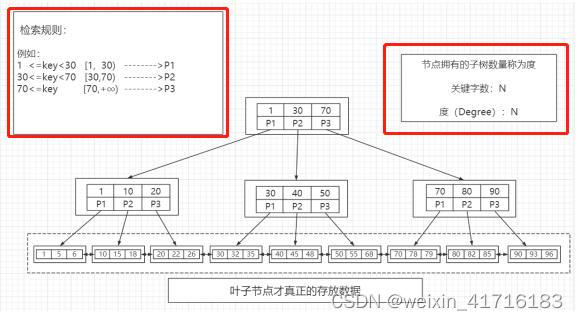
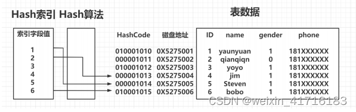
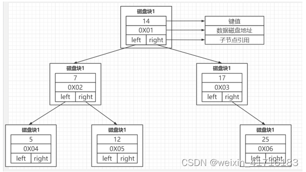
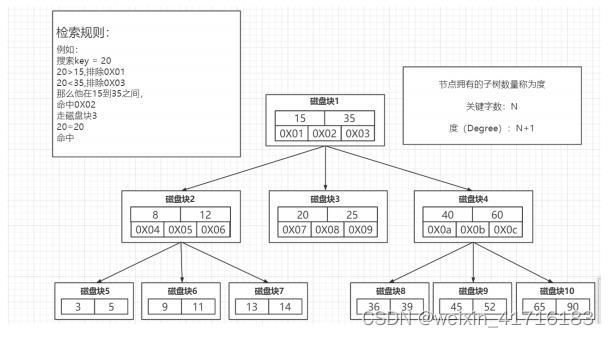
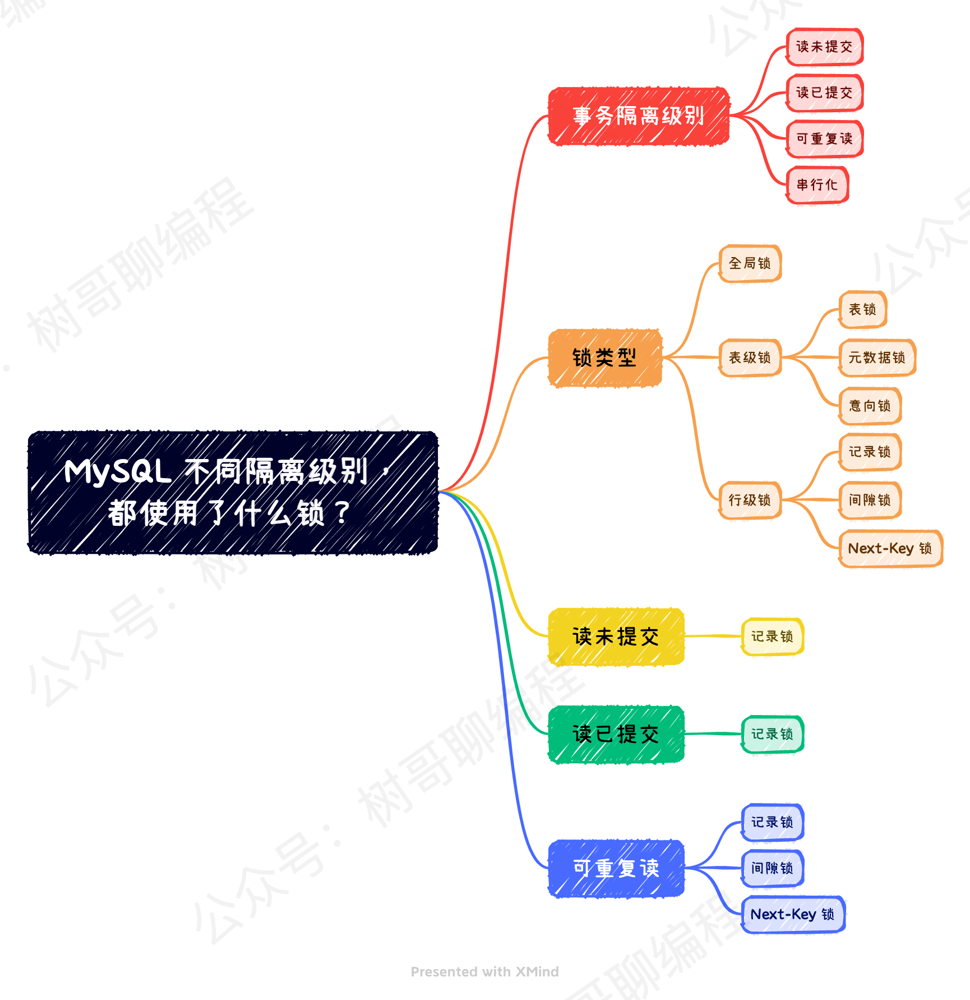
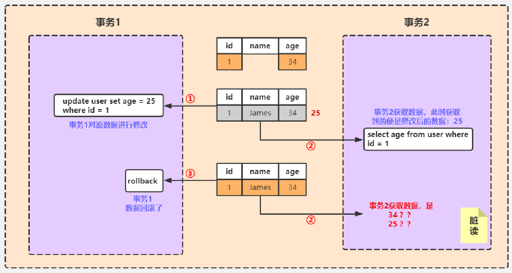
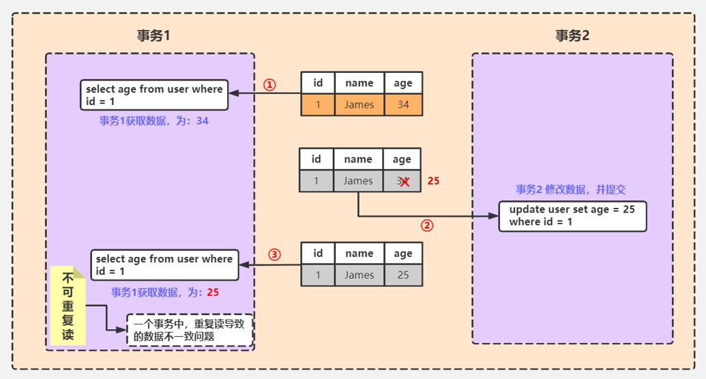
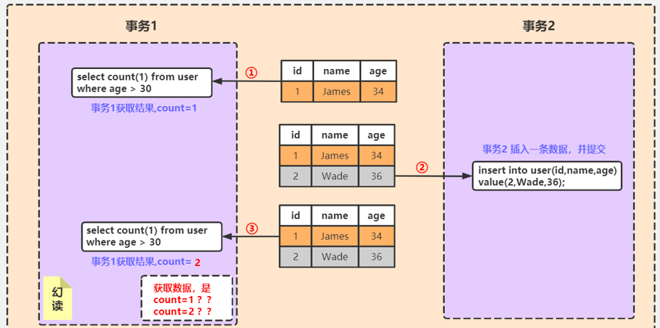
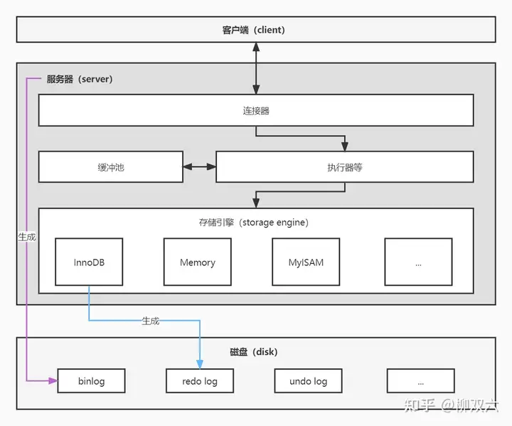
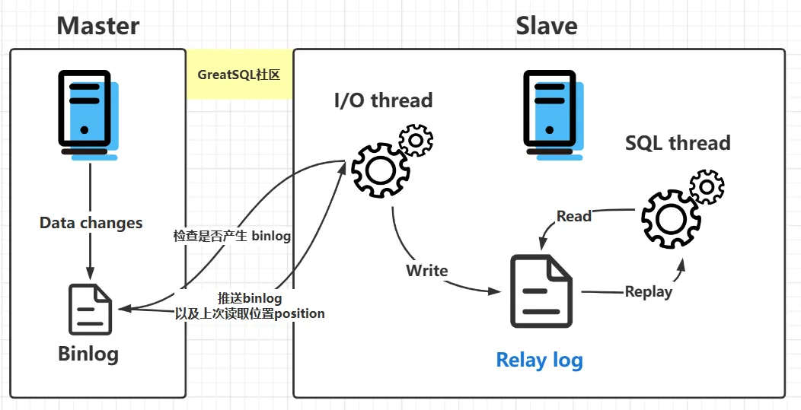

# 三范式

数据库的三范式（Three Normal Forms）是一种设计规范，用于规范化关系型数据库中的数据结构，以减少数据冗余和提高数据的一致性。

1. 第一范式（1NF）：要求关系表中的每个属性都是原子的，不可再分。也就是说，每个属性不能包含多个值或多个属性。通过将多值属性拆分为单值属性，可以消除数据冗余和复杂性。
2. 第二范式（2NF）：在满足 1NF 的基础上，要求表中的非主键属性完全依赖于主键。换句话说，非主键属性必须完全依赖于候选键（主键）。如果存在部分依赖，即一个非主键属性依赖于候选键的一部分属性，就需要将其拆分为独立的关系表。
3. 第三范式（3NF）：在满足 2NF 的基础上，要求表中的非主键属性之间没有传递依赖关系。如果存在传递依赖，即一个非主键属性依赖于另一个非主键属性，就需要将其拆分为独立的关系表。

# 基本语法

### 删除操作：

1. `DROP`删除整个表
2. `TRUNCATE`删除全部数据不删除表
3. `DELETE`删除部分数据

### 配置：

查看配置：

```mysql
SELECT @@global.character_set_database;
SELECT @@session.character_set_database;
SELECT @@character_set_database;

SHOW global variables LIKE 'character_set_database';
SHOW session variables LIKE 'character_set_database';
SHOW variables LIKE 'character_set_database';
```


# 索引

适合作索引的字段特点：

1. 常用作条件查询；
2. 常用作排序；
3. 常用作连接；
4. 高区分度、分布均匀；
5. 不会频繁改动。

### 创建索引

三种方式：

1. 建表时创建：

   ```mysql
   create table user_index(
       id  int  auto_increment   primary key,
       first_name   varchar(16),
       last_name   varchar(16),
       id_card        varchar(18),
       information   text(225),
       key    name( first_name,last_name),
       fulltext   key(information),
       unique key(id_card)
   );
   ```

2. `create`创建：

   ```mysql
   create index index_name on table_name(column_list);
   ```

3. `alter`添加：

   ```mysql
   alter table table_name add index index_name(column_list);
   ```

### 删除索引

```mysql
alter table table_name drop key idx_name;
```

### 普通索引

也叫非唯一索引，是最普通的索引，没有任何的限制。

### 主键索引

主键索引是所有 InnoDB 表必须的，且一个表中只能有一个主键索引。InnoDB 的数据文件就是按照主键顺序存放的，也就是聚簇索引。主键索引的选择对查询的性能有很大的影响。

### 唯一索引（Unique Index）

唯一索引要求键值不能重复，但可以有空值。另外需要注意的是，主键索引是一种特殊的唯一索引，它还多了一个限制条件，要求键值不能为空。主键索引用 primay key 会自动创建。如果是组合索引，则**组合的值**必须唯一。

### 回表查询

根据数据库行的具体地址来找到对应行数据，一般在非聚簇索引中需要回表查询。

### 聚簇索引（Clustered Index）

**聚簇索引**（Clustered Index）是一种**数据存储方式**，它将数据的物理存储顺序与索引顺序相同。也就是说，表中的数据行按照索引键的顺序进行存储。聚簇索引通常用于数据库系统中，以提高数据查询的效率。**非主键索引**在 InnoDB 中大多数情况下就是**非聚簇索引**。非主键索引通常又被称为**二级索引**（Secondary Index）。

特点：

1. 物理存储顺序与索引顺序相同：

   - 在聚簇索引中，数据行按照索引键的顺序存储在磁盘上。也就是说，数据的物理位置是按照索引的顺序排列的。

   - 这意味着索引中的每个键值对应的数据是实际的数据行，而不是指向数据行的指针。

2. 每张表只能有一个聚簇索引：

   - 由于聚簇索引要求数据按照某个键的顺序物理存储，因此每个表只能有一个聚簇索引。因为数据只能按照一种顺序存储。

   - 其他索引可以是**非聚簇索引**（Non-clustered Index），即索引和数据存储是分开的。

3. 提高查询效率，特别是范围查询：
   - 聚簇索引特别适合范围查询（例如 `BETWEEN`、`ORDER BY` 等），因为数据是连续存储的。数据库可以只进行一次磁盘读取，然后顺序地读取数据，而不是像非聚簇索引那样每次都要根据索引指针跳转到不同的存储位置读取数据。

4. 插入和更新的代价较高：
   - 由于数据的物理存储顺序要和索引顺序保持一致，因此在插入新数据或更新数据时，可能需要重新排列数据的物理存储顺序。这使得聚簇索引在频繁插入和更新的情况下性能较低。

聚簇索引与非聚簇索引的区别：

| 特性           | 聚簇索引                         | 非聚簇索引                       |
| -------------- | -------------------------------- | -------------------------------- |
| 数据存储方式   | 数据按照索引的顺序存储           | 索引存储与数据存储分离           |
| 每表的索引数量 | 每个表只能有一个聚簇索引         | 可以有多个非聚簇索引             |
| 叶子节点       | 叶子节点存储的是实际的数据行     | 叶子节点存储的是指向数据行的指针 |
| 查询性能       | 对于范围查询特别高效             | 查询性能相对较低                 |
| 插入/更新性能  | 插入和更新可能会导致数据重新排列 | 插入和更新不会影响数据的物理顺序 |

适用场景：

- **聚簇索引** 适合读多写少、且需要频繁进行范围查询的场景，如数据分析、日志查询等。
- **非聚簇索引** 更适合频繁的随机读写操作，尤其是在没有明确的排序要求时。

### 覆盖索引

在一次查询中，如果一个索引包含或者说覆盖**所有**需要查询的字段的值，我们就称之为覆盖索引，而不再需要**回表查询**。而要确定一个查询是否是覆盖索引，我们只需要`EXPLAIN`语句看`Extra`列的结果是否是`Using index`即可。

### 全文索引（Fulltext Index）

在 MySQL 5.6 版本以前，只有 MyISAM 存储引擎支持全文引擎。在 5.6 版本中，InnoDB 加入了对全文索引的支持，但是不支持中文全文索引。在 5.7.6 版本，MySQL 内置了 ngram 全文解析器，用来支持亚洲语种的分词。但是，InnoDB 的全文索引在功能和性能上与 MyISAM 存在差距，如需对全文索引的性能要求较高，或者对全文索引的更高级功能有所要求，建议使用MyISAM存储引擎。

建表时创建：

```mysql
CREATE TABLE articles (
    id INT UNSIGNED AUTO_INCREMENT NOT NULL PRIMARY KEY,
    title VARCHAR (200),
    body TEXT,
    FULLTEXT (title, body) WITH PARSER ngram
) ENGINE = INNODB DEFAULT CHARSET=utf8mb4 COMMENT='文章表';
INSERT INTO articles (title, body) VALUES ('弘扬正能量', '贯彻党的18大精神');
INSERT INTO articles (title, body) VALUES ('北京冬奥会', '2022年北京冬奥会于2022年2月20日闭幕啦');
INSERT INTO articles (title, body) VALUES ('MySQL Tutorial', 'DBMS stands for Database');
INSERT INTO articles (title, body) VALUES ('IBM History', 'DB2 history for IBM');
```

现有表字段添加：

```mysql
ALTER TABLE articles ADD FULLTEXT INDEX title_body_index (title,body) WITH PARSER ngram;
```

使用全文索引：

```mysql
-- 创建一个包含文章的表
CREATE TABLE articles (
    id INT AUTO_INCREMENT PRIMARY KEY,
    title VARCHAR(255),
    body TEXT,
    FULLTEXT(title, body)  -- 在标题和正文字段上创建全文索引
) ENGINE=InnoDB;

-- 插入一些数据
INSERT INTO articles (title, body) VALUES
('MySQL Fulltext Search Example', 'This is an example of MySQL FULLTEXT search.'),
('Understanding Fulltext Search', 'Learn how to use MySQL FULLTEXT search for text-based queries.'),
('Fulltext and Inverted Indexes', 'This article compares FULLTEXT search with inverted indexes.');

-- 使用全文搜索进行查询
SELECT * FROM articles
WHERE MATCH(title, body) AGAINST ('MySQL search' IN NATURAL LANGUAGE MODE);
```

解释：

- **`FULLTEXT(title, body)`**：在 `title` 和 `body` 字段上创建全文索引。
- **`MATCH ... AGAINST`**：用于执行全文搜索，`NATURAL LANGUAGE MODE` 是 MySQL 支持的一种全文搜索模式。
- 在上述例子中，MySQL 使用全文索引来搜索包含关键词 "MySQL" 和 "search" 的文章。

### 倒排索引（Inverted Index）

MySQL **没有内置**的倒排索引，不过可以通过一些技巧来模拟倒排索引。通常，我们可以将关键词提取并存储在一个独立的表中，然后通过该表实现类似倒排索引的功能。

示例：模拟倒排索引

假设我们有一个包含文档的表 `documents`，并且我们希望为每个文档创建一个倒排索引来加速关键词搜索。

```mysql
-- 创建包含文档的表
CREATE TABLE documents (
    id INT AUTO_INCREMENT PRIMARY KEY,
    content TEXT
);

-- 插入一些文档
INSERT INTO documents (content) VALUES
('This is an example of a document.'),
('This document discusses MySQL and Inverted Indexes.'),
('Fulltext search and inverted indexes are important.');

-- 创建倒排索引表，记录每个关键词与文档的关系
CREATE TABLE inverted_index (
    word VARCHAR(255),
    document_id INT,
    PRIMARY KEY (word, document_id),
    FOREIGN KEY (document_id) REFERENCES documents(id)
);

-- 手动向倒排索引表插入数据（通常由文本分析工具生成）
INSERT INTO inverted_index (word, document_id) VALUES
('example', 1),
('document', 1),
('document', 2),
('mysql', 2),
('inverted', 2),
('index', 2),
('fulltext', 3),
('inverted', 3),
('index', 3);

-- 查询包含关键词 'document' 的文档
SELECT d.id, d.content FROM documents d
JOIN inverted_index i ON d.id = i.document_id
WHERE i.word = 'document';
```

解释：

- **`inverted_index` 表**：这张表充当倒排索引，记录每个关键词与文档 ID 的对应关系。
- **`JOIN inverted_index ON document_id`**：通过倒排索引表来查询包含特定关键词的文档。
- 虽然这种方式是模拟倒排索引，但它可以高效处理特定关键词的查询。

### 空间索引（Spatial Index）

R 树。略。

### 底层数据结构

#### B+ 树（加强多路平衡查找树）



大部分 MySQL 存储引擎的默认索引类型。B+Tree 是一种**平衡多路查找树**，可以保证数据的**有序性**，并且有较高的查找效率。比如 InnoDB 存储引擎就采用的 B+Tree 索引。在 B+Tree 索引中，索引项是按照顺序排列并分布在树上的，这样对范围查询和排序就有了很大的优势。**叶子节点才真正存放数据，非叶子节点只存放键**，键存的更多，高度更低，减少磁盘IO；叶子节点形成**链表**，可以快速遍历。

[MySQL 索引原理详解](https://blog.csdn.net/weixin_41716183/article/details/126089315)

分表：

#### Hash



Memory 存储引擎的索引就采用了 Hash 索引，适用于**等值查询**，但不支持**范围查询和排序**等操作。Hash 索引的查询速度非常快，但是索引的**维护成本较高**，而且 Hash 冲突的存在也会影响查询性能。

#### 为什么不用 AVL 树（平衡二叉树）或红黑树？



AVL 树**左右子树深度差绝对值不能超过 1**。

红黑树的种种约束保证的是什么？**最长路径不超过最短路径的二倍**。不太适合于数据库索引。适合内存的数据机构，例如实现一致性哈希：

- **节点度与磁盘访问**：AVL 树和红黑树的每个节点**只包含两个子节点**（即度为 2），这意味着树的**高度相对较大**。由于数据库中的数据通常存储在磁盘上，每次从磁盘读取数据都会引发一次 I/O 操作。树的高度越高，意味着进行查询时需要访问的磁盘页面越多，导致**磁盘 I/O 次数增加**，查询效率下降。（==子节点少 → 高度大 → I/O多==）
- **平衡开销**：AVL 树为了保持严格的平衡，插入和删除操作需要**频繁的旋转**操作，这增加了维护平衡的开销。红黑树虽然对平衡的要求没有 AVL 树严格，但仍然需要进行旋转操作，尤其是在频繁插入和删除的情况下，**维护成本较高**。（==频繁旋转 → 维护成本高==）

因为 B Tree 和 B+Tree 的特性，它们广泛地用在文件系统和数据库中，例如 Windows 的 HPFS 文件系统，Oracel、MySQL、SQLServer 数据库。

#### 为什么不用 B 树（多路平衡查找树）



B 树相比二叉树更适合数据库索引，原因是它是**多叉平衡树**（度数 > 2），它**减少了树的高度**，从而**减少了磁盘 I/O**。然而，B 树与 B+ 树相比仍存在一些劣势：

- **数据存储**：B 树的**每个节点都存储键和数据**，而 B+ 树的**非叶子节点只存储键**，所有**数据都存储在叶子节点上**。因此，B+ 树的非叶子节点可以存储更多的键（InnoDB 页大小默认 16 KB / 每个键大小 = 每个节点的键数量），每个节点有更多的子节点，从而使树的**高度更低**，进一步**减少了磁盘 I/O**。（==叶子存数据 → 非叶子存更多键 → 增加 Degree，降低高度 → 减少IO==）

  > 一般来说，索引本身也很大，不可能全部存储在内存中，因此索引往往以索引文件的形式存储的磁盘上。这样的话，索引查找过程中就要产生磁盘I/O消耗，相对于内存存取，I/O存取的消耗要高几个数量级，所以评价一个数据结构作为索引的优劣最重要的指标就是在查找过程中磁盘I/O操作次数的渐进复杂度。换句话说，索引的结构组织要尽量减少查找过程中磁盘I/O的存取次数。
  >

- **范围查询**：B+ 树的所有叶子节点通过指针相连，形成一个链表结构，因此在做范围查询时，可以通过叶子节点之间的链表快速遍历数据。而 B 树由于数据分布在各个节点，进行范围查询时需要在树上进行频繁的查找和遍历，效率较低。（==叶子节点链表==）

### 索引失效

1. 使用`!=`或`<>`操作符：查询的结果集大于整个表的大约 30%，索引对期待**扫描全部**数据的查询通常没有帮助，尤其是不等式查询。
2. 对索引列进行**计算或函数**操作：如果对一个索引列进行函数操作，那么引擎将无法使用索引，因为它必须对每个行执行函数操作后才能比较结果。例如：`SELECT * FROM table WHERE YEAR(date_column) = 2022;`
3. 使用`LIKE`操作符**以`%`开头的模糊查询**：当`LIKE`的模式值以通配符`%`开头时，无法使用索引，因为查询引擎无法知道搜索结果在何处开始或结束。例如：`SELECT * FROM table WHERE column LIKE '%Z';`
4. 联合索引中使用**最左前缀原则**。像 `(col1, col2, col3)` 这样的联合索引只有在查询条件在索引树左侧时才能够被用到。比如查询 `col1` 或 `col1, col2`，索引是起效的。但当查询 `col2` 或者 `col3` 或者 `col2, col3`这样，该索引就不起作用了。
5. **数据类型不一致**：如果查询中的数据类型与索引中的数据类型不一致，MySQL 将无法使用索引。

# 事务

## 隔离级别

“魔高一尺，道高一丈”：读未提交 < 脏读 < 读已提交 < 不可重复读 < 可重复读 < 幻读 < 可串行化



### 读未提交（Read Uncommitted）

**可以读取到其他事务还没提交的数据。** 在这个隔离级别下，由于可以读取到未提交的值，因此会产生「脏读」问题。此隔离存在排他锁，两个事务无法同时修改，后修改的会阻塞。此隔离**读取数据不需要加锁**，所以可以一边写，另一边读，可能造成脏读。

```mysql
-- 设置事务隔离级别为 READ UNCOMMITTED
SET TRANSACTION ISOLATION LEVEL READ UNCOMMITTED;
```

### 脏读（Dirty Read）

未提交 + 回滚/修改

举个例子：A 事务更新了 price 为 30，但还**未提交**。此时 B 事务读取到了 price 为 30，但后续 A 事务**回滚**了，那么 B 事务读取到的 price 就是错的（脏的）。

事务 2 可以读取事务 1 还没提交的数据，一旦后者**回滚**或再次修改就会造成错误：



### 读已提交（Read Committed）

读写混合操作较多时推荐该级别。

**只能读到其他事务已经提交的数据。** 这个隔离级别解决了脏读的问题，不会读到未提交的值，但是却会产生「不可重复读」问题。

同样是记录锁，但是

```mysql
-- 设置事务隔离级别为 READ COMMITTED
SET TRANSACTION ISOLATION LEVEL READ COMMITTED;
```

### 不可重复读（Non-Repeatable Read）

一边读 + 另一边改

指的是在**同一个事务**范围内，前后两次读取到的数据不一样。举个例子：A 事务第 1 次读取了 price 为 10。随后 B 事务将 price 更新为 20，接着 A 事务再次读取 price 为 30。A 事务前后两次读取到的数据是不一样的，这就是不可重复读。

事务 1 的两次查询之间，夹杂了事务 2 的**针对本行的修改**，导致两次查询的结果不一样：



### 可重复读 （Repeatable Read）

**指的是同一事务范围内读取到的数据是一致的。** 这个隔离级别解决了「不可重复读」的问题，只要是在同一事务范围内，那么读取到的数据就是一样的。对于 MySQL Innodb 来说，其实通过 MVCC 来实现的。但「可重复读」隔离级别会产生幻读问题。

```mysql
-- 设置事务隔离级别为 REPEATABLE READ
SET TRANSACTION ISOLATION LEVEL REPEATABLE READ;
```

### 幻读（Phantom Read）

一边读范围 + 另一边改范围

对于某个**范围**的数据读取，前后两次可能读取到不同的结果。

举个例子：数据库中有 price 为 1、3、5 三个商品，此时 A 事务查询 price < 10 的商品，查询到了 3 个商品。随后 B 事务插入了一条 price 为 7 的商品。接着 A 事务继续查询 price < 10 的商品，这次却查询到了 4 个商品。

可以看到「幻读」与「不可重复读」是有些类似的，只是「不可重复读」更多指的是**某一条**记录，而「幻读」指的则是**某个范围**数据。对于 MySQL Innodb 来说，其通过**行级锁**级别的 Gap Lock 解决了幻读的问题。Next-key Lock，间隙锁 + 记录锁，间隙锁锁定记录行之间的间隙（左开右开区间），记录锁锁定行记录，合二为一（左开右闭区间）锁定整个范围。

事务 1 的两次查询之间，夹杂了事务 2 的**针对其他行的插入**，导致两次查询的结果不一样：



### 可串行化（Serializable）

**所有事务串行执行**。

```mysql
-- 设置事务隔离级别为 SERIALIZABLE
SET TRANSACTION ISOLATION LEVEL SERIALIZABLE;
```

### MVCC

MVCC（Multi-Version Concurrency Control）是一种并发控制机制，用于在数据库系统中处理并发读写操作的一致性问题。

在传统的并发控制机制中，比如锁机制，读操作会对数据加锁，写操作会对数据加排他锁，以防止并发操作导致的数据不一致性。但是锁机制会带来死锁、性能下降等问题。

而 MVCC 机制则采用了更加灵活的方式来处理并发问题。它基于**时间戳**的概念，为每个数据版本都分配了一个唯一的时间戳。当一个事务开始时，它会读取当前的数据版本，并将该版本的时间戳作为自己的”读取时间戳”。在事务执行期间，它只能看到在该时间戳之前已经提交的数据版本。对于写操作，事务会创建一个新的数据版本，并将其时间戳设置为当前时间戳。

这样，不同事务之间的读写操作可以同时进行，不会相互阻塞，提高了并发性能。同时，MVCC 也保证了事务之间的隔离性，避免了不可重复读、幻读等问题。

MVCC 在许多数据库系统中得到了广泛的应用，比如 MySQL 的 InnoDB 存储引擎就采用了 MVCC 机制来处理并发控制。

# 日志



**Redo log** 和 **bin log**（binary log）是 MySQL 中两个不同的日志类型，它们的作用和使用场景各不相同。下面将详细对比两者的区别：

### 1. **作用和目的**
- **Redo log（重做日志）**：
  - **作用**：InnoDB 引擎专用，用于保证数据库的**崩溃恢复**。当事务被提交时，InnoDB 会将操作记录写入 redo log，即使数据尚未写入磁盘，崩溃后也可以通过 redo log 恢复数据。
  - **目的**：在 MySQL 崩溃或宕机时，利用 redo log 将数据恢复到一致的状态。
  
- **Bin log（二进制日志）**：
  - **作用**：MySQL Server 级别的日志，记录所有**修改数据库内容**的操作，包括 DML（`INSERT`、`UPDATE`、`DELETE` 等）和 DDL（`CREATE`、`ALTER` 等）。它用于**数据恢复**和**主从复制**。
  - **目的**：
    - **数据恢复**：可以使用 bin log 重做某些操作，恢复数据到某个时间点（基于备份 + bin log 的组合）。
    - **主从复制**：用于 MySQL 主从复制中，将主库上的数据更改传递到从库。

### 2. **日志层级**
- **Redo log**：InnoDB 存储引擎级别的日志，**仅适用于 InnoDB 引擎**。其他存储引擎（如 MyISAM）不使用 redo log。
- **Bin log**：MySQL Server 级别的日志，**适用于所有存储引擎**（如 InnoDB、MyISAM 等），记录的是 SQL 语句或基于行的更改。

### 3. **记录内容**
- **Redo log**：
  - 记录的是**物理日志**，具体是数据页的更改（即对磁盘页的修改），而不是 SQL 语句。
  - 日志量较小，记录的数据针对具体的物理操作，主要用于事务提交后的崩溃恢复。

- **Bin log**：
  - 记录的是**逻辑日志**，可以是基于 SQL 语句的日志（statement-based bin log，SBR）或基于行的日志（row-based bin log，RBR）。
  - 适合用于数据的逻辑恢复或数据的复制。

### 4. **写入时机**
- **Redo log**：
  - 在事务执行的过程中，数据变更会先写入 redo log。即使事务尚未提交，数据修改也可能会提前写入 redo log。事务提交时，再刷入 redo log 文件。
  - 因此，redo log 的写入是**提前**的，确保数据的安全性。

- **Bin log**：
  - 只有当事务提交后，MySQL 才会将事务的操作记录写入 bin log。因此，bin log 的写入是在**事务提交后**。

### 5. **数据恢复机制**
- **Redo log**：
  - 用于**崩溃恢复**。当数据库异常宕机后，InnoDB 会通过 redo log 恢复未完全写入磁盘的数据，将数据库恢复到一致性状态。
  - Redo log 只能将数据恢复到最近一次**提交**的状态，不能用于恢复到某个时间点。

- **Bin log**：
  - 用于**时间点恢复**或基于日志的恢复。通过备份数据和 bin log，可以将数据库恢复到某个特定的时间点。
  - 可用于**增量备份**，结合全备份和 bin log，可以恢复到崩溃前的某个时间点。

### 6. **日志文件的大小和循环使用**
- **Redo log**：
  - Redo log 文件是**固定大小**的，由 `innodb_log_file_size` 和 `innodb_log_files_in_group` 参数决定。
  - Redo log 是循环使用的，即写满后会从头开始覆盖旧的日志（类似环形缓冲区）。因此，它主要用于短期的崩溃恢复。

- **Bin log**：
  - Bin log 的大小是可配置的（通过 `max_binlog_size` 参数控制），可以不断生成新的 bin log 文件。
  - Bin log **不会覆盖**旧日志，旧的 bin log 文件会一直保留，直到手动清理或设置自动清理机制（如 `expire_logs_days` 设置 bin log 过期时间）。

### 7. **使用场景**
- **Redo log**：
  - 用于**事务提交后的数据恢复**，在数据库崩溃后恢复到一致的状态，确保事务的持久性。
  - 主要是为了保证数据库的安全性和完整性，不用于数据备份或复制。

- **Bin log**：
  - 用于**主从复制**，通过 bin log 将主库上的操作同步到从库。
  - 用于**数据恢复**，结合全量备份和 bin log，可以恢复数据库到某个特定时间点，适合做增量备份。

### 8. **总结**
| 特性         | Redo Log                       | Bin Log                 |
| ------------ | ------------------------------ | ----------------------- |
| 作用         | 崩溃恢复                       | 数据恢复、主从复制      |
| 日志类型     | 物理日志，记录数据页的变化     | 逻辑日志，记录 SQL 操作 |
| 写入时机     | 事务执行过程中（提前写入）     | 事务提交后写入          |
| 覆盖机制     | 循环覆盖                       | 不覆盖，生成新文件      |
| 应用场景     | 数据库崩溃恢复                 | 数据恢复、主从复制      |
| 使用层级     | InnoDB 引擎级别                | MySQL Server 级别       |
| 文件大小     | 固定大小，循环使用             | 动态增长，不循环        |
| 数据恢复能力 | 仅恢复到最近一次事务提交的状态 | 恢复到任意时间点        |
| 存储引擎     | 仅适用于 InnoDB                | 适用于所有存储引擎      |

*有 binlog 为什么还要 redo log ？*

1. binlog 不知道数据库究竟是在**哪一时刻**丢失了哪部分数据，只能从备份点开始对 binlog 记录重放来恢复数据，比较**耗时**。
2. binlog 恢复是需要我们**手动执行**的，而 redo log 可以在服务器重启后**自动恢复**数据。
3. WAL + 先写缓冲 + 异步刷脏页有效提升了磁盘的 IO 效率。

*有 redo log 为什么还要 binlog？*

1. binlog 是**服务器层面**的功能，redo log 是 **innoDB** 的功能。redo log 帮助 InnoDB 实现了性能提升、自动恢复。但其他存储引擎是**无法使用** redo log 的能力的。
2. 我们也可以关闭 binlog，但大多数情况下我们都会开启，因为开启的好处更多。比如，主从模式需要订阅 binlog 进行**主从复制**，以及可以通过 binlog 进行数据库的增量备份和恢复。

### 总结

**Redo log** 主要用于**崩溃恢复**，是 InnoDB 引擎保证事务持久性的关键机制，而 **bin log** 是 MySQL 层面的日志，主要用于**主从复制**和**数据恢复**。两者在工作原理、写入时机和使用场景上都有明显不同，redo log 专注于保证数据一致性和崩溃恢复，而 bin log 则为数据的备份和复制提供支持。

# 引擎

MySQL的存储引擎是用来存储和管理数据的组件，不同的存储引擎提供了不同的存储机制、索引技巧、锁定水平等功能。MySQL最常见的引擎主要有以下几种：

1. InnoDB：这是 MySQL 的默认存储引擎，支持事务处理和行级锁定，提供了提交、回滚、崩溃恢复能力，支持外键，可以进行外键和非空约束。拥有 redo log 崩溃恢复。
2. MyISAM：这是 MySQL 的传统存储引擎，**不支持事务和行级锁**，只支持表级锁。MyISAM 的优点是插入数据速度快，占用的磁盘空间相对较小。但是，由于不支持事务，安全性不如 InnoDB，一般用于只读或者小型应用。
3. MEMORY：所有的数据都在内存中，数据的处理速度快，但是安全性不高，如果数据库重启，所有的数据都会消失。一般用于存储临时数据。
4. Archive：只支持 INSERT 和 SELECT 操作，适合存储和检索大量的历史数据。
5. BLACKHOLE：黑洞引擎，它不存储数据，插入的数据会被丢弃，但是可以被用在复制的场景，如主从复制。
6. Federated：联邦存储引擎，可以把一些远程的数据表映射为本地的一张表，使用这张表时实际上访问的是远程的数据。

# 主从数据库



## 设置半同步模式：

1. 加载 lib，所有主从节点都要配置

　　主库&从库（windows 下是 dll 文件）：

```
install plugin rpl_semi_sync_master soname 'semisync_master.so';
install plugin rpl_semi_sync_slave soname 'semisync_slave.so';
```

2. 查看，确保所有节点都成功加载：

    ```
    mysql> show plugins;
    +---------------------------------+----------+--------------------+--------------------+---------+
    | Name                            | Status   | Type               | Library            | License |
    +---------------------------------+----------+--------------------+--------------------+---------+
    | rpl_semi_sync_master            | ACTIVE   | REPLICATION        | semisync_master.so | GPL     |
    +---------------------------------+----------+--------------------+--------------------+---------+
    | rpl_semi_sync_slave             | ACTIVE   | REPLICATION        | semisync_slave.so  | GPL     |
    +---------------------------------+----------+--------------------+--------------------+---------+
    ```

3. 启用半同步：

   1. 先启用从库上的参数，最后启用主库的参数：

      从库：

        ```
        set global rpl_semi_sync_slave_enabled = 1; # 1：启用，0：禁止
        ```
      主库：

        ```
        set global rpl_semi_sync_master_enabled = 1;     # 1：启用，0：禁止
        set global rpl_semi_sync_master_timeout = 60000; # 60秒，时间长些便于实验
        ```

   2. 从库重启 io_thread：

        ```
        stop slave io_thread;
        start slave io_thread;
        ```
        
   3. 查看主库参数：
   
        ```mysql
        show global variables like "%sync%";
        show global status like "%sync%";
        ```


`rpl_semi_sync_master_wait_for_slave_count`

1. master 提交后所需的应答数量，如果 slave clients 数量大于等于这个值，那么 master 会一路畅行无阻；如果低于这个值，master 可能会在事务提交阶段发生一次超时等待，当等待超过参数`rpl_semi_sync_master_timeout`设定时，master 就转为异步模式（原理见下一个参数）。
2. master 将这个参数值作为标杆，用来和`rpl_semi_sync_master_clients`参数做比较。

`rpl_semi_sync_master_wait_no_slave`

1. 为 OFF 时，只要 master 发现`rpl_semi_sync_master_clients`小于`rpl_semi_sync_master_wait_for_slave_count`，则master 立即转为异步模式。
2. 为 ON 时，空闲时间（无事务提交）里，即使 master 发现`rpl_semi_sync_master_clients`小于`rpl_semi_sync_master_wait_for_slave_count`，**也不会做任何调整**。只要保证在事务超时之前，master 收到大于等于`rpl_semi_sync_master_wait_for_slave_count`值的 ACK 应答数量，master 就一直保持在半同步模式；如果在事务提交阶段（master 等待 ACK）超时，master 才会转为异步模式。

无论`rpl_semi_sync_master_wait_no_slave`为 ON 还是 OFF，当 slave 上线到`rpl_semi_sync_master_wait_for_slave_count`值时，master 都会自动由异步模式转为半同步模式。

# 分库与分表

InnoDB 默认每页大小`innodb_page_size`为 16KB，其中页头页尾约占 200B，可供存储的部分约为 16184B。三层 B+ 树数据量计算：
$$
({16184 \over \text{主键字段大小}}) ^ 2 * {16184 \over \text{每行数据大小}}
$$
超过该数据量时建议分表。	

# 优化

1. 禁止使用`SELECT *`：不走覆盖索引，会产生回表；

2. 小表驱动大表：`SELECT ... FROM '小表' JOIN '大表'`，因为需要先查出前者中的全部数据，所以前者应为小表、索引完备的表。可以通过`FORCE INDEX`和`STRAIGHT_JOIN`强制指定。其底层为 Join Buffer 缓冲区，其默认大小`innodb_buffer_pool_size`为 0x800000 = 8388608：

   > `innodb_buffer_pool_size`
   >
   > - 定义：这个参数定义了 InnoDB 用于缓存数据和索引的总内存大小。它是 InnoDB 的主要内存结构，决定了可以缓存的数据量，从而影响数据库的性能。
   > - 单位：以字节为单位，通常设置为系统内存的 70% ~ 80%（对于数据库服务器）。
   >
   > `innodb_buffer_pool_chunk_size`
   >
   > - 定义：这个参数定义了缓冲池的分块大小。在 `innodb_buffer_pool_size` 被设置为大于 1GB 的值时，可以将缓冲池分成多个块，每个块的大小由 `innodb_buffer_pool_chunk_size` 定义。
   > - 单位：以字节为单位，默认值通常是 128MB。

3. 连接查询代替子查询；

4. 提升`GROUP BY`的效率：被分组的列建立索引； 

5. 批量插入：单条插入每条都要连接数据库的 connection，SQL——`VALUES`，Mybatis——`<foreache>`，`ExecutorType.BATCH`。默认最大单次插入条数`max_allowed_packet`为 0x400000 = 4194304；

6. 使用`LIMIT`：查询时，最后几页不需要，避免深度分页；

7. `UNION ALL`代替`UNION`：后者会去重，非要用则考虑提升查询本身的效率；

8. 尽量少关联表：

   > 不加索引的字段表连接不允许超过 3 张

# Spring 中的数据源动态切换

通过继承 `AbstractRoutingDataSource` 实现数据源动态切换是一个常见的做法。

本质上是通过在上下文的线程中，在操作数据库前切换不同的数据源中选出对应的数据源，往往通过切面配合方法注解的方式。

以下是详细的实现步骤：

### 1. **创建 DynamicDataSource 类**

首先，你需要创建一个继承自 `AbstractRoutingDataSource` 的类，用于决定当前使用哪个数据源。

```java
import org.springframework.jdbc.datasource.lookup.AbstractRoutingDataSource;

public class DynamicDataSource extends AbstractRoutingDataSource {
    
    @Override
    protected Object determineCurrentLookupKey() {
        // 返回当前数据源的标识
        return DynamicDataSourceContextHolder.getDataSourceType();
    }
}
```

### 2. **创建上下文持有者**

使用一个上下文持有者类来存储和获取当前线程的数据源类型。

```java
public class DynamicDataSourceContextHolder {
    private static final ThreadLocal<String> contextHolder = new ThreadLocal<>();

    public static void setDataSourceType(String dataSourceType) {
        contextHolder.set(dataSourceType);
    }

    public static String getDataSourceType() {
        return contextHolder.get();
    }

    public static void clearDataSourceType() {
        contextHolder.remove();
    }
}
```

### 3. **配置数据源**

在 Spring 的配置类中，配置多个数据源并使用 `DynamicDataSource`。

```java
import org.springframework.beans.factory.annotation.Qualifier;
import org.springframework.boot.autoconfigure.jdbc.DataSourceProperties;
import org.springframework.boot.context.properties.ConfigurationProperties;
import org.springframework.boot.jdbc.DataSourceBuilder;
import org.springframework.context.annotation.Bean;
import org.springframework.context.annotation.Configuration;
import org.springframework.context.annotation.Primary;

import javax.sql.DataSource;
import java.util.HashMap;
import java.util.Map;

@Configuration
public class DataSourceConfig {

    @Bean
    @Primary
    @ConfigurationProperties("spring.datasource.master")
    public DataSource masterDataSource() {
        return DataSourceBuilder.create().build();
    }

    @Bean
    @ConfigurationProperties("spring.datasource.slave")
    public DataSource slaveDataSource() {
        return DataSourceBuilder.create().build();
    }

    @Bean
    public DynamicDataSource dynamicDataSource(
            @Qualifier("masterDataSource") DataSource master,
            @Qualifier("slaveDataSource") DataSource slave) {

        Map<Object, Object> targetDataSources = new HashMap<>();
        targetDataSources.put("master", master);
        targetDataSources.put("slave", slave);

        DynamicDataSource dynamicDataSource = new DynamicDataSource();
        dynamicDataSource.setTargetDataSources(targetDataSources);
        dynamicDataSource.setDefaultTargetDataSource(master); // 默认使用主库

        return dynamicDataSource;
    }
}
```

### 4. **使用 AOP 切换数据源**

可以使用 AOP 来在方法调用前后设置和清除数据源类型。

```java
import org.aspectj.lang.annotation.Aspect;
import org.aspectj.lang.annotation.Before;
import org.aspectj.lang.annotation.After;
import org.springframework.stereotype.Component;

@Aspect
@Component
public class DataSourceAspect {

    @Before("@annotation(ReadOnly)")
    public void setReadDataSource() {
        DynamicDataSourceContextHolder.setDataSourceType("slave");
    }

    @Before("@annotation(WriteOnly)")
    public void setWriteDataSource() {
        DynamicDataSourceContextHolder.setDataSourceType("master");
    }

    /**
     * 织出时清空 ThreadLocal，避免数据库事务传播行为而影响主从切换错误
     */
    @After("@annotation(ReadOnly) || @annotation(WriteOnly)")
    public void clearDataSource() {
        DynamicDataSourceContextHolder.clearDataSourceType();
    }
}
```

### 5. **定义注解**

定义自定义注解来标识读写操作，也可以换成传参获取数据源名。

```java
import java.lang.annotation.ElementType;
import java.lang.annotation.Retention;
import java.lang.annotation.RetentionPolicy;
import java.lang.annotation.Target;

@Target(ElementType.METHOD)
@Retention(RetentionPolicy.RUNTIME)
public @interface ReadOnly {}

@Target(ElementType.METHOD)
@Retention(RetentionPolicy.RUNTIME)
public @interface WriteOnly {}
```

### 6. **使用注解**

在服务层中使用自定义注解来标识读写方法。

```java
public class UserService {

    @ReadOnly
    public User getUserById(Long id) {
        // 查询操作，使用从库
    }

    @WriteOnly
    public void createUser(User user) {
        // 写入操作，使用主库
    }
}
```

### 总结

通过继承 `AbstractRoutingDataSource` 和结合 AOP，可以实现动态数据源切换，从而实现读写分离。这样在运行时，根据方法的注解来决定使用哪个数据源，提高了代码的灵活性和可维护性。