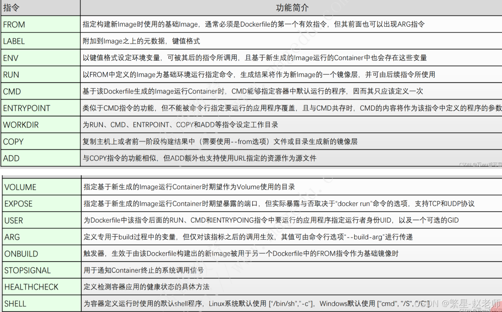
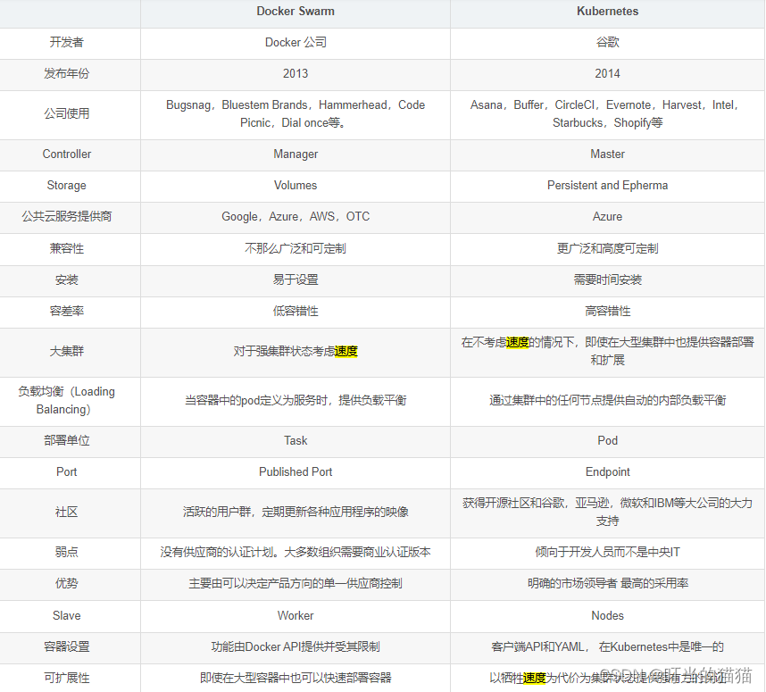

# 命令大全

## 常用命令

| **常用命令** |                                                   |
| ------------ | ------------------------------------------------- |
| `run`        | 从镜像**创建并运行**一个**新容器**，区别于`start` |
| `exec`       | 在运行的容器中执行命令                            |
| `ps`         | 列出容器                                          |
| `build`      | 从 Dockerfile 构建镜像                            |
| `pull`       | 从注册中心下载镜像                                |
| `push`       | 上传镜像到注册中心                                |
| `images`     | 列出镜像                                          |
| `login`      | 登录注册中心                                      |
| `logout`     | 登出注册中心                                      |
| `search`     | 在 Docker Hub 上搜索镜像                          |
| `version`    | 显示 Docker 版本信息                              |
| `info`       | 显示系统范围的信息                                |

## 管理命令

| **管理命令** |                                        |
| ------------ | -------------------------------------- |
| `builder`    | 管理构建                               |
| `buildx*`    | Docker Buildx                          |
| `compose*`   | Docker Compose                         |
| `container`  | 管理容器                               |
| `context`    | 管理上下文                             |
| `debug*`     | 进入任何镜像或容器的 shell             |
| `desktop*`   | Docker Desktop 命令（Alpha）           |
| `dev*`       | Docker 开发环境                        |
| `extension*` | 管理 Docker 扩展                       |
| `feedback*`  | 在终端中提供反馈！                     |
| `image`      | 管理镜像                               |
| `init*`      | 为你的项目创建与 Docker 相关的启动文件 |
| `manifest`   | 管理 Docker 镜像清单和清单列表         |
| `network`    | 管理网络                               |
| `plugin`     | 管理插件                               |
| `sbom*`      | 查看镜像的基于软件材料清单（SBOM）     |
| `scout*`     | Docker Scout                           |
| `system`     | 管理 Docker                            |
| `trust`      | 管理 Docker 镜像的信任                 |
| `volume`     | 管理卷                                 |

## Swarm 命令

Docker Swarm 是 Docker 官方提供的容器集群管理工具，它允许用户在**多个 Docker 主机**上部署和管理容器应用。Swarm 提供了简单的方式来扩展容器应用、保证高可用性、实现负载均衡等功能，使得用户可以轻松地管理和维护容器集群。区别于 Docker Compose 是在**单个服务器或主机**上创建多个容器的工具。

| **Swarm 命令** |            |
| -------------- | ---------- |
| `swarm`        | 管理 Swarm |

## 命令

| **命令**  |                                                              |
| --------- | ------------------------------------------------------------ |
| `attach`  | 将本地标准输入、输出和错误流附加到运行的容器                 |
| `commit`  | 从容器的更改创建新镜像                                       |
| `cp`      | 在容器和本地文件系统之间复制文件/文件夹                      |
| `create`  | 创建新容器                                                   |
| `diff`    | 检查容器文件系统中文件或目录的更改                           |
| `events`  | 获取来自服务器的实时事件                                     |
| `export`  | 将**容器**的文件系统导出为 tar 归档。区别于`save`            |
| `history` | 显示镜像的历史                                               |
| `import`  | 从 tar 包导入内容以创建文件系统镜像，区别于`load`            |
| `inspect` | 返回 Docker 对象的低级信息                                   |
| `kill`    | 杀死一个或多个运行的容器                                     |
| `load`    | 从 tar 归档或标准输入加载镜像，区别于`import`                |
| `logs`    | 获取容器的日志                                               |
| `pause`   | 暂停一个或多个容器内的所有进程                               |
| `port`    | 列出端口映射或容器的特定映射                                 |
| `rename`  | 重命名容器                                                   |
| `restart` | 重启一个或多个容器                                           |
| `rm`      | 删除一个或多个容器                                           |
| `rmi`     | 删除一个或多个镜像                                           |
| `save`    | 将一个或多个**镜像**保存到 tar 归档（默认以标准输出流式传输），区别于`export` |
| `start`   | 启动一个或多个停止的**容器**，区别于`run`                    |
| `stats`   | 显示容器资源使用统计的实时流                                 |
| `stop`    | 停止一个或多个运行的容器                                     |
| `tag`     | 创建一个指向源镜像的目标镜像标签，没有镜像名时用镜像 ID      |
| `top`     | 显示容器中运行的进程                                         |
| `unpause` | 取消暂停一个或多个容器内的所有进程                           |
| `update`  | 更新一个或多个容器的配置                                     |
| `wait`    | 阻塞直到一个或多个容器停止，然后打印它们的退出代码           |

在 `docker cp` 命令中，使用 `-` 作为源或目标时，表示你可以通过标准输入（stdin）或标准输出（stdout）来处理 tar 归档文件。具体来说：

- 作为源（`-`）：
  
   当你使用 `-` 作为源时，命令会从标准输入读取一个 tar 归档文件，然后将其解压到容器中的指定目录。这通常用于将文件通过管道传输到容器中。例如：
   ```bash
   cat archive.tar | docker cp - CONTAINER_ID:/path/in/container
   ```
   这里 `archive.tar` 文件会被解压到指定的容器路径。
   
- 作为目标（`-`）：
  
   当你使用 `-` 作为目标时，命令会将指定容器中的文件打包成 tar 归档，并输出到标准输出。这适合将容器中的文件流式传输到外部。例如：
   ```bash
   docker cp CONTAINER_ID:/path/in/container - | tar xvf -
   ```
   这里容器中的文件会被打包并输出到标准输出，之后可以直接通过管道传输到其他命令或文件中。

这种方式可以方便地在 Docker 容器和宿主机之间传输文件，而无需先将文件保存到本地磁盘。

## **全局选项**

| **全局选项**             |                                                              |
| ------------------------ | ------------------------------------------------------------ |
| `--config string`        | 客户端配置文件的位置（默认 "C:\\Users\\lujin\\.docker"）     |
| `-c, --context string`   | 连接到守护进程所用的上下文名称（覆盖 DOCKER_HOST 环境变量和使用 "docker context use" 设置的默认上下文） |
| `-D, --debug`            | 启用调试模式                                                 |
| `-H, --host list`        | 要连接的守护进程套接字                                       |
| `-l, --log-level string` | 设置日志级别（"debug"、"info"、"warn"、"error"、"fatal"）（默认 "info"） |
| `--tls`                  | 使用 TLS；由 --tlsverify 隐含                                |
| `--tlscacert string`     | 仅信任此 CA 签名的证书（默认 "C:\\Users\\lujin\\.docker\\ca.pem"） |
| `--tlscert string`       | TLS 证书文件的路径（默认 "C:\\Users\\lujin\\.docker\\cert.pem"） |
| `--tlskey string`        | TLS 密钥文件的路径（默认 "C:\\Users\\lujin\\.docker\\key.pem"） |
| `--tlsverify`            | 使用 TLS 并验证远程                                          |
| `-v, --version`          | 打印版本信息并退出                                           |

## 创建镜像

- `build`
- `commit`
- `import`
- dockerfile

## 容器

- 创建
  - `run`
  - ``create`
- 控制
  - `run`
  - `start`
  - `exec`
  - `cp`
  - `diff`
  - `attach`
  - `export`

# Dockerfile



1. **ARG** ：定义专用于 build 过程中的变量，但仅对该指标之后的调用生效，其值可由命令选项`--build-arg`进行传递。
2. **FROM**：此指令用于指定基础镜像。它定义了新构建镜像的基础。Dockerfile中的其他指令将在该基础镜像上构建。
3. **RUN**：此指令用于在镜像中执行命令。它用于在镜像中创建新的层，并执行必要的命令以构建镜像。
4. **COPY**：此指令用于将本地文件或目录复制到镜像中。它通常用于将应用程序文件或配置文件复制到镜像中。
5. **ADD**：此指令用于将文件或目录添加到镜像中。它结合了复制和解压缩的功能，允许将压缩文件添加到镜像中。
6. **CMD**：此指令用于指定容器启动时要运行的默认命令。当容器启动时，它将运行CMD指令中指定的命令。
7. **ENTRYPOINT**：此指令用于指定容器启动时要运行的命令，并为其提供参数。它允许用户自定义容器启动时要运行的命令及其参数。
8. **EXPOSE**：此指令用于指定容器在运行时要暴露的端口。它允许用户定义容器内部服务的端口，以便与外部进行通信。
9. **ENV**：此指令用于设置环境变量。它允许用户在容器中设置环境变量，以便在容器运行时使用。
10. **WORKDIR**：此指令用于设置工作目录。它指定容器启动时的工作目录，并允许用户在容器内部运行命令时切换到该目录。
11. **VOLUME**：此指令用于创建卷挂载点。它允许用户定义卷并将其挂载到容器中，以便持久化存储数据。

dockerfile 示例：

```dockerfile
FROM java:8-alpine
COPY target/myapp.jar /app/myapp.jar
WORKDIR /app
CMD ["java", "-jar", "myapp.jar"]
```

根据 dockerfile 启动镜像：

```shell
docker build -t myapp /path/
```

# 网络模式

# Windows 系统上的问题

可以通过`docker version`查看系统信息：

```
Client:
 Version:           27.2.0
 API version:       1.47
 Go version:        go1.21.13
 Git commit:        3ab4256
 Built:             Tue Aug 27 14:17:17 2024
 OS/Arch:           windows/amd64
 Context:           desktop-linux

Server: Docker Desktop 4.34.1 (166053)
 Engine:
  Version:          27.2.0
  API version:      1.47 (minimum version 1.24)
  Go version:       go1.21.13
  Git commit:       3ab5c7d
  Built:            Tue Aug 27 14:15:15 2024
  OS/Arch:          linux/amd64
  Experimental:     false
 containerd:
  Version:          1.7.20
  GitCommit:        8fc6bcff51318944179630522a095cc9dbf9f353
 runc:
  Version:          1.1.13
  GitCommit:        v1.1.13-0-g58aa920
 docker-init:
  Version:          0.19.0
  GitCommit:        de40ad0
```

打印所示，客户端的系统架构（windows/amd64）与服务（linux/amd64）不一致。

windows 不支持 docker 的 host 模式：

> The host networking driver only works on Linux hosts, and is not supported on Docker Desktop for Mac, Docker Desktop for Windows, or Docker EE for Windows Server.

官方解释链接：https://docs.docker.com/network/drivers/host/

Docker Desktop for Windows 没法 ping 通 linux 容器：

> Docker Desktop can't route traffic to Linux containers. However if you're a Windows user, you can ping the Windows containers.

官网解释链接：https://docs.docker.com/desktop/networking/#per-container-ip-addressing-is-not-possible

[Docker Desktop cannot switch to Windows Container](https://stackoverflow.com/questions/65149702/docker-desktop-cannot-switch-to-windows-container)

win10 家庭版无法将 Docker Engine 切换为 Windows 模式，首先 Docker Desktop 没有`Switch to Windows containers...`选项，即使用命令开启 Hyper-V 功能，因为必须将系统识别为专业版或者企业版。

开启 Hyper-V 功能：

```powershell
pushd "%~dp0"
dir /b %SystemRoot%\servicing\Packages\*Hyper-V*.mum >hyper-v.txt
for /f %%i in ('findstr /i . hyper-v.txt 2^>nul') do dism /online /norestart /add-package:"%SystemRoot%\servicing\Packages\%%i"
del hyper-v.txt
Dism /online /enable-feature /featurename:Microsoft-Hyper-V-All /LimitAccess /ALL
```


# 容器编排

