# JVM内存结构

[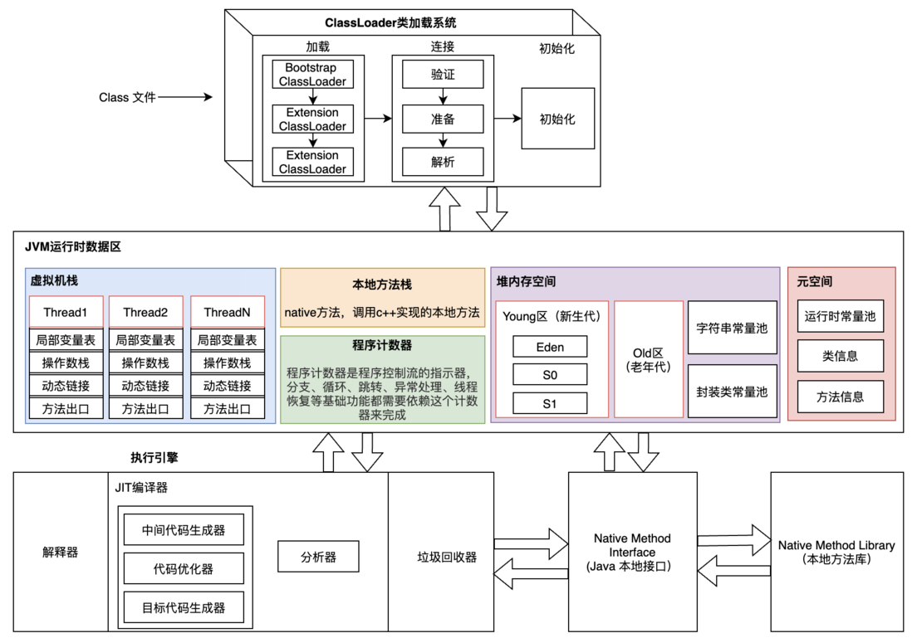](https://segmentfault.com/a/1190000040922573)

JVM启动流程：JVM启动时，是由java命令/javaw命令来启动的。

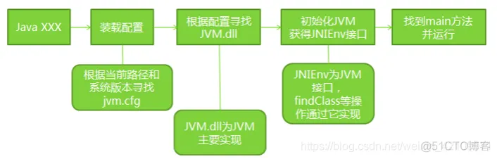

JVM内存结构（Java Memory Structure）和JVM的运行时区域有关。Hotspot VM为JVM的一个实现。

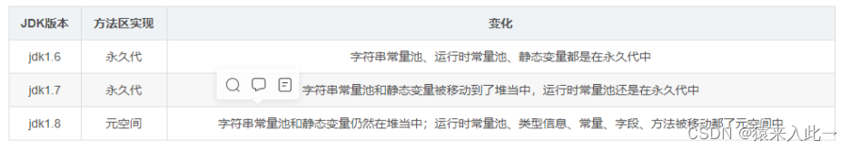

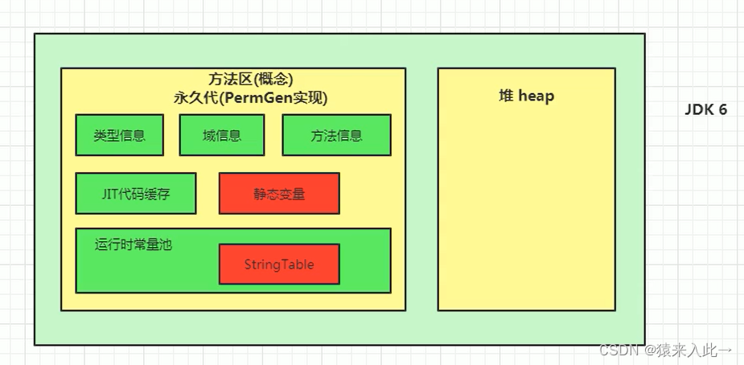

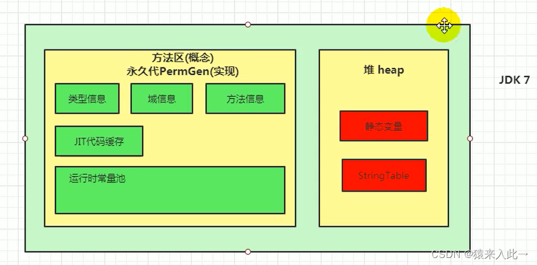

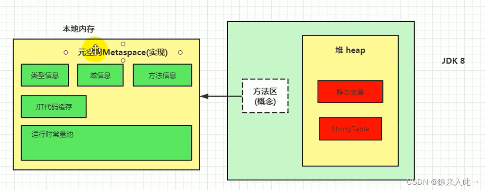

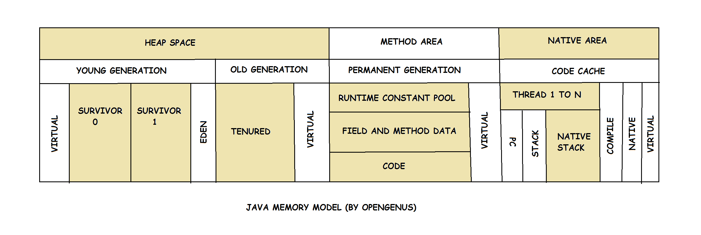


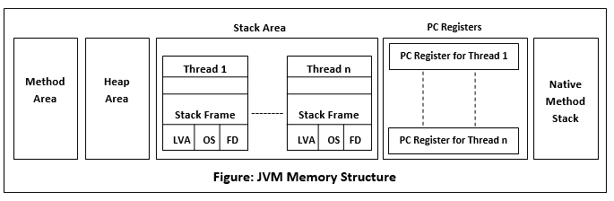

- 方法区（Method Area）/元空间（Metaspace），线程共享
  - 编译器编译后的代码
  
  - 元数据
  
  - 运行时常量池（Runtime Constant Pool）
  
    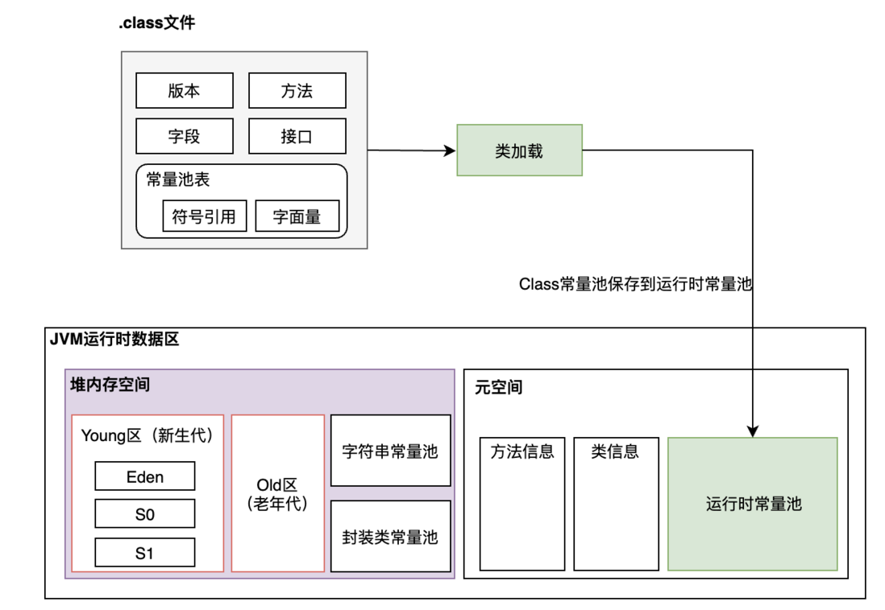
  
- JVM堆（JVM Heap），线程共享，年轻代 : 老年代 = 1 : 2，可以通过`-Xms`设置初始大小，通过`-Xmx`设置最大大小，通过`-XX:NewRatio=n`设置年轻代和年老代的比值
  - 年轻代（Young Gen），新生区 : 复活区 = 4 : 1，可以通过`-Xmn`设置初始和最大堆大小，通过`-XX:SurvivorRatio=n`年轻代中Eden区与两个Survivor区的比值
    - 新生区（Eden）
    - 复活区（Survivor），上一轮 : 本轮 = 1 : 1
      - 上一轮（From）
      - 本轮（To）
  - 老年代（Old/Tenured Gen）
  
- [JVM栈（JVM Stack）](https://www.artima.com/insidejvm/ed2/jvm8.html)，线程隔离，可以通过`-Xxs`设置最大大小
  
  - 栈帧（Stack Frame）
    - 局部变量表（Local Variables Array），一个数字数组，主要用于存储方法参数、定义在方法体内部的局部变量，数据类型包括各类基本数据类型，对象引用，以及 return address 类型。只要被局部变量表中直接或间接引用的对象都不会被回收。
    - 操作数栈（Operand Stack），主要用于保存计算过程的中间结果，同时作为计算过程中变量临时的存储空间。如果被调用的方法带有返回值的话，其返回值将会被压入当前栈帧的操作数栈中，并更新程序计数器中下一条需要执行的字节码指令。
    - 帧数据（Frame Data）
      - 动态链接（Dynamic Linking）：在程序运行期将符号引用（Symbolic Reference）转变为指向运行时常量池的直接引用（Direct Reference）
        - 字面量（Literal）
      - 方法返回地址（Return Address）
      - 异常调度（Exception Dispatch）
      - 附加信息（Other Information）
    
    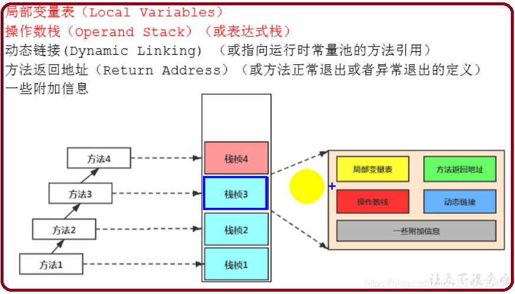
  
- 本地方法栈（Native Method Stack），线程隔离

- 程序计数器（Program Counter Register），又叫PC寄存器，线程隔离，是一块较小的内存空间，是**当前线程的当前栈帧（方法）正在执行的那条字节码指令的地址**。若当前线程正在执行的是一个本地方法，那么此时程序计数器为undefined。唯一一个不会出现`OutOfMemoryError`的内存区域。

  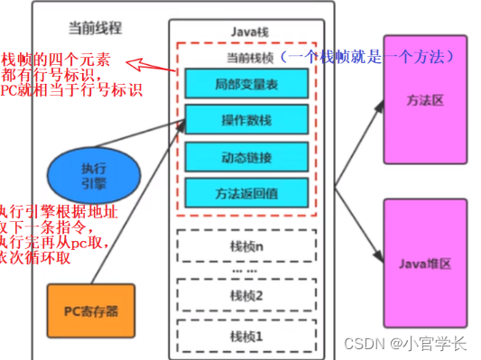

  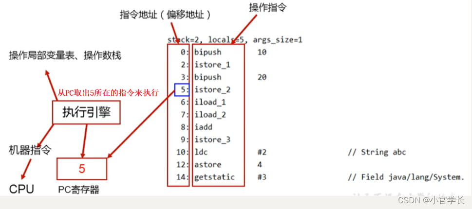

# JAVA对象模型


**Java对象模型（OOP-Klass Model，OOP：Ordinary Object Pointer）**和Java对象在JVM中的表现形式有关。HotSpot虚拟机中，设计了OOP-KlassModel，其中OOP是指普通对象指针，而Klass用来描述对象实例的具体类型，实现了元数据和实例数据进行分离。之所以采用这个模型是因为HotSopt VM的设计者不想让每个对象中都含有一个vtable（虚方法表），所以就把对象模型拆成Klass和OOP，其中OOP中不含有任何虚方法，而Klass含有虚函数表，可以进行method dispatch（方法调度）。

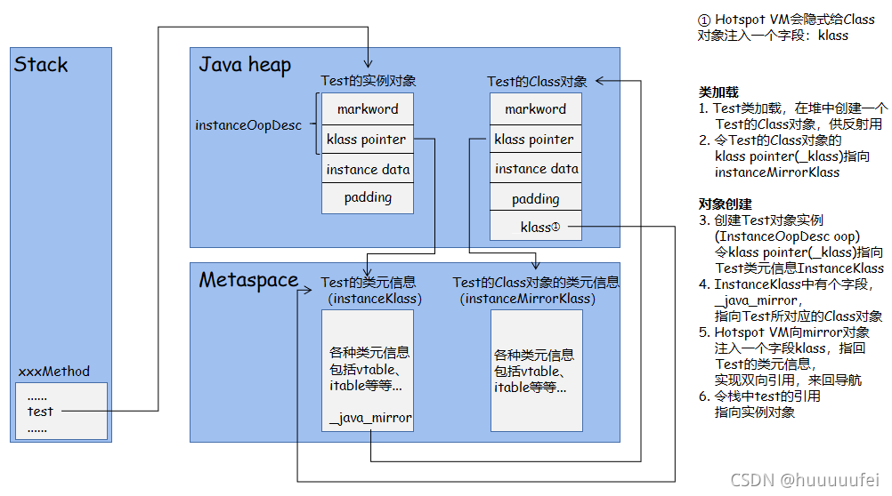

每个Java类再 被JVM加载的时候，JVM会给该类创建一个`instanceKlass`，保存在 方法区，用来在JVM层次表示该Java类。当我们在Java代码中通过`new`创建一个对象时，JVM会在 堆中创建一个`instanceOopDesc`对象，这个对象包含了 对象头及 实例数据。对象头中的 元数据指针指向 方法区中的`instanceKlass`。在Java虚拟机栈中创建 对象的引用，指向堆中对象的对象头。

对象头中包含了GC分代年龄、锁状态标记、哈希码、epoch等信息。对象的状态一共有五种：无状态、轻量级锁、重量级锁、GC标记、偏向锁。

---

## OOP

Ordinary Object Pointer，即**标准对象指针**，它用来表示对象的实例信息。

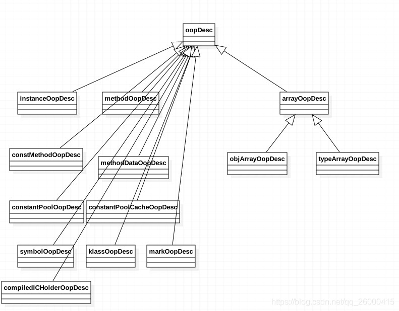

```c++
// 定义了oops共同基类（JDK8之前）
typedef class oopDesc*                            oop;
// 表示一个Java类型实例
typedef class   instanceOopDesc*            instanceOop;
// 表示一个Java方法（JDK8废弃）
typedef class   methodOopDesc*                    methodOop;
// 表示一个Java方法中的不变信息（JDK8废弃）
typedef class   constMethodOopDesc*            constMethodOop;
// 记录性能信息的数据结构（JDK8废弃）
typedef class   methodDataOopDesc*            methodDataOop;
// 定义了数组OOPS的抽象基类
typedef class   arrayOopDesc*                    arrayOop;
// 表示持有一个OOPS数组
typedef class     objArrayOopDesc*            objArrayOop;
// 表示容纳基本类型的数组
typedef class     typeArrayOopDesc*            typeArrayOop;
// 表示在Class文件中描述的常量池（JDK8废弃）
typedef class   constantPoolOopDesc*            constantPoolOop;
// 常量池告诉缓存（JDK8废弃）
typedef class   constantPoolCacheOopDesc*   constantPoolCacheOop;
// 描述一个与Java类对等的C++类（JDK8废弃）
typedef class   klassOopDesc*                    klassOop;
// 表示对象头（JDK8取消该字段）
typedef class   markOopDesc*                    markOop;
// （JDK8废弃）
typedef class   compiledICHolderOopDesc*    compiledICHolderOop;

// 从JDK8开始
typedef class oopDesc*                            oop;
typedef class   instanceOopDesc*            instanceOop;
typedef class   arrayOopDesc*                    arrayOop;
typedef class     objArrayOopDesc*            objArrayOop;
typedef class     typeArrayOopDesc*            typeArrayOop;

// 元数据 JDK8的Metaspace中
//      class MetaspaceObj
class   ConstMethod;
class   ConstantPoolCache;
class   MethodData;
//      class Metadata
class   Method;
class   ConstantPool;
//      class CHeapObj
class   CompiledICHolder;
```

以下是 JDK7 中的类在 JDK8 中的存在形式：
- `klassOop` -> `Klass*`
- `klassKlass` 不再需要
- `methodOop` -> `Method*`
- `methodDataOop` -> `MethodData*`
- `constMethodOop` -> `ConstMethod*`
- `constantPoolOop` -> `ConstantPool*`
- `constantPoolCacheOop` -> `ConstantPoolCache*`

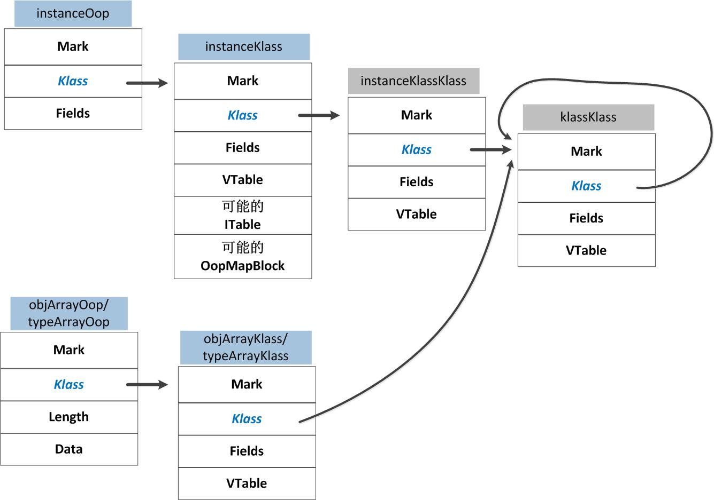

- oop（ordinary object pointer）：oopDesc是Java对象类和Java数组类对象类的顶级基类，也叫**对象头**（oop header）。Java对象的组成：对象头 + 实例数据 + 对齐填充。{name}Desc类描述了Java对象的格式，因此可以从C++访问字段，去除Desc的是相应类的指针类型。oopDesc是抽象的。

  ```c++
  class oopDesc {
      private:
      volatile markOop _mark;
      union _metadata {
          // JDK8之前
          wideKlassOop _klass;
          narrowOop    _compressed_klass;
          // 从JDK8开始废弃klassOop
          Klass*       _klass;
      	narrowKlass  _compressed_klass;
      } _metadata;
  }
  ```

- instanceOop：一个instanceOopDesc是Java类的一个实例，例如调用`new`通过JVM在堆区创建instanceOopDesc，表示这个实例对象，并在栈区创建其引用。在 JVM 内部，一个Java对象在内存中的布局可以连续分成两部分：instanceOopDecs和实例数据。instanceOopDesc包括两部分：

  - 继承至oopDesc类的数据成员(`_mark`和`_metadata`)；
  - 真正的Java类的数据成员，其组成包括：
    - 继承至父类的数据成员和自身的数据成员；
    - 以及为了对齐而产生的填充数据。  

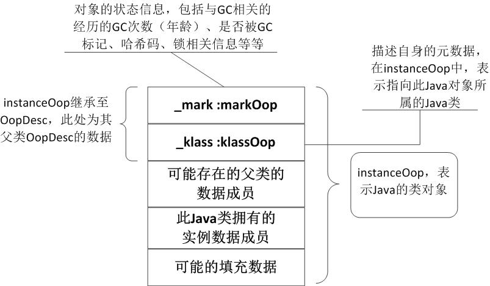

- arrayOop：基本类型数组对象typeArrayOop和引用类型数组对象objArrayOop；

  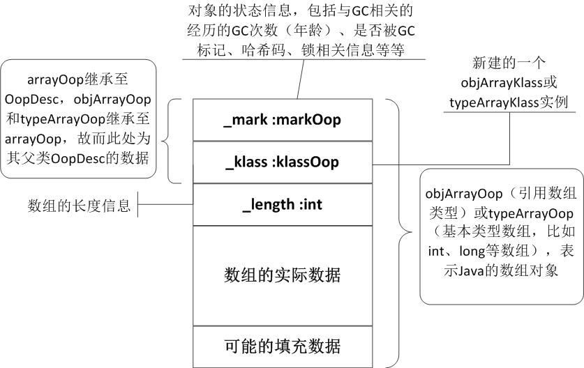

- klassOop（过时）：Java类**在C++中的等价物**。klassOopDesc的一部分（基类）是负责调度C++方法调用的Klass。VM C++对instanceKlass的访问是通过klassOop进行的。
  - JDK8之前的HotSpot，GC堆里的对象的对象头里有`markOop _mark`和`klassOop _klass`（或者压缩指针版）两个字段，klassOop是klassOopDesc，klassOopDesc是把各种-Klass对象包装成可以被GC管理的包装对象。instanceKlass里有`_java_mirror`指针指向对应的java.lang.Class实例，同时Class里也有隐藏字段指向对应的instanceKlass。
  - JDK8之后，GC堆里的对象的对象头的`_klass`直接就是Klass*（或者压缩指针版），直接指向在Metaspace内的Klass（不再经过klassOopDesc这个包装层），然后Klass与Class仍然相互持有对方的指针（`klass`和`_java_mirror`）。**同时废弃的还有klassKlass。**

---

## Klass

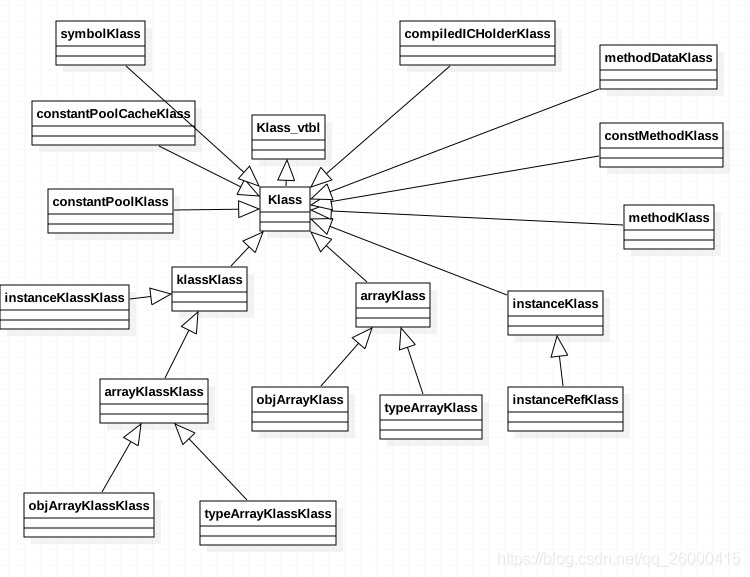

```c++
// klassOop的一部分，用来描述语言层的类型（JDK8之前）
class Klass;
// 在虚拟机层面描述一个Java类
class   instanceKlass;
// 专有instantKlass，表示java.lang.Class的Klass
class     instanceMirrorKlass;
// 专有instantKlass，表示java.lang.ref.Reference的子类的Klass
class     instanceRefKlass;
// 表示methodOop的Klass
class   methodKlass;
// 表示constMethodOop的Klass
class   constMethodKlass;
// 表示methodDataOop的Klass
class   methodDataKlass;
// 作为klass链的端点，klassKlass的Klass就是它自身
class   klassKlass;
// 表示instanceKlass的Klass
class     instanceKlassKlass;
// 表示arrayKlass的Klass
class     arrayKlassKlass;
// 表示objArrayKlass的Klass
class       objArrayKlassKlass;
// 表示typeArrayKlass的Klass
class       typeArrayKlassKlass;
// 表示array类型的抽象基类
class   arrayKlass;
// 表示objArrayOop的Klass
class     objArrayKlass;
// 表示typeArrayOop的Klass
class     typeArrayKlass;
// 表示constantPoolOop的Klass
class   constantPoolKlass;
// 表示constantPoolCacheOop的Klass
class   constantPoolCacheKlass;

// 从JDK8开始
class Klass;
class   InstanceKlass;
class     InstanceMirrorKlass;
class     InstanceClassLoaderKlass;
class     InstanceRefKlass;
class   ArrayKlass;
class     ObjArrayKlass;
class     TypeArrayKlass;
```

- klass：klassOop的一部分（基类），用来：

  1. 提供一个与Java类对等的C++类型描述，即语言级的类对象（方法字典等）；
  2. 为对象提供虚拟机内部的函数调用机制

  这两种功能被整合到一个C++类中。顶级类Klass实现了目的 1，而所有子类都为目的 2 提供了额外的虚拟函数。

- instanceKlass：Java类的VM级别表示。它包含一个类在执行时所需的所有信息。从JDK8开始被实例对象通过`_klass`所指向。instanceKlass的`_java_mirror`指向该类的java.lang.Class实例，同时后者的`klass`（区别与`_klass`）又指向前者。JVM在进行类加载时，在方法区创建instanceKlass，表示其元数据，包括常量池、字段、方法等。在堆中创建其java.lang.Class实例对象作为镜像，并在其中存放其静态变量。

  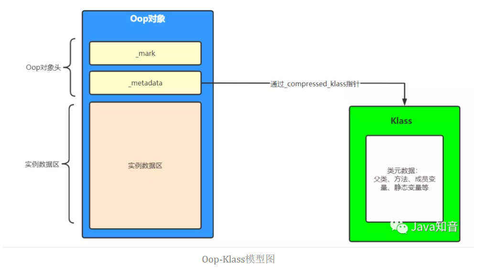

- instanceKlassKlass：一个instanceKlassKlass是一个instanceKlass的类，被后者通过`_klass`所指向。

- instanceMirrorKlass：java.lang.Class实例的专用instanceKlass，被前者通过`_klass`所指向。这些实例很特殊，因为除了Class的普通字段之外，它们还包含类的静态字段。这意味着它们是可变大小的实例，需要特殊的逻辑来计算它们的大小和迭代它们的oops

- instanceRefKlass：Java类的专用instanceKlass，这些类是java.lang.ref.Reference的子类。这些类用于实现强引用（FinalReference）、软引用（SoftReference）、弱引用（WeakReference）、虚引用（PhantomReference）和终止引用（FinalizerReference），需要垃圾收集器的特殊处理。在GC期间，发现的引用对象将根据引用的类型添加（链接）到下面的四个列表之一。链接通过类java.lang.ref.Reference中的下一个字段发生。然后，按照可达性降序处理发现的引用。符合通知条件的引用对象链接到类java.lang.ref.Reference中的静态挂起列表，并通知同一个类中的挂起列表锁定对象。

- arrayKlass：基本类型数组类typeArrayKlass和引用类型数组类objArrayKlass；

---

## OOP与Klass的关系

**注意JDK7和JDK8的变化。**

JDK8之前通过JVM中的instanceOop和C++中的klassOop与JVM中的instanceKlass的组合连接。JDK8之后通过JVM中的instacneOop和Metaspace中的instanceKlass连接：

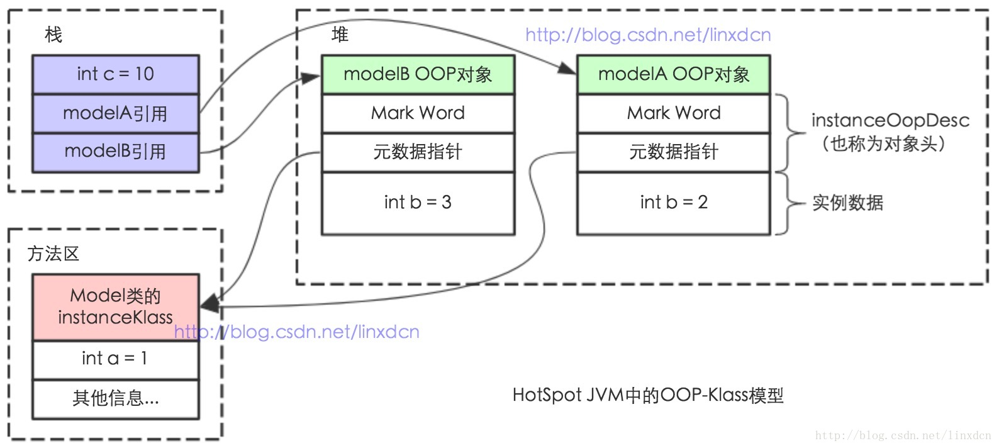

Java类不仅仅由klassOopDesc表示，那么Java类到底由什么来表示？**JDK8之前**的答案是表示Java类的是一个**组合对象**。这个组合对象由两部分组成：一部分是klassOopDesc的数据成员，另一部分是instanceKlass的数据成员。当一个代表Java类的二进制代码经过解析后，虚拟机首先在方法区中分配足够包括这两部分的内存空间并进行合适的赋初始值工作，并将此对象以klassOopDesc指针的形式返回。换句话说，表示Java类的既是klassOopDesc对象，也是一个instanceKlass对象。在使用过程中，一般是作为klassOopDesc的形式进行使用，但需要使用instanceKlass的数据成员时，就在此指针的基础上加上一个固定的偏移，就可以得到表示instanceKlass的指针。在64位机器上，这个固定的偏移为16字节的长度（即使打开压缩指针存储，但因为内存对齐的需求，也需要跨越16字节的长度，才能得到表示instanceKlass的指针）具体如下图所示，klassOopDesc只有继承至oopDesc的数据成员，即在64位机器上是两个指针的长度，为16字节长度。 **JDK8开始**的答案是instanceKlass。

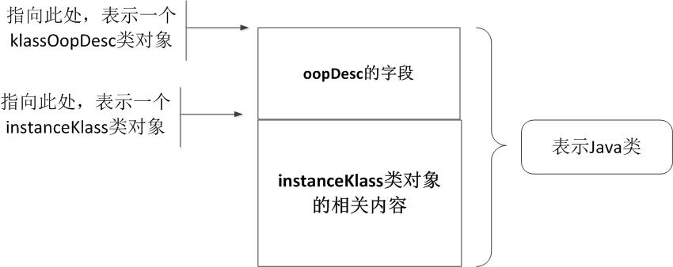

**总结**：当一个新的Java对象需要建立时，首先将代表此类型的二进制数据载入，在方法区建立代表此Java类的组合对象——klassOop和instanceKlass的组合，然后通过运行时的相关函数，从堆空间为此Java类对象分配空间并返还给应用；Java数组对象的建立，首先需要确保数组的元素所代表的类载入，然后需要保证此类所继承的父类、父接口的数组要在方法区存在，如果不存在，首先要在方法区建立之。比如在一个继承体系中，整数类Integer继承至Number类，Number类继承Object类，那么如果建立Integer的Java数组，首先需要建立Number数组类，然后是Object数组类，Object数组类的父类为Object类；然后，在方法区为本数组类分配空间并初始化；最后，当相应的Java数组类建立后，Hotspot在堆内存中为Java数组对象分配空间。

在运行时，每一个Java对象或Java数组对象中的Klass分别指向代表Java类的instanceKlass和代表Java数组类的objArrayKlass（引用类型）/typeArrayKlass（基本类型）。而instanceKlass的Klass指向instanceKlassKlass，这个instanceKlassKlass和klassKlass的类对象是在初始化时建立的，属于全局对象；下图有表示Java对象的instanceOop，表示Java类的instanceKlass，表示Java数组对象的objArrayOop/typeArrayOop，表示Java数组类的objArrayKlass/typeArrayKlass，这几个对象都是运行时建立的。具体如下所示（JDK8之前）：


下面使用实际的事例加以说明。这个例子是一个简单的面向对象的继承结构，父类为Shape，是一个抽象类，三个具体的子类Triangle、Ellipse、Square继承至父类Shape。继承结构如下图所示：

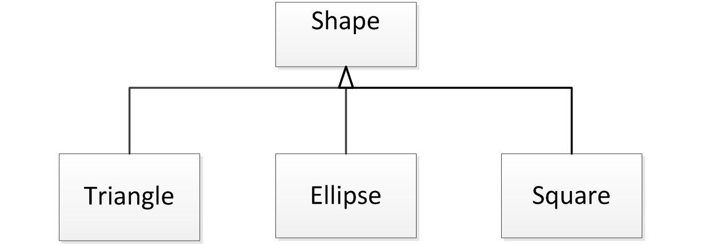

在运行时，当应用需要访问这些类时，Hotspot需要首先解析这些类，并建立instancKlass实例对象表示这个Java类。这个instancKlass实例对象在“对象头”使其指向在初始化时期建立的instanceKlassKlass实例。其它的Java类，比如Integer、String等所有的Java类所建立的instanceKlass实例都指向这个instanceKlassKlass实例，如下图所示。建立的Java对像在其“对象头”处指向所属的Java类，即相应的instanceKlass对象。 

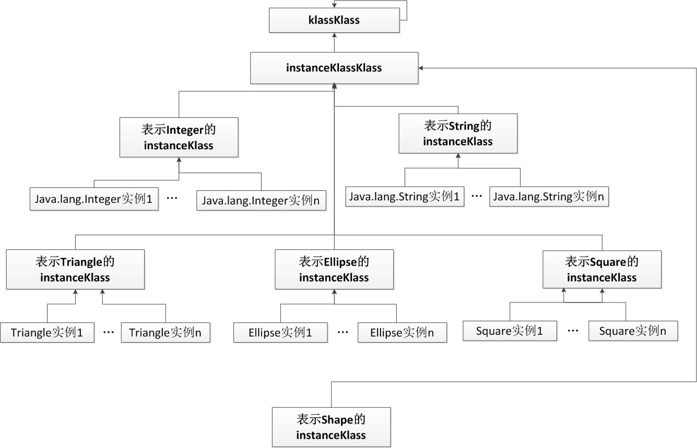

# JAVA内存模型

Java内存模型（Java Memory Model）和Java的并发编程有关。

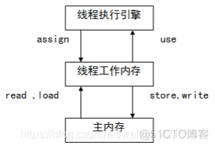

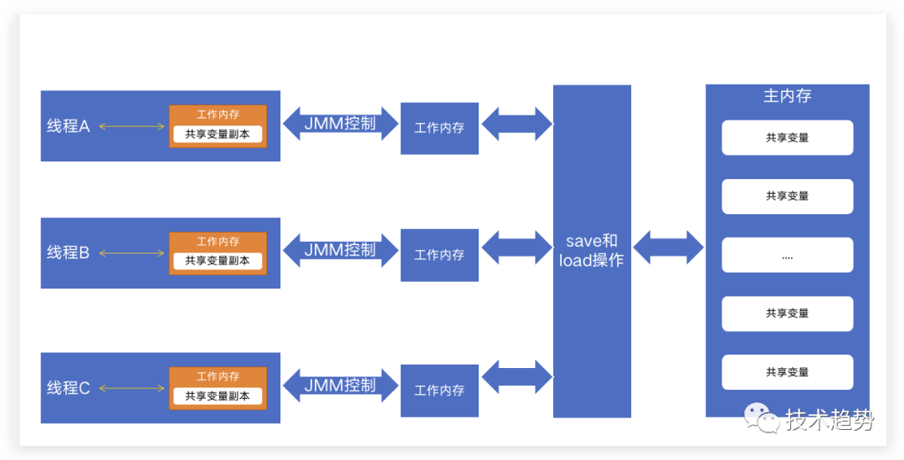

## 内存间交互操作

JMM定义了8种操作（原子操作），虚拟实现时保证这8中操作均为原子操作，以下为8中操作的介绍以及执行顺序：

- lock（锁定）：作用于主内存的变量，把一个变量标志为一个线程占有状态（锁定）；
- unlock（解锁）：作用于主内存的变量，把一个变量从一个线程的锁定状态解除，以便其他线程锁定；
- read（读取）：作用于主内存的变量，将变量从主内存读取到线程的工作空间，以便后续load操作使用；
- load（载入）：作用于工作空间的变量，将load操作从主内存得到的变量放入工作内存变量副本中；
- use（使用）：作用于工作空间的变量，将工作空间中的变量值传递给执行引擎，每当虚拟机遇到一个需要使用到变量的字节码指令时将执行这个操作；
- assign（赋值）：作用于工作内存的变量，把一个从执行引擎接收的值赋给工作空间的变量；
- store（存储）：作用于工作内存的变量，把工作空间的一个变量传到主内存，以便后续write操作使用；
- write（写入）：作用于主内存的变量，把store操作从工作内存中得到的变量值放入主内存的变量中。

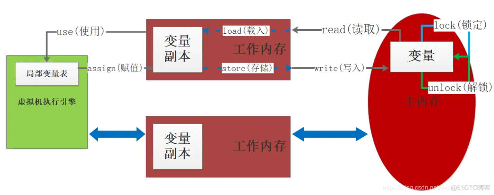

有关操作的一些规定：

- 不允许read和load、store和write操作之一单独出现，即不允许一个变量从主内存读取了但工作内存不接受，或者从工作内存发起回写了但主内存不接受的情况；
- 不允许一个线程丢弃它的最近assign操作，即变量在工作内存中改变了之后必须把该变化同步回主内存；
- 不允许一个线程无原因的（没有发生过任何assign操作）把数据从线程的工作内存同步回主内存中。即不能对变量没做任何操作却无原因的同步回主内存；
- 一个新的变量只能在主内存中诞生，不允许在工作内存中直接使用一个未被初始化（load或assign）的变量，就是对一个变量执行use和store之前必须先执行过了load和assign操作；
- 一个变量在同一个时刻只允许一条线程对其进行lock操作，但lock操作可以被同一条线程重复执行多次，多次执行lock后，只有执行相同次数的unlock操作，变量才会被解锁；
- 如果对一个变量执行lock操作，将会清空工作内存中此变量的值，在执行引擎使用这个变量前，需要重新执行load或assign操作初始化变量的值；
- 如果一个变量事先没有被lock操作锁定，则不允许对它执行unlock操作，也不允许去unlock一个被其他线程锁定住的变量；
- 对一个变量执行unlock操作之前，必须先把此变量同步回主内存中（执行store write）。

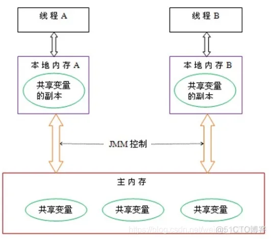

## 内存模型并发保障：Java并发的三大特性

- 原子性：处理器优化问题。一个操作不可被CPU中断再进行调度，要么一次性完成，要么不做。Java内存模型直接保证得原子性操作包括read、load、use、assign、store和write这六个。可以认为基本数据类型（long和double除外，64字节在32位上需要两部操作）的变量操作是具有原子性的，而lock和unlock对应在高层次的字节码指令`monitorenter`和`monitorexit`来隐式的使用底层的这两个操作，高层次的这两个字节码指令在Java中就是同步块，Synchronized关键字，因此在synchronized块之间的操作也具备原子性。

- 可见性：缓存一致性问题。多线程访问同一个变量时，一个线程修改了变量的值，其他线程能立即看到修改之后的值。

  > 在现代计算机系统中，每个 CPU 都有缓存（Cache）。为了提高性能，系统通常会将主内存中的数据缓存到 CPU 近距离的缓存中。如果一个线程在 CPU A 上运行，并修改了一个变量，这个变量的新值可能会被存储在 CPU A 的缓存中，而不是主内存中。此时，如果另一个线程在 CPU B 上运行，并试图读取这个变量，它可能会看到这个变量的旧值。所以需要强制写入主内存。

- 有序性：指令重排问题。程序执行按照代码先后顺序执行。

  > 指令重排：在不破坏数据依赖性的前提下，改变内部执行顺序，使其和代码顺序不一样。

### Synchronized

写有该关键字的代码块或方法，其内部的操作是**原子性**的，保证同一时刻只有一条线程操作。底层是通过`monitorenter`，`monitorexit`指令加解锁，对一个变量解锁之前，必须先把变量同步会主内存，保证共享变量的**修改的可见性**。需要注意的是 synchronized 是**无法禁止指令重排**和处理器优化的。但是 synchronized 同样提供了**有序性**保证。Java 程序中，如果在本线程内观察，所有操作都是天然有序的。如果在一个线程中观察另一个线程，所有操作都是无序的。由于 synchronized 修饰的代码**同一时间只能被同一线程访问**，也就是单线程执行的，所以可以保证其**有序性**（局部单线程无序，不影响多线程之间的有序结果）。

- 同步方法（`ACC_SYNCHRONIZED`）：通过 `ACC_SYNCHRONIZED`标记符来实现同步。当一个线程要访问某个方法时，会检查是否有`ACC_SYNCHRONIZED`，如果有设置，则需要先获取到监视器锁，**其中静态方法锁定类（全局锁），动态方法锁定实例对象**。然后再开始执行方法，方法执行完后在释放监视器锁。如果此时其他线程来请求此方法，会因为无法获取到监视器锁而被**阻塞**。值得注意的是，如果在执行方法时发生了异常并且方法内部未处理该异常，**在异常被抛到方法外之前监视器锁会自动释放**。
- 同步块（`monitorenter`和`monitorexit`）：通过`monitorenter`和`monitorexit`两个指令来实现同步。执行`monitorenter`指令表示**加锁**，执行`monitorexit`指令表示解锁。每个对象维护着被锁次数的**计数器**，未被锁定的对象，计数器为 0。**锁定的是括号中的对象实例。**

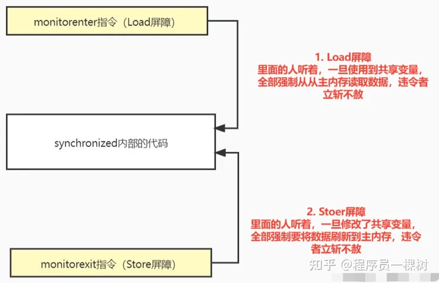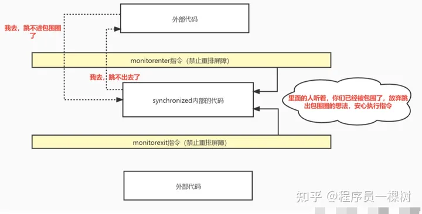

synchronized 和 ReentrantLock 都是**可重入**的。

### Volatile

>volatile
>
>*adj.* 爆炸性的；不稳定的；挥发性的；反复无常的
>
>*n.* 挥发物；有翅的动物

“轻量级”的 synchronized，**只能用来修饰变量**。在大多数场景下，volatile 总开销仍然比锁要低。Java 语言规范第三版中对 volatile 的定义如下：

> Java 编程语言允许线程访问共享变量，为了确保共享变量能被准确和一致的更新，线程应该确保通过排他锁单独获得这个变量。Java 语言提供了 volatile，在某些情况下比锁更加方便。如果一个字段被声明成 volatile， Java 线程内存模型确保所有线程看到这个变量的值是一致的。

可见性 + 禁止指令重排，没有原子性

一个变量被 volatile 修饰后，[每次数据变化之后，其值都会被强制刷入主存。其他处理器缓存由于遵守了**缓存一致性协**议，就会把这个变量的值从主内存（公共堆）加载到自己的缓存中](https://www.cnblogs.com/yungyu16/p/13200565.html)，而不是像**普通变量从线程的私有堆栈中取得变量的值**，保证了共享变量的“**可见性**”。

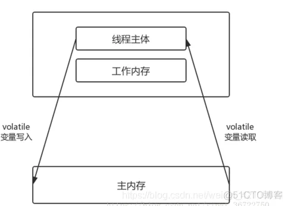

并且通过隐式插入**内存屏障**，禁止指令重排，保证“**有序性**”：
- StoreStore 屏障：写写之间插入，禁止**前写**与**后写**重排，用于确保多个写操作的顺序；
- StoreLoad 屏障：写读之间插入，禁止**前写**与**后读**重排，最强的屏障，通常用于**确保数据依赖性**，防止读到旧值；
- LoadLoad 屏障：读读之间插入，禁止**前读**与**后读**重排，用于确保读多个操作的顺序；
- LoadStore 屏障：读写之间插入，禁止**前读**与**后写**重排，相对少用，主要用于特定的依赖情况。

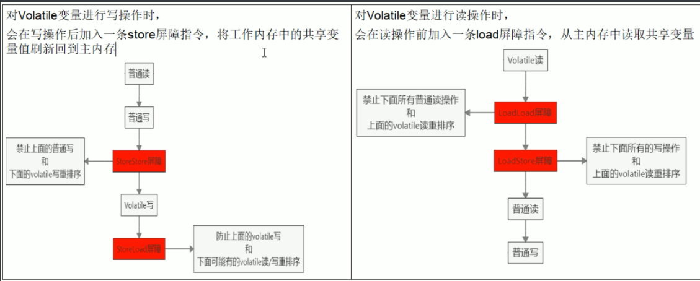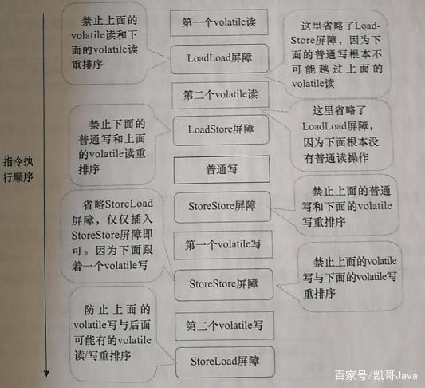

但是**不能保证“原子性**”，因为不涉及`monitorenter`和`monitorexit`两个指令。不能保证的原子性操作有：

- 对变量的写入操作不依赖于该变量的当前值（比如`a = 0; a = a + 1;`的操作，整个流程为 a 初始化为 0，将 a 的值在 0 的基础之上加1，然后赋值给 a 本身，很明显依赖了当前值），或者确保只有单一线程修改变量；
- 该变量不会与其他状态变量纳入不变性条件中（当变量本身是不可变时，volatile 能保证安全访问，比如双重判断的单例模式，但一旦其他状态变量参杂进来的时候，并发情况就无法预知，正确性也无法保障）。

### Final

在 Java 中，final 关键字用于声明一个常量，也就是说，一旦赋值后，就不能再改变。这个特性使得 final 字段在构造函数中赋值后，所有线程都可以看到这个字段的正确值，从而保证了可见性。

具体来说，当一个对象被创建时，如果它的 final 字段在构造函数中被初始化，那么当构造函数结束时，任何获取到该对象引用的线程都将看到 final 字段已经被初始化完成的值，即使没有使用锁或者其他同步机制。

这是因为 Java 内存模型为 final 字段提供了一个重排序规则：在构造函数中对 final 字段的写入，和随后把这个被构造对象的引用赋给一个引用变量，这两个操作**不能重排序**。这就保证了一旦一个对象被构造完成，并且该对象的引用被别的线程获得，那么这个线程能看到该对象 final 字段的正确值。

## 先行发生原则

在此列，并且无法从下列规则推导出来的话，它们就没有顺序性保障，虚拟机可以对它们随意地进行重排序。以下为 8 个具体原则：
- **程序次序规则**（Program Order Rule）：在一个线程内，按照程序代码顺序，书写在前面的操作先行发生于书写在后面的操作。准确地说，应该是控制流顺序而不是程序代码顺序，因为要考虑分支、循环等结构；
- **传递性**（Transitivity）：如果操作A先行发生于操作 B，操作 B 先行发生于操作 C，那就可以得出操作 A 先行发生于操作 C 的结论；
- **对象终结规则**（Finalizer Rule）：一个对象的初始化完成（构造函数执行结束）先行发生于它的`finalize()`方法的开始；
- **管程锁定规则**（Monitor Lock Rule）：一个 unlock 操作先行发生于后面对同一个锁的 lock 操作。这里必须强调的是同一个锁，而“后面”是指时间上的先后顺序；
- **volatile 变量规则**（Volatile Variable Rule）：对一个 volatile 变量的写操作先行发生于后面对这个变量的读操作，这里的“后面”同样是指时间上的先后顺序；
- **线程启动规则**（Thread Start Rule）：Thread对象的`start()`方法先行发生于此线程的每一个动作；
- **线程终止规则**（Thread Termination Rule）：线程中的所有操作都先行发生于对此线程的终止检测，我们可以通过`Thread.join()`方法结束、`Thread.isAlive()`的返回值等手段检测到线程已经终止执行；
- **线程中断规则**（Thread Interruption Rule）：对线程`interrupt()`方法的调用先行发生于被中断线程的代码检测到中断事件的发生，可以通过`Thread.interrupted()`方法检测到是否有中断发生。
