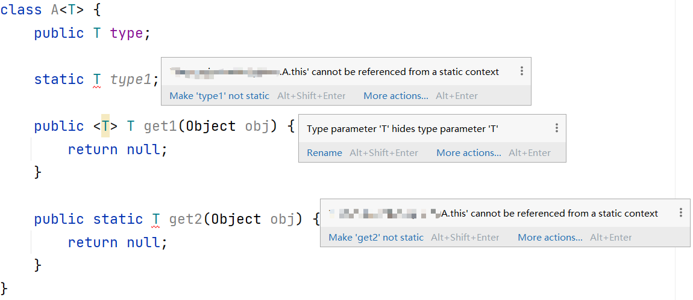
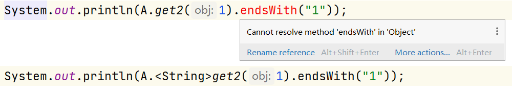

# 泛型

Java 泛型的相关术语：

- `ArrayList<E>`中的 E 称为**类型参数**或**类型变量**，即 Type Parameter；
- `ArrayList<Integer>`中的 Integer 称为**实际类型参数**，即 Actual Type Argument，或 Type Argument；
- `ArrayList<E>`或`ArrayList<Integer>`中的 ArrayList 称为**泛型类**，在类型擦除的语境下 ArrayList 也称为**原始类型**，即参数化类型`ArrayList<Object>`；
- 整个`ArrayList<E>`称为**泛型类型**；
- 整个`ArrayList<Integer>`称为**参数化类型**，即 Parameterized Type；
- `ArrayList<E extends Comparable>`中的 Comparable 称为**限定类型**。

泛型类型 = 泛型类<类型参数[ extends 限定类型]>

参数化类型 = 泛型类<实际类型参数>

类型变量使用大写形式，且比较短。在Java库中，使用如下字母：

- 任意类型：T (type), U, S	（T 的临近字母）
- 映射中的键值：K (key), V (value)
- 集合中的元素：E (element)

> 泛型类的类型参数可以修饰实例变量的类型、实例方法的形参类型、实例方法体中局部变量的类型、实例方法的返回值类型，而不能在静态变量和静态方法的任何位置进行修饰。
>
> 泛型方法的类型参数可以修饰泛型方法的形参类型、泛型方法体中局部变量的类型、泛型方法的返回值类型，其中泛型方法可以是静态或非静态的。

## 泛型擦除（Generic Erase）

编译器都会自动为该泛型类型提供一个对应的原始类型（raw type）。原始类型的名字就是删去尖括号以及其中的类型参数后的泛型类型名，而原始类型中的内容就是将泛型类型中的类型变量进行擦除（erase），并替换为限定类型（如果没有显式指定限定类型，则用默认的限定类型Object）。

由于类型擦除后，Pair 类含有 Object 类型的域，而 Object 不能存储基本类型的值，所以不能使用基本类型实例化类型参数。因此没有`Pair<double>`，只有`Pair<Double>`。

由于类型擦除机制，泛型类型在编译后会被替换为限定类型或 `Object`。在运行时，通过反射只能获取到原始类型（原始类型即为没有泛型参数的类或接口）。对于无限定的泛型类型，类型参数被擦除为 `Object`，但这一信息在**运行时不可见**，无法通过反射直接获取。这是 Java 类型擦除机制的限制之一。通过使用**具体化子类**和反射，可以在一定程度上获取其父类（`getGenericSuperclass`）的泛型参数的信息。这种方法在需要运行时检查泛型类型参数的场景中是有效的。

在**反编译**后可以获取到经过泛型擦除后的限定类型：

```
// signature <T:Ljava/lang/Number;>Ljava/lang/Object;
// declaration: A<T extends java.lang.Number>
class A {
	// ...
	
	// signature <T:Ljava/lang/Number;>([Ljava/lang/Object;)TT;
    // declaration: T get<T extends java.lang.Number>(java.lang.Object[])
    public static get([Ljava/lang/Object;)Ljava/lang/Number;
}
```

**运行时**无法获取到泛型：

```java
class A<T> {
    public T type;
}

public class Test {
    public static void main(String[] args) {
        A<String> a = new A<>();
        Type type = a.getClass().getGenericSuperclass();
        System.out.println(type.getTypeName()); // java.lang.Object
        ParameterizedType pt = (ParameterizedType) type; // Exception in thread "main" java.lang.ClassCastException: class java.lang.Class cannot be cast to class java.lang.reflect.ParameterizedType (java.lang.Class and java.lang.reflect.ParameterizedType are in module java.base of loader 'bootstrap')
    }
}
```

**子类**可以获取到泛型：

```java
class A<T> {
    public T type;
}

class B extends A<String> {
}

public class Test {
    public static void main(String[] args) {        
        B b = new B();
        Type type = b.getClass().getGenericSuperclass();
        System.out.println(type.getTypeName()); // A<java.lang.String>
        ParameterizedType pt = (ParameterizedType) type;
        System.out.println(pt.getActualTypeArguments()[0].getTypeName()); // java.lang.String
    }
}
```

创建泛型类的实例时，类型参数必须是明确的类型的符号引用（TypeSymbol），不能用形参指代。

> [https://blog.csdn.net/weixin_48118167/article/details/130290449](https://blog.csdn.net/weixin_48118167/article/details/130290449)
>
> 在Java中，符号引用（Symbolic Reference）是指用一个符号来代替目标引用的一种引用方式。它包括了两个部分：符号引用和解析。
>
> 符号引用是指在Java类中通过类、方法、字段等名称来引用其他类、方法、字段等的方式。在Java源代码中使用的类名、方法名、字段名等都属于符号引用。符号引用是一个字面量，它可以被存储在类或者方法的常量池中，而不需要提前解析。
>
> 解析是指在运行期间将符号引用转换为实际的内存地址的过程。在Java虚拟机中，符号引用被解析成**直接引用**（Direct Reference），也就是实际的内存地址。在Java中，虚拟机会在运行期间动态解析符号引用，将其转换为直接引用。
>
> 在Java虚拟机规范中，符号引用的格式如下：
>
> > 类或接口的全限定名（对于数组类型，用 “[” 表示） + “#” + 成员名称 + 成员描述符
>
> 例如：`System.out.println()`的格式为`java.io.PrintStream#println(String)`，其中`java.io.PrintStream`是类的全限定名，`println`是方法的名称，`String`是方法的参数类型。

[更多关于符号引用](./类加载与对象初始化.md)

静态方法必须显式声明**类型参数列表**，实例方法不需要类型参数列表（已经由实例确定类型，编译器可通过上下文推断出这个泛型方法的实际类型参数）：



调用静态方法时，类型参数列表的用法：



### 桥方法（Bridge Method）

桥方法不仅用于泛型类型，Java 的重写特性也用到了桥方法。首先再次介绍一下 Java 重写的规则：

1. ⽅法名和参数列表必须相同，返回值类型小于等于父类，抛出的异常范围⼩于等于⽗类，访问修饰符范围⼤于等于⽗类；
2. 如果⽗类⽅法访问修饰符为 private/final/static 则⼦类就不能重写该⽅法，但是被 static 修饰的⽅法能够被再次声明；
3. 构造⽅法⽆法被重写。

《Java核心技术卷I第十版》的第 5 章也提到过，在一个方法重写另一个方法时，可以为重写方法的返回值指定一个相同或者更严格的类型。例如：

```java
public class Employee implements Cloneable {
	public Employee clone throws CloneNotSupportedException {}
}
```

另外我们知道 Object 类的`clone()`方法定义如下：

```java
protected native Object clone() throws CloneNotSupportedException;
```

在上述代码中，Object 类的`clone()`方法的返回值类型为 Object，而 Employee 类重写了 Object 类的`clone()`方法，并且返回了更严格的返回值类型 Employee。

Object 类和 Employee 类的`clone()`方法被定义为具有协变的返回类型（covariant return types）。

通过被反编译后的字节码能看到，Employee 是有下述两个`clone()`方法：

```java
Employee clone() {}
Object clone() {} // Java编译器隐式生成的桥方法，重写了Object类的clone()方法
```

也就是说，Java 编译器认定的重写是父类和子类的方法的方法名称、参数类型和返回值类型必须一致，但是上述 Employee 类中指定了更严格的返回值类型的`clone()`方法之所以符合 Java 重写的规则，是因为 Java 编译器隐式地添加了桥方法，而这个桥方法的方法体里调用了那个指定了更严格的返回值类型的`clone()`方法。

泛型桥方法是存在的，但是它只能被Java编译器**隐式编码和调用**，而不能被显式编码和调用。

在类型擦除后，一条继承链上的类中，我们定义两个集合：形式参数被类型擦除的方法的方法签名集合和形式参数没有被类型擦除的方法的方法签名集合，这两集合没有交集，那么就不会出现`both methods have same erasure, yet neither overrides the other`的报错文案，我个人认为这是 Java 编译器为了规避隐式引入桥方法从而导致冲突而设置的规则。

## 不能实例化参数化类型的数组

[java为什么不支持泛型数组？](https://www.zhihu.com/question/20928981)

因为这样做会**破坏类型安全**。在 Java 中，`Object[]`数组可以是任何数组的父类，或者说，任何一个数组都可以向上转型成它在定义时指定元素类型的父类的数组，这个时候如果我们往里面放不同于原始数据类型，满足后来使用的父类类型的话，编译不会有问题，但是在运行时会检查加入数组的对象的类型，于是会抛 ArrayStoreException：

```java
Object[] objArray = new String[20];
objArray[0] = new Integer(1); // throws ArrayStoreException at runtime
```

因为 Java 的范型会在编译后将类型信息抹掉，这样如果 Java 允许我们使用类似：

```java
Map<Integer, String>[] mapArray = new Map<Integer, String>[20];
```

这样的语句的话，我们在随后的代码中可以把它转型为`Object[]`然后往里面放`Map<Double, String>`实例。这样做不但编译器不能发现类型错误，就连运行时的数组存储检查对它也无能为力，它能看到的是我们往里面放 Map 的对象，我们定义的`<Integer, String>`在这个时候已经被抹掉了，于是而对它而言，只要是 Map，都是合法的。想想看，我们本来定义的是装`Map<Integer, String>`的数组，结果我们却可以往里面放任何 Map，接下来如果有代码试图按原有的定义去取值，后果便是运行时抛出异常。

可以声明通配类型的数组，然后进行类型转换：

```java
Pair<String>[] table = (Pair<String>[]) new Pair<?>[10];
```

但这种形式的 table 数组仍然不是安全的，它还是能存入其他不符合参数化类型的元素，例如在`table[0]`中存入一个`Pair<Integer>`。然后对`table[0].getFirst()`调用一个 String 类有而 Integer 类没有的方法，那么会导致 ClassCastException。

《Java核心技术卷I第十版》提示我们，如果需要收集参数化类型对象，只有一种安全而有效的方法，即使用 ArrayList 来替代数组，例如`ArrayList<Pair<String>>`。即应该集合能确保作为参数化类型对象的集合元素的类型安全性，而不是数组。

> **尽量避免在代码中结合使用泛型和数组，而是应该用更安全的泛型集合**。

## 通配符的类型限定

### 上界`<? extends BoundType>`

> **上界泛型只能读取声明的上界或其父类对象，不能写入任何对象（除 null 以外）**

理解：写入时，不存在任何一个类是限定类和其所有子类的子类；读取时，得到的任何一个类一定可以向上转型为限定类或其父类
$$
\begin{cases}
\neg \exist x \in R \ \forall t \ (t \le B \Longrightarrow x \le t, x \ne null) &\text{R为全部类的集合，B为上界类型限定}\\
\forall x \in G ,\ x \le B &\text{G为可读取到的类的集合，B为上界类型限定}
\end{cases}
$$


### 下界`<? super BoundType>`

> **下界泛型只能写入声明的下界或其子类对象，不能读取任何对象（除 Object 以外）**

理解：读取时，除了 Object 类之外，不存在任何一个类是限定类和其所有父类的父类；写入时，存在某个类是限定类或其子类
$$
\begin{cases}
\neg \exist x \in G \ \forall t \ (t \ge B \Longrightarrow x \ge t, x \ne Object)  &\text{G为可读取到的类的集合，B为上界类型限定}\\
\exist x \in R \ \forall t \ (t \ge B \Longrightarrow x \le t) &\text{R为全部类的集合，B为上界类型限定}
\end{cases}
$$

### PECS 原则（Producer Extends Consumer Super）

如果需要返回`T`，它是生产者（Producer），要使用`extends`通配符；如果需要写入`T`，它是消费者（Consumer），要使用`super`通配符。

```java
public static <T> void copy(List<? super T> destinationList, List<? extends T> sourceList) {}
```

### 无界

只能获取 Object，只能赋值 null。

### 通配符捕获

用`T`捕获`?`

通配符的捕获（Wildcard Capture）是 Java 泛型编程中的一个概念，主要用于解决在处理泛型方法或类时遇到的通配符类型的问题。通配符类型（例如 `? extends T` 和 `? super T`）在某些情况下需要被“捕获”成一个具体的类型参数，以便进一步操作。通配符捕获通常在泛型方法中使用，可以通过一种称为“捕获转换”的技术实现。

#### 为什么需要通配符捕获

当你有一个带有通配符的泛型参数时，你可能希望在方法内部将该通配符类型捕获为一个具体的类型参数，以便进行某些操作。通配符捕获的典型场景包括：

1. **读取和写入**：使用通配符类型时，读取和写入的操作可能会受到限制。通过捕获通配符类型，可以在方法内部将其转换为具体的类型，从而解除这些限制。
2. **类型安全**：通过捕获通配符类型，可以确保类型安全，并避免类型转换异常。

#### 如何实现通配符捕获

可以通过定义一个私有的泛型方法，并在公共方法中调用该私有方法来实现通配符捕获。

示例

##### 示例 1：复制列表中的元素

下面是一个示例，展示如何使用通配符捕获将一个列表中的元素复制到另一个列表中：

```java
import java.util.ArrayList;
import java.util.List;

public class WildcardCaptureExample {

    // 公共方法，使用通配符
    public static void copy(List<? extends Number> src, List<? super Number> dest) {
        copyHelper(src, dest);
    }

    // 私有泛型方法，实现通配符捕获
    private static <T> void copyHelper(List<T> src, List<? super T> dest) {
        for (T element : src) {
            dest.add(element);
        }
    }

    public static void main(String[] args) {
        List<Integer> integers = new ArrayList<>();
        integers.add(1);
        integers.add(2);
        integers.add(3);

        List<Number> numbers = new ArrayList<>();
        copy(integers, numbers);

        System.out.println(numbers); // 输出: [1, 2, 3]
    }
}
```

在这个示例中：

1. `copy` 方法使用了通配符类型 `? extends Number` 和 `? super Number`。
2. `copyHelper` 方法是一个私有的泛型方法，用于捕获通配符类型，并执行实际的复制操作。
3. 在 `main` 方法中，调用 `copy` 方法将 `List<Integer>` 的元素复制到 `List<Number>` 中。

##### 示例 2：交换列表中的元素

下面是另一个示例，展示如何使用通配符捕获交换列表中的两个元素：

```java
import java.util.List;

public class WildcardCaptureExample {

    // 公共方法，使用通配符
    public static void swap(List<?> list, int i, int j) {
        swapHelper(list, i, j);
    }

    // 私有泛型方法，实现通配符捕获
    private static <T> void swapHelper(List<T> list, int i, int j) {
        T temp = list.get(i);
        list.set(i, list.get(j));
        list.set(j, temp);
    }

    public static void main(String[] args) {
        List<String> strings = List.of("A", "B", "C", "D");
        List<String> modifiableList = new ArrayList<>(strings);
        swap(modifiableList, 1, 3);
        System.out.println(modifiableList); // 输出: [A, D, C, B]
    }
}
```

在这个示例中：

1. `swap` 方法使用了通配符类型 `?`。
2. `swapHelper` 方法是一个私有的泛型方法，用于捕获通配符类型，并执行实际的交换操作。
3. 在 `main` 方法中，调用 `swap` 方法交换 `List<String>` 中的两个元素。

#### 总结

通配符的捕获（Wildcard Capture）是一种通过泛型方法捕获通配符类型并将其转换为具体类型的技术。这对于处理使用通配符类型的泛型方法或类时非常有用。通过这种技术，可以在保持类型安全的前提下，灵活地操作使用通配符的泛型集合。
