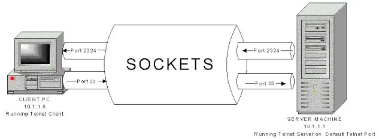

# TCP与Socket和UDP与DatagramSocket

| TCP/IP 五层模型 |                             协议                             |
| :-------------: | :----------------------------------------------------------: |
|     应用层      | HTTP, WebSocket, SOAP, DNS, FTP, Telnet, SMTP, P2P, EMAIL/POP |
|     传输层      |                           TCP, UDP                           |
|     网络层      |                     IP, ICMP, RIP, IGMP                      |
|   数据链路层    |              ARP, RARP, IEEE802.3, PPP, CSMA/CD              |
|     物理层      |            Manchester, MLT-3, 4A, PAM5, FE自协商             |

