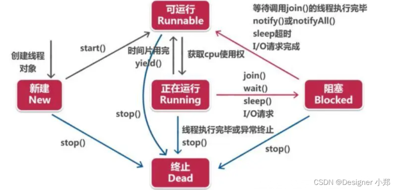

# 进程和线程

| 特性         | 进程                                                         | 线程                                                         |
| ------------ | ------------------------------------------------------------ | ------------------------------------------------------------ |
| 定义         | 程序执行的实例，**资源分配**的基本单位                       | 进程内的**执行单元**，**CPU 调度**的基本单位                 |
| 资源拥有     | 每个进程有**独立的内存空间和资源**                           | 线程**共享同一进程的资源**，包括内存和文件句柄               |
| 创建开销     | 较大，涉及**内存分配**等                                     | 较小，仅需分配少量的**线程控制块**                           |
| 通信方式     | 进程间通信（IPC, Inter-Process Communication）复杂，如管道、消息队列、共享内存、信号量、套接字等 | 线程间通信简单，可以直接读写**共享变量**、锁机制、条件变量、信号量等 |
| 状态切换开销 | 进程切换开销大，因为需要保存和加载进程状态                   | 线程切换开销小，因为只需保存和加载线程状态                   |
| 适用场景     | 适合需要**隔离**的任务，如运行多个独立的应用                 | 适合需要**并发**的任务，如 Web 服务器处理多个请求            |

# 线程的生命周期

主要有五种状态：

1. 新建（New）：线程对象被创建后就进入了新建状态，例如：`Thread thread = new Thread()`。
2. 就绪（Runnable）：当调用线程对象的`start()`方法（`thread.start()`），线程就进入就绪状态。就绪状态的线程被调度器（Scheduler）选中后，就会被赋予CPU资源，此时线程便进入了运行（Running）状态。
3. 运行（Running）：线程获取到CPU资源并执行其`run()`方法。
4. 阻塞（Blocked）：阻塞状态是线程因为某种原因放弃 CPU 使用权，暂时停止运行。直到线程进入就绪状态，才有机会转到运行状态。阻塞的情况分三种：等待阻塞（通过调用线程的`wait()`方法，线程放弃对象锁，进入等待池中，等待`notify()`/`notifyAll()`方法的唤醒，或者等待的时间到达，线程重新获得对象锁进入就绪状态）；同步阻塞（线程在获取 synchronized 同步锁失败（因为锁被其他线程所持有），它会进入同步阻塞状态）；其他阻塞（通过调用线程的`sleep()`或`join()`或发出了I/O请求时，线程会进入到阻塞状态。当`sleep()`状态超时、`join()`等待线程终止或超时、或者I/O处理完毕时，线程重新进入就绪状态）。
   1. `sleep(0)`：让步，释放CPU，不释放锁，类似`yield()`，让出CPU时间片，让调度器参考优先级重新分配。不会阻塞，而`sleep(1)`就会阻塞。让线程让出执行权，但并不保证立即被其他线程执行。[Priority-induced starvation: Why Sleep(1) is better than Sleep(0) and the Windows balance set manager](https://joeduffyblog.com/2006/08/22/priorityinduced-starvation-why-sleep1-is-better-than-sleep0-and-the-windows-balance-set-manager/)

5. 死亡（Dead）：线程`run()`、`main()`方法执行结束，或者因异常退出了`run()`方法，则该线程结束生命周期。死亡的线程不可再次复生。

线程状态的转换关系如下：新建状态通过start()方法转换为就绪状态，就绪状态通过获取CPU资源转换为运行状态，运行状态通过yield()方法可以转换为就绪状态，运行状态通过sleep()、wait()、join()、阻塞I/O或获取不到同步锁可以转换为阻塞状态，阻塞状态解除阻塞后可以转换为就绪状态，运行状态结束生命周期转换为死亡状态。



# 守护线程

**守护线程可以设置优先级**，但其优先级在某些编程语言或环境中可能受到限制。尽管你可以指定优先级，守护线程的实际调度可能会受到系统的影响。

**守护线程可以阻塞或等待**，例如，它可以使用 `wait()`、`join()` 或其他同步机制。在这些情况下，守护线程会暂停执行，直到满足某些条件（例如，等待某个事件或其他线程完成）。

守护线程与主线程或其他线程的通信通常通过共享数据、锁机制、信号量、条件变量等方式实现。在多线程环境中，常用的方法包括：

1. **共享变量**：多个线程可以访问和修改相同的变量。
2. **队列**：使用线程安全的队列（如 `BlockingQueue`）进行消息传递。
3. **事件/信号**：使用条件变量或信号量来通知其他线程发生了特定事件。

这些通信方式可以帮助守护线程与其他线程有效地协调和同步。

```java
// 创建一个守护线程
Thread daemonThread = new Thread(() -> {
    while (true) {
        System.out.println("守护线程正在执行");
        try {
            Thread.sleep(1000);
        } catch (InterruptedException e) {
            e.printStackTrace();
        }
    }
});
// 设置线程为守护线程
daemonThread.setDaemon(true);
// 启动线程
daemonThread.start();

// 主线程执行一段时间
try {
    Thread.sleep(5000);
} catch (InterruptedException e) {
    e.printStackTrace();
}

System.out.println("主线程结束");
```

输出如下：

```
守护线程正在执行
守护线程正在执行
守护线程正在执行
守护线程正在执行
守护线程正在执行
主线程结束
```

如果不设置为守护线程，daemonThread 不会结束：

```
守护线程正在执行
守护线程正在执行
守护线程正在执行
守护线程正在执行
守护线程正在执行
主线程结束
守护线程正在执行
守护线程正在执行
守护线程正在执行
...
```

# Volatile

可见性

禁止指令重排

不保证原子性

# 辨析 yield 和 wait 方法

yield 即“谦让”，也是 Thread 类的方法，类似`sleep(0)`。它让掉当前线程 CPU 的时间片，使正在运行中的线程重新变成就绪状态，并重新竞争 CPU 的调度权。它可能会获取到，也有可能被其他线程获取到。如果一定要用它的话，一句话解释就是：yield 方法可以很好的控制多线程，如执行某项复杂的任务时，如果担心占用资源过多，可以在完成某个重要的工作后使用 yield 方法让掉当前 CPU 的调度权，等下次获取到再继续执行，这样不但能完成自己的重要工作，也能**给其他线程一些运行的机会**，避免一个线程长时间占有 CPU 资源。

`yield()` 是一个明确的请求，表明线程希望放弃执行权，而 `sleep(0)` 则可以看作是一个更轻量的、允许调度的信号。尽管两者在行为上类似，但使用场景和语义略有不同。

在 Java 中，`yield()` 和 `wait()` 都是与线程控制相关的方法，但它们的作用和使用场景有很大不同。下面是它们的详细区别：

### 1. 基本概念

- **yield()**:
  - `Thread.yield()` 是一个静态方法，作用是让当前线程主动放弃 CPU 的使用权，允许其他线程获得执行的机会。
  - 它通常用于优化多线程程序的性能，尤其是在 CPU 资源紧张的情况下。

- **wait()**:
  - `Object.wait()` 是一个实例方法，用于让当前线程等待，直到其他线程调用 `notify()` 或 `notifyAll()` 方法来唤醒它。
  - `wait()` 需要在同步块或同步方法中调用（通常与 `synchronized` 关键字一起使用），它用于线程间的通信。

### 2. 使用场景

- **yield()**:
  - 通常用于提高线程调度的灵活性。
  - 当一个线程希望让其他线程有机会执行时，可以调用 `yield()`，特别是在 CPU 资源有限的情况下。

- **wait()**:
  - 用于实现线程间的协作。当一个线程需要等待某个条件满足时（例如，等待某个资源可用），它会调用 `wait()`。
  - 适合用于生产者-消费者模式等场景，其中一个线程需要等待另一个线程完成某项工作。

### 3. 状态变化

- **yield()**:
  - 调用 `yield()` 方法后，当前线程可能会从运行状态变为就绪状态，但不会释放持有的锁（如果有的话）。
  - 线程的调度依赖于操作系统的实现，调用 `yield()` 后不一定会立即切换线程。

- **wait()**:
  - 调用 `wait()` 后，当前线程会释放持有的锁并进入等待状态，直到被其他线程唤醒。
  - 线程在等待状态期间，不会占用 CPU 资源。

### 4. 唤醒机制

- **yield()**:
  - 线程会在下次调度时被唤醒，但没有特定的唤醒机制，它只是让出 CPU 的使用权，具体由线程调度器决定。

- **wait()**:
  - 线程会被其他线程调用 `notify()` 或 `notifyAll()` 唤醒，这是一种明确的线程间通信机制。

### 5. 示例代码

#### 使用 `yield()`

```java
public class YieldExample {
    public static void main(String[] args) {
        Thread t1 = new Thread(() -> {
            for (int i = 0; i < 5; i++) {
                System.out.println("Thread 1 is running");
                Thread.yield(); // 主动让出 CPU
            }
        });

        Thread t2 = new Thread(() -> {
            for (int i = 0; i < 5; i++) {
                System.out.println("Thread 2 is running");
            }
        });

        t1.start();
        t2.start();
    }
}
```

#### 使用 `wait()`

```java
public class WaitNotifyExample {
    private static final Object lock = new Object();
    private static boolean conditionMet = false;

    public static void main(String[] args) {
        Thread waitingThread = new Thread(() -> {
            synchronized (lock) {
                while (!conditionMet) {
                    try {
                        lock.wait(); // 等待条件满足
                    } catch (InterruptedException e) {
                        Thread.currentThread().interrupt();
                    }
                }
                System.out.println("Condition met, proceeding.");
            }
        });

        Thread notifyingThread = new Thread(() -> {
            synchronized (lock) {
                conditionMet = true;
                lock.notify(); // 唤醒等待的线程
                System.out.println("Condition set, thread notified.");
            }
        });

        waitingThread.start();
        notifyingThread.start();
    }
}
```

### 总结

- `yield()` 用于线程调度的优化，允许其他线程获得 CPU 使用权，但不会释放锁。
- `wait()` 用于线程间的协作和通信，释放锁并使线程等待，直到被其他线程唤醒。 

理解这两个方法的区别对于编写高效且安全的多线程 Java 应用程序至关重要。

# 多线程列表对比

要比较 `CopyOnWriteArrayList`、`Collections.synchronizedList` 和 `ConcurrentLinkedQueue`，我们可以从以下几个方面进行分析：线程安全机制、适用场景、性能和特性。

### 1. `CopyOnWriteArrayList`
#### 线程安全机制
- **机制**：在执行**写操作时，创建数组的新副本**，在新数据上写完后将原数据指向新的数据。读操作无锁，写操作涉及复制数组。
- **优点**：读操作非常快，没有锁，适合读多写少的场景。
- **缺点**：写操作代价高，尤其在大列表中，因为需要复制整个数组。

#### 适用场景
- **读多写少**：非常适合读操作频繁但写操作少的情况，例如缓存、监听器列表等。

#### 性能
- **读操作**：无锁，性能极高。
- **写操作**：由于复制整个数组，性能较低。

#### 特性
- **一致性**：保证读取的一致性，读操作永远不会看到不完全的或中间状态的数据。

### 2. `Collections.synchronizedList`
#### 线程安全机制
- **机制**：**将所有方法用synchronized进行同步**。
- **优点**：简单直接，线程安全。
- **缺点**：所有操作都需要获取锁，可能导致性能瓶颈，特别是在高并发环境下。

#### 适用场景
- **一般情况**：适合简单的线程安全列表需求，特别是如果读写操作数量相当。

#### 性能
- **读操作**：需要获取锁，性能一般。
- **写操作**：需要获取锁，性能一般。

#### 特性
- **一致性**：所有操作都是同步的，保证一致性，但性能在高并发情况下可能不是最优。

### 3. `ConcurrentLinkedQueue`
#### 线程安全机制
- **机制**：无锁的并发队列，基于**CAS**（Compare-And-Swap）实现。
- **优点**：高效的并发性能，非阻塞算法。
- **缺点**：适用于队列操作，不适合列表操作。

#### 适用场景
- **队列操作**：适用于队列场景，如生产者-消费者模型，任务调度等。

#### 性能
- **读操作**：基于CAS，无锁高效。
- **写操作**：基于CAS，无锁高效。

#### 特性
- **一致性**：高效并发操作，非阻塞，适合高并发环境。

### 如何选择
1. **读多写少的场景**：选择 `CopyOnWriteArrayList`，因为其读操作无锁，非常高效。
2. **一般的线程安全列表**：选择 `Collections.synchronizedList`，适合读写操作数量相当的情况。
3. **队列操作**：选择 `ConcurrentLinkedQueue`，适合需要高效并发队列的场景。

### 示例代码

```java
import java.util.List;
import java.util.concurrent.CopyOnWriteArrayList;
import java.util.Collections;
import java.util.ArrayList;
import java.util.concurrent.ConcurrentLinkedQueue;
import java.util.Queue;

public class ThreadSafeCollections {
    public static void main(String[] args) {
        // CopyOnWriteArrayList
        List<Integer> cowList = new CopyOnWriteArrayList<>();
        cowList.add(1);
        cowList.add(2);
        System.out.println("CopyOnWriteArrayList: " + cowList);

        // Collections.synchronizedList
        List<Integer> syncList = Collections.synchronizedList(new ArrayList<>());
        syncList.add(1);
        syncList.add(2);
        System.out.println("Collections.synchronizedList: " + syncList);

        // ConcurrentLinkedQueue
        Queue<Integer> concurrentQueue = new ConcurrentLinkedQueue<>();
        concurrentQueue.add(1);
        concurrentQueue.add(2);
        System.out.println("ConcurrentLinkedQueue: " + concurrentQueue);
    }
}
```

### 总结
选择适当的集合取决于具体的使用场景和需求。理解各个集合的线程安全机制、性能和特性，有助于在实际开发中做出更合适的选择。

# 手动同步列表

手动同步 `Collections.synchronizedList` 的用法，以下是一个具体的示例代码。

### 示例代码

#### 使用 `CopyOnWriteArrayList`

`CopyOnWriteArrayList` 不需要在遍历时手动同步，因为它的读操作是无锁的。

```java
java复制代码import java.util.List;
import java.util.concurrent.CopyOnWriteArrayList;

public class Main {
    public static void main(String[] args) {
        List<Integer> cowList = new CopyOnWriteArrayList<>();
        cowList.add(1);
        cowList.add(2);
        cowList.add(3);

        // 多线程添加元素
        Thread writerThread = new Thread(() -> {
            for (int i = 4; i <= 10; i++) {
                cowList.add(i);
                try {
                    Thread.sleep(100);
                } catch (InterruptedException e) {
                    e.printStackTrace();
                }
            }
        });

        // 多线程遍历列表
        Thread readerThread = new Thread(() -> {
            for (int i = 0; i < 3; i++) {
                System.out.println("Reading: " + cowList);
                try {
                    Thread.sleep(150);
                } catch (InterruptedException e) {
                    e.printStackTrace();
                }
            }
        });

        writerThread.start();
        readerThread.start();
    }
}
```

#### 使用 `Collections.synchronizedList`

`Collections.synchronizedList` 需要在遍历时手动同步以防止 `ConcurrentModificationException`。

```java
java复制代码import java.util.List;
import java.util.ArrayList;
import java.util.Collections;

public class Main {
    public static void main(String[] args) {
        List<Integer> syncList = Collections.synchronizedList(new ArrayList<>());
        syncList.add(1);
        syncList.add(2);
        syncList.add(3);

        // 多线程添加元素
        Thread writerThread = new Thread(() -> {
            for (int i = 4; i <= 10; i++) {
                syncList.add(i);
                try {
                    Thread.sleep(100);
                } catch (InterruptedException e) {
                    e.printStackTrace();
                }
            }
        });

        // 多线程遍历列表
        Thread readerThread = new Thread(() -> {
            for (int i = 0; i < 3; i++) {
                // 在遍历时手动同步
                synchronized (syncList) {
                    System.out.println("Reading: " + syncList);
                    try {
                        Thread.sleep(150);
                    } catch (InterruptedException e) {
                        e.printStackTrace();
                    }
                }
            }
        });

        writerThread.start();
        readerThread.start();
    }
}
```

### 解释

1. **`CopyOnWriteArrayList` 示例**
   - **线程1**：添加元素到列表。
   - **线程2**：遍历列表并输出当前列表内容。
   - 由于 `CopyOnWriteArrayList` 在写操作时会创建新的副本，读操作不会受到影响，因此不需要手动同步。
2. **`Collections.synchronizedList` 示例**
   - **线程1**：添加元素到列表。
   - **线程2**：遍历列表并输出当前列表内容。
   - 在遍历时使用 `synchronized(syncList)` 进行手动同步，以防止并发修改引发的异常。

### 总结

当需要在多线程环境下遍历列表时：

- **`CopyOnWriteArrayList`**：适合读多写少的场景，不需要手动同步。
- **`Collections.synchronizedList`**：在遍历时需要手动同步整个列表，适合读写操作数量相当的情况。

# Servlet3 中的 AsyncContext 异步和多线程异步的区别

Servlet3 中的 AsyncContext 异步和多线程异步都是为了实现异步处理，但是它们的实现方式和适用场景有所不同。

### AsyncContext异步

- **定义:** AsyncContext是Servlet3引入的一个接口，它提供了一种将长时间运行的任务从Servlet的主线程中分离出来的机制。
- **原理:** 当一个请求到来时，Servlet容器会创建一个AsyncContext对象，并将请求处理委托给一个新的线程。这个新的线程可以长时间运行，而Servlet容器的主线程则可以立即返回，去处理其他请求。当新的线程完成任务后，它可以调用AsyncContext的complete()方法来通知Servlet容器，Servlet容器再将响应发送给客户端。
- 特点:
  - **非阻塞:** Servlet容器的主线程不会被长时间的任务阻塞。
  - **灵活:** 可以自定义异步处理的逻辑。
  - **集成:** 与Servlet容器紧密集成，可以方便地获取请求和响应对象。
- 适用场景:
  - **I/O操作:** 比如文件上传、下载，数据库查询等。
  - **长时间运行的任务:** 比如生成报表、发送邮件等。

### 多线程异步

- **定义:** 多线程异步是指在Servlet中启动一个新的线程，这个线程与Servlet的主线程并发执行。
- **原理:** Servlet在处理请求时，创建并启动一个新的线程，这个线程负责执行长时间运行的任务。Servlet的主线程可以继续处理其他请求，而无需等待新线程完成。
- 特点:
  - **灵活:** 可以完全自定义多线程的实现。
  - **复杂:** 需要考虑线程同步、死锁等问题。
- 适用场景:
  - **需要高度自定义的异步处理:** 当AsyncContext提供的功能不足时，可以使用多线程。
  - **需要更细粒度的控制:** 可以对线程进行更精细的管理。

### 两者之间的区别

| 特点                    | AsyncContext            | 多线程                   |
| ----------------------- | ----------------------- | ------------------------ |
| **实现方式**            | Servlet容器提供         | 开发者自定义             |
| **与Servlet容器的关系** | 紧密集成                | 相对独立                 |
| **易用性**              | 相对简单                | 相对复杂                 |
| **线程管理**            | Servlet容器负责         | 开发者负责               |
| **适用场景**            | I/O操作、长时间运行任务 | 需要高度自定义的异步处理 |

### 总结

- **AsyncContext** 更加适合于常见的异步处理场景，它提供了简单易用的API，并且与Servlet容器紧密集成。
- **多线程** 则适合于需要高度自定义的异步处理场景，但是开发难度较大，需要开发者对线程有深入的了解。

**选择哪种方式取决于具体的需求:**

- 如果需要简单的异步处理，并且希望与Servlet容器紧密集成，那么AsyncContext是更好的选择。
- 如果需要高度自定义的异步处理，并且对线程有深入的了解，那么多线程是更好的选择。

**需要注意的是:** 虽然多线程可以提供更多的灵活性，但是也带来了更大的复杂性。在使用多线程时，需要小心处理线程同步、死锁等问题。

**何时选择AsyncContext？**

- 当你需要将长时间运行的任务从主线程中移出，以提高服务器的吞吐量时。
- 当你需要在Servlet中处理I/O操作，并且希望避免阻塞主线程时。

**何时选择多线程？**

- 当你需要对异步处理过程进行更细粒度的控制时。
- 当AsyncContext提供的功能不足以满足你的需求时。

**总结**： AsyncContext和多线程都是实现异步处理的有效方式。选择哪种方式取决于具体的应用场景和开发者的需求。在实际开发中，可以根据不同的需求，选择合适的方式来实现异步处理。