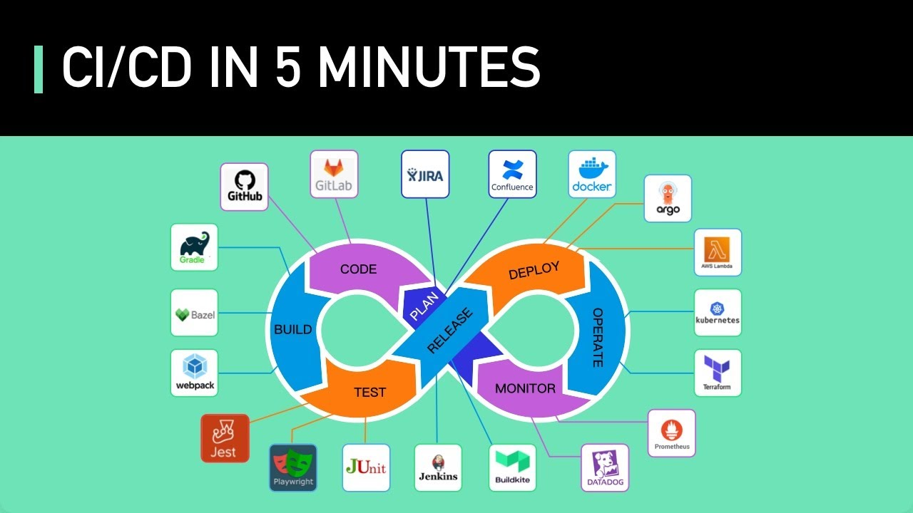

# CMD

打开指定路径：

```shell
start explorer "xxx"
```

计算 MD5：

```shell
certutil -hashfile 'targetfile' MD5
```

查看历史所有命令：

```powershell
Get-Content (Get-PSReadlineOption).HistorySavePath | findstr "xxx"
```

# JShell

```shell
/env [-class-path <路径>] [-module-path <路径>] [-add-modules <模块>] ...
```

查看或更改评估上下文，例如：临时添加环境变量

```shell
/env -class-path 'path/'
```

# Javac

直接引入并编译：

```shell
javac -encoding UTF-8 -classpath .\unimported.jar .\Uncompiled.java
```

直接引入并运行：

```shell
java -classpath "path1;path2;..." MyClass
# Linux/Unix 中用冒号分隔路径
```


# Jenkins



启动：

```shell
java "-Dhudson.plugins.git.GitSCM.ALLOW_LOCAL_CHECKOUT=true" -jar jenkins.war --httpPort=11001
```

用户名`admin`，密码：

```shell
cat ~/.jenkins/secrets/initialAdminPassword
```

克隆仓库和提交更改：

```shell
git clone git@github.com:jenkins-docs/simple-java-maven-app.git
# 加入 Jenkinsfile
git commit -m "xxx"
```

Jenkinsfile 示例（采用 Groovy 语法）：

```groovy
pipeline {
    agent any
    
    stages {
        stage('Build') {
            steps {
                bat 'mvn -B -DskipTests clean package'
            }
        }
        stage('Test') {
            steps {
                input "Does the staging environment look ok?"
                bat 'mvn test'
            }
            post {
                always {
                    junit 'target/surefire-reports/*.xml'
                }
            }
        }
        stage('Deliver') {
            steps {
                // bat './jenkins/scripts/deliver.bat'
                bat 'java -jar target/my-app-1.0-SNAPSHOT.jar'
            }
        }
    }
}
```

“Build when a change is pushed to the repository”选项现已更名为“GitHub hook trigger for GITScm polling”

## Agent

在 Jenkins 中，`agent` 是指构建任务的执行环境，通常是指构建代理节点。Jenkins 支持在不同的机器（本地或远程）上执行构建任务，这些机器被称为 **agent**（或代理节点）。你可以通过 **Jenkins Master**（主服务器）来管理和分配这些构建任务。

### 1. `agent any` 解释：
`agent any` 是一个常见的 **Jenkins Pipeline** 中的声明，用来指示 **Jenkins** 使用任何可用的代理节点来执行该流水线的构建任务。也就是说，它没有指定具体的节点，而是让 Jenkins 根据当前有可用的代理节点来自动选择执行任务。

```groovy
pipeline {
    agent any
    stages {
        stage('Build') {
            steps {
                echo 'Building...'
            }
        }
    }
}
```

解释：

- `agent any` 表示这个流水线的构建可以在任何可用的 Jenkins agent 上执行。
- **Jenkins 主节点**（master node）也可以作为 agent 使用，但通常为了分担负载，构建任务会分配到其他 **远程代理节点**（agent）。

### 2. `agent` 的其他配置选项：
除了 `any`，`agent` 还可以根据你的需求配置为其他几种类型。常见的配置如下：

#### 1. **`agent none`**
   - 表示该流水线没有全局的 agent，通常用于流水线中的不同阶段有不同的代理配置。在流水线的不同阶段中，你可以单独为每个阶段指定一个 agent。

```groovy
pipeline {
    agent none
    stages {
        stage('Build') {
            agent { label 'linux' }
            steps {
                echo 'Building on a Linux node...'
            }
        }
        stage('Test') {
            agent { label 'windows' }
            steps {
                echo 'Testing on a Windows node...'
            }
        }
    }
}
```
   - **`agent none`** 允许你在流水线级别不指定 agent，改为为每个阶段单独指定一个。

#### 2. **指定节点标签（`label`）**
   - 你可以使用 **`label`** 来指定流水线或阶段在特定的节点上执行。节点的标签是用来标识具有特定功能或操作系统的节点。

```groovy
pipeline {
    agent { label 'linux' }  // 仅在具有 "linux" 标签的节点上执行
    stages {
        stage('Build') {
            steps {
                echo 'Building on a Linux node...'
            }
        }
    }
}
```
   - 这种方式会将任务分配到具有特定标签的节点（比如 `linux` 或 `windows`）。

#### 3. **指定特定节点名称（`node`）**
   - 如果你知道要在某个具体节点上执行构建任务，你可以通过 **`node`** 来指定该节点的名称。

```groovy
pipeline {
    agent { node { label 'build-node-1' } }
    stages {
        stage('Build') {
            steps {
                echo 'Building on node build-node-1...'
            }
        }
    }
}
```

#### 4. **Docker 容器（`docker`）**
   - Jenkins 还允许你将构建任务放入 **Docker 容器** 中，这种方式非常适用于需要特定环境或依赖的任务。

```groovy
pipeline {
    agent {
        docker { image 'maven:3.6.3-jdk-11' }
    }
    stages {
        stage('Build') {
            steps {
                sh 'mvn clean install'
            }
        }
    }
}
```
   - 这样，构建任务将在指定的 Docker 容器中运行，确保所有构建所需的工具和环境都在容器内。

#### 5. **Docker with args**
   - 你还可以指定 Docker 容器的额外参数，如挂载本地卷等。

```groovy
pipeline {
    agent {
        docker {
            image 'node:14'
            args '-v /home/jenkins:/home/jenkins'  // 指定挂载目录
        }
    }
    stages {
        stage('Build') {
            steps {
                sh 'npm install'
            }
        }
    }
}
```

### 3. **总结：常见的 agent 配置**
- **`agent any`**：在任何可用的节点上执行构建任务（最常用的方式）。
- **`agent none`**：在流水线级别不指定 agent，通常用于需要在不同阶段使用不同节点的场景。
- **`label 'xxx'`**：指定一个带有标签的节点来执行流水线或阶段任务。
- **`node { label 'xxx' }`**：指定特定的节点名称来执行构建。
- **`docker { image 'xxx' }`**：在指定的 Docker 容器中执行构建。
- **`docker { image 'xxx' args 'xxx' }`**：在 Docker 容器中执行构建，并可以指定额外的配置参数。

### 4. **常见的使用场景**：
- **`agent any`**：适用于没有特殊要求，任何节点都可以执行构建的普通场景。
- **`agent none`** + 各阶段指定 agent：适用于不同阶段有不同需求的流水线（例如某些任务需要在 Windows 上执行，某些任务需要在 Linux 上执行）。
- **Docker 容器**：适用于需要在特定的容器环境中执行的任务，避免了环境配置的问题。

Jenkins 的 `agent` 配置灵活多样，适用于不同的构建需求和环境。你可以根据项目需求选择合适的配置。

# Logstash

配置文件一般在 config 目录录下面，logstash.yml 和 jvm.options，另外 6.0 以上的版本会有 pipelines.yml，这个文件是为了在同一个进程中运行多个管道。
