# 类加载与对象初始化

Class Loading and Object Initialization

## 类加载

JVM首次使用某个类时，需通过CLASSPATH查找该类的.class文件。将.class文件中对类的描述信息加载到内存中，进行保存。如：包名、类名、父类、属性、方法、构造方法……

JVM并不是一开始就会将所有的类加载到内存，而是用到某个类，才会去加载，只加载一次。

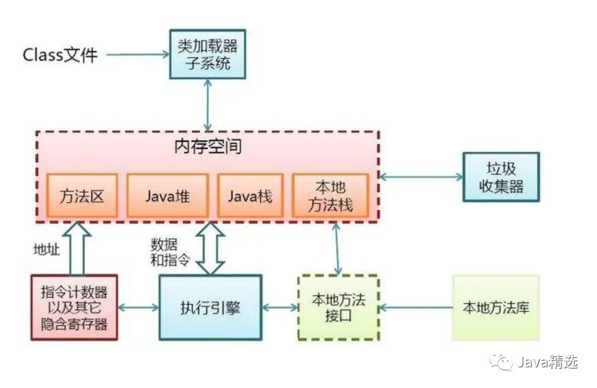

触发完全类加载的方式：

- `new`、`getstatic`、`putstatic`、`invokestatic` 指令：`MyClass myInstance = new MyClass()`；
- 初始化子类；
- 访问静态属性：`System.out.println(MyClass.staticField)`；
- 调用静态方法：`MyClass.staticMethod()`；
- `java.lang.reflect`对类进行反射调用时；
- 利用反射主动加载并将是否初始化类参数设为`true`：`Class.forName("全限定名", true, classLoader)`；
- 打印类的class属性：`System.out.println(MyClass.class)`；
- 动态语言支持：`java.lang.invoke.MethodHandle`解析的结果为`REF_getstatic`、`REF_putstatic`、`REF_invokestatic`方法句柄时，该类必须初始化。

**连接准备**但止步于**连接解析**的方式：

- 访问**常量（static final）**基本类型和字符串，因为位于方法区的元空间（Metaspace），但是访问**引用类型的常量**会触发，例如：`System.out.println(MyClass.constantInt)`；
- 创建数组：`MyClass[] myArr = new MyClass[10]`；
- 利用反射主动加载并将是否初始化类参数设为`false`：`Class.forName("全限定名", false, classLoader)`；
- 通过类加载器的`loadClass`方法，显式装载（动态加载）：`classLoader.loadClass("MyClass")`，没有执行`resolveClass()`方法，[该方法负责连接过程](https://www.reddit.com/r/javahelp/comments/eiwzeu/how_does_classloaderresolveclassclass_work/)；
- 访问类的class属性：`Class<MyClass> myClass = MyClass.class`。

类加载分为三个部分：加载、连接、初始化，这三个部分与使用和卸载共同组成了**类的生命周**期：


1. 编译（Compile）：java文件→class文件；

2. 加载（Loading，区别于类加载）由**类加载器（ClassLoader）**实现，**懒惰**加载（用到时才加载），如果没有父类，先按照**双亲委派机制**加载父类（Object是所有非基本类型类的父类，所以JVM最先将Object加载）：

   触发加载的时机：

   - 预加载：虚拟机启动时装载，装载的是JAVA_HOME/lib下的rt.jar下的.class文件；
   - 运行时装载：虚拟机在用到一个A.class文件的时候，会先去内存中查看一下这个A.class文件有没有被装载，如果没有就会按照类的全限定名来装载这个类；

   加载步骤：

   1. 全限定名获取.class文件的二进制字节流：

      - 从zip包中获取，这就是以后jar、ear、war格式的基础；
      - 从网络中获取，典型应用就是Applet；
      - 运行时计算生成，典型应用就是动态代理技术；
      - 由其他文件生成，典型应用就是JSP，即由JSP生成对应的.class文件；
      - 从数据库中读取，这种场景比较少见；

   2. 静态存储结构（.class文件） → 运行时数据结构（instanceKlass），位于本地内存（也叫直接内存，Native Memory，Off-heap）中的方法区（1.8之前在永久代PermGen Space，1.8之后在元空间Metaspace）；

   3. 将class字节流的静态存储结构转化成方法区（元空间）的运行时数据结构，class文件常量池进入运行时常量池，生成代表这个类的`java.lang.Class<Person>`类型对象，位于JVM内存中（Heap Memory），作为方法区这个类的各种数据（例如此时还未生成的静态变量）的访问入口；

      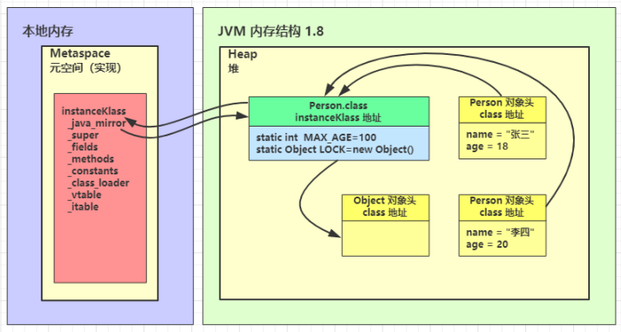

3. 连接（Linking）：

   1. 验证（Verification）：该阶段主要是为了保证加载进来的字节流符合JVM的规范，不会对JVM有安全性问题，例如报`ClassFormatError`。其中有对元数据的验证，例如检查类是否继承了被`final`修饰的类；还有对符号引用的验证，例如校验符号引用是否可以通过全限定名找到，或者是检查符号引用的权限（private、public）是否符合语法规定等。主要包括四种验证：文件格式验证、元数据验证、字节码验证、符号引用验证：

      - 文件格式验证：验证字节流是否符合class文件格式的规范，如：是否以魔数（Magic Number）0xcafebabe开头（U4类型，4个字节，所有Java class文件均以此标志为开头）、主版本号（Major Version，U2类型，2个字节）和次版本号（Minor Version，U2类型，2个字节）是否在当前虚拟机处理范围内等等；
      - 元数据验证：对字节码描述的信息进行语义分析，以保证其描述的信息符合Java语言规范的要求；如：这个类是否有父类，是否实现了父类的抽象方法，是否重写了父类的`final`方法，是否继承了被`final`修饰的类等等；
      - 字节码验证：通过数据流和控制流分析，确定程序语义是合法的、符合逻辑的，如：操作数栈的数据类型与指令代码序列能配合工作，保证方法中的类型转换有效等等；
      - 符号引用验证：确保解析动作能正确执行；如：通过符合引用能找到对应的类和方法，符号引用中类、属性、方法的访问性是否能被当前类访问等等。

   2. 准备（Preparation）：主要任务是创建类的静态字段，为类的**静态变量开辟空间（分配内存）并赋默认值**：

      - 静态变量是基本类型的默认值为0；

      - 静态变量是引用类型的默认值为null；

      - 常量：
        
        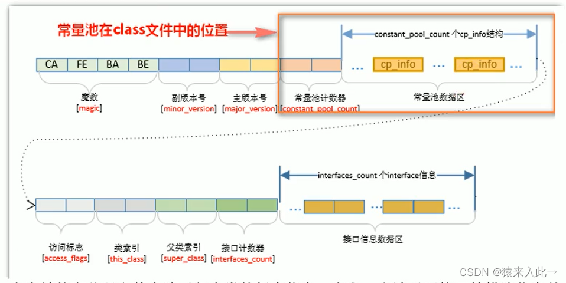
        
        二进制文件中所有cp_info对应的反编译结果为：
        
        ```
        Constant pool:
           #1 = Methodref          #13.#31        // java/lang/Object."<init>":()V
           #2 = Fieldref           #12.#32        // Person.i:I
           ...
        ```
        
        - 基本类型和字符串类型：编译阶段值就确定了，赋值操作在本阶段完成；

          ```
            public static final int age;
              descriptor: I
              flags: (0x0019) ACC_PUBLIC, ACC_STATIC, ACC_FINAL
              ConstantValue: int 10
          
            public static final java.lang.String name;
              descriptor: Ljava/lang/String;
              flags: (0x0019) ACC_PUBLIC, ACC_STATIC, ACC_FINAL
              ConstantValue: String Tom
          ```
        
        - 引用类型：赋值操作在后续**初始化**阶段完成；
        

      静态变量的存储位置：

      - JDK7之前：静态变量存储于方法区中instanceKlass末尾；
      - JDK7开始：静态变量存储于_java_mirror（堆内存中类.class对象实例）末尾。

   3. 解析（Resolution）：该阶段的主要职责为**将运行时常量池中的符号引用转变为直接引用**（指向数据所存内存的指针或句柄），运行时常量池相对于Class文件常量池的另一重要特性是**具备动态性**。此处针对的是**静态方法及属性和私有方法与属性**，因为这类方法与私有方法不能被重写，静态属性在运行期也没有多态这一说，即在编译器可知，运行期不可变，所以适合在该阶段解析，譬如类方法`main`替换为直接引用，为**静态连接**，区别于运行时的**动态连接**。在某些情况下可以初始化阶段之后再开始，这是为了支持Java语言的**运行时绑定**（动态连接：调用`Class.forName()`或`classLoader.loadClass()`）。**符号引用是只包含语义信息，不涉及具体实现的；而解析（resolve）过后的直接引用则是与具体实现息息相关的。**[JVM符号引用转换直接引用的过程？](https://www.zhihu.com/question/50258991/answer/120450561)

      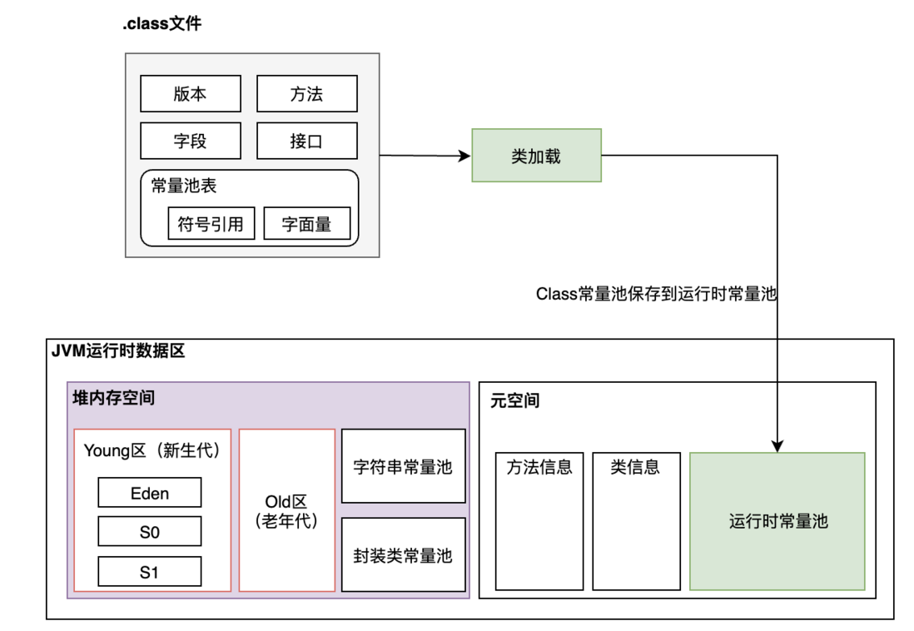

      符号引用 vs 直接引用：

      - 符号引用（Symbolic Reference）即字符串，在.class文件中形如`#12`（表示常量池中第12项），是对包括类和接口的全限定名、字段的名称和描述符、方法的名称和描述符等的引用。只包含语义信息，不涉及具体实现的：

        > This is actually the concept of the compilation principle, the symbolic reference includes the following three types of constants:
        >
        > -  Fully qualified names for classes and interfaces
        > - Name and descriptor of the field
        > - The name and descriptor of the method

        ```
        Constant pool:
           #1 = Methodref          #6.#17         // java/lang/Object."<init>":()V
           #2 = String             #18            // Bar
           #3 = Class              #19            // Test
           ...
        ```

      - 直接引用（Direct Reference）即偏移量，是JVM（或其它运行时环境）所能**直接使用**的形式，直接指向目标的指针（direct pointer或compressed pointer）、相对偏移量或一个间接定位到目标的句柄。如指向方法区某个类的一个指针。说白了就是类的元信息位于内存的地址串，与具体实现息息相关：

        > A direct reference can be a pointer to a target directly, a relative offset, or a handle that can be indirectly anchored to the target. The direct reference is related to the memory layout implemented by the virtual machine, and the direct references that are translated from the same symbol reference on different virtual machine samples are generally not the same. If there is a direct reference, the referenced target must already exist in memory.

      例如：一个类的方法为`test()`，则符号引用即为`test`，这个方法存在于内存中的地址假设为`0x123456`，则这个地址则为直接引用。假设：一个类有一个静态变量，该静态变量是一个自定义的类型，那么经过解析后，该静态变量将是一个指针，指向该类在方法区的内存地址，以“在Analysis类的`main`方法中访问A类”为例，命令行启动**HSDB**（HostspotDebugger）工具：

      ```shell
      # JDK1.8
      java -cp %JAVA8_HOME%/lib/sa-jdi.jar sun.jvm.hotspot.HSDB
      # JDK11
      jhsdb hsdb
      ```

      在加载代码执行前，或通过`classLoader.loadClass("A")`的方式加载类，A没有经过解析：

      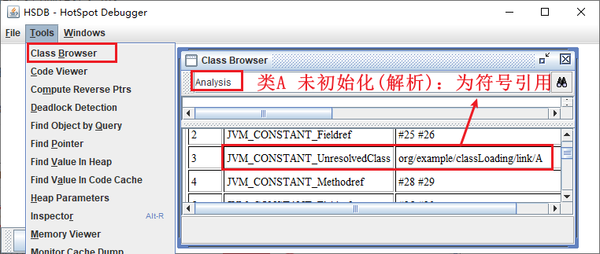

      通过`Class.forName("A", true, classLoader)`加载类，A经过了解析：

      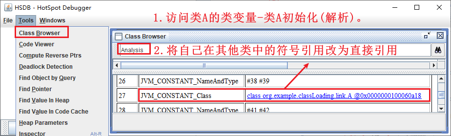

4. 初始化（Initialization）：JVM会执行其**静态初始化器（clinit）**中的Java代码并保证其线程安全。**注意只有对类的主动使用才会导致类的初始化（懒惰执行）**。**静态初始化器clinit**包含了对类中**所有静态变量**进行赋值操作的Java代码块：

   - **定义静态变量**时指定初始值（右值的初始化）；
   - 在**静态代码块**里为静态变量赋值，**此处注意向前引用**；

   它们按照类定义时的顺序依次执行，会**覆盖掉**连接准备阶段的默认值。如果在静态初始化器中发生异常，则该类将被视为无法正确初始化，不允许被使用。

   类初始化方法 vs 实例初始化方法：

   - 类初始化方法（clinit）指的是类构造器，主要作用是在类加载过程中的**初始化**阶段进行执行，执行内容包括**静态变量初始化和静态块的执行**：

     - 是由javac添加的静态方法（只有当类需要静态初始化时才添加，没有静态成员和代码块时就不需要静态初始化，也就不会添加），并且在加载类之后由JVM调用；
     - 执行子接口或者实现类的类初始化方法时，不需要先执行父接口的类初始化方法，只有当父接口中定义的变量被使用时，父接口才会被初始化；
     - 如果类中没有静态变量或静态代码块，那么clinit方法将不会被生成；

     - 在执行clinit方法时，必须先执行父类的clinit方法；

     - clinit方法只执行一次；

     - 静态变量的赋值操作和静态代码块的合并顺序由源文件中出现的顺序决定；
     - 可以向前赋值（覆盖默认值），不能向前获取（Illegal Forward Reference）；

   - 实例初始化方法（init）指的是实例构造器，本质是在堆内存创建一个**instanceOopDesc**对象，主要作用是在类**实例化**过程中执行，执行内容包括**成员变量初始化和代码块的执行**：

     - 在实例创建出来的时候调用，包括：
       - 调用new操作符；
       - 调用Class或Java.lang.reflect.Constructor对象的newInstance()方法；
       - 调用任何现有对象的clone()方法；
       - 通过java.io.ObjectInputStream类的getObject()方法反序列化；
     - 如果类中没有成员变量和代码块，那么init方法将不会被生成；
     - 在执行init方法时，必须先执行父类的init方法；
     - init方法每实例化一次就会执行一次；
     - init方法先为实例变量分配内存空间，再执行赋默认值，然后根据源码中的顺序执行赋初值或代码块；
     - 可以向前赋值（覆盖默认值），不能向前获取（Illegal Forward Reference）。

5. 使用（Using）；

6. 卸载（Unloading）：垃圾回收。

------

类加载的在代码中的体现：

newInstance：弱类型，低效率，只能调用无参构造，或当前Constructor实例的构造

new：强类型，相对高效，能调用任何Public构造

```java
class Foo {
    public static Object obj;
    static {
        System.out.print("Foo static -> ");
        // try {
        //     Class.forName("Bar");
        // } catch (Exception e) {
            
        // }
        // new Bar();
        System.out.println();
    }
    int i = 1;
    {
        System.out.print("Foo instance -> ");
        func();
        System.out.println();
    }
    void func() {
        System.out.print("Foo func: ");
        System.out.print(i);
    }
}
class Bar extends Foo {
    // public static Object obj;
    public static Object obj1;
    static {
        System.out.print("Bar static -> ");
        // new Foo();
        System.out.println();
    }
    String i = "abc";
    {
        System.out.print("Bar instance -> ");
        func();
        System.out.println();
    }
    @Override
    void func() {
        System.out.print("Bar func: ");
        System.out.print(i);
    }
}
public class Test {
    public static void main(String[] args) throws Exception {
        // clinit: 在jvm第一次加载class文件时调用，包括静态变量初始化语句和静态块的执行。是类构造器方法，也就是在jvm进行类加载—–验证—-解析—–初始化，中的初始化阶段jvm会调用clinit方法。只有当一个类需要静态初始化时才添加
        // init: 在实例创建出来的时候调用，包括调用new操作符；调用Class或Java.lang.reflect.Constructor对象的newInstance()方法；调用任何现有对象的clone()方法；通过java.io.ObjectInputStream类的getObject()方法反序列化
        // Class.forName是从指定的classloader中装载类,如果没有指定,也就是一个参数的时候,是从装载当前对象实例所在的classloader中装载类。实际上是调用Class.forName(className, true, this.getClass().getClassLoader())
        // ClassLoader的实例调用loadClass方法,是指从当前ClassLoader实例中调用类,而这个实例与装载当前所在类实例的Classloader也许不是同一个. 
        // newInstance: 弱类型，低效率，只能调用无参构造，或当前Constructor实例的构造
        // new: 强类型，相对高效，能调用任何Public构造

        // only load subclass without clinit
        // Bar.class.getClassLoader().loadClass("Bar"); // 显式装载(动态加载) 用户指定类(指定Bar)加载器。内部调用重载后的 loadClass("Bar", false) If the resolve parameter is true then resolve the class
        // System.out.println(String.class.getClassLoader());
        // System.out.println(Foo.class.getClassLoader());
        // System.out.println(Bar.class.getClassLoader());
        // System.out.println(Test.class.getClassLoader());
        // Class.forName("Bar", true, Bar.class.getClassLoader()); // The class is initialized only if the initialize parameter is true and if it has not been initialized earlier.
        Class.forName("Bar", true, Test.class.getClassLoader());
        // Class.forName("Bar", false, new Test().getClass().getClassLoader());
        // System.out.println(Foo.obj);
        // System.out.println(Bar.obj); // focus on Foo's static, "Bar static" can appear once anywhere.
        // System.out.println(Bar.obj1); // focus on Bar's static, "Bar static" can only appear once, so it must be in the last position.
        // new Foo(); // focus on Foo's static 隐式装载(硬编码) 当前类(Test)加载器
        
        // load subclass and clinit
        // Class.forName("Foo"); // 显式装载(动态加载) 当前类(Test)加载器
        // Class.forName("Bar"); // 显式装载(动态加载) 当前类(Test)加载器
        
        // init instance
        // new Bar(); // 隐式装载(硬编码) 当前类(Test)加载器
        // Class.forName("Bar").getDeclaredConstructor().newInstance(); // 显式装载(动态加载) 当前类(Test)加载器
        // Bar.class.newInstance(); // 显式装载(动态加载) 当前类(Test)加载器
    }
}
```

运行时加入`-Xlog:class+load=info`可以查看类加载情况：

```shell
java -Xlog:class=info Test
```

当在Test的`main`方法中对Bar类进行**类加载**时，打印结果：

```
[0.015s][info][class,load] opened: C:\Development\Java\jdk-11.0.2\lib\modules
[0.031s][info][class,load] java.lang.Object source: jrt:/java.base
...省略部分类加载...
[0.453s][info][class,load] Test source: file:/E:/Workspaces/Java/
[0.454s][info][class,load] java.lang.NamedPackage source: jrt:/java.base
[0.455s][info][class,load] java.lang.PublicMethods$MethodList source: jrt:/java.base
[0.455s][info][class,load] java.lang.PublicMethods$Key source: jrt:/java.base
[0.456s][info][class,load] java.lang.Void source: jrt:/java.base
[0.459s][info][class,load] Foo source: file:/E:/Workspaces/Java/
[0.459s][info][class,load] Bar source: file:/E:/Workspaces/Java/
Foo static ->
Bar static ->
[0.459s][info][class,load] jdk.internal.misc.TerminatingThreadLocal$1 source: jrt:/java.base
[0.460s][info][class,load] java.lang.Shutdown source: jrt:/java.base
[0.461s][info][class,load] java.lang.Shutdown$Lock source: jrt:/java.base
```

可以看到Object、Test、Foo、Bar等类都被加载，Object最先被加载，与Foo和Bar符合继承关系顺序，同时子类加载后紧跟静态块打印。

### 类加载器

ClassLoader

[【原创】Java类加载原理解析](http://www.blogjava.net/zhuxing/archive/2008/08/08/220841.html)

[深入理解Java类加载器(一)：Java类加载原理解析](https://blog.csdn.net/justloveyou_/article/details/72217806)

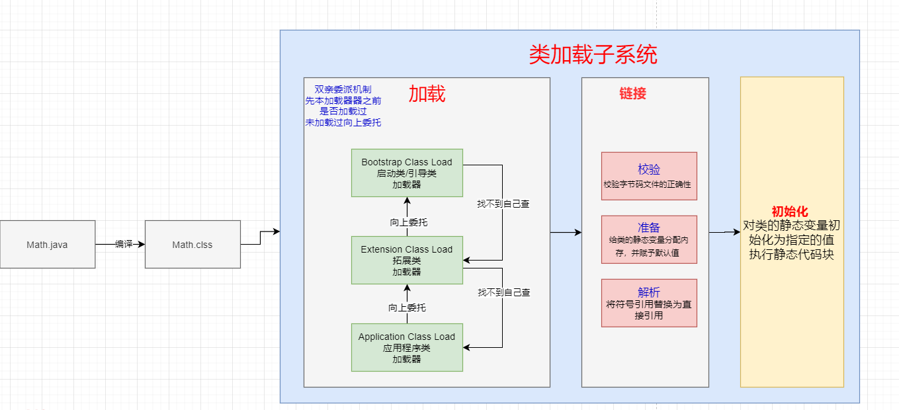

JVM的类加载过程是由类加载器（ClassLoader）来实现的。类加载器负责将类装载到内存中，并为其创建一个Class对象。Java虚拟机定义了三种类加载器，分别为Bootstrap ClassLoader、Extension/Platform ClassLoader、System ClassLoader，它们按照层次关系进行组织，而且每个类加载器都有自己独立的命名空间，保证了不同类加载器之间的隔离性：
- Bootstrap ClassLoader（启动类加载器）：JDK9之前由C++编写，负责加载**Java运行环境（JRE）核心库或`-Xbootclasspath`选项指定的jar包等虚拟机识别的类库**，例如java.lang包等。它是JVM的内置类加载器，在JVM启动时就会被初始化。由于启动类加载器涉及到虚拟机本地实现细节，开发者无法直接获取到启动类加载器的引用。从JDK9开始，由JVM内部和Java类库共同协作实现的类加载器，但为了与之前代码进行兼容，在尝试获取启动类加载器时仍然会返回`null`，仍然**不会得到对应的BootClassLoader实例**。可由启动类加载器加载到的路径可通过`System.getProperty("sun.boot.library.path")`查看；

  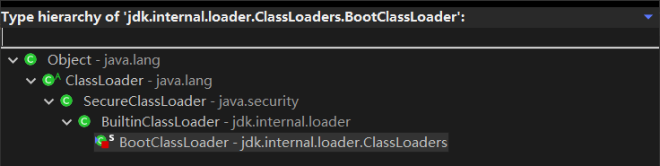

- Extension ClassLoader（扩展类加载器，已被取代）：由Sun的ExtClassLoader（sun.misc.Launcher$ExtClassLoader）实现，用来加载**Java扩展库**，位于JRE的/lib/ext目录下，或者通过`-Djava.ext.dirs`系统变量指定的其他目录中；

  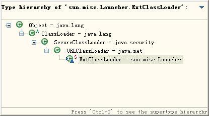

- Platform ClassLoader（平台类加载器）：从JDK9开始引入模块化系统，取代了扩展类加载器。同时取消了JRE目录，因为随时可以组合构建出程序运行所需的JRE，执行：`jlink -p 模块路径 --add-modules 要解析的根模块 --output 输出JRE路径`；

  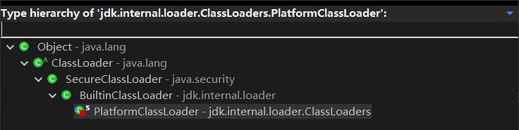

- Application ClassLoader（应用程序类加载器）：由Sun的AppClassLoader（sun.misc.Launcher$AppClassLoader）实现，用来加载应用程序路径上的类，或`-Djava.class.path`变量所指的目录中的类库，也称为系统类加载器。它是ClassLoader类的子类，通常是由Java应用程序创建的默认类加载器。一般情况，如果我们没有自定义类加载器默认就是用这个加载器；

  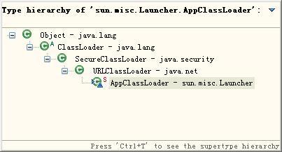

  JDK9之后：

  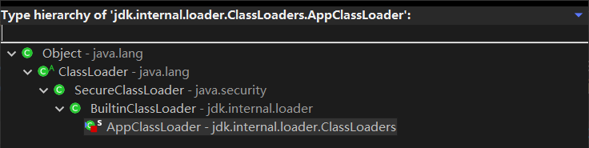

- Custom ClassLoader（如Tomcat自定义加载器）：负责加载用户自定义路径下的类包

java.lang.ClassLoader是顶级父类，它是一个抽象类，类加载器均是继承自它，它一定会有对应的子类实现，若想查看某个类是被哪个加载器加载进内存的，可以调用`MyClass.class.getClassLoader()`方法进行查看：

```java
// 输出结果为 null，因为其是顶级加载器 Bootstrap 所加载的
System.out.println("String:" + String.class.getClassLoader());
// 输出结果为 null，因为其也是顶级加载器 Bootstrap 所加载的
System.out.println("HKSCS: " + HKSCS.class.getClassLoader());
// 该类位于 ext 目录某个 jar 包下，所以它由扩展类加载器 ExtClassLoader 所加载
System.out.println("DNSNameService: " + DNSNameService.class.getClassLoader());
// 该类是自定义类，所以它由应用类加载器 AppClassLoader 所加载
System.out.println("MyClass: " + MyClass.class.getClassLoader());
// 输出结果为 null，父加载器并不是类的加载器的加载器
System.out.println("DNSNameService#parent#classLoader: " + DNSNameService.class.getClassLoader().getClass().getClassLoader());
System.out.println("MyClass#parent#classLoader: " + ClassLoaderLevel.class.getClassLoader().getClass().getClassLoader());
System.out.println(ClassLoader.getSystemClassLoader());
System.out.println(ClassLoader.getSystemClassLoader().getParent());  
System.out.println(ClassLoader.getSystemClassLoader().getParent().getParent());
```

打印如下：

```
String: null
HKSCS: null
DNSNameService: sun.misc.Launcher$ExtClassLoader@2ef1e4fa
MyClass: sun.misc.Launcher$AppClassLoader@18b4aac2
DNSNameService#parent#classLoader: null
MyClass#parent#classLoader: null
sun.misc.Launcher$AppClassLoader@18b4aac2
sun.misc.Launcher$ExtClassLoader@2ef1e4fa
null
```

通过以上的代码输出，我们可以判定应用类加载器的父加载器是标准扩展类加载器，但是我们试图获取标准扩展类加载器的父类加载器时确得到了null，就是说标准扩展类加载器本身强制设定父类加载器为null。

类加载器的命名空间：

类加载器的**命名空间**是指每个类加载器所加载的类都拥有独立的命名空间，相同名称的类可以存在于不同的命名空间中。

打破类加载器的双亲委派模型：

双亲委派机制只是Java推荐的机制，不是强制机制。可以使用**线程上下文类加载器（Thread Context ClassLoader）**来打破类加载器的双亲委派模型，`Thread.setContextClassLoader(classLoader)`。例如Tomcat类加载。但是无论如何无法加载假冒的核心库类，以`java.lang.System`为例：

- 假设自定义类加载器用双亲委派，那么优先由启动类加载器加载真正的`java.lang.System`，自然不会加载假冒的类；
- 假设自定义类加载器不用双亲委派，那么自定义类加载器加载假冒的`java.lang.System`时，它需要先加载父类`java.lang.Object`，而你没有用委派，找不到`java.lang.Object`所以加载会失败；
- 自定义类加载器加载路径前缀是`java`的类时，会抛安全异常，在JDK9以上版本这些特殊包名都与模块进行了绑定，无法编译。

缓存机制：

类加载器的缓存机制是指当一个类被某个类加载器加载后，该类及其依赖的类将被缓存到该类加载器中，以供后续使用。

自定义类加载器：

可以通过继承ClassLoader类并重写`findClass()`方法来自定义类加载器。通常情况下，自定义类加载器会从指定的路径或者网络地址上加载字节码文件。

热部署（Hot Swap）：

热部署是指在不停止Java应用程序的情况下，动态地替换或更新Java类或资源文件。实现Java代码的热部署可以使用一些工具，如JRebel、DCEVM等。这些工具通常通过改变类加载器的行为，使得修改后的Java类能够被重新加载到JVM中。

#### 双亲委派机制

Parent Delegation Mechanism

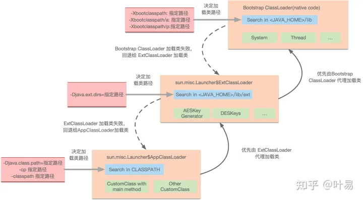

优先委派上级类加载器进行加载，如果上级类加载器：

- 能找到这个类，则由上级加载，加载后该类也对下级加载器可见；
- 找不到这个类，则下级类加载器才有资格执行加载；
- 在JDK9之后的版本中，当平台及应用程序类加载器收到类加载请求，在委派给父加载器加载前，要先判断该类是否能够归属到某一个系统模块中，如果可以找到这样的归属关系，就要优先委派给负责那个模块的加载器完成加载。

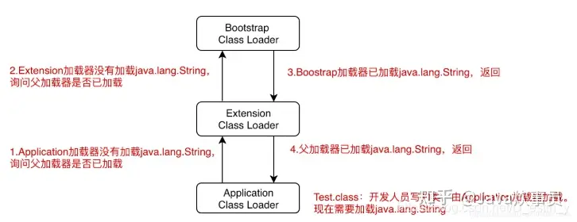

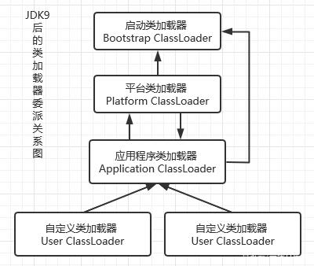

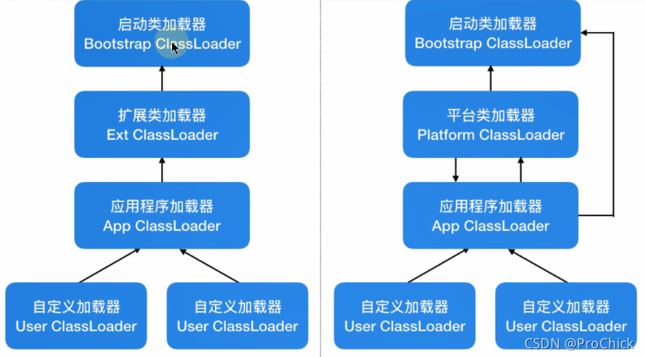

目的：

- 沙箱安全机制：保证核心类优先加载，自己写的`java.lang.String.class`类不会被加载，这样便可以防止核心API库被随意篡改；
- 上级对下级共享，避免类的重复加载：当父亲已经加载了该类时，就没有必要子ClassLoader再加载一 次，保证被加载类的唯一性。

```java
protected Class<?> loadClass(String name, boolean resolve)
        throws ClassNotFoundException
{
    // 获取同步锁
    synchronized (getClassLoadingLock(name)) {
        // First, check if the class has already been loaded
        // 此处为JNI方法，查找该类是否已经加载
        Class<?> c = findLoadedClass(name);
        if (c == null) {
            long t0 = System.nanoTime();
            try {
                if (parent != null) {
                    // 若父加载器不为空，父加载器先进行加载
                    c = parent.loadClass(name, false);
                } else {
                    // 父加载器为空时，说明当前加载器是启动类加载器：Bootstrap
                    c = findBootstrapClassOrNull(name);
                }
            } catch (ClassNotFoundException e) {
                // ClassNotFoundException thrown if class not found
                // from the non-null parent class loader
            }

            if (c == null) {
                // If still not found, then invoke findClass in order
                // to find the class.
                long t1 = System.nanoTime();
                c = findClass(name);

                // this is the defining class loader; record the stats
                PerfCounter.getParentDelegationTime().addTime(t1 - t0);
                PerfCounter.getFindClassTime().addElapsedTimeFrom(t1);
                PerfCounter.getFindClasses().increment();
            }
        }
        if (resolve) {
            // 执行连接过程
            resolveClass(c);
        }
        return c;
    }
}
```

#### Tomcat的类加载机制

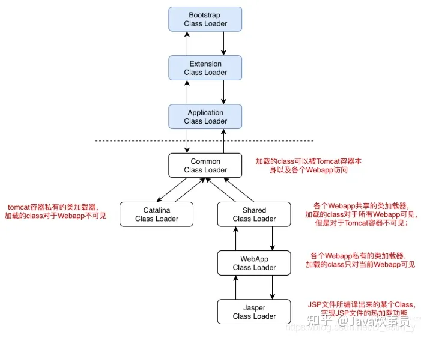

Tomcat违背了双亲委派模型，因为双亲委派机制要求除了顶层启动类加载器Bootstrap ClassLoader之外，其余的类加载都应该由其父类加载器加载。而Tomcat不是这样实现的，Tomcat为了实现**隔离性**，没有遵循这个约定，每个Webapp ClassLoader加载自己目录下的class文件，不会传递给父类加载器。tomcat的几个主要类加载器：

- CommonLoader：Tomcat最基本的类加载器，加载路径中的class可以被Tomcat容器本身以及各个Webapp访问；
- CatalinaLoader：Tomcat容器私有的类加载器，加载路径中的class对于Webapp不可见；
- SharedLoader：各个Webapp共享的类加载器，加载路径中的class对于所有Webapp可见，但是对于Tomcat容器不可见；
- WebappClassLoader：各个Webapp私有的类加载器，加载路径中的class只对当前Webapp可见，比如加载war包里相关的类，每个war包应用都有自己的WebappClassLoader，实现相互隔离，比如不同war包应用引入了不同的spring版本， 这样实现就能加载各自的spring版本。

#### Spring的类加载机制

Spring加载问题：Tomcat加载器的实现清晰易懂，并且采用了官方推荐的“正统”的使用类加载器的方式。这时有一个问题：如果有10个Web应用程序都用到了Spring的话，可以把Spring的jar包放到common或shared目录下让这些程序共享。Spring的作用是管理每个web应用程序的bean，调用`getBean`方法时自然要能访问到应用程序的类，而用户的程序显然是放在`/WebApp/WEB-INF/`目录中的（由 WebAppClassLoader加载），那么在CommonClassLoader或SharedClassLoader中的Spring容器如何去加载并不在其加载范围的用户程序（/WebApp/WEB-INF/）中的类呢？

解答：答案呼之欲出，Spring根本不会去管自己被放在哪里，它统统使用线程类加载器来加载类，而线程类加载器默认设置为了WebAppClassLoader。也就是说，哪个WebApp应用调用了Spring，Spring就去**<u>取该应用自己的</u>**WebAppClassLoader来加载bean。

在web.xml中定义的listener为`org.springframework.web.context.ContextLoaderListener`，它最终调用了`org.springframework.web.context.ContextLoader`来装载bean，具体方法如下（删去了部分不相关内容）：

```java
// org.springframework.web.context.ClassLoader Line:261
public WebApplicationContext initWebApplicationContext(ServletContext servletContext) {
	try {
		// 创建WebApplicationContext
		if (this.context == null) {
			this.context = createWebApplicationContext(servletContext);
		}
		// 将其保存到该webapp的servletContext中		
		servletContext.setAttribute(WebApplicationContext.ROOT_WEB_APPLICATION_CONTEXT_ATTRIBUTE, this.context);
		// 获取线程上下文类加载器，默认为WebAppClassLoader
		ClassLoader ccl = Thread.currentThread().getContextClassLoader();
		// 如果spring的jar包放在每个webapp自己的目录中
		// 此时线程上下文类加载器会与本类的类加载器（加载spring的）相同，都是WebAppClassLoader
		if (ccl == ContextLoader.class.getClassLoader()) {
			currentContext = this.context;
		}
		else if (ccl != null) {
			// 如果不同，也就是上面说的那个问题的情况，那么用一个map把刚才创建的WebApplicationContext及对应的WebAppClassLoader存下来
			// 一个webapp对应一个记录，后续调用时直接根据WebAppClassLoader来取出
			currentContextPerThread.put(ccl, this.context);
		}
		
		return this.context;
	}
	catch (RuntimeException ex) {
		logger.error("Context initialization failed", ex);
		throw ex;
	}
	catch (Error err) {
		logger.error("Context initialization failed", err);
		throw err;
	}
}
```

#### 自定义类加载器

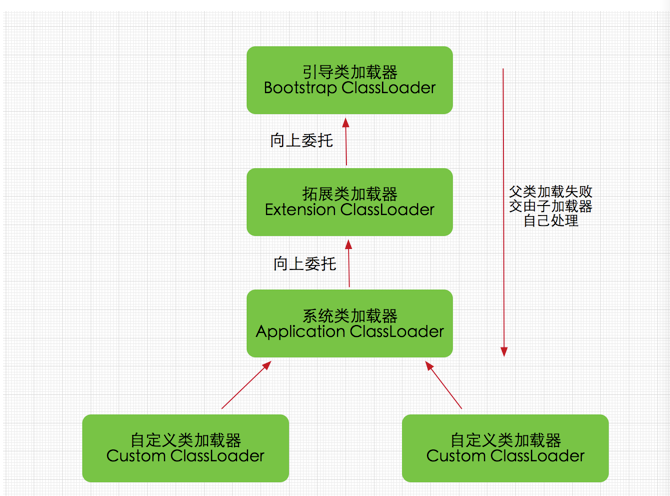

可以看出，除了和本地实现密切相关的启动类加载器之外，包括扩展类加载器、平台类加载器和应用类加载器在内的所有其他类加载器我们都可以当做自定义类加载器来对待，唯一区别是是否被虚拟机默认使用。如果用两个自定义类加载器去加载某自定义类型（注意不要将自定义类型的字节码放置到JRE核心库路径或者扩展路径中，否则会被系统类加载器或扩展类加载器抢先加载），然后用获取到的两个Class实例调用`java.lang.Object.equals()`判断，将会得到**不相等**的结果。当自定义类加载器没有指定父类加载器的情况下，默认的父类加载器是通过调用`ClassLoader()`生成的应用类加载器（AppClassLoader），所以即使用户自定义类加载器不指定父类加载器，也同样可以加载启动类加载器、扩展类加载器和平台类加载器已加载的类：

```java
protected ClassLoader() {
    this(checkCreateClassLoader(), null, getSystemClassLoader());
}

@CallerSensitive
public static ClassLoader getSystemClassLoader() {
    switch (VM.initLevel()) {
        case 0:
        case 1:
        case 2:
            // the system class loader is the built-in app class loader during startup
            return getBuiltinAppClassLoader();
        case 3:
            String msg = "getSystemClassLoader cannot be called during the system class loader instantiation";
            throw new IllegalStateException(msg);
        default:
            // system fully initialized
            assert VM.isBooted() && scl != null;
            SecurityManager sm = System.getSecurityManager();
            if (sm != null) {
                checkClassLoaderPermission(scl, Reflection.getCallerClass());
            }
            return scl;
    }
}

static ClassLoader getBuiltinAppClassLoader() {
    return ClassLoaders.appClassLoader();
}
```

一般尽量不要覆写已有的`loadClass()`方法中的委派逻辑。一般在JDK 1.2之前的版本才这样做，而且事实证明，这样做极有可能引起系统默认的类加载器不能正常工作。在JVM规范和JDK文档中（1.2或者以后版本中），都没有建议用户覆写`loadClass()`方法，相比而言，明确提示开发者在开发自定义的类加载器时覆写`findClass()`逻辑：

```java
public class MyClassLoader extends ClassLoader {
    // 类所在路径，默认为当前路径下
    private String dir = "./";
    
    public MyClassLoader(String dir) {
        super();
        this.dir = dir;
    }
    
    @Override
    protected Class<?> findClass(String name) throws ClassNotFoundException {
        String path = this.dir + "/" + name + ".class";
        byte[] b = null;
        try (
                BufferedInputStream bis = new BufferedInputStream(new FileInputStream(path));
                ByteArrayOutputStream baos = new ByteArrayOutputStream()) {
            int len = 0;
            byte[] buff = new byte[1024];
            while ((len = bis.read(buff)) != -1) {
                baos.write(buff, 0, len);
            }
            b = baos.toByteArray();
        } catch (IOException e) {
            e.printStackTrace();
        }
        if (b == null) {
            throw new ClassNotFoundException();
        }
        return super.defineClass(name, b, 0, b.length);
    }
}
```

ClassLoader的子类在调用`loadClass()`时，会调用`findLoadedClass()`查找已加载的类，防止重复加载：

```java
protected final Class<?> findLoadedClass(String name) {
    if (!checkName(name))
        return null;
    return findLoadedClass0(name);
}

private final native Class<?> findLoadedClass0(String name);
```

BuiltinClassLoader及其子类在调用`findClass()`时，会调用`findLoadedModule()`查找已加载的模块，防止重复加载：

```java
private LoadedModule findLoadedModule(String cn) {
    int pos = cn.lastIndexOf('.');
    if (pos < 0)
        return null; // unnamed package
    String pn = cn.substring(0, pos);
    return packageToModule.get(pn);
}
```

## 对象初始化

[构造函数 成员函数初始化顺序 以及多态的构造函数的调用顺序](https://blog.csdn.net/zhanghaotian2011/article/details/9040935)

名词解释：

- 静态成员变量：Class Variables (Static Fields, Static Member Variables)
- 实例成员变量：Instance Variables (Non-Static Fields, Instance Member Variables)
- 静态代码块：Staitc Initializer Block
- 实例代码块：Instance Initializer Block
- 构造器：Constructor
- 静态 = 静态成员变量 + 静态代码块
- 动态 = 实例成员变量 + 动态代码块
- 实例 = 实例成员变量 + 动态代码块 + 构造器
- 动态代码块 = 构造代码块 = 实例代码块

规则：

1. 只要代码中出现某类的静态成员变量或方法（充分不必要条件），就会触发**类加载**，该类的*静态*就会执行。打印`MyClass.class`会触发，而打印`MyClass.class.getClassLoader()`不会触发。算子类调用父类的静态成员变量或方法，仅执行父类的*静态*，不会执行子类的*静态*；

2. *静态*最先执行，只执行一次；

3. 静态代码块执行与静态成员变量初始化的顺序，与代码中的顺序一致；

4. *静态*执行之后，*动态*才执行，初始化几次就会执行几次；

5. 动态代码块执行与成员变量初始化的顺序，与代码中的顺序一致；

6. 构造器紧跟*动态*执行，初始化几次就会执行几次；

7. 优先级：*静态* > 继承关系；

8. 执行顺序：静态(父类→子类)→实例(父类(动态→构造器)→子类(动态→构造器))

   父类静态→子类静态→父类动态→父类构造器→子类动态→子类构造器；

9. 在动态代码块或成员变量中初始化自身或者子类，会造成循环构造，抛出`StackOverflowError`；

10. 子类不可以覆盖父类中声明为静态的方法；

11. 父类可以被子类覆盖方法，从而通过该方法访问子类中的私有成员；

12. 字段是不参与多态的，不会被覆盖。派生类如果声明了跟基类同名的字段，则两个字段在最终的实例中**都会存在**；派生类的版本只会在名字上遮盖（shadow / hide）掉基类字段的名字，而不会与基类字段合并或令其消失；

13. <u>系统默认值的给予</u> 比 <u>通过等号的赋予</u> 先执行；

14. 向前引用（Forward Reference）：通过简单名称引用的变量可以出现在左值位置，但不能出现在右值的位置（`a++`和`a+=1`都是`a=a+1`，也出现在右值）；

15. 非法的向前引用（Illegal Forward Reference）：可以在代码块中提前修改后边的变量，因为此时变量已有默认值（已经执行连接准备），所以可以将该变量重新赋值，这是在类初始化阶段进行的。但是执行代码块时，并没有执行变量的初始化，因此并不能在变量初始化前访问变量。

```java
class SuperClass {
    
    // 静态代码块和静态成员变量初始化最先执行, 只执行一次
    static SubClass subClass = new SubClass();
    static {
        System.out.println("1.SuperClass:");
    }
    
    // 静态执行之后, 构造代码块才执行, 初始化几次就会执行几次
    {
        System.out.println("5.Before SuperClass nonstatic member variable init.");
    }
    
    // 静态执行之后, 动态成员变量才初始化, 初始化几次就会执行几次
    protected int i = 1;
    protected static int j = 100;
    // StackOverflowError 循环构造
    // SuperClass superClass = new SuperClass();
    
    // 构造代码块顺序紧邻构造器, 并在构造器之前执行
    {
        System.out.println("6.SuperClass constructor code block: i = " + i);
        System.out.println("  SuperClass constructor code block: j = " + j);
    }
    
    // 静态代码块执行与静态成员变量初始化的顺序, 与代码中的顺序一致
    static {
        System.out.println("2.SuperClass static code block: j = " + j);
    }
    
    public SuperClass() {
        // 此处的构造方法访问此类(父类)的私有成员变量
        System.out.println("7.SuperClass constructor method: i = " + i);
        // 此处的方法根据访问控制情况可能会被子类覆盖, 若被覆盖, 则此方法是子类的方法, 所以可以访问其类的私有成员变量
        m();
        // 此处重载的方法未被子类覆盖
        m(0);
    }
    
    public void m() {
        System.out.println("13.SuperClass.m(): i = " + i);
    }
    
    public void m(int n) {
        System.out.println("9.SuperClass.m(): i = " + i);
    }
}

public class SubClass extends SuperClass {
    
    static SuperClass superClass = new SuperClass();
    static {
        System.out.println("3.SubClass:");
    }
    
    {
        System.out.println("10.Before SubClass nonstatic member variable init.");
    }
    
    private int i = 10;
    private static int j = 1000;
    // StackOverflowError 循环构造
    // SubClass subClass = new SubClass();
    
    {
        System.out.println("11.SubClass constructor code block: i = " + i);
        System.out.println("   SubClass constructor code block: j = " + j);
    }
    
    static {
        System.out.println("4.SubClass static code block: j = " + j);
    }
    
    public SubClass() {
        // 父类构造器无参, 此处可隐式调用
        super();
        System.out.println("12.SubClass constructor method: i = " + i);
        // 该方法仍是父类的方法，其内部访问的也是父类的私有成员变量
        super.m();
        // 该方法是子类的方法，其内部访问的也是子类的私有成员变量
        m();
    }
    
    @Override
    public void m() {
        System.out.println("8.SubClass.m(): i = " + i);
    }

    // 静态之后
    public static void main(String[] args) {
        System.out.println("0.Main method: j = " + j);
        SuperClass sc = new SubClass();
        // 此处访问的是形式类型的成员变量
        // 父类的成员变量不能被子类覆盖
        // 只有通过子类或被子类覆盖的方法才能访问子类的动态成员变量
        System.out.println("SuperClass.i = " + sc.i);
        System.out.println("SuperClass.j = " + SuperClass.j);
        System.out.println("SubClass.j = " + SubClass.j);
    }
}
```

打印结果：

```
5.Before SuperClass nonstatic member variable init.
6.SuperClass constructor code block: i = 1
  SuperClass constructor code block: j = 0
7.SuperClass constructor method: i = 1
8.SubClass.m(): i = 0
9.SuperClass.m(): i = 1

10.Before SubClass nonstatic member variable init.
11.SubClass constructor code block: i = 10
   SubClass constructor code block: j = 0
12.SubClass constructor method: i = 10
13.SuperClass.m(): i = 1
8.SubClass.m(): i = 10

1.SuperClass:
2.SuperClass static code block: j = 100

5.Before SuperClass nonstatic member variable init.
6.SuperClass constructor code block: i = 1
  SuperClass constructor code block: j = 100
7.SuperClass constructor method: i = 1
13.SuperClass.m(): i = 1
9.SuperClass.m(): i = 1

3.SubClass:
4.SubClass static code block: j = 1000

0.Main method: j = 1000

5.Before SuperClass nonstatic member variable init.
6.SuperClass constructor code block: i = 1
  SuperClass constructor code block: j = 100
7.SuperClass constructor method: i = 1
8.SubClass.m(): i = 0
9.SuperClass.m(): i = 1

10.Before SubClass nonstatic member variable init.
11.SubClass constructor code block: i = 10
   SubClass constructor code block: j = 1000
12.SubClass constructor method: i = 10
13.SuperClass.m(): i = 1
8.SubClass.m(): i = 10

SuperClass.i = 1
SuperClass.j = 100
SubClass.j = 1000
```

