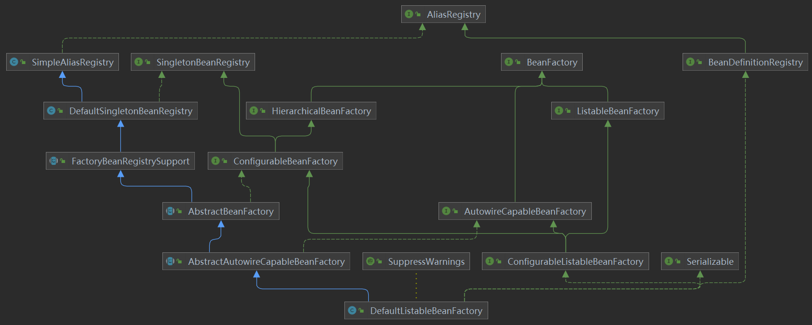
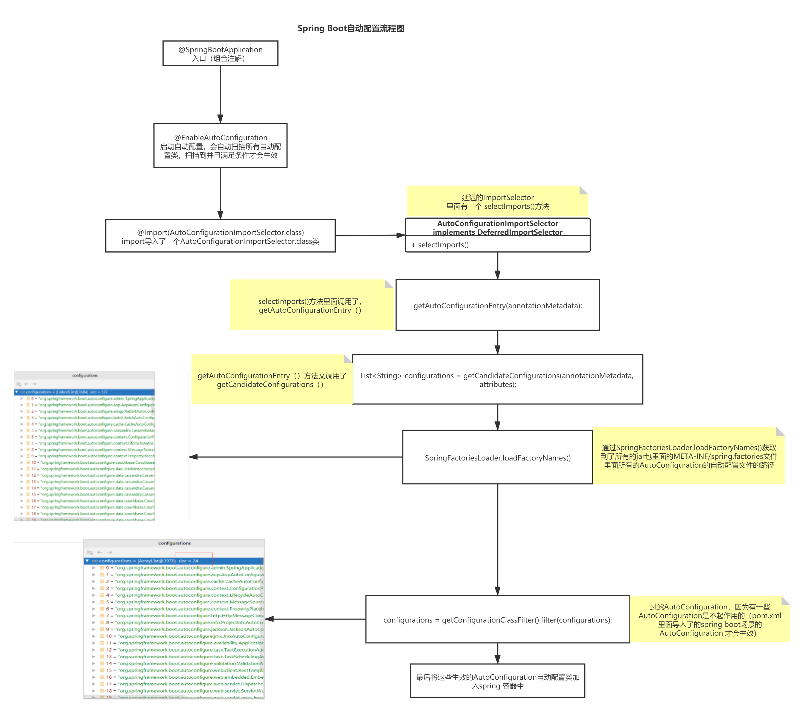
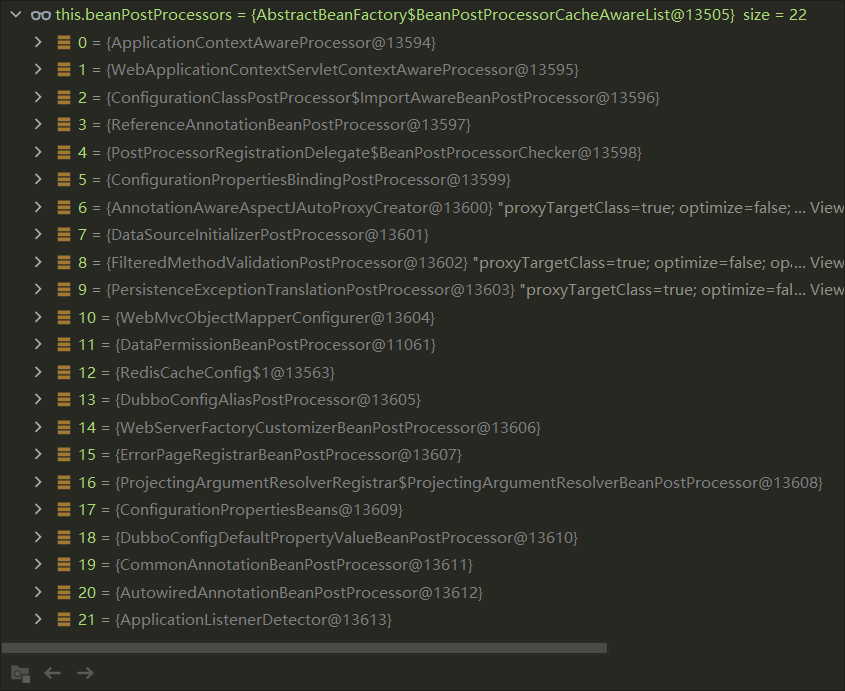
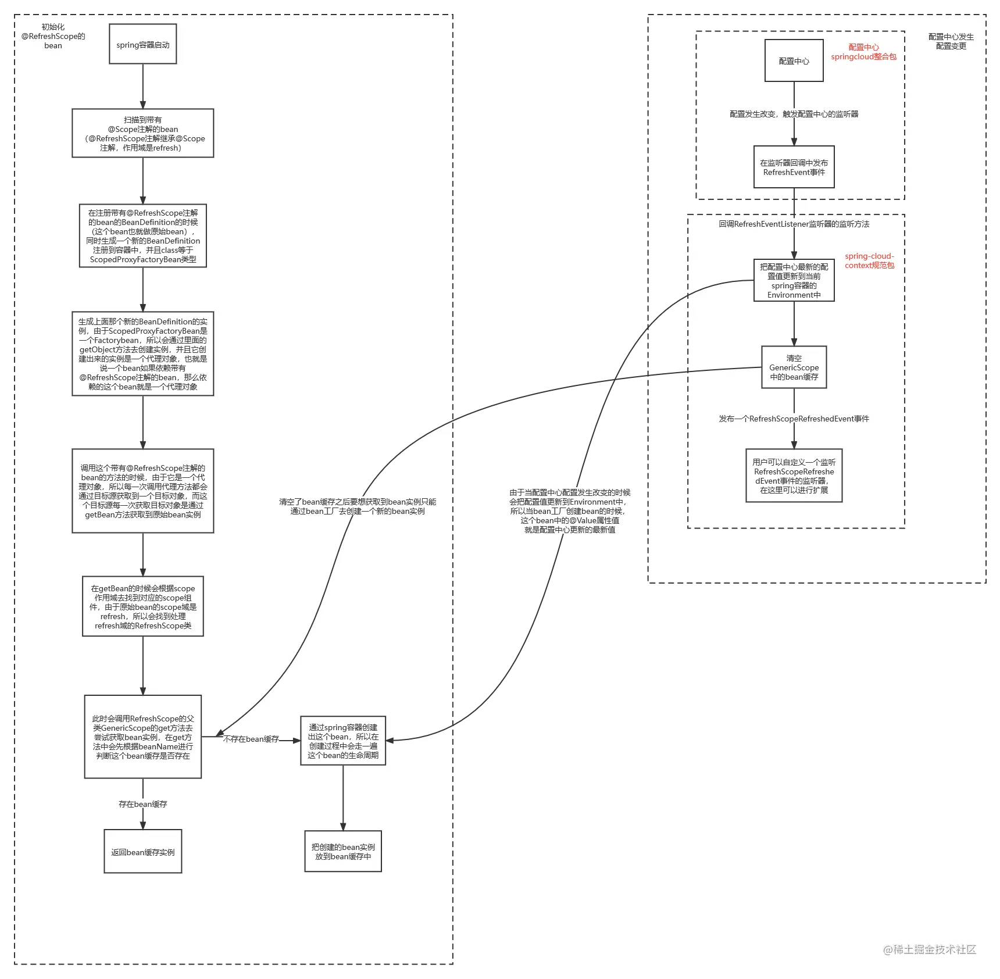
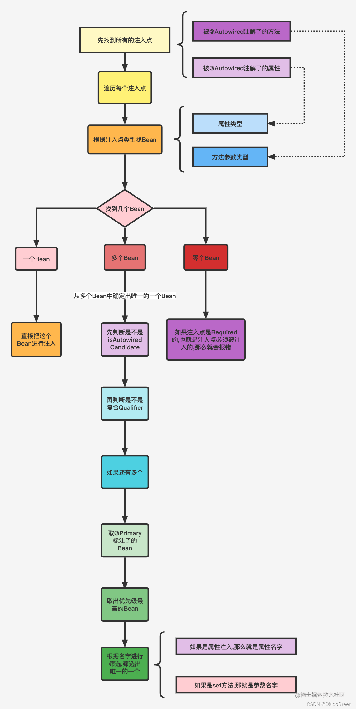

# Spring 注解

@(Java)[Spring, 注解]

---
- [`@Bean`](#bean)
	- [`InstantiationAwareBeanPostProcessor`接口](#instantiationawarebeanpostprocessor接口)
	- [`SmartInstantiationAwareBeanPostProcessor`接口](#smartinstantiationawarebeanpostprocessor接口)
	- [`MergedBeanDefinitionPostProcessor`接口](#mergedbeandefinitionpostprocessor接口)
	- [`BeanNameAware`接口](#beannameaware接口)
	- [`BeanFactoryAware`接口](#beanfactoryaware接口)
	- [`ApplicationContextAware`接口](#applicationcontextaware接口)
	- [`BeanPostProcessor`接口](#beanpostprocessor接口)
	- [`@PostConstruct`和`@PreDestroy`](#postconstruct和predestroy)
	- [`InitializingBean`和`DisposableBean`接口](#initializingbean和disposablebean接口)
	- [`initMethod`和`destroyMethod`](#initmethod和destroymethod)

- [`@Configuration`](#configuration)

- [`@ComponentScan`和`TypeFilter`](#componentscan和typefilter)

- [`@Scope`](#scope)

- [`@Import`](#import)
	- [`ImportSelector`](#importselector)
	- [`ImportBeanDefinitionRegistrar`](#importbeandefinitionregistrar)

---
## @Bean
#### 注册过程

在 Spring 框架中，将 Bean 存储到容器中的过程发生在 `DefaultListableBeanFactory` 类中。这个类继承了 `AbstractBeanFactory` 和 `BeanFactory`，它负责注册、存储和管理 Spring 容器中的 Bean。该类被 ApplicationContext 持有。



当 Bean 被创建之后，Spring 会将其缓存或存储在容器中，以便后续的依赖注入或 Bean 检索。下面将介绍核心的代码路径，说明 Spring 是如何将 Bean 存储到容器中的。

##### **Bean 的缓存：`singletonObjects`**

Spring 使用一个称为 `singletonObjects` 的缓存（`ConcurrentHashMap`）来存储已经实例化的单例 Bean。该缓存位于 `DefaultSingletonBeanRegistry` 类中，`DefaultListableBeanFactory` 是它的子类。

```java
// DefaultSingletonBeanRegistry.java
private final Map<String, Object> singletonObjects = new ConcurrentHashMap<>(256);
```

当一个单例 Bean 创建完成后，Spring 会将其存储在 `singletonObjects` 中，以便之后可以直接从缓存中获取，而不需要再次创建。

##### **Bean 创建后的存储：`addSingleton` 方法**

创建 Bean 后，Spring 会调用 `addSingleton` 方法将 Bean 存储到 `singletonObjects` 缓存中。这是将单例 Bean 放入容器的核心步骤。

```java
// DefaultSingletonBeanRegistry.java
@Override
public void addSingleton(String beanName, Object singletonObject) {
    synchronized (this.singletonObjects) {
        this.singletonObjects.put(beanName, singletonObject);
        this.singletonFactories.remove(beanName);
        this.earlySingletonObjects.remove(beanName);
        this.registeredSingletons.add(beanName);
    }
}
```

`addSingleton` 方法做了几件事：

1. 将创建好的单例 Bean 放入 `singletonObjects` 缓存中。
2. 从 `singletonFactories` 和 `earlySingletonObjects` 中移除 Bean（这些是 Spring 处理循环依赖时的临时缓存）。
3. 将 Bean 名称添加到 `registeredSingletons` 中，记录已经注册的单例 Bean。

##### **`createBean` 方法：调用 `addSingleton` 存储 Bean**

当 Spring 调用 `createBean` 方法创建一个新的单例 Bean 时，在创建完成后会调用 `addSingleton` 方法将 Bean 注册到容器中。

```java
// AbstractAutowireCapableBeanFactory.java
protected Object doCreateBean(final String beanName, final RootBeanDefinition mbd, final @Nullable Object[] args)
        throws BeanCreationException {

    // Create bean instance
    BeanWrapper instanceWrapper = createBeanInstance(beanName, mbd, args);
    Object bean = instanceWrapper.getWrappedInstance();

    // Store singleton if necessary
    if (mbd.isSingleton()) {
        addSingleton(beanName, bean);  // 将 Bean 存储到 singletonObjects 中
    }

    // Initialize the bean
    populateBean(beanName, mbd, instanceWrapper);
    initializeBean(beanName, exposedObject, mbd);

    return exposedObject;
}
```

- `createBeanInstance` 是 Bean 实例创建的入口，它负责调用构造器或工厂方法来创建 Bean。
- 在 Bean 创建完成后，Spring 会检查当前 Bean 是否为单例（`mbd.isSingleton()`），如果是单例，就调用 `addSingleton` 将 Bean 存储到容器的缓存中。

##### **完整的 Bean 注册流程**

以下是 Spring 完整的 Bean 创建和注册流程：

1. **Bean 定义加载**：Spring 通过 XML 配置或注解加载 Bean 的定义信息，并将其注册到 `BeanDefinitionRegistry` 中。
2. **Bean 实例化**：当容器需要一个 Bean 时，会调用 `createBean` 方法来实例化该 Bean。
3. **依赖注入**：在 `populateBean` 中进行依赖注入，将 Bean 的属性或构造器参数依赖注入到 Bean 中。
4. **初始化回调**：在 `initializeBean` 中调用 `InitializingBean` 接口的 `afterPropertiesSet` 方法或 Bean 的自定义初始化方法。
5. **Bean 注册**：Bean 初始化完成后，通过 `addSingleton` 方法将该 Bean 存储到 `singletonObjects` 缓存中。

##### **注册 Bean 的示例代码**

假设有一个简单的 Bean，Spring 会按照如下步骤将其注册到容器中：

```java
@Component
public class MyBean {
    // Some fields and methods
}
```

- **加载定义**：Spring 通过扫描注解找到 `MyBean` 类，并生成一个 `BeanDefinition`。
- **创建实例**：Spring 调用 `createBean` 方法实例化 `MyBean`。
- **依赖注入**：Spring 通过 `populateBean` 方法注入依赖。
- **存储 Bean**：`MyBean` 实例化完成后，Spring 调用 `addSingleton("myBean", myBeanInstance)` 将该 Bean 存储到 `singletonObjects` 缓存中。

这样，`MyBean` 就被注册到 Spring 容器中了，后续通过 `getBean("myBean")` 调用时，Spring 会直接从 `singletonObjects` 中获取已经创建好的实例，而不会重复创建。

##### 总结

- **`singletonObjects` 缓存**：Spring 使用 `singletonObjects` 存储已经实例化的单例 Bean。
- **`addSingleton` 方法**：这是将单例 Bean 存储到容器中的核心方法，负责将创建好的 Bean 注册到 `singletonObjects`。
- **创建和注册流程**：Bean 在经过实例化、依赖注入、初始化等阶段后，最终通过 `addSingleton` 方法存储到容器中，供后续使用。

这一系列机制确保了 Spring 的单例 Bean 只会被实例化一次，并可以被多次检索和使用。

### 生命周期

[Spring容器加载bean的过程](https://blog.csdn.net/qq_37795502/article/details/107086929)

[@Bean 注解全解析](https://www.cnblogs.com/cxuanBlog/p/11179439.html)

[Spring的@Bean只能放在@Configuration里面吗？](https://blog.csdn.net/z69183787/article/details/108105329)

[Spring注解驱动开发（一）](https://blog.csdn.net/weixin_37778801/article/details/86233124)

被`@Bean`注解的**方法**相当于XML配置文件中的`<bean>`标记。Bean类型必须有一个**无参构造器**。

[spring源码系列（一）——spring循环引用](https://zhuanlan.zhihu.com/p/201226332)


[Spring面试题（2020最新版）](https://thinkwon.blog.csdn.net/article/details/104397516#Springbean_526)


[Spring中bean的生命周期（最详细）](https://blog.csdn.net/qq_35634181/article/details/104473308#t3)


SpringApplication

ConfigurableApplicationContext.refresh()（默认实现类 AnnotationConfigServletWebApplicationContext）

> **间接继承**：`ConfigurableApplicationContext` 通过 `ApplicationContext` 间接继承了 `BeanFactory`。
>
> **委托模式**：`ConfigurableApplicationContext` 并不直接实现 `BeanFactory` 的所有功能，而是通过委托内部的 `ConfigurableListableBeanFactory` 来管理 `Bean`。
>
> **高层抽象**：`ConfigurableApplicationContext` 是更高级的应用上下文容器，它提供了比 `BeanFactory` 更丰富的功能（如事件机制、资源管理、国际化支持等）。

- 生成 beanFactory：`ConfigurableListableBeanFactory beanFactory = obtainFreshBeanFactory();`
- 该类接口为 BeanDefinitionRegistry  加载定义信息：AnnotatedBeanDefinitionReader（配置解析器）和 ClassPathBeanDefinitionScanner（注解扫描器）读取并解析
- `finishBeanFactoryInitialization(beanFactory)`初始化所有 bean
  - `beanFactory.preInstantiateSingletons()`在此处触发创建所有非懒加载的单例 Bean
    - 遍历`this.beanDefinitionNames`并通过`getBean(beanName)`创建Bean

BeanFactoryPostProcessor 会比 Bean 先实例化。

AbstractAutowireCapableBeanFactory.class：

- createBean
    - resolveBeforeInstantiation 创建前准备
      - postProcessBeforeInstantiation
      - postProcessAfterInstantiation
    - doCreateBean
      - createBeanInstance
        - determineConstructorsFromBeanProcessors
          - determineCandidateConstructors
        - instantiateBean 或者 autowireConstructor **实例化对象**
      - applyMergedBeanDefinitionPostProcessors
        - postProcessMergedBeanDefinition
      - getEarlyBeanReference
        - gerEarlyBeanReference
      - populateBean 在实例化之前解析依赖关系，确保实例化顺序，为了 postProcessProperties
        - postProcessAfterInstantiation
        - postProcessProperties **依赖注入**前的准备：Bean属性赋值，例如`required=true`（原 postProcessPropertyValues 方法），如果是例如`AutowiredAnnotationBeanPostProcessor`的实现类则执行了依赖注入
      - initializeBean
        - invokeAwareMethods 赋值三种字段
          - BeanNameAware
          - BeanClassLoaderAware
          - BeanFactoryAware
        - applyBeanPostProcessorsBeforeInitialization
          - postProcessBeforeInitializtion
            - invokeAwareInterfaces 赋值其他字段，例如：`((ApplicationContextAware) bean).setApplicationContext(this.applicationContext)`等设置各种实现了`Aware`接口的 bean
        - invokeInitMethods **初始化**
          - afterPropertiesSet 实现 InitializingBean 接口的初始化
          - invokeCustomInitMethod 调用自定义的初始化 init-method
        - applyBeanPostProcessorsAfterInitialization
          - postProcessAfterInitialization

回到父类 AbstractBeanFactory.class：

- getSingleton 容器缓存
  - addSingleotn 存入容器 singletonObjects 中

销毁实例：

- Main.stop()
- SpringContainer.stop()
- AbstractApplicationContext.stop()
- SmartLifecycle.stop()
- AutowireBeanFactoryObjectPostProcessor.destroy()
- AbstractBeanFactory 调用 destroyBean：
  - DisposableBeanAdapter 实现 Runnable 接口：
    - run 方法调用 destroy：
      - 调用实现了 DisposableBean 接口的 destroy 方法
      - invokeCustomDestroyMethod 调用自定义的 destroy-method 方法



可以通过设置`spring.main.allow-bean-definition-overriding`配置项避免重复定义同名的bean，后定义的bean会覆盖之前定义的相同名称的bean。

```java
spring.main.allow-bean-definition-overriding=true
```

### 依赖注入的本质

Spring 中依赖注入的**内部机制**主要依赖于以下几个核心组件和类，尤其是 `AutowiredAnnotationBeanPostProcessor`，以及 `BeanFactory` 等组件。下面我将详细解释这些机制的关键代码路径。

#### **`AutowiredAnnotationBeanPostProcessor`**

这是处理 `@Autowired` 注解的核心类，Spring 会使用它在依赖注入的过程中，解析并注入带有 `@Autowired` 注解的字段、构造器或方法。

**关键方法**：

- `AutowiredAnnotationBeanPostProcessor` 实现了 `BeanPostProcessor` 接口，它通过以下几个步骤来完成自动注入：

  ```java
  @Override
  public PropertyValues postProcessProperties(PropertyValues pvs, Object bean, String beanName) throws BeansException {
      InjectionMetadata metadata = findAutowiringMetadata(beanName, bean.getClass(), pvs);
      try {
          // 实际调用注入依赖的逻辑
          metadata.inject(bean, beanName, pvs);
      } catch (Throwable ex) {
          throw new BeanCreationException(beanName, "Injection of autowired dependencies failed", ex);
      }
      return pvs;
  }
  ```

- `findAutowiringMetadata` 方法会通过反射扫描当前类的所有字段、构造器和方法，查找带有 `@Autowired`、`@Value` 等注解的地方，并生成 `InjectionMetadata`。

  ```java
  private InjectionMetadata findAutowiringMetadata(String beanName, Class<?> clazz, @Nullable PropertyValues pvs) {
      // 缓存与类相关的注入元数据，避免重复查找
      InjectionMetadata metadata = this.injectionMetadataCache.get(clazz);
      if (InjectionMetadata.needsRefresh(metadata, clazz)) {
          synchronized (this.injectionMetadataCache) {
              metadata = buildAutowiringMetadata(clazz);
              this.injectionMetadataCache.put(clazz, metadata);
          }
      }
      return metadata;
  }
  ```

- `InjectionMetadata.inject` 方法会根据前面扫描得到的元数据，对 Bean 进行实际的依赖注入。

#### **依赖注入的具体执行过程**

Spring 框架会通过 `AutowiredAnnotationBeanPostProcessor` 中的 `InjectionMetadata` 来处理依赖的注入。`InjectionMetadata` 包含了所有待注入的字段和方法的元数据，并通过反射来注入依赖。

以字段注入为例：

```java
public void inject(Object target, @Nullable String beanName, @Nullable PropertyValues pvs) throws Throwable {
    // 遍历所有待注入的字段
    for (InjectedElement element : this.injectedElements) {
        // 实际执行注入
        element.inject(target, beanName, pvs);
    }
}
```

`InjectedElement.inject` 方法中，Spring 使用反射机制为目标对象的字段、构造器或方法注入依赖：

```java
protected void inject(Object bean, @Nullable String beanName, @Nullable PropertyValues pvs) throws Throwable {
    // 通过 BeanFactory 获取依赖并注入
    Object value = beanFactory.resolveDependency(this.descriptor, beanName, null, this.typeConverter);
    if (value != null) {
        ReflectionUtils.makeAccessible(this.field);
        // 使用反射为字段赋值
        this.field.set(bean, value);
    }
}
```

在这个过程中，Spring 会根据字段或方法的 `DependencyDescriptor`，从 `BeanFactory` 中解析出对应的依赖 Bean，并通过反射将依赖注入到目标对象。

#### **`DefaultListableBeanFactory`：依赖解析的核心**

依赖解析和获取 Bean 是通过 `DefaultListableBeanFactory` 来完成的，这是 Spring 中的默认 `BeanFactory` 实现，它负责管理 Bean 的创建、依赖解析和注入。

**关键方法**：

- `resolveDependency` 方法是用来解析依赖的关键方法：

  ```java
  @Override
  @Nullable
  public Object resolveDependency(DependencyDescriptor descriptor, @Nullable String requestingBeanName,
          @Nullable Set<String> autowiredBeanNames, @Nullable TypeConverter typeConverter) throws BeansException {
  
      descriptor.initParameterNameDiscovery(getParameterNameDiscoverer());
      if (Optional.class == descriptor.getDependencyType()) {
          return createOptionalDependency(descriptor, requestingBeanName);
      }
      else if (ObjectFactory.class == descriptor.getDependencyType() ||
              ObjectProvider.class == descriptor.getDependencyType()) {
          return new DependencyObjectProvider(descriptor, requestingBeanName);
      }
      else {
          // 实际解析依赖的逻辑
          return doResolveDependency(descriptor, requestingBeanName, autowiredBeanNames, typeConverter);
      }
  }
  ```

- `doResolveDependency` 是依赖解析的核心方法。它会根据 `DependencyDescriptor` 的描述，从容器中查找合适的 Bean，并进行依赖注入。

  ```java
  @Nullable
  public Object doResolveDependency(DependencyDescriptor descriptor, @Nullable String beanName,
          @Nullable Set<String> autowiredBeanNames, @Nullable TypeConverter typeConverter) throws BeansException {
  
      Class<?> type = descriptor.getDependencyType();
      
      // 如果是集合类型，会处理多 Bean 注入的场景
      if (descriptor.getDependencyType().isArray()) {
          return resolveMultipleBeans(type);
      }
      
      // 查找符合条件的 Bean，并执行依赖注入
      String autowiredBeanName = determineAutowireCandidate(beanNames, descriptor);
      Object beanInstance = resolveCandidate(autowiredBeanName, descriptor, type);
      return beanInstance;
  }
  ```

这个方法会从 `BeanFactory` 容器中找到与描述符匹配的候选 Bean，并返回给 `AutowiredAnnotationBeanPostProcessor`，最终通过反射注入到目标对象中。

#### **构造器注入**

如果使用的是构造器注入（如 `@Autowired` 标注在构造函数上），Spring 会通过 `ConstructorResolver` 来执行，具体来说是通过 `resolveConstructorArguments` 和 `autowireConstructor` 方法解析构造函数参数并注入。

```java
public BeanWrapper autowireConstructor(
        String beanName, RootBeanDefinition mbd, @Nullable Constructor<?>[] chosenCtors, Object[] explicitArgs) {

    Constructor<?> constructorToUse = chosenCtors[0];  // 选择合适的构造器
    Object[] argsToUse = resolveConstructorArguments(beanName, mbd, bw, constructorToUse, explicitArgs);  // 解析参数
    bw.setBeanInstance(instantiate(beanName, mbd, constructorToUse, argsToUse));  // 通过反射实例化并注入依赖
}
```

#### 总结

- **`AutowiredAnnotationBeanPostProcessor`** 是处理依赖注入的关键类，它负责解析带有 `@Autowired` 等注解的字段、方法和构造器，并通过 `InjectionMetadata` 对 Bean 进行依赖注入。
- **`DefaultListableBeanFactory`** 是依赖解析的核心，它通过 `resolveDependency` 和 `doResolveDependency` 方法，从容器中获取依赖的 Bean 并将其注入目标对象。
- **构造器注入** 则通过 `ConstructorResolver` 解析构造函数参数并进行依赖注入。

这些机制共同构成了 Spring 中依赖注入的底层实现逻辑。

#### `postProcessProperties`是否实现了依赖注入？

##### 核心点的澄清

`postProcessProperties` 方法确实是与依赖注入密切相关的部分，但它的本质是为**依赖注入的处理提供一个钩子**，并通过 `InjectionMetadata` 去执行依赖注入的过程。也就是说，`postProcessProperties` 方法虽然不是“**唯一**”实现依赖注入的地方，但它是 **Spring 依赖注入流程中关键的一部分**，尤其是在处理像 `@Autowired` 这样的注解时，**依赖注入的执行确实发生在 `postProcessProperties` 内部**。

因此，`postProcessProperties` 确实**触发并实际执行了依赖注入逻辑**，但这并不是唯一的依赖注入形式。例如，Spring 还支持通过构造器注入或其他形式的依赖注入。

##### 更详细的解释

让我们更详细地看一下 `postProcessProperties` 与依赖注入的关系：

1. **`postProcessProperties` 是 Spring 5.1 引入的方法**，它是 Spring 提供的一个用于在 Bean 的属性注入前进行处理的钩子函数。对于处理 `@Autowired`、`@Value` 等注解时，**依赖注入确实发生在 `postProcessProperties` 中**，特别是由 `AutowiredAnnotationBeanPostProcessor` 处理。

2. 在 `postProcessProperties` 中，`InjectionMetadata.inject(bean, beanName, pvs)` 实际上调用了依赖注入的逻辑。这个方法内部会根据先前分析的元数据，找到需要依赖注入的属性，并通过反射将依赖注入到目标对象（`bean`）中。

   ```java
   metadata.inject(bean, beanName, pvs);
   ```
   
3. **依赖注入的过程**是通过 `InjectionMetadata.inject` 方法完成的，它遍历每一个带有 `@Autowired` 注解的字段或方法，并通过 `BeanFactory` 来解析依赖，最后通过反射注入到 Bean 中。

   ```java
   public void inject(Object bean, String beanName, PropertyValues pvs) throws Throwable {
       for (InjectedElement element : this.injectedElements) {
           element.inject(bean, beanName, pvs);  // 通过反射注入依赖
       }
   }
   ```

4. **其它注入方式**：虽然 `postProcessProperties` 处理的是 `@Autowired`、`@Value` 等注解的依赖注入，但构造器注入、手动注入或 XML 配置注入等其它注入方式并不依赖这个方法。这些注入形式通过 Spring 容器的其他机制，如 `ConstructorResolver` 和 `BeanFactory` 等来完成。

##### 回答关键问题：`postProcessProperties` 是否直接实现了依赖注入？

- **是的，`postProcessProperties` 可以直接触发依赖注入**，尤其是在处理 `@Autowired` 或 `@Value` 等注解时。因为它内部调用了 `InjectionMetadata.inject`，该方法执行了反射操作，将 Bean 的依赖注入进来。
- 然而，**它并不是唯一的依赖注入机制**。Spring 依赖注入的实现方式有多种，比如构造器注入、XML 配置注入等，这些注入机制不一定依赖于 `postProcessProperties`。所以我们可以说，`postProcessProperties` 是某些特定依赖注入场景（如 `@Autowired`）的关键步骤，而不是全部依赖注入的入口。

##### 结论

- **`postProcessProperties` 在 `AutowiredAnnotationBeanPostProcessor` 中确实负责执行依赖注入**，这与依赖注入直接相关。它通过 `InjectionMetadata.inject` 方法实际完成了依赖注入。
- 之前我提到的“`postProcessProperties` 并不直接实现依赖注入”的说法不完全准确。更准确的描述应该是：`postProcessProperties` 是**在依赖注入过程中重要的一个步骤**，特别是在处理 `@Autowired` 注解时，它会实际调用依赖注入逻辑。

所以，`postProcessProperties` **不仅在依赖注入前提供了钩子**，而且在某些场景下（如注解驱动的依赖注入）**确实直接触发了依赖注入的执行**。

### 初始化顺序

在 Spring 中，Bean 的初始化顺序并不是简单地按照 Bean 的声明顺序来确定，而是基于**依赖关系**和**容器初始化规则**来决定的。对于你提到的场景，**A 依赖于 B**，Spring 会确保在创建 A 之前，先完成 B 的初始化。这是通过以下几种机制实现的：

#### **基于依赖关系的初始化顺序**

Spring 容器在初始化 Bean 时，会首先检查当前 Bean 是否依赖其他 Bean。如果有依赖关系（如 A 依赖 B），Spring 会确保先创建并初始化 B，再初始化 A。

具体来说，依赖关系可以通过以下方式确定：

- **构造器注入**：如果 A 的构造器参数中需要 B，那么 Spring 会在创建 A 之前先创建 B。

- **属性注入（`@Autowired` 等）**：如果 A 的字段或方法参数中依赖于 B，Spring 同样会先创建 B，再注入到 A 中。

  例如，假设 A 依赖于 B，通过构造器注入：

  ```java
  public class A {
      private final B b;
  
      @Autowired
      public A(B b) {
          this.b = b;
      }
  }
  ```

  Spring 在创建 A 时，会解析出 B 作为依赖，确保 B 在 A 之前被创建和初始化。

#### **依赖管理的核心机制：`depends-on` 和自动依赖**

在 Spring 中，除了自动依赖解析外，还可以通过 `depends-on` 明确指定 Bean 的初始化顺序。

##### **`depends-on` 显式声明顺序**

如果希望更明确地控制 Bean 的初始化顺序，可以使用 `@DependsOn` 注解或 XML 配置中的 `depends-on` 属性。`depends-on` 强制声明某个 Bean 在初始化时依赖于其他 Bean。

- **Java 注解方式**：

  ```java
  @DependsOn("beanB")
  public class A {
      // A 会在 B 初始化之后创建
  }
  ```

- **XML 配置方式**：

  ```xml
  <bean id="a" class="com.example.A" depends-on="b"/>
  <bean id="b" class="com.example.B"/>
  ```

在这两种情况下，Spring 会强制确保 B 在 A 之前被创建和初始化。

##### **自动依赖解析**

Spring 默认会根据依赖关系（如构造器注入或 `@Autowired`）自动解析依赖顺序。例如，A 依赖 B，Spring 会在解析 Bean A 时发现 B 是它的依赖，从而确保 B 先于 A 创建和初始化。

#### Lazy Initialization（延迟初始化）对顺序的影响

如果某个 Bean 设置了 `@Lazy`（延迟初始化），它的初始化可能被延迟到**首次使用时**。这可能会影响初始化顺序。

- 如果 A 设置了 `@Lazy`，但 B 没有设置，B 会在容器启动时立即初始化，而 A 则会在第一次被请求时才被初始化。

  ```java
  @Lazy
  @Component
  public class A {
      @Autowired
      private B b;
  }
  ```

此时，虽然 A 依赖 B，但 A 的初始化会被推迟，只有当某个 Bean 或组件第一次请求 A 时，Spring 才会初始化它。

#### **Bean Factory 和 BeanPostProcessor 的参与**

在某些复杂场景下，`BeanFactoryPostProcessor` 和 `BeanPostProcessor` 也会参与到 Bean 的创建流程中。这些特殊的组件能够在 Bean 创建之前或之后对 Bean 的初始化顺序和依赖关系进行调整。

#### **默认的无依赖 Bean 的顺序**

如果两个 Bean 之间没有明确的依赖关系，Spring 容器可能会根据声明顺序（例如 XML 文件中的顺序或类扫描的顺序）来初始化它们，但这个顺序是**不可预测的**。因此，最好通过显式依赖声明（如 `depends-on`）来保证顺序。

#### **循环依赖**

Spring 默认支持大部分类型的**循环依赖**，例如 A 依赖于 B，B 也依赖于 A。Spring 会通过代理和缓存的方式处理循环依赖。不过对于构造器循环依赖，Spring 容器会抛出异常，因为它无法在实例化阶段解决这种循环。

#### 解决循环依赖

在 Spring 框架中，**循环依赖（circular dependency）** 是指两个或多个 Bean 相互依赖的情况，例如：

- **A 依赖 B，B 依赖 A**
- **A 依赖 B，B 依赖 C，C 依赖 A**

Spring 容器使用了一个**三级缓存**机制来解决循环依赖问题，特别是在单例 Bean 的情况下。需要注意的是，这种解决循环依赖的方式只适用于单例作用域的 Bean，且只能解决**构造器注入之外**的其他方法（如 setter 方法）引起的循环依赖。对于构造器注入引起的循环依赖，Spring 无法解决，会抛出`BeanCurrentlyInCreationException`异常。对于 prototype 作用域的 Bean，Spring 也无法解决其循环依赖，会抛出`BeanCurrentlyInCreationException`异常。

以下是 Spring 如何处理这种问题的细节。

##### 1. **三级缓存机制**
Spring 在创建 Bean 的过程中，会使用三级缓存来处理单例 Bean 的循环依赖。三级缓存中的每一级都有不同的作用：

1. **一级缓存（`singletonObjects`）**：用于存储已经完全初始化好的单例 Bean（包括所有依赖的注入和初始化过程都完成的 Bean）。
2. **二级缓存（`earlySingletonObjects`）**：用于存储提前曝光的、尚未完全初始化的 Bean（这些 Bean 可能已经完成构造，但依赖注入尚未完成）。
3. **三级缓存（`singletonFactories`）**：用于存储能够创建早期单例对象的工厂（通常是为了解决循环依赖的代理对象）。

##### 2. **Bean 创建的流程**
当 Spring 容器遇到一个需要创建的 Bean 时，它会按照以下步骤处理：

1. 检查一级缓存：首先，Spring 会在一级缓存（`singletonObjects`）中检查是否已经存在该 Bean。如果存在，则直接返回这个 Bean；
2. 检查二级缓存：如果一级缓存中没有找到该 Bean，Spring 会在二级缓存（`earlySingletonObjects`）中检查。二级缓存用于存储提前曝光的 Bean，这些 Bean 可能已经构建完成但尚未完全初始化（例如，某些依赖注入可能还未完成）；
3. 检查三级缓存：如果在二级缓存中也没有找到，Spring 会在三级缓存（`singletonFactories`）中查找能够创建该 Bean 的工厂对象。这一步是为了解决循环依赖。如果该 Bean 被标记为循环依赖的一部分，Spring 会使用三级缓存中的工厂来创建 Bean 的代理对象或提前暴露的半成品对象。

##### 3. **解决循环依赖的关键步骤**
场景：A 依赖 B，B 依赖 A

假设有两个 Bean `A` 和 `B`，它们相互依赖，Spring 处理这个问题的步骤如下：

1. Spring 首先创建 Bean `A`，并将 Bean `A` 的构造器实例化。在这个阶段，依赖注入还未完成。
2. 为了解决循环依赖，Spring 将 `A` 的早期引用（可能是一个代理对象）放入三级缓存（`singletonFactories`），这样当创建 `B` 时，如果 `B` 需要 `A`，它可以从三级缓存中获取到一个引用，而不会引发循环依赖。
3. 接下来，Spring 开始创建 Bean `B`，并尝试注入 `A`。此时，`A` 还没有完全初始化，但是 Spring 会从三级缓存中获取 `A` 的早期引用，并将其注入到 `B` 中。
4. Bean `B` 创建完成后，Spring 再返回并完成 `A` 的初始化，并将其从三级缓存升级到二级缓存，再升级到一级缓存中。
5. 最终，`A` 和 `B` 都被成功创建，并放入一级缓存。

##### 4. **实际示例**
假设有以下两个类：

```java
@Component
public class A {
    @Autowired
    private B b;
}

@Component
public class B {
    @Autowired
    private A a;
}
```

- Spring 在创建 `A` 时发现它依赖 `B`，于是开始创建 `B`。
- 在创建 `B` 时，发现 `B` 又依赖 `A`，这时 Spring 会使用三级缓存提前暴露 `A` 的引用，并将其注入到 `B` 中。
- `B` 创建完成后，Spring 再回到 `A`，继续完成它的初始化。

##### 5. **局限性：构造器注入循环依赖**
Spring 的三级缓存机制只能解决 **“setter 注入”** 或 **“字段注入”** 中的循环依赖问题。对于构造器注入（constructor injection），由于 Bean 在构造时必须完全满足依赖关系，Spring 无法通过提前暴露未完成的 Bean 来解决这种依赖。对此，Spring 会抛出一个异常。

例如：

```java
@Component
public class A {
    private final B b;
    
    @Autowired
    public A(B b) {
        this.b = b;
    }
}

@Component
public class B {
    private final A a;

    @Autowired
    public B(A a) {
        this.a = a;
    }
}
```

这里 `A` 和 `B` 通过构造器相互依赖，Spring 无法提前创建 Bean，因此会抛出 `BeanCurrentlyInCreationException` 异常。

##### 6. **解决构造器循环依赖的方法**
要解决构造器循环依赖，可以考虑以下方法：
- **重构设计**：避免相互依赖，或者通过设计模式（如代理模式、事件发布订阅模式）来解耦。
- **使用 `@Lazy` 注解**：标记某个 Bean 延迟初始化，避免立即创建相互依赖的 Bean。

例如：

```java
@Component
public class A {
    private final B b;

    @Autowired
    public A(@Lazy B b) {
        this.b = b;
    }
}
```

`@Lazy` 会告诉 Spring 延迟注入 Bean `B`，从而打破循环依赖链。

##### 7. 禁用循环依赖

```java
// AbstractAutowireCapableBeanFactory.class
applicationContext.setAllowCircularReferences(false);
```

#### 结论

- **如果 A 依赖 B**（通过构造器注入、字段注入、方法注入或 `@DependsOn` 等方式），Spring 会确保 B 在 A 之前完成初始化。这是由 Spring 的依赖管理机制自动处理的。
- 如果没有明确的依赖关系，Bean 的初始化顺序是不可预测的，因此建议使用 `@DependsOn` 等方式显式控制顺序。

Spring 容器通过依赖关系、`depends-on` 以及自动依赖解析机制，确保在依赖注入的场景中，依赖对象总是优先于其依赖者进行初始化。

### 确定初始化顺序的机制

Spring 的依赖管理机制是通过一系列底层的类和方法来实现的，主要包括 `DefaultListableBeanFactory` 和 `AbstractAutowireCapableBeanFactory`，它们共同作用以确保依赖 Bean 在其依赖者之前完成初始化。下面我们将通过查看这些核心类中的关键代码片段，来理解 Spring 如何通过依赖关系来决定 Bean 的初始化顺序。

#### **`DefaultListableBeanFactory` 类**

`DefaultListableBeanFactory` 是 Spring 中最常用的 `BeanFactory` 实现类，负责处理 Bean 的注册、依赖解析以及初始化。

##### 关键方法：`preInstantiateSingletons`

在 Spring 启动时，`preInstantiateSingletons` 方法会被调用，用于实例化所有的单例 Bean。它确保了所有非延迟加载（非 `@Lazy`）的 Bean 按照依赖顺序正确创建。

```java
public void preInstantiateSingletons() throws BeansException {
    if (logger.isDebugEnabled()) {
        logger.debug("Pre-instantiating singletons in " + this);
    }

    // Iterate over a copy to allow for init methods which in turn register new bean definitions.
    // While this may not be part of the regular factory bootstrap, it does otherwise work fine.
    List<String> beanNames = new ArrayList<>(this.beanDefinitionNames);

    // Trigger initialization of all non-lazy singleton beans...
    for (String beanName : beanNames) {
        RootBeanDefinition bd = getMergedLocalBeanDefinition(beanName);
        if (!bd.isAbstract() && bd.isSingleton() && !bd.isLazyInit()) {
            getBean(beanName);  // 创建 Bean
        }
    }
}
```

这里的 `getBean(beanName)` 方法会触发单例 Bean 的实例化和初始化过程。

#### **`AbstractAutowireCapableBeanFactory` 类**

该类负责处理 Bean 的创建过程，并且是处理 Bean 自动装配和依赖注入的核心类。

#### 关键方法：`createBean`

`createBean` 方法是 Bean 创建的入口。这个方法负责调用依赖注入前后的各种处理器，并确保依赖的 Bean 在当前 Bean 之前被创建。

```java
@Override
protected Object createBean(String beanName, RootBeanDefinition mbd, @Nullable Object[] args) throws BeanCreationException {
    // Resolve before-instance-creation methods (e.g. autowire by name/type, factory methods)
    Object bean = resolveBeforeInstantiation(beanName, mbd);
    if (bean != null) {
        return bean;
    }

    // Create the bean instance
    Object beanInstance = doCreateBean(beanName, mbd, args);
    return beanInstance;
}
```

`doCreateBean` 是 Bean 实际创建的过程，它负责解析 Bean 的依赖并确保依赖 Bean 的实例先被创建。

##### 关键方法：`doCreateBean`

```java
protected Object doCreateBean(final String beanName, final RootBeanDefinition mbd, final @Nullable Object[] args)
        throws BeanCreationException {

    // Ensure that all dependencies are resolved and injected
    // 1. Bean 实例化之前解析依赖关系
    populateBean(beanName, mbd, instanceWrapper);

    // ... 其他处理流程
}
```

#### **`populateBean` 方法**

`populateBean` 是处理依赖注入的关键步骤。这个方法会检查当前 Bean 是否有依赖于其他 Bean，并确保这些依赖在当前 Bean 之前被创建。

```java
protected void populateBean(String beanName, RootBeanDefinition mbd, @Nullable BeanWrapper bw) {
    PropertyValues pvs = mbd.getPropertyValues();

    // 检查是否存在自动注入
    if (mbd.isAutowireCandidate()) {
        // 2. 处理自动装配，注入依赖
        pvs = autowireByType(beanName, mbd, bw, pvs);
    }

    // ... 执行其他属性填充
}
```

#### **`autowireByType` 方法**

`autowireByType` 是 Spring 处理依赖注入的具体方法。它会根据当前 Bean 的依赖类型（比如字段、构造器参数等）自动查找容器中合适的 Bean，并注入到当前 Bean 中。

```java
protected PropertyValues autowireByType(String beanName, RootBeanDefinition mbd, BeanWrapper bw, PropertyValues pvs) {
    // 获取当前 Bean 的所有依赖类型
    String[] propertyNames = unsatisfiedNonSimpleProperties(mbd, bw);

    for (String propertyName : propertyNames) {
        // 根据类型找到合适的依赖 Bean
        Object autowiredBean = resolveDependency(new DependencyDescriptor(field, true), beanName, autowiredBeanNames, typeConverter);
        bw.setPropertyValue(propertyName, autowiredBean);
    }

    return pvs;
}
```

`resolveDependency` 是关键的一步，它通过 `DependencyDescriptor` 找到容器中与依赖类型匹配的 Bean，并确保依赖 Bean 在注入前已经初始化。

#### **依赖解析的具体实现：`resolveDependency`**

`resolveDependency` 方法负责从 Spring 容器中查找与指定类型相匹配的 Bean，它会先检查依赖 Bean 是否已经创建，如果没有，则会优先创建依赖 Bean。

```java
@Nullable
public Object resolveDependency(DependencyDescriptor descriptor, @Nullable String requestingBeanName, @Nullable Set<String> autowiredBeanNames, @Nullable TypeConverter typeConverter) throws BeansException {
    // 依赖查找过程，寻找与描述符匹配的 Bean
    Object result = doResolveDependency(descriptor, requestingBeanName, autowiredBeanNames, typeConverter);
    return result;
}
```

#### **`doResolveDependency` 方法**

`doResolveDependency` 是 Spring 依赖解析的核心，它从 `BeanFactory` 中获取符合依赖的 Bean，如果这个 Bean 尚未初始化，Spring 会确保先创建它。

```java
@Nullable
public Object doResolveDependency(DependencyDescriptor descriptor, @Nullable String beanName, @Nullable Set<String> autowiredBeanNames, @Nullable TypeConverter typeConverter) throws BeansException {
    Class<?> type = descriptor.getDependencyType();
    
    // 根据类型查找 Bean
    String[] candidates = findAutowireCandidates(beanName, type, descriptor);
    if (candidates.length == 1) {
        // 只有一个匹配的 Bean，返回它
        return getBean(candidates[0]);
    }
    
    // 如果有多个候选者，选择最合适的
    return determineAutowireCandidate(candidates, descriptor);
}
```

#### 总结

- **Bean 的初始化顺序**是在 Spring 的依赖管理机制中由 `BeanFactory` 负责的，尤其是通过 `DefaultListableBeanFactory` 和 `AbstractAutowireCapableBeanFactory` 来完成。
- 在 `createBean`、`populateBean`、`autowireByType` 和 `resolveDependency` 等方法中，Spring 会解析 Bean 的依赖关系，并确保先初始化依赖 Bean，再初始化其依赖者。
- 依赖解析过程通过 `DependencyDescriptor` 查找并获取依赖 Bean，并在注入 Bean 时确保它们已经完成初始化。

这个机制确保了在 Spring 中，Bean A 依赖于 B 时，B 会在 A 之前完成初始化。

### [InstantiationAwareBeanPostProcessor接口](#bean)

### [SmartInstantiationAwareBeanPostProcessor接口](#bean)

### [MergedBeanDefinitionPostProcessor接口](#bean)

### [BeanNameAware接口](#bean)
在`Bean`类自己的无参构造器调用之后首先调用的方法。

### [BeanFactoryAware接口](#bean)

### [ApplicationContextAware接口](#bean)

### [BeanPostProcessor接口](#bean)

BeanPostProcessor 例子：



### [@PostConstruct和@PreDestroy](#bean)

### [InitializingBean和DisposableBean接口](#bean)

### [initMethod和destroyMethod](#bean)

### Bean的四种构造方式

#### constructor-arg

#### property

#### 注入集合

##### list

##### set

##### map

#### props

#### 注入内部 Bean

---
## @Aware

常用的Aware接口：

1. **ApplicationContextAware**：这个接口可以让 bean 获得当前的 ApplicationContext，从而让 bean 有能力访问所有的 Spring 管理的其他 bean。
2. **BeanFactoryAware**：通过实现这个接口，bean 可以获得创建它的 BeanFactory。
3. **BeanNameAware**：通过实现这个接口，bean 可以知道自己在 BeanFactory 中的名字。
4. **EnvironmentAware**：实现这个接口的 bean 可以获取到 Spring 的 Environment，这样就可以访问到 profiles 和属性。
5. **MessageSourceAware**：实现这个接口的 bean 可以获得 MessageSource，从而可以解析 messages。
6. **ResourceLoaderAware**：实现这个接口的 bean 可以获得 ResourceLoader，从而可以加载资源文件。
7. **ApplicationEventPublisherAware**：**Spring 的监听机制**，实现这个接口的 bean 可以获得 ApplicationEventPublisher，可以发布事件到应用的其他部分。
8. **EmbeddedValueResolverAware**：实现这个接口的 bean 可以获得 StringValueResolver，这样可以解析 Spring 表达式。

## @Component

泛指组件，当组件不好归类的时候，我们可以使用这个注解进行标注。

### @Component与@Controller，@Service，@Repository之间的区别

**没有本质区别**，且都是单例模式（只有类是单例，不包含类中的 Bean 成员）。

### [@Configuration 与@Component的区别：Full 模式和 Lite 模式](https://my.oschina.net/u/4412457/blog/4296258)

官方定义为：在**没有标注`@Configuration`的类**里面有`@Bean`方法就称为Lite模式的配置。透过源码再看这个定义是不完全正确的，而应该是有如下情况均认为是 Lite 模式的配置类：

- 类上标注有`@Configuration(proxyBeanMethods=false)`注解
- 类上标注有`@Component`，`@Controller`，`@Service`，`@Repository`注解
- 类上标注有`@ComponentScan`注解
- 类上标注有`@Import`注解
- 类上标注有`@ImportResource`注解
- 若类上没有任何注解，但类内存在`@Bean`方法

[Spring中 @Configuration 和 @Component 的区别及原理详解](https://blog.csdn.net/2301_76607156/article/details/130526647)

[spring源码------@Configuration跟@Component及其派生注解@Service等的区别以及spring对其代理增强的原理](https://blog.csdn.net/szhlcy/article/details/103150769)

Lite 模式产生的 Bean 不为**单例模式**（例如：用`System.identityHashCode()`检验被`@Controller`注解的类中的 Bean，每次新生成的相同类型的 Bean 的哈希值不同，不是同一实例，而被`@Configuration`注解的类中的 Bean 则是同一实例），因为 Bean 所在类没有经过 **CGLIB 动态代理**，也就无法对其进行 **AOP 增强**，所以调用构造方法生成 Bean 时，为普通 Java 调用方式。**容器上下文中只会保留第一个生成的实例**（beanName 不同时），作为容器管理的 Bean。如果一个类的 BeanDefinition 的 Attribute 中有 Full 配置属性，那么这个类就会被 Spring 代理。**特别注意：不是 Component 不为单例模式，而是普通 Component 中的 Bean 不为单例模式。**

优点：

- 运行时不再需要给对应类生成 CGLIB 子类，提高了运行性能，降低了启动时间；
- 可以该配置类当作一个普通类使用，也就是说`@Bean`方法可以是`private`、可以是`final`；

缺点：

- 不能声明 Bean 之间的依赖，也就是说不能通过方法调用来依赖其它 Bean。“弥补”方法：把依赖 Bean 放进方法入参里即可。

---
## @ComponentScan 和 TypeFilter
[Spring注解——使用@ComponentScan自动扫描组件](https://www.jianshu.com/p/64aac6461d5b)

[Spring注解驱动开发（一）](https://blog.csdn.net/weixin_37778801/article/details/86233124)

`@ComponentScan`可以扫描到所有注解了`@Component`的类，并加载到Spring容器中。例如：`@Configuration`, `@Controller`, `@Repository`, `@Service`。其自身也必须放在可被扫描到的类上，一般为配置类。


---
## @Scope
[Spring注解驱动开发（一）](https://blog.csdn.net/weixin_37778801/article/details/86233124)

[【Spring注解必知必会】@Scope注解源码解析](https://juejin.cn/post/7130235020790202381)

`@Scope`注解，用来表示 Spring 中 Bean 的作用域范围（`value`或者`scopeName`），可以分为一下几种类型：

- singleton：默认值，单例模式，在整个 Spring IoC 容器中，使用 singleton 定义的 Bean 将只有一个实例。
- prototype：多实例模式，每次通过容器的`getBean`方法获取 prototype 定义的 Bean 时，都将产生一个新的 Bean 实例。
- request：对于每次 HTTP 请求，使用 request 定义的 Bean 都将产生一个新实例，即每次 HTTP 请求将会产生不同的 Bean 实例。只有在 Web 应用中使用 Spring 时，该作用域才有效。
- session：对于每次 HTTP Session，使用 session 定义的 Bean 都将产生一个新实例。同样只有在 Web 应用中使用 Spring 时，该作用域才有效。

`proxyMethod`属性：

- `ScopedProxyMode.DEFAULT`：proxyMode 的默认值，一般情况下等同于 NO，即不需要动态代理。
- `ScopedProxyMode.NO`：不需要动态代理，即返回的是 Bean 的实例对象。
- `ScopedProxyMode.INTERFACES`：代理的对象是一个接口，即`@Scope`的作用对象是接口，这种情况是基于 JDK 实现的动态代理。
- `ScopedProxyMode.TARGET_CLASS`：代理的对象是一个类，即`@Scope`的作用对象是一个类，是以生成目标类扩展的方式创建代理，基于 CGLib 实现动态代理。

---

## @RefreshScope

Spring Cloud 中的注解，完全等同于`@Scope("refresh")`，只是默认代理的对象为一个类：

```java
@Target({ElementType.TYPE, ElementType.METHOD})
@Retention(RetentionPolicy.RUNTIME)
@Scope("refresh")
@Documented
public @interface RefreshScope {
    ScopedProxyMode proxyMode() default ScopedProxyMode.TARGET_CLASS;
}
```

为了实现动态刷新配置，主要就是想办法达成以下两个核心目标：

- 让 Spring 容器重新加载 Environment 环境配置变量；
- Spring Bean 重新创建生成。

`@RefreshScope`主要就是基于`@Scope`注解的作用域代理的基础上进行扩展实现的，加了`@RefreshScope`注解的类，在被 Bean 工厂创建后会加入自己的 refresh scope 这个 Bean 缓存中，后续会优先从 Bean 缓存中获取，当配置中心发生了变更，会把变更的配置更新到 Spring 容器的 Environment 中，并且同时 Bean 缓存就会被清空，从而就会从 Bean 工厂中创建 Bean 实例了，而这次创建 Bean 实例的时候就会继续经历这个 Bean 的生命周期，使得`@Value`属性值能够从 Environment 中获取到最新的属性值，这样整个过程就达到了动态刷新配置的效果。



---
## @Import
注解在类上，可以在以该类配置的容器中，引入一个名字为全类名的`Bean`，如：`com.example.BeanClass`。可以搭配`ImportSelector`和`ImportBeanDefinitionRegistrar`使用。**可以为应用程序导入并启用外部配置类。**很多以“Enable”为名字前缀的注解都合并有`@Import`，用以引入配置类。

```java
@Import(SchedulingConfiguration.class)
public @interface EnableScheduling {
	// ...
}
```

4.1 之前只能导入配置类，4.2 之后可以导入普通类：

- **配置类 (`@Configuration`)**：Spring 会对配置类做特殊处理，例如**代理**、确保 `@Bean` 方法返回单例等。配置类的目的是提供 bean 的定义，并且这些 bean 可能是由复杂逻辑创建的。
- **普通类**：Spring 只是将其当作普通的 bean 注册到容器中。**没有额外的代理或处理**。Spring 不会在这个类中查找或注册任何额外的 bean，**不会提供其他 bean 定义**，只是该类的实例本身被注册为容器中的一个 bean。

### ImportSelector
实现`ImportSelector`接口并搭配`@Import`，返回需要的组件的全类名的数组。

### ImportBeanDefinitionRegistrar
实现`ImportBeanDefinitionRegistrar`接口并搭配`@Import`，可以手动注册`Bean`到容器中。

## 读取配置的方式

### @Value

[Quick Guide](https://www.baeldung.com/spring-value-annotation)

[用法总结](https://mp.weixin.qq.com/s/OLnRYo174BtIFQGzBBjX5w)

[${}与SpringEL表达式#{}](https://blog.csdn.net/qq_38181949/article/details/108256727)

[@Value的诸多用法](https://blog.csdn.net/weixin_45614626/article/details/120850552)

将全局配置文件application[-profile].properties|yml中的值赋给被注解的成员变量上。

```java
// 配置项
@Value("${aaa.bbb.ccc.name:default-name}")
private String name;
// 计算
@Value("#{1+2}")
private Integer number;
// 注入id为roleService的bean，不加@亦可
@Value("#{@roleService}")
private RoleService roleService;
// 静态类，用T()
@Value("#{T(java.io.File).separator}")
private String separator;
// 调用方法
@Value("#{'abc'.substring(0,2)}")
private String ab;
// 混合使用
@Value("#{T(java.lang.Integer).parseInt('${spring.quartz.trackerStatusJob.receiveDaysNum:10}')}")
private Integer receiveDaysNum;
```

建议平时在使用`@Value`时，尽量都设置一个默认值。如果不需要默认值，宁可设置一个空。避免启动时因找不到配置项而报错。

```java
@Value("${aaa.bbb.ccc.name:}")
private String name;
```


### @PropertySource

读取配置文件.properties或.yml并其中对应的字段注入给被注解的类的成员变量上。

### @ImportSource

读取配置文件beans-config.xml，并将配置的Bean全部交给容器管理。必须注解在配置类上。

---

## @Controller

[springmvc Controller接收前端参数的几种方式总结](https://www.cnblogs.com/mjs154/p/11667796.html)

[controller 的三种返回方式](https://www.cnblogs.com/gagazhao/p/6735803.html)

> 一般来说，Controller是Handler，但Handler不一定是Controller。
>
> 例如：HttpRequestHandler、WebRequestHandler、MessageHandler都是可以使用DispatcherServlet的处理程序。（Controller是执行Web请求并返回视图的处理程序。）
>
> 简而言之，Handler只是一个术语，它既不是类也不是接口它负责执行映射。

---

## @Repository

使用`@Repository`注解可以确保DAO或者Repositories提供异常转译，这个注解修饰的DAO或者Repositories类会被`@ComponetScan`发现并配置，同时也不需要为它们提供XML配置项。

---

## @Service

---

## @Configuration

相当于XML配置文件中的beans标签

[Spring注解驱动开发（一）](https://blog.csdn.net/weixin_37778801/article/details/86233124)

[@Component和@Configuration作为配置类的差别](https://blog.csdn.net/long476964/article/details/80626930)

与`@Component`的区别是，`@Configuration`注解的类中的bean是**单例**，而`@Component`注解的类中的bean是**多例**。详见Full模式和Lite模式的区别。

## 依赖注入（Dependency Injection）



## @Autowired

> Field injection is not recommended. Inspection info: Spring Team recommends: "Always use constructor based dependency injection in your beans. Always use assertions for mandatory dependencies". 
>
> 属性字段注入的方式不推荐。检查到的问题是：Spring团队建议：“始终在bean中使用基于构造函数的依赖项注入， 始终对强制性依赖项使用断言。”

Spring框架中，虽然`@Autowired`可以用于字段注入，但是并不推荐这种用法。主要原因有以下几点：

1. **测试难度**：使用字段注入，会使得在不使用Spring容器的情况下，比如单元测试时，很难为这些依赖注入模拟的实现。
2. **不可变性**：如果使用构造器注入，你的依赖可以是`final`的，这样就可以保证它们的不可变性。而字段注入无法做到这一点。
3. **依赖隐藏**：字段注入可能会隐藏类的依赖，使得依赖关系不清晰。当一个类有很多字段注入时，很难一眼就看出这个类都依赖哪些其他的类或者组件。

因此，Spring推荐使用构造器注入。这样做的好处是，你可以清楚地看到该类的依赖关系（通过构造函数的参数），并且这些依赖可以是`final`的，保证了它们的**不可变性**。此外，使用构造器注入，可以更容易地在不使用 Spring 容器的情况下，比如进行单元测试时，为这些依赖提供模拟的实现。

> 构造器注入简化单元测试的几个方面：
>
> - **明确的依赖声明**：通过构造器注入，依赖项必须通过构造函数传入，依赖关系显式可见。这使得在编写单元测试时更容易识别和替换这些依赖。
>
>   例如：
>
>   ```java
>   public class MyService {
>       private final Dependency dependency;
>       
>       public MyService(Dependency dependency) {
>           this.dependency = dependency;
>       }
>   
>       public void doSomething() {
>           dependency.perform();
>       }
>   }
>   ```
>
>   在单元测试中，你可以轻松传入一个 mock 对象来替代 `Dependency`：
>
>   ```java
>   @Test
>   public void testDoSomething() {
>       Dependency mockDependency = Mockito.mock(Dependency.class);
>       MyService myService = new MyService(mockDependency);
>   
>       myService.doSomething();
>       
>       // 验证 mockDependency 的方法被调用
>       Mockito.verify(mockDependency).perform();
>   }
>   ```
>
> - **依赖注入在对象创建时完成**：在单元测试中，使用构造器注入意味着依赖项在对象创建时就可以被注入，无需依赖 Spring 容器的运行时行为。这让单元测试更加灵活和可控。
>
> - **减少对容器的依赖**：由于构造器注入不依赖 Spring 的 `@Autowired` 机制，测试时不需要启动 Spring 容器。对于单元测试来说，避免启动容器能让测试更加轻量和快速。

如果你正在使用 Spring 框架，并且需要使用`required=false`选项，那么`@Autowired`可能是最好的选择。

解析顺序：

1. 如果有`@Value`注解，那么注入其`value`属性指定的值，并跳过后续所有流程，也就是说，**当`@Value`和`@Autowired`同时存在时，会忽略`@Autowired`注解**；
2. 按照**类型**找出所有可能的bean（不考虑泛型）。比如你要`@Autowired DefService<String> defService`，这里会找出所有类型是 `DefService`的bean，至于泛型是什么，这里不管；
3. 根据`@Qualifier`排除掉不匹配的；
4. 找出完全匹配泛型的bean，比如`DefService<String>`，放到一个容器里面，容器记作result。判断如果result里面啥也没有，说明没有完全匹配泛型的bean，就去找兼容泛型的bean，比如`DefService`，放到result里面；
5. 如果我们需要注入数组、Collection 家族的接口、Map 类型（子类型不算）。比如`@Autowired List<DefService<String>>`，直接把 result里面的所有bean 封装成一个List对象注入bean。如果是Map类型的话，Map的key是bean的名字；
6. 如果我们只需要注入单个bean：
   - result为空，如果是required（比如`@Autowired(required=true)`，抛出`NoSuchBeanDefinitionException`，否则注入`null`；
   - result里面只有一个元素的话，直接注入它；
   - result里面有多个元素，那么我们需要选出一个：
     - 如果有且仅有一个bean标注了`@Primary`注解，直接注入；
     - 如果有多个bean标注了`@Primary`注解，抛出`NoUniqueBeanDefinitionException`；
     - 没有bean标注`@Primary`注解，则尝试`@javax.annotation.Priority`注解，按照该注解的value属性值排序，找出value属性值最小的那个，如果有，那么注入；
     - 没有bean标注`@Priority`注解，遍历候选bean，如果某个候选bean的名字（包括别名）与注入项的名字（比如字段名）相同，直接注入它（`@Autowired`可以按照bean的名字注入就体现在这里）；
     - 所有都不符合，检查—下是否是required，如果是，抛出`NoUniqueBeanDefinitionException`，如果不是，注入`null`。

## @Lazy

`DefaultListableBeanFactory.resolveDependency()`
`ContextAnnotationAutowireCandidateResolver.getLazyResolutionProxyIfNecessary()`
`ContextAnnotationAutowireCandidateResolver.buildLazyResolutionProxy()`

## @Required

从 Spring 5.1 开始，`@Required`注解已被废弃，不再推荐使用。Spring 推荐使用构造器注入来确保必需的依赖能被正确的设置。这种方式更为直观，并且可以利用 Java 的类型安全特性，而不需要额外的运行时检查。

## @Resource

只能标注在字段和setter方法上，不能标注在构造函数上。如果你的代码需要遵循 JSR-250 规范，那么应该使用`@Resource`。

解析方式：

- jndi查找；

- 满足以下两个条件之一，根据名字查找符合类型的bean（不考虑泛型）。如果根据名字只找到了一个，那么直接注入它；如果找到了多个，抛出`ConflictingBeanDefinitionException`：
   - 显式指定了name属性值，如果显式指定了，但是根据名字没找到，抛出`NoSuchBeanDefinitionException`；
   
   - 解析出一个内部的name变量，然后beanFactory中恰好包含名字为name的bean，解析出name变量的步骤如下：
     1. 如果显式指定了name属性值，把它保存为tempName（比如`@Resource(name="xxx")`）；
     
     2. 如果tempName是空的，将tempName设置为`@Resource`注解所在的成员变量或者方法的名字（注意如果方法名是setter，就去掉set并转成驼峰，比如`setUserService`方法，就会得到`userService`）；
     
     3. 将tempName作为SpEL解析，得到最终的name，比如`@Resource(name="#{systemProperties['os.name']}")`，在Win10电脑上运行得到的最终name是“Windows 10”。
     
        
   
- 如果不满足上面提到的两个条件，那么会走`@Autowired `的解析顺序。注意和`@Autowired`的区别，那就是`@Autowired`注解**只有一个`required`属性**，所以在处理`@Value`之后<u>按照**类型**找出所有可能的bean（不考虑泛型）</u>时，这个类型只能是`@Autowired`注解所在的字段或者方法参数的类型，而不能显示地指定类型。但是`@Resource`注解**有一个`type`属性**，如果指定了这个`type`属性，这个类型就是`type`属性值。


## @Inject

这个注解等同于`@Autowired(required=true)`。不支持`required=false`选项。如果你正在编写能与多种 DI 框架（如 Guice）兼容的代码，那么 `@Inject` 是一个好的选择。

## @Qualifier

[Baeldung Quick Guide](https://www.baeldung.com/spring-qualifier-annotation)

配合`@Resource`,`@Inject`和`@Autowired`，在应用程序上下文中定义了多个 bean，我们可以使用`@Qualifier`注解，通过允许我们将特定的依赖项注入到类中来消除任何歧义。目标 bean 上有这个注解，并且**所有的属性值都相等**。注意`@Qualifier`注解的`value`属性比较特殊，**当目标 bean 上没有对应的`@Qualifier`注解时**，如果目标 bean 的`beanName`与被注入字段的`@Qualifier`注解的`value`属性值相同的话，那么`value`属性就算符合（如果还有其他属性的话，其他属性还是要完全相同才行，至于目标 bean 上都没有这个注解了，怎么比其他属性，不常用，略）。我们常用的`@Qualifier`注解正好只有一个`value`属性，并且最常用的使用方式就是把它的值设置为某个 bean 的名字。当系统中存在**多个相同类型**的 bean 时，如果不使用`@Qualifier`程序启动会报错。

```java
// 限定注入类(被注入字段)
@Resource
@Qualifier("defaultFile")
private File dependency1;

@Inject
@Qualifier("namedFile2")
private File dependency2;

@Autowired
@Qualifier("namedFile3")
private File dependency3;

// 筛选注入对象(目标bean)
@Bean
@Qualifier("namedFile4")
public File dependency4() {
    return new File("path");
}
```

[Spring注解@Qualifier的详细用法你知道几种](https://www.jb51.net/article/217180.htm)

[`@Autowired`和`@Resource`的区别：](https://blog.csdn.net/qq_52354698/article/details/129479919)

`@Resource`的匹配查找顺序（名字优先）：

1. Match by Name: `@Resource(name="beanName")`
2. Match by Type
3. Match by Qualifier: `@Qualifier("qualifierValue")`

`@Inject`的匹配查找顺序（类型优先）：

1. Match by Type
2. Match by Qualifier: `@Qualifier("qualifierValue")`
3. Match by Name: `@Inject` + `@Named("namedAnnotationValue")`

`@Autowired`的匹配查找顺序（类型优先）：

1. Match by Type
2. Match by Qualifier: `@Qualifier("qualifierValue")`
3. Match by Name

其中 Type 对应 Bean 的类型，Qualifier对应注解`@Qualifier`的`value`，Name 对应 bean 的名字 beanName。

### 注入集合

如果你想将多个特定的Bean注入到一个集合中，通常的做法是使用`@Qualifier`注解在类成员变量级别或者方法参数级别来指定某个特定Bean，而不是作用于泛型类型的集合元素。

你可以通过如下两种方式来实现类似的需求：

#### 方法1：使用自定义的限定注解（`@Qualifier`）

你可以将特定的Bean标记为某个`@Qualifier`，然后使用`@Autowired`和`@Qualifier`注解来指定这个集合中的Bean。

代码示例：

```java
@Component
@Qualifier("service1")
public class Service1 implements Service {
    // 实现代码
}

@Component
@Qualifier("service2")
public class Service2 implements Service {
    // 实现代码
}

@Component
@Qualifier("service3")
public class Service3 implements Service {
    // 实现代码
}

@Autowired
public void setServices(@Qualifier("service1") Service service1,
                        @Qualifier("service2") Service service2,
                        @Qualifier("service3") Service service3) {
    this.services = Arrays.asList(service1, service2, service3);
}
```

#### 方法2：使用`@Autowired`注入一个带有特定限定的集合

如果你想要将多个`ServiceInterface`实现类注入到一个集合中，可以考虑将这些类作为一个组，然后通过将这些服务归类为相同的`@Qualifier`来进行注入：

代码示例：

```java
@Component("service1")
public class Service1 implements Service {
    // 实现代码
}

@Component("service2")
public class Service2 implements Service {
    // 实现代码
}

@Component("service3")
public class Service3 implements Service {
    // 实现代码
}

@Autowired
@Qualifier("serviceGroup")
public void setServices(List<Service> services) {
    this.services = services;
}
```

然后，你可以在配置类中使用`@Bean`或者XML配置文件来创建一个带有特定`@Qualifier`的集合：

```java
@Configuration
public class ServiceConfig {

    @Bean
    @Qualifier("serviceGroup")
    public List<Service> serviceGroup(Service1 service1, 
                                      Service2 service2, 
                                      Service3 service3) {
        return Arrays.asList(service1, service2, service3);
    }
}
```

通过这种方式，你可以将多个特定的Bean注入到一个`List`集合中。

## @Primary

## @Order

控制 bean 依赖注入的顺序，比如注入容器。

如果您熟悉 Spring 中的面向切面编程 (AOP)，您就会意识到对切面进行排序的需求。 @Order 在这里非常简便。假设您有两个切面：LoggingAspect 和 SecurityAspect，并且您希望确保在安全检查之后进行日志记录。

```java
@Aspect
@Order(2)
@Component
public class LoggingAspect {}

@Aspect
@Order(1)
@Component
public class SecurityAspect {}
```

在Spring框架中，`@Order` 注解和 `Ordered` 接口都是用于定义bean的排序优先级，主要用于影响Spring容器中bean的加载顺序（例如，处理器、拦截器、过滤器等的执行顺序）。但它们的优先级和应用场景有所不同。

### 1. `@Order` 注解
- `@Order` 是一个注解，通常用于标注在bean类上，指定该bean的优先级。Spring在处理这些bean时，会根据`@Order`的值来决定执行的顺序。值越小，优先级越高。
- 示例：
  ```java
  @Component
  @Order(1)
  public class MyBean implements MyInterface {
      // ...
  }
  ```

### 2. `Ordered` 接口
- `Ordered` 是一个接口，bean通过实现这个接口来指定优先级。`Ordered`接口有一个方法 `getOrder()`，返回一个整数值来表示优先级，数值越小优先级越高。
- 示例：
  ```java
  @Component
  public class MyBean implements MyInterface, Ordered {
      @Override
      public int getOrder() {
          return 1;
      }
  }
  ```

### 优先级比较
在Spring中，`@Order` 和 `Ordered` 的优先级是一样的，二者不会直接冲突。`@Order` 注解在Spring容器扫描时，会被自动转换为实现了 `Ordered` 接口的形式。也就是说，Spring在幕后会将 `@Order` 注解解析为一个 `Ordered` 实现。因此，最终它们的优先级和行为是等同的。

如果一个bean既实现了 `Ordered` 接口，又使用了 `@Order` 注解，`@Order` 注解的优先级会生效。Spring会根据注解中的值来设置优先级。

### 总结：
- **`@Order` 注解** 的优先级会高于 **`Ordered` 接口**，如果两者都存在时，Spring会优先使用注解中的 `@Order` 值。
- 如果仅使用 `Ordered` 接口，则会根据接口中的 `getOrder()` 方法来设置优先级。

所以，简而言之，`@Order` 注解优先级高于 `Ordered` 接口的实现。

## @Lookup

[Baeldung Quick Guide](https://www.baeldung.com/spring-lookup)

在单例实例中获取多例实例。单例组件使用`@Autowired`方式注入多例组件时，被引入多例组件也会变成单例的。而`@Lookup`可以保证被引入的组件保持多例模式。这是因为 Spring 通过调用`beanFactory.getBean(StudentNotification.class)`重写了该方法，所以我们可以直接将其写成**`return null`**，也就是方法存根（method stub），因为每次都是新生成实例。甚至可以直接注解到该类继承的抽象类或实现的接口中的对应方法上（但是该方法仍需被存根或是具体的（concrete），不能被省略，**否则组件扫描会跳过抽象 bean**）。

**`@Lookup`与`@Bean`一起用会无效。**因为`@Lookup`注解的生效机制是 bean 在构建对象时生效的，发现有方法加了`@Lookup`就创建一个 cglib 代理放入到 Spring 容器中（**Full 模式**）。但是通过`@Bean`方式注入依赖项的时候，是自己手动 new 的对象放入到容器中（**Lite 模式**），所以 Spring 容器中也就不是一个 cglib 代理，自然也就没有`LookupOverrideMethodInterceptor`可供 intercept。

## Conditional

### @Conditional

给定参数的类实现了 Condition 接口

### @ConditionalOnBean

当给定的在bean存在时，则实例化当前bean

### @ConditionalOnMissingBean

当给定的在bean不存在时，则实例化当前bean

### @ConditionalOnClass

当给定的类名在类路径上存在，则实例化当前bean

### @ConditionalOnMissingClass

当给定的类名在类路径上不存在，则实例化当前bean

### @ConditionalOnProperty

通过其三个属性prefix,name以及havingValue来实现的，其中prefix表示配置文件里节点前缀，name用来从application.properties中读取某个属性值，havingValue表示目标值。
- 如果该值为空，则返回false；
- 如果值不为空，则将该值与havingValue指定的值进行比较，如果一样则返回true，否则返回false；
- 返回值为false，则该configuration不生效，为true则生效。

```java
@Configuration
@ConditionalOnProperty(prefix="lind.redis", name="enable", havingValue="true")
public class UserConfigure {
    @Bean
    public MyTestInjection createBean1(){
        return new MyTestInjection();
    }
}
```

## @Payload

在 Spring 框架中，`@Payload` 注解主要用于在消息驱动开发中，从消息中提取消息体（payload）并将其绑定到方法参数上，通常用于与消息中间件（如 Kafka、RabbitMQ、JMS 等）进行集成的场景。

`@Payload` 通常与消息监听器方法一起使用，特别是在使用 Spring Messaging 或 Spring Integration 时。它告诉 Spring 如何将消息体转换为方法参数的类型。

### 代码示例

以下是一个使用 RabbitMQ 的简单示例，展示了如何在消息监听器中使用 `@Payload` 来接收消息体。

#### 1. 依赖

在 `pom.xml` 中，确保你有相关的依赖：

```xml
<dependencies>
    <!-- Spring Boot RabbitMQ Starter -->
    <dependency>
        <groupId>org.springframework.boot</groupId>
        <artifactId>spring-boot-starter-amqp</artifactId>
    </dependency>
    <!-- JSON 序列化支持 -->
    <dependency>
        <groupId>com.fasterxml.jackson.core</groupId>
        <artifactId>jackson-databind</artifactId>
    </dependency>
</dependencies>
```

#### 2. 配置类

配置 RabbitMQ 队列、交换器和绑定：

```java
import org.springframework.amqp.core.*;
import org.springframework.context.annotation.Bean;
import org.springframework.context.annotation.Configuration;

@Configuration
public class RabbitMQConfig {

    public static final String QUEUE_NAME = "myQueue";
    public static final String EXCHANGE_NAME = "myExchange";

    @Bean
    public Queue queue() {
        return new Queue(QUEUE_NAME, true);
    }

    @Bean
    public TopicExchange exchange() {
        return new TopicExchange(EXCHANGE_NAME);
    }

    @Bean
    public Binding binding(Queue queue, TopicExchange exchange) {
        return BindingBuilder.bind(queue).to(exchange).with("routing.key.#");
    }
}
```

#### 3. 消息消费者

在消费者类中，我们使用 `@RabbitListener` 监听来自队列的消息，并通过 `@Payload` 注解提取消息体。

```java
import org.springframework.amqp.rabbit.annotation.RabbitListener;
import org.springframework.messaging.handler.annotation.Payload;
import org.springframework.stereotype.Service;

@Service
public class MessageConsumer {

    @RabbitListener(queues = RabbitMQConfig.QUEUE_NAME)
    public void receiveMessage(@Payload MyMessage message) {
        System.out.println("Received message: " + message);
    }
}
```

#### 4. 消息体类

创建一个 POJO 类 `MyMessage`，用于映射消息的 JSON 数据。

```java
public class MyMessage {
    private String content;
    private String sender;

    // getters and setters

    @Override
    public String toString() {
        return "MyMessage{" +
                "content='" + content + '\'' +
                ", sender='" + sender + '\'' +
                '}';
    }
}
```

#### 5. 发送消息

为了测试消费者，我们可以创建一个控制器，向 RabbitMQ 发送消息。

```java
import org.springframework.amqp.rabbit.core.RabbitTemplate;
import org.springframework.web.bind.annotation.GetMapping;
import org.springframework.web.bind.annotation.RequestParam;
import org.springframework.web.bind.annotation.RestController;

@RestController
public class MessageProducer {

    private final RabbitTemplate rabbitTemplate;

    public MessageProducer(RabbitTemplate rabbitTemplate) {
        this.rabbitTemplate = rabbitTemplate;
    }

    @GetMapping("/send")
    public String sendMessage(@RequestParam String content, @RequestParam String sender) {
        MyMessage message = new MyMessage();
        message.setContent(content);
        message.setSender(sender);
        rabbitTemplate.convertAndSend(RabbitMQConfig.EXCHANGE_NAME, "routing.key.test", message);
        return "Message sent!";
    }
}
```

#### 6. 运行流程

1. 当访问 `/send` 端点时，例如：`http://localhost:8080/send?content=Hello&sender=Alice`，会将消息发送到 RabbitMQ 队列。
2. 消费者 `MessageConsumer` 监听队列，并通过 `@Payload` 提取消息体 `MyMessage`。
3. `receiveMessage` 方法将处理收到的消息并输出到控制台。

### 小结

- `@Payload` 的作用是从消息中提取消息体并映射到方法参数上。
- 在消息驱动的应用中，它可以让你轻松将消息载荷绑定到 POJO 对象上，简化消息处理的开发。
