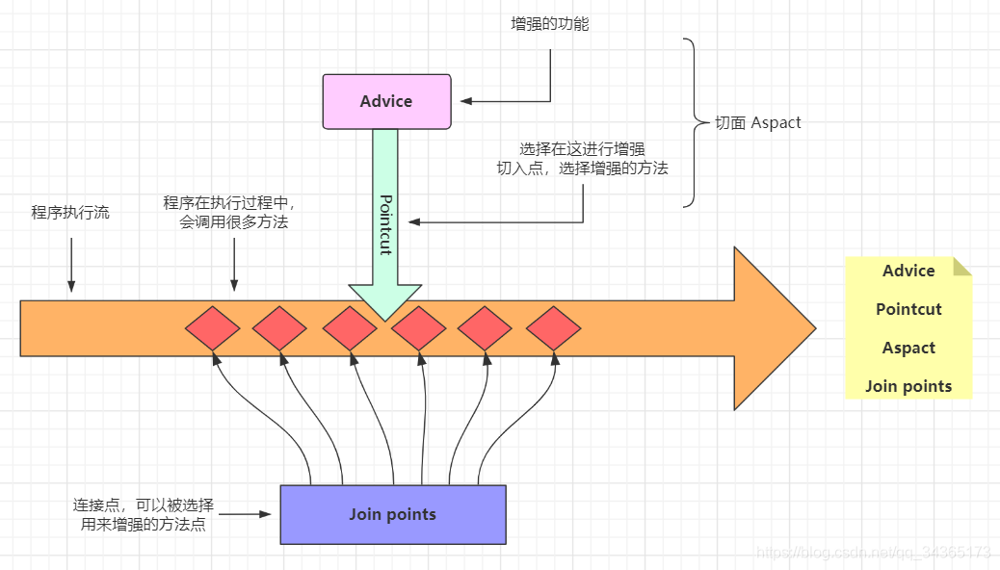
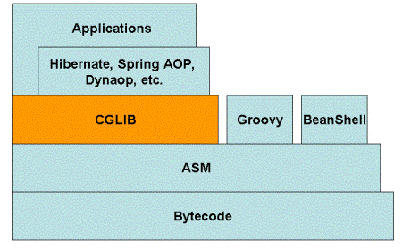

**AOP (Aspect-Oriented Programming)**，即面向切面编程，是一种编程范式，用于在不改变原有业务逻辑代码的情况下，实现某些横切关注点（如日志记录、事务管理、安全控制等）的分离与复用。Spring AOP 是 Spring 框架中的一个核心模块，提供了对 AOP 的支持，允许你使用声明式编程的方式将这些横切关注点添加到你的代码中。Spring AOP 的作用就是将那些与业务无关，但又频繁出现在业务处理中的系统服务，如日志、事务、安全等，以声明式的方式应用到业务处理上，从而实现业务逻辑和系统服务的解耦，提高代码的重用性和可维护性。

其实现方式有 JDK、CGLIB 和 AspectJ。

## 1. AOP 的基本概念

在理解 Spring AOP 之前，需要了解以下几个核心概念：

- **切面 (Aspect)**：切面是横切关注点的**模块**化封装，比如日志切面、事务切面。一个切面可以包含多个增强（advice）和一个或多个切入点（pointcut）。
- **增强 (Advice)**：增强是切面中的**具体动作**。Spring AOP 支持五种类型的增强：
  - 
  - **前置增强 (`@Before`)**：在目标方法执行之前执行；
  - **环绕增强 (`@Around`)**：在目标方法执行前后都可以执行自定义逻辑，并且可以控制目标方法是否执行；
  - **返回增强 (`@AfterReturning`)**：在目标方法成功执行之后执行；
  - **异常增强 (`@AfterThrowing`)**：在目标方法抛出异常时执行；
  - **后置增强 (`@After`)**：在目标方法执行之后执行（无论方法是否成功执行）；
  - 执行顺序：`@Before -> @Aroud前 -> 目标方法 -> @Aroud后 -> @AfterReturning/@AfterThrowing -> @After`
- **连接点 (JoinPoint)**：连接点是指在程序执行过程中**可以插入增强的位置**，比如方法调用、异常抛出等。Spring AOP 只支持方法级别的连接点。
- **切入点 (Pointcut)**：切入点是用来**定义在哪**些连接点上应用增强的表达式。切入点表达式可以基于方法名、方法参数、注解等来匹配。
- **目标对象 (Target Object)**：目标对象是被增强的**方法所在的对象**。增强的功能最终会应用在目标对象上。
- **代理 (Proxy)**：Spring AOP 使用代理模式来创建增强后的目标对象。代理对象是目标对象的替身，通过代理对象的方法调用，会触发相关的切面逻辑。
- **引入 (Introduction)**：引入是指在不修改目标对象的情况下，为其添加新的接口实现。

## 2. Spring AOP 的工作原理

Spring AOP 基于动态代理技术来实现 AOP 功能。Spring AOP 使用两种主要的代理方式：

- **JDK 动态代理**：如果目标对象实现了一个或多个接口，Spring AOP 会使用 JDK 的动态代理来创建代理对象。通过 JDK 动态代理生成的代理对象是目标对象的接口的实现类。

- **CGLIB 代理**：如果目标对象没有实现任何接口，Spring AOP 会使用 CGLIB（Code Generation Library）来生成目标对象的子类作为代理对象。CGLIB 通过生成字节码的方式创建代理对象，这个代理对象是目标类的子类。

#### 代理对象的工作原理

当代理对象的方法被调用时，Spring AOP 会根据切入点表达式判断当前方法是否匹配，如果匹配则执行相应的增强逻辑。

## 3. Spring AOP 的实现方式

Spring AOP 支持通过注解和 XML 配置两种方式来实现 AOP 功能：

### 1. 注解方式

注解方式是 Spring AOP 中最常用的方式，通过使用 `@Aspect` 注解来定义切面，并使用 `@Before`, `@After`, `@Around`, `@AfterReturning`, `@AfterThrowing` 等注解来定义增强。

**示例**：

```java
import org.aspectj.lang.annotation.Aspect;
import org.aspectj.lang.annotation.Before;
import org.springframework.stereotype.Component;

@Aspect
@Component
public class LoggingAspect {

    @Before("execution(* com.example.service.*.*(..))")
    public void logBeforeMethod() {
        System.out.println("Method is about to execute");
    }
}
```

- **`@Aspect`**：标记类为切面。
- **`@Before`**：定义前置增强，`execution(* com.example.service.*.*(..))` 是切入点表达式，表示匹配 `com.example.service` 包下的所有方法。

### 2. XML 配置方式

虽然注解方式更为常见，但 Spring AOP 也支持使用 XML 来配置切面和增强。

**示例**：

```xml
<aop:config>
    <aop:aspect id="loggingAspect" ref="loggingAspectBean">
        <aop:pointcut id="serviceMethod" expression="execution(* com.example.service.*.*(..))"/>
        <aop:before method="logBeforeMethod" pointcut-ref="serviceMethod"/>
    </aop:aspect>
</aop:config>
```

## 4. Spring AOP 的实际应用场景

- **日志记录**：在方法执行前、后或异常时记录日志。
- **事务管理**：在方法执行前开启事务，方法执行后提交事务，遇到异常时回滚事务。
- **权限检查**：在方法执行前检查用户是否有权限执行该操作。
- **缓存**：在方法执行前检查缓存是否有数据，如果有则返回缓存数据，如果没有则执行方法并将结果缓存。

## 5. 其他重要概念

- **引入 (Introduction)**：通过引入可以在现有类中添加新功能或接口的实现。例如，可以为某个类引入一个新的接口，并提供该接口的实现。

- **顺序控制**：可以通过 `@Order` 注解或者实现 `Ordered` 接口来控制切面的执行顺序，值越小的切面优先执行。

## 6. Spring AOP 与 AspectJ

Spring AOP 是基于代理的 AOP 框架，适用于方法级别的拦截，而 AspectJ 是一个功能更为强大的 AOP 框架，允许直接在对象中使用，可以进行编译时增强，支持字段级别的拦截。Spring AOP 是轻量级的，适合大多数常见的企业级应用，而 AspectJ 则适合更复杂、更细粒度的 AOP 场景。注意区别于 JDK 和 CGLIB。


## 7. Spring AOP 的限制

- **仅支持方法级别的拦截**：Spring AOP 只能在方法执行时进行增强，不能对构造函数、字段或类的静态方法进行拦截。
- **基于代理的实现**：Spring AOP 使用代理模式，所以对 final 方法或 final 类不起作用，无法对这些方法或类进行增强。

## 8. 总结

Spring AOP 是一个功能强大且使用广泛的模块，可以帮助开发者以更清晰、可维护的方式处理横切关注点。它使用简单的注解和配置即可完成复杂的逻辑封装，是企业级应用开发中的重要工具。


## 实例分析

```java
@Aspect
class MyAspect {
    @Before("@annotation(anno)")
	public void myMethod(JoinPoint joinPoint, MyAnnotation anno) {}
}
```

### 1. **增强 (Advice)**
- **对应**: `@Before`
- **解释**: 增强定义了在特定连接点执行的操作。在这段代码中，`@Before` 指定了一个前置增强，即在匹配的连接点之前执行的操作。这里的前置增强会在方法执行前触发。

### 2. **连接点 (JoinPoint)**
- **对应**: `joinPoint`
- **解释**: 连接点是程序执行过程中的某个点，在 Spring AOP 中通常是方法的执行。在这段代码中，`JoinPoint joinPoint` 参数代表当前方法的执行点，提供了对目标方法、方法参数、目标对象等信息的访问。

### 3. **切入点 (Pointcut)**
- **对应**: `@annotation(anno)`
- **解释**: 切入点定义了哪些连接点会被增强。在这段代码中，`@annotation(anno)` 是一个切入点表达式，指定了任何带有 `MyAnnotation` 注解的方法作为切入点。因此，这个增强会应用到所有标注了 `MyAnnotation` 注解的方法上。

### 4. **目标对象 (Target Object)**
- **对应**: 通过 `joinPoint.getTarget()` 可以获取到目标对象
- **解释**: 目标对象是包含了被增强方法的对象。在这段代码中，`joinPoint.getTarget()` 可以用来获取当前执行方法所在的对象实例，这个对象就是目标对象。

### 5. **切面 (Aspect)**
- **对应**: 定义该增强方法的类（假设类名为 `MyAspect`）
- **解释**: 切面是增强和切入点的组合，通常表示横切关注点的模块化封装。在这段代码中，包含 `myMethod` 方法的类就是切面，假设类名为 `MyAspect`。

### 总结
根据这段代码的规则：

- **增强 (Advice)**：`@Before` 注解定义的前置增强。
- **连接点 (JoinPoint)**：`joinPoint` 参数，表示程序执行到某个方法的具体点。
- **切入点 (Pointcut)**：`@annotation(anno)` 表达式，指定了哪些方法会被前置增强。
- **目标对象 (Target Object)**：通过 `joinPoint.getTarget()` 获取，表示被增强方法所属的对象。
- **切面 (Aspect)**：`MyAspect`定义了增强方法的类，负责封装横切关注点的逻辑。

## 类型推断 省略写法

在 Spring AOP 中，切入点表达式 `@annotation(annotation)` 用于匹配那些带有特定注解的方法。即使在表达式中没有明确指出注解的类型，Spring AOP 仍然能够正确识别并增强带有该注解的方法，这是因为切入点表达式中的参数类型是在增强方法的参数列表中定义的。

### 具体解析

```java
@Before("@annotation(annotation)")
public void beforeIgnorePermission(JoinPoint joinPoint, MyAnnotation annotation)
```

#### 1. **注解类型的推断**
- **注解类型 (`annotation`)**：在这个例子中，`annotation` 是方法参数 `MyAnnotation annotation` 的名称。Spring AOP 会根据这个参数的类型来推断应该匹配哪些方法。因此，虽然在切入点表达式中没有明确写出 `MyAnnotation` 的类型，但因为增强方法的参数明确了它的类型是 `MyAnnotation`，所以 Spring AOP 知道要匹配所有带有 `MyAnnotation` 注解的方法。

#### 2. **切入点匹配机制**
- **运行时检查**：当 Spring AOP 处理连接点时，它会检查每个方法是否具有与 `MyAnnotation` 类型匹配的注解。如果方法上有 `MyAnnotation` 注解，那么该方法就会被切入点表达式匹配，进而执行对应的增强逻辑。

#### 3. **增强的执行**
- **动态绑定**：当方法被匹配到之后，Spring AOP 会动态地将注解实例注入到增强方法的 `annotation` 参数中，使得增强方法能够访问注解的属性值。

### 示例说明

假设有一个方法：

```java
@MyAnnotation
public void someMethod() {
    // 业务逻辑
}
```

因为 `someMethod` 上有 `MyAnnotation` 注解，且增强方法中的 `annotation` 参数类型也是 `MyAnnotation`，所以这个方法会被`@Before("@annotation(annotation)")` 切入点表达式匹配，进而在方法执行前触发 `beforeIgnorePermission` 增强方法。

### 总结

即使在切入点表达式 `@annotation(annotation)` 中没有明确指定注解的类型，Spring AOP 仍然能够识别并增强那些带有特定类型注解的方法。注解的类型是在增强方法参数的类型中定义的，Spring AOP 会基于这个类型信息来匹配相应的方法。

## 辨析**引入**（Introduction）与**织入**（Weaving）

在 Spring AOP 中，引入（**Introduction**）和织入（**Weaving**）是两个不同的概念，它们代表了面向切面编程中的不同方面。

### 1. **引入（Introduction）**
引入（Introduction），有时也称为**内部增强（Inter-type Declaration）**，是指在不修改现有类的情况下，为该类添加新的属性或方法，或者让其实现新的接口。在 Spring AOP 中，引入通常用于向一个现有的类动态添加新的行为或实现。

#### 举例：
假设有一个类 `Customer`，没有实现某个接口 `VIP`，但通过引入，我们可以在运行时动态地让 `Customer` 实现 `VIP` 接口，并提供对应的方法实现。

**示例**：
```java
public interface VIP {
    void becomeVIP();
}

@Aspect
public class VIPIntroductionAspect {

    @DeclareParents(value = "com.example.Customer+", defaultImpl = DefaultVIPImpl.class)
    public static VIP vip;
}

public class DefaultVIPImpl implements VIP {
    public void becomeVIP() {
        System.out.println("Customer is now a VIP!");
    }
}
```

- **`@DeclareParents`**：用来实现引入。`value` 指定了要增强的类或接口，`defaultImpl` 指定了实现新接口的默认实现类。
- 通过引入，`Customer` 类在运行时可以动态地成为 `VIP`，并可以调用 `becomeVIP()` 方法。

### 2. **织入（Weaving）**
织入（Weaving）是指将切面（Aspect）应用到目标对象的过程。在 AOP 中，织入是将增强代码与目标对象结合在一起的过程，它可以发生在不同的时间点上：
- **编译时（Compile-time Weaving）**：在编译时将切面织入目标类中。这通常需要特殊的编译器，如 AspectJ 编译器。
- **类加载时（Load-time Weaving）**：在目标类被加载到 JVM 时织入切面。这需要使用特殊的类加载器。
- **运行时（Runtime Weaving）**：在应用程序运行时动态地将切面织入目标对象中。Spring AOP 使用动态代理或 CGLIB 代理来实现运行时织入。

### 3. **总结**
- **引入（Introduction）**：是一种特殊的增强类型，允许为现有的类动态地添加新方法或实现新接口。
- **织入（Weaving）**：是将切面与目标对象结合在一起的过程，是 AOP 实现的核心机制。

因此，引入和织入是两个不同的概念。在 Spring AOP 中，引入是实现某种增强（特别是添加新行为）的手段，而织入是将任何增强（包括引入）应用到目标对象的过程。

## 切面的顺序


Spring 提供了如下两种解决方案指定不同切面类里的增强处理的优先级： 

1. 让切面类实现`Ordered`接口：实现该接口的`getOrder()`方法，该方法返回值越小，优先级越高；
2. 直接使用`@Order`注解来修饰一个切面类：使用这个注解时可以配置一个`int`类型的`value`属性，该属性值越小，优先级越高；

同一个切面类里的两个相同类型的增强处理在同一个连接点被织入时，Spring AOP 将以随机的顺序来织入这两个增强处理，没有办法指定它们的织入顺序。即使给这两个 Advice 添加了`@Order`这个注解也不行

## 动态代理

Spring 对 `@Configuration` 注解的类默认使用 CGLIB 动态代理。

对于带有 `@Service`、`@Component`、`@Repository` 等注解的类，Spring 默认不会对它们进行动态代理，除非这些类需要通过其他方式进行增强（如切面、事务等）。

类似于 `@Service`，`@Controller` 也不会直接触发 CGLIB 代理。Spring MVC 框架管理控制器的生命周期和请求处理逻辑，它不会为 `@Controller` 代理类生成 CGLIB 代理，除非涉及 AOP 功能。

**@Transactional**、**@Cacheable**、**@Async** 等注解：这些注解会触发 AOP 增强。当某个类或方法使用这些注解时，Spring 通常会为该类或方法创建代理对象。Spring 首先会尝试使用 **JDK 动态代理**，如果该类没有实现接口，则会使用 **CGLIB** 代理。

如果在配置中启用了强制使用 CGLIB 代理，Spring 将无论类是否实现接口，都使用 CGLIB 进行代理。

```java
@EnableAspectJAutoProxy(proxyTargetClass = true)
```


代理模式，可以在代理对象的方法前后添加功能（增强）：


[什么鬼？弃用JDK动态代理，Spring5 默认使用 CGLIB 了？](https://mp.weixin.qq.com/s/JaBJh44ZCDvqWoxp61y3Zw)

1. Spring 5.x 中 AOP 默认依旧使用 JDK 动态代理；
2. Spring Boot 2.x 开始，为了解决使用 JDK 动态代理可能导致的类型转化异常而默认使用 CGLIB，JDK 只能自动注入接口，不能自动注入实现类；
3. 在 Spring Boot 2.x 中，如果需要默认使用 JDK 动态代理可以通过配置项`spring.aop.proxy-target-class=false`来进行修改，默认为`true`，`@EnableAspectJAutoProxy`中的`proxyTargetClass`配置已无效；
4. CGLIB 生成子类，JDK 实现接口，前者性能更好。


### JDK

JDK 自带的动态代理

-  java.lang.reflect.Proxy:生成动态代理类和对象；
-  java.lang.reflect.InvocationHandler（处理器接口）：可以通过invoke方法实现

对真实角色的代理访问。

每次通过 Proxy 生成的代理类对象都要指定对应的处理器对象。

接口：Subject.java

```java
public interface Subject {
    public int sellBooks();

    public String speak();
}
```

真实对象：RealSubject.java

```java
public class RealSubject implements Subject{
    @Override
    public int sellBooks() {
        System.out.println("卖书");
        return 1 ;
    }

    @Override
    public String speak() {
        System.out.println("说话");
        return "张三";
    }
}
```

处理器对象：MyInvocationHandler.java

```java
/**
 * 定义一个处理器
 */
public class MyInvocationHandler implements InvocationHandler {
    /**
     * 因为需要处理真实角色，所以要把真实角色传进来
     */
    Subject realSubject;

    public MyInvocationHandler(Subject realSubject) {
        this.realSubject = realSubject;
    }

    /**
     *
     * @param proxy    代理类
     * @param method    正在调用的方法
     * @param args      方法的参数
     * @return
     * @throws Throwable
     */
    @Override
    public Object invoke(Object proxy, Method method, Object[] args) throws Throwable {
        System.out.println("调用代理类");
        if(method.getName().equals("sellBooks")){
            int invoke = (int)method.invoke(realSubject, args);
            System.out.println("调用的是卖书的方法");
            return invoke ;
        }else {
            String string = (String) method.invoke(realSubject,args) ;
            System.out.println("调用的是说话的方法");
            return  string ;
        }
    }
}
```

调用端：Main.java

```java
/**
 * 调用类
 */
public class Client {
    public static void main(String[] args) {
        // 真实对象
        Subject realSubject =  new RealSubject();

        MyInvocationHandler myInvocationHandler = new MyInvocationHandler(realSubject);
        // 代理对象
        Subject proxyClass = (Subject) Proxy.newProxyInstance(ClassLoader.getSystemClassLoader(), new Class[]{Subject.class}, myInvocationHandler);

        proxyClass.sellBooks();

        proxyClass.speak();
    }
}
```

### CGLIB

CGLIB 动态代理是针对代理的类, 动态生成一个子类, 然后子类覆盖代理类中的方法, 如果是 private 或是 final 类修饰的方法,则不会被重写。同样，`@Transactional`注解只能应用在 public 方法上，如果应用在 protected、private 或 default 方法上，它不会报错，但是也不会有任何效果。

CGLIB 是一个功能强大，高性能的代码生成包。它为没有实现接口的类提供代理，为 JDK 的动态代理提供了很好的补充。通常可以使用 Java 的动态代理创建代理，但当要代理的类没有实现接口或者为了更好的性能，CGLIB 是一个好的选择。

CGLIB 作为一个开源项目，其代码托管在 GitHub，地址为：https://github.com/cglib/cglib



CGLIB 底层使用了 ASM（一个短小精悍的字节码操作框架）来操作字节码生成新的类。除了 CGLIB 库外，脚本语言（如 Groovy 和 BeanShell）也使用 ASM 生成字节码。ASM 使用类似 SAX 的解析器来实现高性能。我们不鼓励直接使用 ASM，因为它需要对 Java 字节码的格式足够的了解。

需要代理的类:

```java
public class Engineer {
    // 可以被代理
    public void eat() {
        System.out.println("工程师正在吃饭");
    }

    // final 方法不会被生成的字类覆盖
    public final void work() {
        System.out.println("工程师正在工作");
    }

    // private 方法不会被生成的字类覆盖
    private void play() {
        System.out.println("this engineer is playing game");
    }
}
```

CGLIB 代理类:

```java
public class CglibProxy implements MethodInterceptor {
    private Object target;

    public CglibProxy(Object target) {
        this.target = target;
    }

    @Override
    public Object intercept(Object o, Method method, Object[] objects, MethodProxy methodProxy) throws Throwable {
        System.out.println("###   before invocation");
        Object result = method.invoke(target, objects);
        System.out.println("###   end invocation");
        return result;
    }

    public static Object getProxy(Object target) {
        Enhancer enhancer = new Enhancer();
        // 设置需要代理的对象
        enhancer.setSuperclass(target.getClass());
        // 设置代理人
        enhancer.setCallback(new CglibProxy(target));
        return enhancer.create();
    }
}
```

测试方法:

```java
public class CglibMainTest {
    public static void main(String[] args) {
        // 生成 Cglib 代理类
        Engineer engineerProxy = (Engineer) CglibProxy.getProxy(new Engineer());
        // 调用相关方法
        engineerProxy.eat();
    }
}
```

运行结果:

```
###   before invocation
工程师正在吃饭
###   end invocation
```