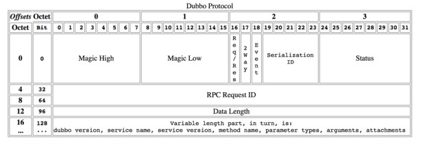

# Spring Cloud Alibaba


|                    | 非 Alibaba                   | Alibaba         |
| ------------------ | ---------------------------- | --------------- |
| 网关               | Zuul 2, Spring Cloud Gateway | Higress         |
| 负载均衡           | Ribbon                       | 内部集成 Ribbon |
| Restful API        | Feign (HTTP)                 | Dubbo (RPC)     |
| 微服务             | Spring Cloud                 | Dubbo (RPC)     |
| 异步调用，消息队列 | RabbitMQ, Kafka              | RocketMQ        |
| 控制面，注册中心   | Eureka, Consul, Zookeeper    | Nacos           |
| 可观测             | Zipkin                       | Skywalking      |
| 限流降级熔断       | Hystrix                      | Sentinel        |
| 分布式事务         |                              | Seata           |
| 流量控制           | Spring Cloud Gateway         | Dubbo, Sentinel |
| 配置中心           | Spring Cloud Config          | Nacos           |

Nacos = Eureka + Spring Cloud Config

[Spring Boot 与 Spring Cloud 与 Spring Cloud Alibaba 各组件版本号对应关系](https://github.com/alibaba/spring-cloud-alibaba/wiki/%E7%89%88%E6%9C%AC%E8%AF%B4%E6%98%8E#%E7%BB%84%E4%BB%B6%E7%89%88%E6%9C%AC%E5%85%B3%E7%B3%BB)

2022.x 分支

适配 Spring Boot 3.0，Spring Cloud 2022.x 版本及以上的 Spring Cloud Alibaba 版本按从新到旧排列如下表（最新版本用*标记）： *(注意，该分支 Spring Cloud Alibaba 版本命名方式进行了调整，未来将对应 Spring Cloud 版本，前三位为 Spring Cloud 版本，最后一位为扩展版本，比如适配 Spring Cloud 2022.0.0 版本对应的 Spring Cloud Alibaba 第一个版本为：2022.0.0.0，第个二版本为：2022.0.0.1，依此类推)*

| Spring Cloud Alibaba Version | Spring Cloud Version  | Spring Boot Version |
| ---------------------------- | --------------------- | ------------------- |
| 2022.0.0.0*                  | Spring Cloud 2022.0.0 | 3.0.2               |
| 2022.0.0.0-RC2               | Spring Cloud 2022.0.0 | 3.0.2               |
| 2022.0.0.0-RC1               | Spring Cloud 2022.0.0 | 3.0.0               |

2021.x 分支

适配 Spring Boot 2.4，Spring Cloud 2021.x 版本及以上的 Spring Cloud Alibaba 版本按从新到旧排列如下表（最新版本用*标记）：

| Spring Cloud Alibaba Version | Spring Cloud Version  | Spring Boot Version |
| ---------------------------- | --------------------- | ------------------- |
| 2021.0.5.0*                  | Spring Cloud 2021.0.5 | 2.6.13              |
| 2021.0.4.0                   | Spring Cloud 2021.0.4 | 2.6.11              |
| 2021.0.1.0                   | Spring Cloud 2021.0.1 | 2.6.3               |
| 2021.1                       | Spring Cloud 2020.0.1 | 2.4.2               |

组件版本关系

每个 Spring Cloud Alibaba 版本及其自身所适配的各组件对应版本如下表所示（注意，Spring Cloud Dubbo 从 2021.0.1.0 起已被移除出主干，不再随主干演进）：

| Spring Cloud Alibaba Version                              | Sentinel Version | Nacos Version | RocketMQ Version | Dubbo Version | Seata Version    |
| --------------------------------------------------------- | ---------------- | ------------- | ---------------- | ------------- | ---------------- |
| 2022.0.0.0                                                | 1.8.6            | 2.2.1         | 4.9.4            | ~             | 1.7.0            |
| 2022.0.0.0-RC2                                            | 1.8.6            | 2.2.1         | 4.9.4            | ~             | 1.7.0-native-rc2 |
| 2021.0.5.0                                                | 1.8.6            | 2.2.0         | 4.9.4            | ~             | 1.6.1            |
| 2.2.10-RC1                                                | 1.8.6            | 2.2.0         | 4.9.4            | ~             | 1.6.1            |
| 2022.0.0.0-RC1                                            | 1.8.6            | 2.2.1-RC      | 4.9.4            | ~             | 1.6.1            |
| 2.2.9.RELEASE                                             | 1.8.5            | 2.1.0         | 4.9.4            | ~             | 1.5.2            |
| 2021.0.4.0                                                | 1.8.5            | 2.0.4         | 4.9.4            | ~             | 1.5.2            |
| 2.2.8.RELEASE                                             | 1.8.4            | 2.1.0         | 4.9.3            | ~             | 1.5.1            |
| 2021.0.1.0                                                | 1.8.3            | 1.4.2         | 4.9.2            | ~             | 1.4.2            |
| 2.2.7.RELEASE                                             | 1.8.1            | 2.0.3         | 4.6.1            | 2.7.13        | 1.3.0            |
| 2.2.6.RELEASE                                             | 1.8.1            | 1.4.2         | 4.4.0            | 2.7.8         | 1.3.0            |
| 2021.1 or 2.2.5.RELEASE or 2.1.4.RELEASE or 2.0.4.RELEASE | 1.8.0            | 1.4.1         | 4.4.0            | 2.7.8         | 1.3.0            |

# RestTemplate

# Eureka

Netflix注册中心


注册中心引入：

```xml
<dependency>
    <groupId>org.springframework.cloud</groupId>
    <artifactId>spring-cloud-starter-netflix-eureka-server</artifactId>
</dependency>
```

注册中心配置：

```yaml
server:
  port: 8081
eureka:
  instance:
    hostname: localhost
  client:
    # 是否需要获取服务信息 因为自己是注册中心server所以为false
    fetch-registry: false
    # 是否需要将自己注册到注册中心(注册中心集群需要设置为true) 因为自己是注册中心server所以为false
    register-with-eureka: false
    # 配置eureka注册中心地址
    service-url:
      defaultZone: http://localhost:8081/eureka/
```

客户端引入：

```xml
<dependency>
    <groupId>org.springframework.cloud</groupId>
    <artifactId>spring-cloud-starter-netflix-eureka-client</artifactId>
</dependency>
```

客户端配置：

```yaml
server:
  port: 8082
eureka:
  instance:
    hostname: localhost
  client:
    # 是否需要获取服务信息
    fetch-registry: true
    # 是否需要将自己注册到注册中心(注册中心集群需要设置为true)
    register-with-eureka: true
    # 配置eureka注册中心地址
    service-url:
      defaultZone: http://localhost:8081/eureka/
```

## 自我保护机制

Eureka的自我保护机制主要是为了防止在网络分区故障（网络不稳定）的情况下，Eureka Server和Eureka Client之间的通信出现问题，而导致的服务注册信息错误删除。

在分布式系统中，网络故障是常有的事情，Eureka Server在短时间内丢失过多的客户端心跳时，会进入自我保护模式。在该模式下，Eureka Server会保护注册表中的信息，不再注销任何微服务，当网络故障恢复后，Eureka Server会自动退出保护模式。这样可以避免因为网络问题，导致服务实例被错误地从注册表中删除，从而使得其他服务无法找到该服务实例。

自我保护模式可以让集群更加健壮，但是我们在开发测试阶段，需要频繁地重启发布，如果触发了保护机制，则旧的服务实例没有被删除，这时请求有可能跑到旧的实例中，而该实例已经关闭了，这就会导致请求错误，影响开发测试。所以在实际使用过程中，我们需要根据具体情况来配置Eureka的自我保护机制。

```properties
# 关闭自我保护机制
eureka.server.enable-self-preservation=false
# 设置Eureka Server清理无效节点的时间间隔，单位为毫秒。默认值为60000，即60秒
eureka.server.eviction-interval-timer-in-ms=60000
# Eureka客户端向服务端发送心跳的时间间隔，单位为秒。默认值为30秒
eureka.instance.lease-renewal-interval-in-seconds=30
# Eureka服务端在收到最后一次心跳后等待时间的上限，单位为秒。默认值为90秒，超时将剔除服务
eureka.instance.lease-expiration-duration-in-seconds=90
```


# Nacos

Alibaba **注册中心（默认 AP 可切换 CP） + 配置管理（CP）**


nacos/conf/application.properties 配置文件：

开启数据库模式，关闭则需要全部注释掉：

```properties
### Count of DB:
db.num=1

### Connect URL of DB:
db.url.0=jdbc:mysql://127.0.0.1:3306/nacos?characterEncoding=utf8&connectTimeout=1000&socketTimeout=3000&autoReconnect=true&useUnicode=true&useSSL=false&serverTimezone=GMT%2B8
db.user.0=root
db.password.0=123456
```

开启管理权限认证：

```properties
nacos.core.auth.enabled=true
nacos.core.auth.plugin.nacos.token.secret.key=VGhpc0lzTXlDdXN0b21TZWNyZXRLZXkwMTIzNDU2Nzg
```

启动命令：

```shell
./nacos/bin/startup.cmd -m standalone
```


application.yml 作用域在于当前应用有效，bootstrap.yml 系统级别的配置有效（一般采用远程配置的时候才会用到）。

通过配置`spring.profiles.active`参数，可以达到根据 profile 拉取配置的目的。bootstrap-dev.properties 配置如下：

```properties
spring.application.name=app
spring.cloud.nacos.config.server-addr=localhost:8848
spring.cloud.nacos.config.file-extension=yml
```

之所以需要配置`spring.application.name`，是因为它是构成 Nacos 配置管理`dataId`字段的一部分。在 Nacos 中，`dataId`的完整格式是这样的：

```pro
${prefix}-${spring.profiles.active}.${file-extension}
```

其中，`prefix` 默认为 `spring.application.name` 的值，当然，也可以通过配置项 `spring.cloud.nacos.config.prefix`来配置。而`spring.profiles.active` 即为当前环境对应的 profile。优先级为：远程 app-profile.yml > 远程 app.yml > 本地 app.yml。

注意：当`spring.profiles.active`为空时，对应的连接符`-`也将不存在，dataId 的拼接格式变成`${prefix}.${file-extension}`的形式 。`file-exetension`为配置内容的数据格式，可以通过配置项`spring.cloud.nacos.config.file-extension`来配置，目前只支持 properties 和 yaml 类型。

共享配置（shared-configs）和扩展配置（extension-config）：

- Nacos在配置路径`spring.cloud.nacos.config.extension-config`下，允许我们指定⼀个或多个额外配置。
- Nacos在配置路径`spring.cloud.nacos.config.shared-configs`下，允许我们指定⼀个或多个共享配置。

上述两类配置都⽀持三个属性：`data-id`、`group`（默认为字符串`DEFAULT_GROUP`)、`refresh`（默认为`true`)：

- data-id : Data Id。
- group：自定义 Data Id 所在的组，不明确配置的话，默认是 DEFAULT_GROUP。
- refresh: 控制该 Data Id 在配置变更时，是否支持应用中可动态刷新， 感知到最新的配置值。默认是不支持的。

依赖：

```xml
<!--用于获取nacos配置管理->配置列表下配置文件中的内容-->
<dependency>
    <groupId>com.alibaba.cloud</groupId>
    <artifactId>spring-cloud-starter-alibaba-nacos-config</artifactId>
</dependency>

<!--用于服务注册，将想要注册的服务注册到nacos中，被naocs发现-->
<dependency>
    <groupId>com.alibaba.cloud</groupId>
    <artifactId>spring-cloud-starter-alibaba-nacos-discovery</artifactId>
</dependency>
```

配置示例：

```yaml
spring:
 application:
   name: ddd-demo-service
 cloud:
   nacos:
     username: nacos-usr
     password: nacos-pwd
     # 配置
     config:
       server-addr: nacos-2.nacos-headless.public.svc.cluster.local:8848
       namespace: ygjpro-test2
       file-extension: yml
       group: ddd-demo
       ......
       shared-configs[3]:
         data-id: mysql.yaml
         refresh: true
       ......
       extension-configs[3]:
         data-id: mysql.yaml
         group: ddd-demo
         refresh: true
      # 注册发现
      discovery:
        id: ddd-demo-service
        group: ddd-demo-group
      	server-addr: nacos-2.nacos-headless.public.svc.cluster.local:8848
      	secure: true # 可以将gateway中route的协议设为https
```

优先级：

- 上述两类配置都是数组，对同种配置，数组元素对应的下标越⼤，优先级越⾼。也就是排在后⾯的相同配置，将覆盖排在前⾯的同名配置：
  - 同为扩展配置，存在如下优先级关系：`extension-configs[3] > extension-configs[2] > extension-configs[1] > extension-configs[0]`。
  - 同为共享配置，存在如下优先级关系：`shared-configs[3] > shared-configs[2] > shared-configs[1] > shared-configs[0]`。
- 不同种类配置之间，优先级按顺序如下：主配置 > 扩展配置（extension-configs）> 共享配置（shared-configs）。

---

Nacos 支持IP黑白名单的配置来控制注册访问的权限。

在 Nacos 的配置文件（`application.properties`或`application.yml`）中，可以添加以下配置项来配置 IP 黑白名单：

1. 白名单配置：

   ```
   nacos.security.allowed-ips=127.0.0.1,192.168.1.100
   ```

   以上配置将只允许 IP 为 127.0.0.1 和 192.168.1.100 的请求进行注册和访问。

2. 黑名单配置：

   ```
   nacos.security.blocked-ips=192.168.1.200,192.168.1.201
   ```

   以上配置将禁止 IP 为 192.168.1.200 和 192.168.1.201 的请求进行注册和访问。

你可以根据项目的需求，在 Nacos 的配置文件中添加相应的配置项来实现IP黑白名单的控制。需要注意的是，配置文件中的 IP 应按照逗号分隔，并且支持 IPv4 和 IPv6 地址。


## 对比 Eureka

CAP：

**CAP 原则**又称 **CAP 定理**，指的是在一个分布式系统中， **Consistency**（一致性）、 **Availability**（可用性）、**Partition tolerance**（分区容错性），三者不可得兼。

> CAP原则，也称为**CAP定理**，是由计算机科学家Eric Brewer在2000年提出的一个关于分布式系统的基本定理。CAP定理描述了分布式系统在设计和实现时必须面临的三种特性，分别是：
>
> 1. **Consistency（一致性）：**
>    一致性指的是所有节点在同一时间看到的数据是一致的，即每次读取操作都会返回最新的、成功写入的数据。这意味着如果某个数据已经被更新，所有客户端在读取该数据时都应该得到更新后的值。
> 2. **Availability（可用性）：**
>    可用性是指每个请求（无论读还是写）都能在有限的时间内获得响应，无论响应是成功还是失败。换句话说，系统要保证每个请求都能被处理，即使有些节点失效，系统仍然要保持部分功能可用。
> 3. **Partition Tolerance（分区容错性）：**
>    分区容错性指的是系统能够应对网络分区的情况，网络分区是指系统中节点之间的通信出现了延迟或失败，导致节点之间无法正常通信。在分布式系统中，网络分区是不可避免的，因此系统必须能够在部分节点之间无法通信的情况下继续运行。
>
> **CAP定理的核心：**
> CAP定理指出，对于一个分布式系统来说，无法同时完全满足一致性、可用性和分区容错性这三个特性，最多只能同时满足其中的两个。
>
> - **CA (Consistency + Availability，弱可用性)：** 在没有网络分区的情况下，系统可以保证数据一致性和可用性，但一旦发生网络分区，系统可能无法继续工作。
> - **CP (Consistency + Partition Tolerance，强一致性，差可用性)：** 系统在网络分区的情况下仍然能保证一致性，但可能会牺牲可用性（某些请求可能无法得到响应）。
> - **AP (Availability + Partition Tolerance，高可用性和最终一致性)：** 系统在网络分区时依然保持可用性，但可能无法保证数据一致性（不同节点读取的数据可能不一致）。
>
> **示例：**
>
> - **CA系统：** 适合在**局域网**中使用，没有网络分区的情况，保证数据一致且高可用。
> - **CP系统：** 比如分布式数据库（如HBase），在网络分区发生时优先保证数据的一致性，例如：zookeeper，银行转账。
> - **AP系统：** 比如DNS系统，它优先保证高可用性，即使不同节点的数据暂时不一致。
>
> 在实际的分布式系统设计中，设计者通常需要在CAP之间做出权衡，具体取决于应用场景和需求。


- Eureka 只支持 AP；

- Consul 只支持 CP；

- Nacos 支持 CP 和 AP 两种：Nacos 是根据配置识别 CP 或 AP 模式，如果注册 Nacos 的 client 节点注册时是`ephemeral=true`即为临时节点，那么 Naocs 集群对这个 client 节点效果就是 AP，反之则是 CP，即不是临时节点：

  ```properties
  # false为永久实例，true表示临时实例开启，注册为临时实例，默认为true
  spring.cloud.nacos.discovery.ephemeral=true
  ```
  > ephemeral
  >
  > *adj.* 短暂的，瞬间的

  Nacos 是可以在 AP 模式和 CP 模式之间进行切换的，默认为 AP：

  ```shell
  curl -X PUT "http://localhost:8848/nacos/v1/ns/operator/switches?entry=serverMode&value=CP"
  ```

连接方式：

- Eureka 是使用定时发送和服务进行联系，属于**短连接**；
- Nacos 使用的是 Netty 和服务直接进行连接，属于**长连接**；

服务异常剔除：

- Eureka Client 在默认情况每隔 30 秒向 Eureka Server 发送一次心跳，当 Eureka Server 在默认连续 90 秒的情况下没有收到心跳，会把 Eureka Client 从注册表中剔除，再由 Eureka Server 60 秒的清除间隔，把 Eureka Client 给下线：

  ```java
  // EurekaInstanceConfigBean
  private int leaseRenewalIntervalInSeconds = 30; //心跳间隔30s
  private int leaseExpirationDurationInSeconds = 90; //默认90s没有收到心跳从注册表中剔除
  
  // EurekaServerConfigBean
  private long evictionIntervalTimerInMs = 60000L; //异常服务剔除下线时间间隔
  ```

  也就是在极端情况下 Eureka Server 从异常到剔除在到完全不接受请求可能需要 30sec + 90sec + 60sec = 3min 左右（还是未考虑 Ribbon 缓存情况下）；

- Nacos Client 通过**心跳上报**方式告诉 Nacos 注册中心健康状态，默认心跳间隔 5 秒，Nacos 会在超过 15 秒未收到心跳后将实例设置为不健康状态，可以正常接收到请求超过 30 秒 Nacos 将实例删除，不会再接收请求；

操作实例方式：

- Nacos 提供了 Nacos Console 可视化控制话界面，可以对实例列表进行监听，对实例进行上下线,权重的配置，并且 Config Server 提供了对服务实例提供配置中心，且可以对配置进行 CRUD，版本管理；
- Eureka 仅提供了实例列表，实例状态，错误信息，相比于 Nacos 过于简单；

自我保护机制：

- 相同点：保护阈值都是个比例，0 - 1 范围，表示健康的实例占全部实例的比例；

- 不同点：

  - 保护方式不同：

    - Eureka：当在短时间内，统计续约失败的比例，如果达到一定阈值，则会触发自我保护的机制，在该机制下，Eureka Server 不会剔除任何的微服务，等到正常后，再退出自我保护机制。

      ```properties
      # 启用或禁用自我保护模式
      eureka.server.enable-self-preservation=true
      # 自我保护模式的续约阈值比例
      eureka.server.renewal-percent-threshold=0.85
      ```

    - Nacos：当域名健康实例（Instance）占总服务实例的比例小于阈值时（默认 0.95），无论实例是否健康，都会将这个实例返回给客户端。这样做虽然损失了一部分流量，但是保证了集群的剩余健康实例能正常工作。

      ```properties
      # 自我保护模式的触发阈值
      server.protect.threshold=0.85
      ```
  
  - 范围不同：
  
    - Nacos 的阈值是针对某个具体 Service 的，而不是针对所有服务的；
    - Eureka 的自我保护阈值是针对所有服务的。


# Consul

https://zhuanlan.zhihu.com/p/486049646

由HashiCorp开源的，使用Go语言开发。

## 对比 Eureka 和 Nacos

一致性：Consul 强一致性（CP）

- 服务注册相比 Eureka 会稍慢一些。因为 Consul 的 Raft 协议要求必须**过半数**的节点都写入成功才认 为注册成功；
- Leader 挂掉时，重新选举期间整个 consul 不可用。保证了强一致性但牺牲了可用性。

Eureka 保证高可用和最终一致性（AP）

- 服务注册相对要快，因为不需要等注册信息 replicate 到其他节点，也不保证注册信息是否 replicate 成功；
- 当数据出现不一致时，虽然 A，B 上的注册信息不完全相同，但每个 Eureka 节点依然能够正常对外提供服务，这会出现查询服务信息时如果请求 A 查不到，但请求 B 就能查到。如此保证了可用性但牺牲了一致性。

Nacos 保证高可用和最终一致性（AP）

- Nacos通过集群部署和故障转移机制确保服务的持续可用，即使部分节点宕机，系统仍然能够正常工作；
- 服务注册和心跳机制：Nacos在多节点集群中，服务实例的注册信息可能需要一段时间在各个节点之间同步。在这种情况下，短时间内不同的节点可能会有不一致的服务信息（如某个服务实例已经下线，但部分节点还未同步到该状态）；
- 数据传播延迟：Nacos的集群节点之间通过异步复制的方式传播服务信息，确保最终一致性。也就是说，虽然在某些时间点上，节点之间可能存在数据不一致，但通过这种异步的同步机制，系统中的服务注册信息最终会在所有节点之间达成一致；
- Raft协议在配置管理中的强一致性：虽然Nacos在服务发现中主要采用最终一致性模型，但在配置管理模块中，Nacos使用了**Raft一致性算法**，保证配置更新的强一致性。通过Raft协议，Nacos能够确保配置的更新在多数节点达成一致后才会生效。这意味着在Nacos的配置管理部分，它是支持**强一致性**的，而在服务注册与发现部分，则是**最终一致性**。

# Ribbon

引入：

```xml
<dependency>
    <groupId>org.springframework.boot</groupId>
    <artifactId>spring-boot-starter-web</artifactId>
</dependency>

<dependency>
    <groupId>org.springframework.cloud</groupId>
    <artifactId>spring-cloud-starter-netflix-eureka-client</artifactId>
</dependency>

<dependency>
    <groupId>com.netflix.ribbon</groupId>
    <artifactId>ribbon-loadbalancer</artifactId>
</dependency>

<dependency>
    <groupId>org.springframework.cloud</groupId>
    <artifactId>spring-cloud-netflix-ribbon</artifactId>
</dependency>

<dependency>
    <groupId>com.netflix.ribbon</groupId>
    <artifactId>ribbon-core</artifactId>
</dependency>
```

配置方法

## 负责均衡规则


1. RoundRobinRule：轮询策略。Ribbon默认采用的策略，若经过一轮轮询没有找到可用的服务提供者，其最多轮询10轮，若最终还没有找到，则返回NULL。
2. RandomRule：随机策略。从所有可用的服务提供者中**随机选择**一个。
3. RetryRule：重试策略。先按照RoundRobinRule策略获取服务提供者，如果获取失败，则在**指定的时限内重试**。默认的时限为500毫秒。
4. BestAvailableRule：最低并发策略。先**过滤掉**由于多次访问故障而处于断路器**跳闸状态**的服务提供者，然后选择一个**并发量最小**的服务提供者。
5. AvailabilityFilteringRule：可用过滤策略。先**过滤掉非健康**的服务提供者，然后再选择**并发量较小**的服务提供者。
6. WeightedResponseTimeRule：响应时间加权策略。根据每个服务提供者的**平均响应时间计算权重**，响应时间越短，权重越大，被选中的概率越高。当刚启动时，采用RoundRobinRule策略，等统计信息足够时，切换到WeightedResponseTimeRule策略。
7. ZoneAvoidanceRule：区域权衡策略。综合判断服务提供者的所在**区域的性能和服务的可用性**，选择最佳的服务提供者。如果没有区域信息，则退化为轮询策略。

以上策略可以根据具体的业务场景和需求进行选择和配置。例如，如果服务提供者的性能差异不大，可以采用轮询或随机策略；如果希望优先选择性能较好的服务提供者，可以采用响应时间加权策略；如果服务提供者分布在不同的区域，可以考虑采用区域权衡策略等。


## 使用

@RibbonClient

RestTemplate 构建并发送 Http 请求。

# Feign


Feign 封装了 Ribbon 和 Hystrix；

Ribbon 封装了 RestTemplate；

RestTemplate 封装了 Http 请求。


## 使用

`Feign.build`不能搭配`SpringMvcContract`+`@RequestMapping`。

第一种使用方式：`SpringMvcConstract`+`@FeignClient`+`@RequestMapping`。

OpenFeign 在使用`@FeignClient`的情况下，使用的是 SpringMvcContract，它使得被`@FeignClient`修饰的接口，可以使用`@GetMapping`和`@PostMapping`等 Spring Mvc 注解。如果没有单独配置，则会使用 FeignClientsConfiguration 中默认配置的 SpringMvcContract。

1. 引入依赖：

   ```xml
   <dependency>
       <groupId>org.springframework.cloud</groupId>
       <artifactId>spring-cloud-starter-netflix-eureka-client</artifactId>
   </dependency>
   
   <dependency>
       <groupId>org.springframework.cloud</groupId>
       <artifactId>spring-cloud-starter-openfeign</artifactId>
   </dependency>
   
   <dependency>
       <groupId>io.github.openfeign</groupId>
       <artifactId>feign-jackson</artifactId>
   </dependency>
   ```

2. 配置文件中注册自己：

   ```yml
   server:
     port: 8085
   spring:
     application:
       name: my-feign
   eureka:
     instance:
       hostname: localhost
     client:
       #是否需要获取服务信息
       fetch-registry: true
       #是否需要将自己注册到注册中心(注册中心集群需要设置为true)
       register-with-eureka: true
       #配置eureka服务器地址
       service-url:
         defaultZone: http://${eureka.instance.hostname}:8081/eureka/
   ```

3. 启动类：

   ```java
   @SpringBootApplication
   @EnableFeignClients
   public class FeignApplication {
       public static void main(String[] args) {
           SpringApplication.run(FeignApplication.class, args);
       }
   }
   ```

4. 创建配置类：

   ```java
   @Configuration // 全局设置，如果不希望全局设置则需要在启动类中排除该类
   public class MyFeignConfig {
       @Bean
       public Contract feignContract() {
           // 默认协议不用配置
           return new SpringMvcContract();
       }
   }
   ```

5. ⭐创建接口（最佳实践）：

   

   创建接口：

   ```java
   public interface UserApi {
       @GetMapping("/user/get")
       User get(@RequestParam("name") String name);
   }
   ```
   
   消费者**继承**接口，`path`值会添加到请求方法路径之前，可以与父接口合并，因为该注解不继承，不会影响到父接口的实现类：
   
   ```java
   @FeignClient(name="eureka-client", path = "/", configuration=MyFeignConfig.class) // Feign 集成 Ribbon 客户端负载均衡，只是一个声明式的伪客户端
   public interface UserClient extends UserApi {}
   ```
   
6. 生产者（**另一个 module**）**实现**接口：

   ```java
   @RestController // 必须是含有 @Controller 的注解
   @RequestMapping("/")
   public class UserService implements UserApi {
       @Override
       public User get(String name) {
           User user = new User();
           user.setName(name);
           return user;
       }
   }
   ```

7. 消费者使用接口：

   ```java
   @RequiredArgsConstructor
   @RestController
   @RequestMapping("/")
   public class UserController {
       private final UserClient client;
   
       @GetMapping("/user/get")
       public User get(@RequestParam("name") String name) {
           return client.get(name);
       }
   }
   ```

总结：`FeignClient.get(@RequestParam String name) -> Api.get(String name) -> @GetMapping() -> @RestController -> @GetMapping() -> Service.get(@RequestParam String name)`

---

第二种使用方式：`Contract.Default`+`Feign.Build`+`@RequestLine`。

如果我们要使用`@RequestLine`，则需要替换 Open Feign 的 **Contract（MVC解析器）**。BaseContract 的`processAnnotationOnMethod`方法，只会处理@Body、@RequestLine和@Header 3个注解，如果不是的话，会直接跳过：

- 针对`@RequestLIne`：
  获取`@RequstLine`的`value`，使用正则表达式判断值是否是“GET xxxx”这类的形式，不是就报错。解析到之后，获得方法和 uri 设置进 RequestTemplate 中；
- 针对`@Body`：
  将`@Body`中的`value`塞到 RequestTemplate 的 body 中；
- 针对`@Headers`：
  获取`@Header`中的`value`，进行解析，并放入 RequestTemplate 的 Header 中；

1. 引入依赖（同上）；

2. 配置文件（同上）；

3. 启动类（同上）；

4. 创建配置类：

   ```java
   @Configuration // 全局设置，如果不希望全局设置则需要在启动类中排除该类
   public class MyFeignConfig {
       @Bean
       public Contract feignContract() {
           // 如果 @FeignClient 搭配 @RequestLine，则必须使用 Feign 默认合约，此时不能使用 @RequestMapping
           return new Contract.Default();
       }
   }
   ```

5. 根据服务端请求方法创建客户端接口：

   ```java
   // 服务端
   @RestController
   @RequestMapping("/")
   public class UserService {
       @GetMapping({"/user/get", "/client/user/get"})
       public User get(@QueryMap User user) {
           return user;
       }
   }
   
   // 接口
   public interface UserApi {
       @RequestLine("GET /user/get")
       User get(@QueryMap User user);
   }
   ```

   当配置类中配置了`Contract.Default()`时，接口请求方法必须搭配`@RequestLine`，不能使用`@RequestMapping`，否则会报错：

   ```
   Warnings:
   - Class UserFeign has annotations [FeignClient] that are not used by contract Default
   - Method get has an annotation GetMapping that is not used by contract Default
   ```

   反之，当接口请求方法注解了`@RequestLine`时，配置类中必须配置`Contract.Default()`，否则会报错：

   ```
   Caused by: java.lang.IllegalStateException: Method UserClient#get(User) not annotated with HTTP method type (ex. GET, POST)
   ```

6. 创建客户端并调用接口：

   ```java
   @RequiredArgsConstructor
   @RestController
   @RequestMapping("/")
   public class UserController {
       @GetMapping("/user/get")
       public User get(@RequestParam String name) {
           User req = new User();
           req.setName(name);
           UserApi client = Feign
               	.builder()
   	            .decoder(new JacksonDecoder())
                   .logger(new Logger.ErrorLogger())
                   .logLevel(Logger.Level.FULL)
                   .target(UserApi.class, "http://localhost:8082");
           User res = client.get(req);
           return res;
       }
   }
   ```

   访问`http://localhost:8085/user/get?name=John`打印输出，其中 8085 为客户端，8082 为服务端：

   ```
   [UserApi#get] ---> GET http://localhost:8082/user/get?name=John HTTP/1.1
   [UserApi#get] ---> END HTTP (0-byte body)
   [UserApi#get] <--- HTTP/1.1 200 (211ms)
   [UserApi#get] connection: keep-alive
   [UserApi#get] content-type: application/json
   [UserApi#get] date: Thu, 26 Oct 2023 07:15:15 GMT
   [UserApi#get] keep-alive: timeout=60
   [UserApi#get] transfer-encoding: chunked
   [UserApi#get] 
   [UserApi#get] {"name":"John","age":10}
   [UserApi#get] <--- END HTTP (24-byte body)
   ```

​		**注意`Feign.builder()`无法实现负载均衡**

总结：

- GET：`client -> Api.get(String name) -> @RequestLine("GET /get?name={name}") -> @RestController("/") -> @GetMapping("/get") -> Service.get(@RequestParam String name)`
- GET：`client -> Api.get(String name) -> @RequestLine("GET /get/{name}") -> @RestController("/") -> @GetMapping("/get/{name}") -> Service.get(@PathVariable("name") String name)`
- @QueryMap：`client -> Api.get(@QueryMap User user) -> @RequestLine("GET /get") -> @RestController("/") -> @GetMapping("/get") -> Service.get(@QueryMap User user)`
- POST：`client -> Api.post(User user) -> @RequestLine("POST /post") -> @RestController("/") -> PostMapping("/post") -> Service.post(@RequestBody User user)`

---

第三种使用方式：`Contract.Default`+`@FeignClient`+`@RequestMapping`。

1. 引入依赖（同上）；

2. 配置文件（同上）；

3. 启动类（同上）；

4. 创建配置类（同上）；

5. 根据服务端请求方法创建客户端接口（同上）；

6. 实现`UserApi`接口：

   ```java
   // 客户端实现接口
   @FeignClient(name = "eureka-client", path = "/client", configuration = MyFeignConfig.class)
   public interface UserClient extends UserApi {}
   ```

7. 客户端调用接口：

   ```java
   @RequiredArgsConstructor
   @RestController
   @RequestMapping("/")
   public class UserController {
       private final UserClient client;
       
       @GetMapping("/client/user/get")
       public User clientGet(@RequestParam(required = false) String name) {
           User user = new User();
           user.setName(name);
           return client.get(user);
       }
   }
   ```

总结：`FeignClient.get(String name) -> Api.get(String name) -> @RequestLine("GET /get/{name}") -> @RestController("/") -> @GetMapping("/get") -> Service.get(@RequestParam String name)`

---

## 搭配 Nacos

只需要修改依赖和配置文件，并启动 Nacos 注册中心。

1. pom.xml 去掉 Eureka 改为 Nacos：

   ```xml
   <dependency>
       <groupId>com.alibaba.cloud</groupId>
       <artifactId>spring-cloud-starter-alibaba-nacos-discovery</artifactId>
   </dependency>
   
   <dependency>
       <groupId>org.springframework.cloud</groupId>
       <artifactId>spring-cloud-starter-openfeign</artifactId>
   </dependency>
   
   <dependency>
       <groupId>io.github.openfeign</groupId>
       <artifactId>feign-jackson</artifactId>
   </dependency>
   ```

2. application.yml 去掉 eureka 改为 spring.cloud：

   生产者：

   ```yaml
   spring:
     application:
       name: feign-provider
     cloud:
       nacos:
         discovery:
           server-addr: localhost:8848
   ```

   消费者：

   ```yaml
   spring:
     application:
       name: feign-consumer
     cloud:
       nacos:
         discovery:
           server-addr: localhost:8848
   ```

3. 启动 Nacos 并启动生产者和消费者应用服务

   ```shell
   .\startup.cmd -m standalone
   ```

4. 如果 Nacos 作为配置中心需要额外添加依赖和 bootstrap.yml 配置文件：

   ```xml
   <dependency>
       <groupId>org.springframework.cloud</groupId>
       <artifactId>spring-cloud-starter-bootstrap</artifactId>
   </dependency>
   
   <dependency>
       <groupId>com.alibaba.cloud</groupId>
       <artifactId>spring-cloud-starter-alibaba-nacos-config</artifactId>
   </dependency>
   ```

   新建 bootstrap.yml

   ```yaml
   spring:
     cloud:
       nacos:
         config:
         	name: feign-provider # nacos 里的配置文件名，默认为 spring.application.name
           server-addr: localhost:8848
           file-extension: yml
   ```

5. 在 Nacos 控制中心页面添加配置或者命令行添加配置（需要进行 URL 编码）：

   ```shell
   curl -X POST "http://127.0.0.1:8848/nacos/v1/cs/configs?dataId=feign-provider.yml&group=DEFAULT_GROUP&content=server%3A%0A%20%20port%3A%208094"
   ```

6. 重新启动生产者和消费者应用服务

---

## 降级

在前文的基础上引入负责熔断降级的依赖：

```xml
<dependency>
    <groupId>org.springframework.cloud</groupId>
    <artifactId>spring-cloud-starter-netflix-hystrix</artifactId>
</dependency>
```

在配置文件中开启：

```yaml
feign:
  circuitbreaker:
    enabled: true # 原 hystrix 熔断
```

FallbackClass：

```java
@Component
public class UserClientFallback implements UserClient {
    @Override
    public User get(User user) {
        user.setAge(-2);
        return user;
    }
}
```

或者 FallbackFactory：

```java
@Component
public class UserClientFallbackFactory implements FallbackFactory<UserClient> {
    @Override
    public UserClient create(Throwable cause) {
        return new UserClient() {
            @Override
            public User get(User user) {
                System.out.println(cause.getMessage());
                user.setAge(-3);
                return user;
            }
        };
    }
}
```

注解中指定降级类：

```java
@FeignClient(
        name = "eureka-client",
        fallback = UserClientFallback.class,
        fallbackFactory = UserClientFallbackFactory.class,
        path = "/client") // Feign 集成 Ribbon 客户端负载均衡，只是一个声明式的伪客户端
public interface UserClient extends UserApi {}
```

优先级：fallback > fallbackFactory，但是后者可以传入异常。

---

## 原生注解

Feign 原生注解与`@RequestMapping`作用相反，前者是将参数的值拼接到 uri 路径地址，而后者是将 uri 路径地址中的值映射到参数。

| 注解           | 位置         | 作用                                                         |
| :------------- | :----------- | :----------------------------------------------------------- |
| `@RequestLine` | METHOD       | 为请求定义 HttpMethod 和 UriTemplate。 花括号`{expression}`中的值使用其相应的带`@Param`注解的参数解析。 |
| `@Param`       | PARAMETER    | 定义一个模板变量，其值将用于解析相应的表达式模板，通过作为注解值提供的名称。如果缺少值，它将尝试从字节码方法参数名称中获取名称（如果代码是用`-parameters`标志编译的）。 |
| `@Headers`     | METHOD, TYPE | 定义一个 HeaderTemplate。使用带`@Param`注释的值来解析相应的 Expressions。在 Type 上使用时，模板将应用于每个请求。 |
| `@QueryMap`    | PARAMETER    | 范围定义一个 Map 名称键值对或 POJO，以扩展为查询字符串。     |
| `@HeaderMap`   | PARAMETER    | 范围定义一个 Map 名称键值对，扩展为 HttpHeaders。            |
| `@Body`        | METHOD       | 定义 Template，类似于 UriTemplateand、 HeaderTemplate，它使用带`@Param`注释的值来解析相应的 Expressions。 |

`@QueryMap` vs. `@SpringQueryMap`：

OpenFeign 注解`@QueryMap`支持将 POJO 对象用作 GET 的 map 参数。但很不幸，该 OpenFeign 缺省注解跟 Spring 不兼容，因为它缺少一个属性`value`。但是 Spring Cloud OpenFeign 提供了一个功能上等价的注解`@SpringQueryMap `，使用该注解，可以将一个 POJO 或者 Map 作为一个请求参数 Query Parameter Map（Spring Cloud 2.1.x 及之后）。

虽然有了`@SpringQueryMap`，但如果使用了含有继承关系的 model，如`XXXReq extends BaseReq`，Feign只能将`XXXReq`中参数放在 url 中，`BaseReq`中的内容丢失。在 Feign 10.3.0 中解决。Spring Cloud OpenFeign 2.1.4 版本升级到 Feign 10.4.0，修复该问题。


# Dubbo


目前版本的 dubbo 已经支持 dubbo、rest、rmi、hessian、http、webservice、thrift、memcached、redis 等 10 种传输协议了，并且还支持同一个服务同时定义多种协议，例如配置`protocol={"dubbo", "rest"}`则该服务同时支持 dubbo 与 rest 两种传输协议。


## Dubbo 协议

https://blog.csdn.net/Facial_Mask/article/details/132378418




## 对比 Feign


|     实现框架     |          Provider           |             Consumer              |
| :--------------: | :-------------------------: | :-------------------------------: |
|      Feign       |         @Controller         |           @FeignClient            |
|      Dubbo       |        @DubboService        |          @DubboReference          |
| Dubbo 改造 Feign | @Controller + @DubboService | @FeignClient + @DubboTransported⭐ |

*@RestController 也属于 @Controller*

[微服务中远程调用 Dubbo 与 Feign 对比](https://www.cnblogs.com/ying-z/p/14781757.html)：

> Dubbo支持更多功能、更灵活、支持高并发的RPC框架。
>
> SpringCloud全家桶里面（Feign、Ribbon、Hystrix），特点是非常方便。Ribbon、Hystrix、Feign在服务治理中，配合Spring Cloud做微服务，使用上有很多优势，社区也比较活跃，看将来更新发展。
>
> 业务发展影响着架构的选型，当服务数量不是很大时，使用普通的分布式RPC架构即可，当服务数量增长到一定数据，需要进行服务治理时，就需要考虑使用流式计算架构。Dubbo可以方便的做更精细化的流量调度，服务结构治理的方案成熟，适合生产上使用，虽然Dubbo是尘封后重新开启，但这并不影响其技术价值。
>
> 如果项目对性能要求不是很严格，可以选择使用Feign，它使用起来更方便。
>
> 如果需要提高性能，避开基于Http方式的性能瓶颈，可以使用Dubbo。
>
> Dubbo Spring Cloud的出现，使得Dubbo既能够完全整合到Spring Cloud的技术栈中，享受Spring Cloud生态中的技术支持和标准化输出，又能够弥补Spring Cloud中服务治理这方面的短板。

## 注意事项

推荐在配置类中通过`@Bean`和`@DubboReference`在方法上注入，不要在字段或者 setter 方法上注入。

>  It is recommended to use @DubboReference on the @Bean method in the Java-config class, but not on the fields or setter methods to be injected.

使用 Dubbo 的时候需要注意返回的值需要序列化，如果是字符串，配置字符串序列化方式，如果是对象，那么需要把对象实现序列化接口。

关于扫描包的问题，在使用 Spring、Spring MVC、Mybatis 开发的时候，如果配置 Spring MVC 扫描器的时候，如果是客户端，那么需要先把 Dubbo 的包扫描放在上面，然后再把 Spring MVC 的包扫描放在下面即可，不然会出现注册的 Service 的 Bean 为 null，详细代码如下：

    <!-- 配置Dubbo应用的名称 -->
    <dubbo:application name="resource"/>
    
    <!-- 配置注册中心地址 -->
    <dubbo:registry address="zookeeper://192.168.1.101:2181"/>
    
    <!-- 配置Dubbo的包扫描-->
    <dubbo:annotation package="com.resource.controller"/>
    
    <!-- SpringMVC的Controller层的包扫描-->
    <context:component-scan base-package="com.resource.controller" />
发布的服务的接口类路径要客户端接口的类路径必须一致，不然也会访问不到，例如：服务接口 AService 的类路径是 com.xxx.service，那么客户端的 AService 的类路径也必须为 com.xxx.service，并且这两个类里面的结构和组成还必须一模一样。

## 服务注册原理

@DubboService 可以直接注册到 IOC 容器中：


## 过滤器 Filter

内置过滤器：

```properties
cache=org.apache.dubbo.cache.filter.CacheFilter
validation=org.apache.dubbo.validation.filter.ValidationFilter
metrics-provider=org.apache.dubbo.metrics.filter.MetricsProviderFilter
observationreceiver=org.apache.dubbo.metrics.observation.ObservationReceiverFilter

monitor=org.apache.dubbo.monitor.support.MonitorFilter
callback-consumer-context=org.apache.dubbo.monitor.support.CallbackConsumerContextFilter

metrics=org.apache.dubbo.monitor.dubbo.MetricsFilter

consumersign=org.apache.dubbo.auth.filter.ConsumerSignFilter
providerauth=org.apache.dubbo.auth.filter.ProviderAuthFilter
authenticationResolver=org.apache.dubbo.spring.security.filter.ContextHolderAuthenticationResolverFilter
authenticationExceptionTranslator=org.apache.dubbo.spring.security.filter.AuthenticationExceptionTranslatorFilter

echo=org.apache.dubbo.rpc.filter.EchoFilter
generic=org.apache.dubbo.rpc.filter.GenericFilter
genericimpl=org.apache.dubbo.rpc.filter.GenericImplFilter
token=org.apache.dubbo.rpc.filter.TokenFilter
accesslog=org.apache.dubbo.rpc.filter.AccessLogFilter
classloader=org.apache.dubbo.rpc.filter.ClassLoaderFilter
classloader-callback=org.apache.dubbo.rpc.filter.ClassLoaderCallbackFilter
context=org.apache.dubbo.rpc.filter.ContextFilter
exception=org.apache.dubbo.rpc.filter.ExceptionFilter
executelimit=org.apache.dubbo.rpc.filter.ExecuteLimitFilter
deprecated=org.apache.dubbo.rpc.filter.DeprecatedFilter
compatible=org.apache.dubbo.rpc.filter.CompatibleFilter
timeout=org.apache.dubbo.rpc.filter.TimeoutFilter
tps=org.apache.dubbo.rpc.filter.TpsLimitFilter
profiler-server=org.apache.dubbo.rpc.filter.ProfilerServerFilter
adaptiveLoadBalance=org.apache.dubbo.rpc.filter.AdaptiveLoadBalanceFilter
active-limit=org.apache.dubbo.rpc.filter.ActiveLimitFilter
rpc-exception=org.apache.dubbo.rpc.filter.RpcExceptionFilter

trace=org.apache.dubbo.rpc.protocol.dubbo.filter.TraceFilter
```


## 扩展点

例如配置系列化器的流程：

META-INF/dubbo/internal/org.apache.dubbo.rpc.model.ScopeModelInitializer → ScopeModelInitializer → SecurityScopeModelInitializer → ObjectMapperCodecCustomer → ObjectMapperCodecCustomerImpl

## 整合 Spring Cloud Gateway


Dubbo 仪表板：

```powershell
mvn --projects dubbo-admin-server spring-boot:run "-Dspring-boot.run.arguments=`"--admin.registry.address=nacos://127.0.0.1:8848?group=IC-TESTING-PROCESSING-MANAGEMENT&namespace=public&username=nacos&password=nacos,--admin.config-center=nacos://127.0.0.1:8848?group=IC-TESTING-PROCESSING-MANAGEMENT&username=nacos&password=nacos`"" 
```

# Spring Cloud Gateway

Spring Cloud Gateway 是 Spring Cloud 的一个全新项目，该项目是基于 Spring 5.0，Spring Boot 2.0 和 Project Reactor 等响应式编程和事件流技术开发的网关，它旨在为微服务架构提供一种简单有效的统一的 API 路由管理方式。

Spring Cloud Gateway 作为 Spring Cloud 生态系统中的网关，目标是替代 Netflix Zuul，其不仅提供统一的路由方式，并且基于 Filter 链的方式提供了网关基本的功能，例如：安全、监控/埋点、限流等。

它是基于WebFlux框架实现的，而 WebFlux 框架底层则使用了高性能的 Reactor 模式通信框架 **Netty**。Spring Cloud Gateway 的性能比 Zuul 更加优秀，从测试结果来看，Spring Cloud Gateway 的 RPS 是 Zuul 的 1.6 倍。


核心功能：

- 请求路由（负载均衡）：一切请求都必须先经过gateway，但网关不处理业务，而是根据某种规则，把请求转发到某个微服务，这个过程叫做路由。当然路由的目标服务有多个时，还需要做负载均衡；
- 权限控制：网关作为微服务入口，需要校验用户是是否有请求资格，如果没有则进行拦截；
- 限流：当请求流量过高时，在网关中按照下流的微服务能够接受的速度来放行请求，避免服务压力过大。

使用步骤：

1. 引入：

   ```xml
   <dependency>
       <groupId>org.springframework.cloud</groupId>
       <artifactId>spring-cloud-starter-netflix-eureka-client</artifactId>
   </dependency>
   
   <dependency>
       <groupId>org.springframework.cloud</groupId>
       <artifactId>spring-cloud-starter-gateway</artifactId>
       <exclusions>
           <exclusion>
               <groupId>org.springframework.cloud</groupId>
               <artifactId>spring-cloud-gateway-server</artifactId>
           </exclusion>
       </exclusions>
   </dependency>
   
   <dependency>
       <groupId>org.springframework.cloud</groupId>
       <artifactId>spring-cloud-gateway-server</artifactId>
   </dependency>
   ```

2. 启动类：

   ```java
   @SpringBootApplication
   public class GatewayApplication {
   	public static void main(String[] args) {
   		SpringApplication.run(GatewayApplication.class, args);
   	}
   }
   ```

3. 配置文件：

   ```yaml
   server:
     port: 10010 # 网关端口
   spring:
     application:
       name: gateway # 服务名称
     cloud:
       gateway:
         discovery:
           locator:
             enabled: true # 开启从注册中心动态创建路由的功能，区别于显式配置的routes，默认配置了一个根据serviceId进行rewrite的filter，相当于每个predicates中额外自带一个path
             lower-case-service-id: true # 使用小写服务名，默认是大写
             url-expression: "'lb://'+serviceId" # 生成uri的表达式
         
         routes: # 网关路由配置
           - id: user-service # 路由id，自定义，只要唯一即可
             # http 和 lb 两种目标地址
             uri: http://127.0.0.1:8081 # 路由的目标地址 http就是固定地址
             uri: lb://user-service # 路由的目标地址 lb就是负载均衡，后面跟服务名称
             uri: lb:https://user-service # 显示指定地址的协议，https也可由nacos的secure设置，默认为http
             predicates: # 路由断言，也就是判断请求是否符合路由规则的条件，不能为空
               - Path=/user/** # 这个是按照路径匹配，只要以/user/开头就符合要求
             filters:
             	- StripPrefix=1 # 去除前缀 此处去除 Path 中的 /user
             order: -1 # 数字越小优先级越高
         
         globalcors: # 全局的跨域处理
           add-to-simple-url-handler-mapping: true # 解决options请求被拦截问题
           cors-configurations:
             '[/**]':
               allowed-origins: # 允许哪些网站的跨域请求 
                 - "https://192.168.81.1:10010"
                 - "http://192.168.81.1:10010"
               allowed-methods: "*" # 允许的跨域ajax的请求方式
               allowed-headers: "*" # 允许在请求中携带的头信息
               allow-credentials: true # 是否允许携带cookie
               maxAge: 360000 # 跨域检测的有效期
   ```

## 动态路由

通过 Nacos 实时修改并发布：Spring Cloud Gateway 启动时，就将 yml 配置文件中的路由配置和规则加载到内存里，使用`InMemoryRouteDefinitionRepository`来管理。但是上线的项目一般都无法做到不重启网关，就可以添加或删除一个新的路由配置和规则。于是这是 Nacos 就可以出场了，来担任次任务。当我们需要添加或删除一个新的路由配置和规则，我们直接通过 Nacos 配置中心下发添加或者删除路由的功能，网关监听配置的更改，就可以轻松实现在不重启网关的情况下，实现动态路由管理。

## 断言 Predicate

[匹配规则分类](https://blog.csdn.net/Ahri_J/article/details/105666936)

- 基于权重的匹配
- 基于时间的匹配
- 基于请求的匹配
  - Path
  - Header
  - Cookie
  - Method
  - Host
  - Query


## 过滤器 Filter


### 默认过滤器

- AddRequestHeader：添加请求头参数，参数和值直接使用都会分隔。
- AddRequestParameter：添加请求表单参数，多个参数需要有多个过滤器。
- AddResponseHeader：添加响应头参数。
- CircuitBreaker：实现熔断时使用，支持 CircuitBreaker 和 Hystrix 两种。
- DedupeResponseHeader：对指定响应头去重复。
- FallbackHeaders：可以添加降级时的异常信息。
- PrefixPath：匹配所有前缀满足条件的 URI。
- RequestRateLimiter：限流过滤器。
- RedirectTO：重定向。有两个参数，status 和 url。其中 status 应该 300 系列重定向状态码。
- RemoveRequestHeader：删除请求头参数。
- RemoveResponseHeader：删除响应头参数。
- RemoveRequestParameter：删除请求参数。
- RewritePath：重新请求路径。
- RewriteResponseHeader：重写响应头参数。
- SaveSession：如果项目中使用 Spring Security 和 Spring Session 整合时，此属性特别重要。
- SecureHeaders：具有权限验证时，建议的头信息内容。
- SetPath：功能和StripPrefix有点类似。语法更贴近 Restful。
- SetRequestHeader：替换请求头参数，不是添加。同名替换，不同名设值。
- SetResponseHeader：替换响应头参数。
- SetStatus：设置响应状态码。
- StripPrefix：跳过路由uri中前几段后发送给下游。
- Retry：设置重试次数。
- RequestSize：请求最大大小。包含 maxSize 参数，可以有单位“KB”或者“MB”默认为“B”。
- ModifyRequestBody：修改请求体内容。
- ModifyResponseBody：修改响应体。

### 路由过滤器

### 全局过滤器

### 自定义过滤器

两种自定义过滤器：

```java
@Configuration
public class CustomGlobalFilter implements GlobalFilter, Ordered {
    @Override
    public Mono<Void> filter(ServerWebExchange exchange, GatewayFilterChain chain) {
        // 校验请求参数
        if (exchange.getRequest().getQueryParams().get("username") != null) {
        	// 放行
            return chain.filter(exchange);
        }
        // 拒绝
        return exchange.getResponse().setComplete();
    }
 
    @Override
    public int getOrder() {
        return -1;
    }
}

@Order(-1)
@Component
public class AuthorizeFilter implements GlobalFilter {
    @Override
    public Mono<Void> filter(ServerWebExchange exchange, GatewayFilterChain chain) {
        // 获取全部参数
        MultiValueMap<String, String> params = exchange.getRequest().getQueryParams();
        // 获取授权
        String auth = params.getFirst("authorization");
        // 校验授权
        if ("admin".equals(auth)) {
            // 放行
            return chain.filter(exchange);
        }
        // 设置状态码
        exchange.getResponse().setStatusCode(HttpStatus.FORBIDDEN);
        // 拒绝
        return exchange.getResponse().setComplete();
    }
}
```

## CORS

## 原理

RouteToRequestUrlFilter

ReactiveLoadBalancerClientFilter

# Zuul

Spring Cloud Zuul 是一个 API 网关，它能够作为系统的统一入口，处理所有的外部请求。Zuul 支持请求路由、过滤、限流等功能，可以有效地保护后端服务。

1. 项目背景
   Zuul是由Netflix公司开发的一个微服务网关，而Gateway则是Spring Cloud生态中的一部分。尽管Zuul可以独立使用，但Spring Cloud将其集成在Spring-Cloud-starter-Netflix-Zuul中，使得开发人员可以更方便地在Spring Cloud应用程序中使用Zuul。
2. API设计
   Zuul使用的是**阻塞式的API，不支持长连接，例如Websockets**。底层基于Servlet，处理的是HTTP请求。由于没有提供异步支持，流控等功能由Hystrix提供。相比之下，Gateway基于非阻塞的API设计，支持长连接和Websockets等。在底层，Gateway使用Netty作为其底层环境，与传统的Servlet容器不兼容，也不能打包成WAR包。
3. 异步支持
   **Zuul仅支持同步请求，而Gateway则支持异步请求。**在微服务架构中，异步请求可以提高系统的吞吐量，但并不能保证更好的性能。最终性能还需要通过严密的压测来决定。
4. 性能和稳定性
   理论上，由于Gateway的设计更加现代和高效，它可能更适合提高系统吞吐量。然而，关于两者在实际应用中的性能和稳定性表现，还需要根据具体的用例和环境进行评估。
5. 框架设计的角度
   从框架设计的角度来看，Gateway具有更好的扩展性。它已经发布了2.0.0的RELEASE版本，稳定性也非常好。此外，由于Gateway基于Spring Boot和Spring Webflux，它与Spring生态系统的集成更加紧密，可以更好地利用Spring提供的各种功能和工具。
6. 总结
   综上所述，Zuul和Gateway都是优秀的微服务网关解决方案，各自具有独特的特点和优势。开发人员可以根据实际需求选择适合的方案。如果需要一个稳定、成熟的解决方案，并且已经使用Spring生态系统，那么Gateway可能是一个更好的选择。如果需要一个更加灵活、可定制的解决方案，并且对异步请求有较高的需求，那么Zuul可能更适合。无论选择哪种方案，都需要在实际应用中进行充分的测试和评估，以确保其满足项目的需求。

# Actuator

监控应用服务运行状态

1. 引入：

   ```xml
   <dependency>
       <groupId>org.springframework.boot</groupId>
       <artifactId>spring-boot-starter-actuator</artifactId>
   </dependency>
   ```

2. 配置文件：

   ```yaml
   server:
     port: 8080
   management:
     endpoints:
       web:
         exposure:
           include: "*"
         base-path: /actuator
   ```

3. 直接访问：`http://localhost:8080/actuator`

[配置详情](https://blog.csdn.net/GXL_1012/article/details/126411408)

| Endpoints        | 描述                                                         |
| ---------------- | ------------------------------------------------------------ |
| auditevents      | 公开当前应用程序的审核事件信息。                             |
| beans            | 显示应用程序中所有 Spring bean 的完整列表。                  |
| caches           | 暴露可用的缓存。                                             |
| conditions       | 显示在配置和自动配置类上评估的条件以及它们匹配或不匹配的原因。 |
| configprops      | 显示所有的整理列表`@ConfigurationProperties`，查看配置属性，包括默认配置。 |
| env              | 露出 Spring 的属性的各种环境变量，后面可跟`/{name}`查看具体的值。 |
| flyway           | 显示已应用的任何 Flyway 数据库迁移。                         |
| health           | 显示应用健康信息，2.0 以后需要在配置里`show-details`打开开关。 |
| httptrace        | 显示 HTTP 跟踪信息，2.0 以后需要手动打开。                   |
| info             | 显示任意应用信息，是在配置文件里自己定义的。                 |
| integrationgraph | 显示 Spring Integration 图。                                 |
| loggers          | 显示和修改应用程序中记录器的配置。                           |
| liquibase        | 显示已应用的任何 Liquibase 数据库迁移。                      |
| metrics          | 显示指标信息，比如内存用量和 HTTP 请求计数,后可跟`/{name}`查看具体值。 |
| mappings         | 显示所有`@RequestMapping`路径的整理列表。                    |
| scheduledtasks   | 显示应用程序中的计划任务。                                   |
| sessions         | 允许从 Spring Session 支持的会话存储中检索和删除用户会话。   |
| shutdown         | 允许应用程序正常关闭。                                       |
| threaddump       | 执行线程转储。                                               |

# Hystrix

https://zhuanlan.zhihu.com/p/131570695


设计原则：

- 防止任何单个依赖项耗尽所有容器（如 Tomcat）用户线程。
- 甩掉包袱，快速失败而不是排队。
- 在任何可行的地方提供回退，以保护用户不受失败的影响。
- 使用隔离技术（如隔离板、泳道和断路器模式）来限制任何一个依赖项的影响。
- 通过近实时的度量、监视和警报来优化发现时间。
- 通过配置的低延迟传播来优化恢复时间。
- 支持对 Hystrix 的大多数方面的动态属性更改，允许使用低延迟反馈循环进行实时操作修改。
- 避免在整个依赖客户端执行中出现故障，而不仅仅是在网络流量中。

`@EnableHystrix`和`@EnableCircuitBreaker`：

- 相同：都是 Spring Cloud 中用于开启 Hystrix 断路器的注解，都是在 Spring Boot 应用程序的主类上使用的；

- 区别：

  - `@EnableHystrix`会自动配置 Hystrix，并将其添加到应用程序的类路径中。它还允许在应用程序中使用`@HystrixCommand`注解来标记需要使用 Hystrix 的方法；

  - `@EnableCircuitBreaker`不仅支持 Hystrix，还其他断路器实现，例如 Resilience4j。它会自动配置断路器，并将其添加到应用程序的类路径中。它还允许在应用程序中使用`@CircuitBreaker`注解来标记需要使用断路器的方法。**在 Hystrix 2.2.10 版本中`@EnableCircuitBreaker`注解已经被淘汰了。**

1. 引入：

   ```xml
   <dependency>
       <groupId>org.springframework.cloud</groupId>
       <artifactId>spring-cloud-starter-netflix-hystrix</artifactId>
       <version>2.2.10.RELEASE</version>
   </dependency>
   
   <!--可视化仪表板-->
   <dependency>
       <groupId>org.springframework.cloud</groupId>
       <artifactId>spring-cloud-starter-netflix-hystrix-dashboard</artifactId>
       <version>2.2.10.RELEASE</version>
   </dependency>
   ```

2. 配置文件（此处省略 eureka 注册等相关配置）：

   ```yaml
   # 监控相关属性
   management:
     endpoints:
       web:
         exposure:
           include: hystrix.stream # 开放 hystrix 监控访问的端口
     endpoint:
       hystrix:
         stream:
           enabled: true
   # 设置 dashboard 配置
   hystrix:
     dashboard:
       proxy-stream-allow-list: localhost # 设置允许代理的地址
   ```

3. 启动类：

   ```java
   @SpringBootApplication
   @EnableHystrix // 开启熔断
   @EnableHystrixDashboard // 开启熔断监控
   public class HystrixDemoApplication {
       public static void main(String[] args) {
           SpringApplication.run(HystrixDemoApplication.class, args);
       }
   }
   ```

4. 注解需要熔断的方法，并提供降级后的方法。注意要求 fallbackMethod 方法和目标方法**必须在同一个类中，具有相同的参数**（异常参数可选）：

   ```java
   private UserAPI userAPI;
   
   // 某个可能会出错的方法
   @HystrixCommand(fallbackMethod = "fallback")
   public User get(String name) {
       return userAPI.get(name);
   }
   
   private User fallback(String name) {
       return new User(name, -1);
   }
   ```

6. 监控：

   - Actuator 监控：`http://localhost:8085/actuator/hystrix.stream`；
   
   - Hystrix 监控（单服务监控）：`http://localhost:8085/hystrix`中输入上述 Actuator 的监控路径并点击 Monitor Stream 按钮，实现被前者代理；
   
     
   
     
   
   - Turbine 监控（集群监控）：集成 Turbine（见下文）后，`http://localhost:8085/hystrix`中输入`http://localhost:8087/turbine.stream`。

`@HystrixCommand`的`commandProperties `可配置的`@HystrixProperty`参数一览：

- `CIRCUIT_BREAKER_ENABLED`/`circuitBreaker.enabled`：是否开启熔断策略，默认值为`true`。
- `CIRCUIT_BREAKER_REQUEST_VOLUME_THRESHOLD`/`circuitBreaker.requestVolumeThreshold`：单位时间内（默认 10 秒内），请求超时数超出则触发熔断策略，默认值为 20 次请求数。 
- `EXECUTION_ISOLATION_THREAD_TIMEOUT_IN_MILLISECONDS`/`execution.isolation.thread.timeoutInMilliseconds`：设置单位时间，判断`circuitBreaker.requestVolumeThreshold`的时间单位，默认 10 秒，单位毫秒。 
- `CIRCUIT_BREAKER_SLEEP_WINDOW_IN_MILLISECONDS`/`circuitBreaker.sleepWindowInMilliseconds`：当熔断策略开启后，延迟多久尝试再次请求远程服务。默认为 5 秒。单位毫秒。这5秒直接执行 fallback 方法，不在请求远程 Application Service。
- `CIRCUIT_BREAKER_ERROR_THRESHOLD_PERCENTAGE`/`circuitBreaker.errorThresholdPercentage`：单位时间内，出现错误的请求百分比达到限制，则触发熔断策略，默认为 50%。 
- `CIRCUIT_BREAKER_FORCE_OPEN`/`circuitBreaker.forceOpen`：是否强制开启熔断策略，即所有请求都返回 fallback 托底数据，默认为`false`。 
- `CIRCUIT_BREAKER_FORCE_CLOSED`/`circuitBreaker.forceClosed`：是否强制关闭熔断策略，即所有请求一定调用远程服务，默认为`false`。

# Turbine

Hystrix Dashboard 是一款针对 Hystrix 进行实时监控的工具，通过 Hystrix Dashboard 我们可以在直观地看到各 Hystrix Command 的请求响应时间，请求成功率等数据。但是只使用 Hystrix Dashboard 的话，你只能看到单个应用内的服务信息，这明显不够。我们需要一个工具能让我们**汇总系统内多个服务的数据并显示**到 Hystrix Dashboard 上，这个工具就是 Turbine。

1. 引入：

   ```xml
   <dependency>
       <groupId>org.springframework.cloud</groupId>
       <artifactId>spring-cloud-starter-netflix-hystrix-dashboard</artifactId>
       <version>2.2.10.RELEASE</version>
   </dependency>
   
   <dependency>
       <groupId>org.springframework.cloud</groupId>
       <artifactId>spring-cloud-starter-netflix-turbine</artifactId>
       <version>2.2.10.RELEASE</version>
   </dependency>
   ```

2. 配置文件：

   ```yaml
   # 配置 turbine
   turbine:
     combine-host-port: true
     cluster-name-expression: "'default'"
     aggregator:
       cluster-config: default
     app-config: feign-demo,turbine-demo # 需要使用turbine进行监控的微服务名称，多个采用逗号隔开
   
   # 设置 dashboard 配置
   hystrix:
     dashboard:
       proxy-stream-allow-list: localhost # 设置允许代理的地址
   ```

3. 查看监控页：`http://localhost:8087/hystrix`中输入`http://localhost:8087/turbine.stream`。

# Sentinel


其中`---`可以合并个配置文件：假如生成的包名为 cms-eureka-ha.jar

`java -jar  cms-eureka-ha.jar  --spring.profiles.active=peer1`

`java -jar  cms-eureka-ha.jar  --spring.profiles.active=peer2`

通过 spring.profiles.active 指定使用哪个 profile 启动。

启动 Sentinel 仪表板：

```shell
java "-Dserver.port=8718" "-Dcsp.sentinel.dashboard.server=localhost:8718" "-Dproject.name=sentinel-dashboard" -jar .\sentinel-dashboard-1.8.6.jar
```

默认用户名和密码均为：sentinel

## 对比 Hystrix

|                | Sentinel                                       | Hystrix                       |
| -------------- | ---------------------------------------------- | ----------------------------- |
| 隔离策略       | 信号量隔离                                     | 线程池隔离/信号量隔离         |
| 熔断降级策略   | 基于慢调用比例或异常比例                       | 基于失败比率                  |
| 实时指标实现   | 滑动窗口                                       | 滑动窗口（基于 RxJava）       |
| 规则配置       | 支持多种数据源                                 | 支持多种数据源                |
| 扩展性         | 多个扩展点                                     | 插件的形式                    |
| 基于注解的支持 | 支持                                           | 支持                          |
| 限流           | 基于 QPS，支持基于调用关系的限流               | 有限的支持                    |
| 流量整形       | 支持慢启动、匀速排队模式                       | 不支持                        |
| 系统自适应保护 | 支持                                           | 不支持                        |
| 控制台         | 开箱即用，可配置规则、查看秒级监控、机器发现等 | 不完善                        |
| 常见框架的适配 | Servlet、Spring Cloud、Dubbo、gRPC 等          | Servlet、Spring Cloud Netflix |

## 信号量隔离

## 线程池隔离

# Sleuth

链路追踪框架

Spring Cloud Sleuth 提供了链路追踪的解决方案。它能够在每个请求中注入一个唯一的追踪 ID，并记录请求在各个服务间的调用路径，从而帮助我们分析和监控系统的性能瓶颈。

# Zipkin

链路追踪可视化工具

# Spring Cloud Config


bootstrap 和 application 的区别说明：

bootstrap 和 application 都是 SpringBoot 项目中的配置文件，他们的区别主要有以下的几个方面

1. 加载顺序区别：

   bootstrap 配置文件是比 application 配置文件优先加载的，因为 bootstrap 是由 Spring 父上下文加载，用于应用程序上下文的引导阶段，而 application 是由子上下文加载。

2. 优先级区别：

   bootstrap 加载的配置信息是不能被 application 的相同配置覆盖的，如果两个配置文件同时存在，也是以 bootstrap 为主。

3. 应用场景区别 bootstrap 常见应用场景：

   1. 配置一些固定的，**不能被覆盖**的属性，用于一些系统级别的参数配置。本地的配置文件是默认不能覆盖远程的配置的；

   2. 一些需要加密/解密的场景；

   3. 当你使用了 Spring Cloud Config 配置中心时，这时需要在 boostrap 配置文件中添加连接到配置中心的配置属性来加载外部配置中心的配置信息：

      

Springboot 的配置优先级，由里向外，外层覆盖里层：

命令行参数 > 操作系统环境变量 > 应用外的配置文件 > 应用内的配置文件

加入 Spring Cloud Config 配置中心后：

配置中心 > 命令行参数 >  本地 bootstrap.properties > bootstrap.yml > application.properties > application.yml

使用方法：

1. 服务端引入：

   ```xml
   <dependency>
       <groupId>org.springframework.cloud</groupId>
       <artifactId>spring-cloud-config-server</artifactId>
   </dependency>
   ```

2. 服务端配置文件 application.yml：

   ```yaml
   server:
     port: 8088
   spring:
     application:
       name: config-server
     profiles:
       active: default
     cloud:
       config:
         server:
           git:
             uri: https://github.com/1ujin/datalog-scheduler-backend
             search-paths: src/main/resources
             proxy:
               https:
                 host: '127.0.0.1'
                 port: '7890'
           overrides: # 覆盖远程配置项 sever.port
             server:
               port: 8089
   ```

3. 服务端启动类：

   ```java
   @EnableConfigServer
   @SpringBootApplication
   public class ConfigServerApplication {
       public static void main(String[] args) {
           SpringApplication.run(ConfigServerApplication.class, args);
       }
   }
   ```

4. 服务端访问规则：

   - `/{application}/{profile}[/{branch}]`：`http://localhost:8088/application/default/dev`，省略分支名就是 master 分支，返回解析后的 json 格式：

     ```json
     {
         name: "application",
         profiles: [
         	"default"
         ],
         label: "dev",
         version: "c239c484fae9e72420579cf4b21c1ceddcaccb55",
         state: null,
         propertySources: [
             {
                 name: "overrides",
                 source: {
                     server.port: "8089"
                 }
             }, {
                 name: "https://github.com/1ujin/datalog-scheduler-backend/file:E:\Users\lujin\AppData\Local\Temp\config-repo-6230624909643277406\src\main\resources\application.yml",
                 source: {
                     server.port: 8080,
                     spring.datasource.url: "jdbc:mysql://localhost:3306/cesi?serverTimezone=GMT%2B8&allowMultiQueries=true",
                     spring.datasource.username: "root",
                     spring.datasource.password: 123456,
                     spring.datasource.hikari.max-lifetime: 600000,
                     mybatis.mapper-locations: "classpath:mapper/*.xml",
                     mybatis.configuration.map-underscore-to-camel-case: true,
                     logging.level.com.cesi.datalogscheduler.mapper: "DEBUG",
                     logging.level.org.springframework.web: "DEBUG",
                     logging.level.org.mybatis.spring: "DEBUG",
                     logging.level.java.sql: "DEBUG",
                     logging.config: "classpath:log4j2-spring.xml",
                     conflict.local-path: "/usr/local/share/cesi/backup/data",
                     conflict.volume-path: "E:/Workspaces/cesi/backup/data",
                     schedule.default-cron: "0 30 8 * * *",
                     schedule.task-timeout: 60,
                     schedule.compression-level: 6,
                     schedule.zip-split-size: 1073741824,
                     cors-filter.access-control-allow-origin: "http://localhost:8083",
                     udp.port.log: 9001
                 }
             }
         ]
     }
     ```

   - `/{application}-{profile}.(yml|properties)`：`http://localhost:8088/application-dev.yml`，返回文件内容：

     ```yaml
     server:
       port: '8089'
     ```

   - `/{branch}/{application}-{profile}.(yml|properties)`：`http://localhost:8088/dev/application-default.yml`，返回文件内容：

     ```yaml
     server:
       port: '8089'
     spring:
       datasource:
         url: jdbc:mysql://localhost:3306/cesi?serverTimezone=GMT%2B8&allowMultiQueries=true
         username: root
         password: 123456
         hikari:
           max-lifetime: 600000
     mybatis:
       mapper-locations: classpath:mapper/*.xml
       configuration:
         map-underscore-to-camel-case: true
     logging:
       level:
         com:
           cesi:
             datalogscheduler:
               mapper: DEBUG
         org:
           springframework:
             web: DEBUG
           mybatis:
             spring: DEBUG
         java:
           sql: DEBUG
       config: classpath:log4j2-spring.xml
     conflict:
       local-path: /usr/local/share/cesi/backup/data
       volume-path: E:/Workspaces/cesi/backup/data
     schedule:
       default-cron: 0 30 8 * * *
       task-timeout: 60
       compression-level: 6
       zip-split-size: 1073741824
     cors-filter:
       access-control-allow-origin: http://localhost:8083
     udp:
       port:
         log: 9001
     ```

5. 客户端引入：

   ```xml
   <dependency>
       <groupId>org.springframework.cloud</groupId>
       <artifactId>spring-cloud-starter-config</artifactId>
   </dependency>
   
   <dependency>
       <groupId>org.springframework.cloud</groupId>
       <artifactId>spring-cloud-starter-bootstrap</artifactId>
   </dependency>
   
   <dependency>
       <groupId>org.springframework.boot</groupId>
       <artifactId>spring-boot-starter-web</artifactId>
   </dependency>
   ```

6. 客户端配置文件 bootstrap.yml：

   ```yaml
   server:
     port: 8089
   spring:
     application:
       name: config-client
     cloud:
       config:
         uri: http://localhost:8088
         label: master
         profile: default
         discovery: # eureka负载均衡服务
           service-id: config-server
           enabled: false # 关闭
         allow-override: true
         name: application # 如果不指定 spring.cloud.config.name 系统会使用 spring.application.name 去请求参数
   ```

   客户端配置允许覆盖：

   ```yaml
   spring:
     cloud:
       config:
         allow-override: true
         override-none: true
         override-system-properties: true
   ```

7. 客户端测试配置绑定：

   ```java
   @RestController
   @RefreshScope
   @RequestMapping("/")
   public class ConfigController {
       @Value("${server.port}")
       private String value;
   
       @GetMapping("/config")
       public String get() {
           return value;
       }
   }
   ```

   访问`http://8089/config`可得响应 8089。

## 手动刷新

# Bus

在微服务架构的系统中， 我们通常会使用轻量级的消息代理来构建一个共用的消息主题让系统中所有微服务实例都连接上来， 由于该主题中产生的消息会被所有实例监听和消费， 所以我们称它为消息总线。在总线上的各个实例都可以方便地广播一些需要让其他连接在该主题上的实例都知道的消息， 例如配置信息的变更或者其他一些管理操作等。由于消息总线在微服务架构系统中被广泛使用， 所以它同配置中心一样， 几乎是微服务架构中的必备组件。Spring Cloud 作为微服务架构综合性的解决方案，对此自然也有自己的实现， 这就是本章我们将要具体介绍的 Spring Cloud Bus。通过使用 Spring Cloud Bus，可以非常容易地搭建起消息总线， 同时实现了一些消息总线中的常用功能，比如，配合 Spring Cloud Config 实现微服务应用配置信息的动态更新等。


1. 引入

   ```xml
   <dependency>
       <groupId>org.springframework.cloud</groupId>
       <artifactId>spring-cloud-starter-bus-kafka</artifactId>
   </dependency>
   <dependency>
       <groupId>org.springframework.cloud</groupId>
       <artifactId>spring-cloud-bus</artifactId>
   </dependency>
   ```

2. 配置文件：

   ```yaml
   spring:
     kafka:
   	bootstrap-servers: CentOSA:9092,CentOSB:9092,CentOSC:9092
   ```

3. 发布新服务：

   

   注意：所有的节点都可以执行消息的总线的发布和订阅信息。其中 aa:9090 中 aa 表示刷新的应用 9090 表示刷新服务的端口。

# MQ

消息队列优点：

- 解耦
- 异步
- 削峰：秒杀活动，一般会因为流量过大，导致应用挂掉，为了解决这个问题，一般在应用前端加入消息队列。
- 数据分发


消息队列缺点：

- 系统可用性降低
- 系统复杂性提高：例如重复消费、消息丢失、顺序性问题。
- 一致性问题

AMQP 和 JMS：

MQ 是消息通信的模型，并发具体实现。现在实现 MQ 的有两种主流方式：AMQP、JMS。

- AMQP 即 Advanced Message Queuing Protocol，一个提供统一消息服务的应用层标准高级消息队列协议，是应用层协议的一个开放标准，为面向消息的中间件设计。基于此协议的客户端与消息中间件可传递消息，并不受客户端/中间件不同产品，不同的开发语言等条件的限制。Erlang 中的实现有 RabbitMQ 等；
- JMS 即 Java 消息服务（Java Message Service）应用程序接口，是一个 Java 平台中关于面向消息中间件（MOM）的 API，用于在两个应用程序之间，或分布式系统中发送消息，进行异步通信。Java 消息服务是一个与具体平台无关的 API，绝大多数 MOM 提供商都对 JMS 提供支持。

两者间的区别和联系：

- JMS 是定义了统一的接口，来对消息操作进行统一；AMQP 是通过规定协议来统一数据交互的格式；
- JMS 限定了必须使用 Java 语言；AMQP 只是协议，不规定实现方式，因此是跨语言的；
- JMS 规定了两种消息模型；而 AMQP 的消息模型更加丰富。

常见MQ产品：

- ActiveMQ：基于 JMS；
- RabbitMQ：基于 AMQP 协议，erlang 语言开发，稳定性好；
- RocketMQ：基于 JMS，阿里巴巴产品，目前交由 Apache 基金会；
- Kafka：分布式消息系统，高吞吐量。


幂等性问题

## RabbitMQ


角色：

- Producer：生产者，即生产方客户端，生产方客户端将消息发送；
- Consumer：消费者，即消费方客户端，接收MQ转发的消息；
- Connection：连接，生产者或消费者与代理建立连接，之后才可以完成消息的生产和消费；
- Channel：通道，从生产者或消费者与代理建立的连接中创建通道，消息的投递获取依赖通道；
- Broker：代理，消息队列服务进程，此进程包括两个部分：
  - Exchange：消息队列交换器/转发器，按一定的规则将消息路由转发到某个队列，对消息进行过虑；
  - Queue：消息队列，存储消息的队列，消息到达队列并转发给指定的消息路由，被消费者监听；
- Virtual Host：虚拟主机，有点类似于环境隔离，不同环境都可以单独配置一个 Virtual Host，其实就是一个独立的访问路径，不同用户使用不同路径，各自有自己的队列、交换机，互相不会影响。

组合方式：

- 生产者入度 0，出度 1；
- 交换机入度 n，出度 n；
- 队列入度 n，出度 n（轮询）；
- 消费者入度 1，出度 0；

所以有：

- 生产者 : 交换机 = n : 1
- 生产者 : 队列 = n : 1
- 交换机 : 队列 = n : n
- 队列 : 消费者 = 1 : n（轮询）

动作：

- Publish：发送（发布）消息；
- Consume / Get：接受（消费）消息；
- Subscribe：订阅；
- Exchange：交换。


消息模型：

- 基本消息模型
- Work Queues
- Publish/Subscribe：发布/订阅模型，交换机类型：Fanout：扇出/广播类型；
- Routing：路由模型，交换机类型：Direct：直连/路由类型；
- Topic：主题/通配符模型，交换机类型：Topic：主题/通配符类型；
- Headers：标头/键值对模式，交换机类型：Headers：表头/键值对类型；
- RPC：远程过程调用模式。

交换机类型：

- Direct：直连类型，是根据消息携带的路由键（routing key）将消息投递给对应队列的，步骤如下：
  1. 将一个队列绑定到某个交换机上，同时赋予该绑定一个路由键（routing key）；
  2. 当一个携带着路由值为R的消息被发送给直连交换机时，交换机会把它路由给绑定值同样为R的队列。
- Fanout：扇出/广播类型，将消息路由给绑定到它身上的所有队列。不同于直连交换机，路由键在此类型上不启任务作用。如果 N 个队列绑定到某个扇型交换机上，当有消息发送给此扇型交换机时，交换机会将消息的发送给这所有的 N 个队列；
- Topic：主题类型，队列通过路由键绑定到交换机上，然后，交换机根据消息里的路由值，将消息路由给一个或多个绑定队列；
- 扇型交换机和主题交换机异同：
  - 对于扇型交换机路由键是没有意义的，只要有消息，它都发送到它绑定的所有队列上；
  - 对于主题交换机，路由规则由路由键决定，只有满足路由键的规则，消息才可以路由到对应的队列上；
  - 当一个队列的绑定键为 "#"（井号） 的时候，这个队列将会无视消息的路由键，接收所有的消息。当 * (星号) 和 # (井号) 这两个特殊字符都未在绑定键中出现的时候，此时主题交换机就拥有的直连交换机的行为。所以主题交换机也就实现了扇形交换机的功能，和直连交换机的功能。
- Headers：标头类型；
- Dead Letter：死信类型；
- Custom：自定义类型。


可以看到有三个选择，首先第一个Ack（acknowledge） Mode，这个是应答模式选择，一共有4个选项：

- Nack message requeue true：拒绝消息，也就是说不会将消息从消息队列取出，并且重新排队，一次可以拒绝多个消息；
- Ack message requeue false：确认应答，确认后消息会从消息队列中移除，一次可以确认多个消息；
- Reject message requeue true：拒绝消息，并重新排队；
- Reject message requeue false：拒绝消息，不重新排队。

死信交换机和死信队列：

消息队列中的数据，如果迟迟没有消费者来处理，那么就会一直占用消息队列的空间。比如我们模拟一下抢车票的场景，用户下单高铁票之后，会进行抢座，然后再进行付款，但是如果用户下单之后并没有及时的付款，这张票不可能一直让这个用户占用着，因为你不买别人还要买呢，所以会在一段时间后超时，让这张票可以继续被其他人购买。

这时，我们就可以使用死信队列，将那些用户超时未付款的或是用户主动取消的订单，进行进一步的处理，以下类型的消息都会被判定为死信：

- 消息被拒绝（basic.reject / basic.nack），并且`requeue = false`；
- 消息 TTL 过期；
- 队列达到最大长度。


```java
@Configuration
public class RabbitConfiguration {
    // 创建一个新的死信交换机
    @Bean("directDlExchange")
    public Exchange dlExchange() {
        return ExchangeBuilder.directExchange("dlx.direct").build();
    }

    // 创建一个新的死信队列
    @Bean("yydsDlQueue")
    public Queue dlQueue() {
        return QueueBuilder.nonDurable("dl-yyds").build();
    }

    // 死信交换机和死信队列进绑定
    @Bean("dlBinding")
    public Binding dlBinding(@Qualifier("directDlExchange") Exchange exchange, @Qualifier("yydsDlQueue") Queue queue) {
        return BindingBuilder.bind(queue).to(exchange).with("dl-yyds").noargs();
    }

    @Bean("yydsQueue")
    public Queue queue() {
        return QueueBuilder.nonDurable("yyds")
                .deadLetterExchange("dlx.direct") // 指定死信交换机
                .deadLetterRoutingKey("dl-yyds") // 指定死信 RoutingKey
            	.ttl(5000) // 如果5秒没处理，就自动删除
            	.maxLength(3) // 将最大长度设定为3
                .build();
    }
}
```


## RocketMQ


组成：

- Name Server：主要功能是为整个 MQ 集群提供服务协调与治理，具体就是记录维护 Topic、Broker 的信息，及监控 Broker 的运行状态；

- Broker：代理；

- Producer：生产者；

- Consumer：消费者；

- Message：消息，每个Message属于某个topic，每个消息都使用唯一的messageID进行表示，同时消息可以带有标签 Tag 和 Key：

  - Message Key / Message Id：
    - msgId：由 Producer 端生成，`msgId = producerId + 进程ID ProcessHandle.current().pid() + MessageClientIDSetter.class.getClassLoader().hashcode() + 当前时间 + AutomicInteger 自增计数器`；
    - offsetMsgId：由 Broker 端生成。

  接受的消息结构：

  ```
  ConsumeMessageThread_please_rename_unique_group_name_4_2 Receive New Messages: [
      MessageExt [
          brokerName = broker-a, 
          queueId = 0, 
          storeSize = 224, 
          queueOffset = 1076, 
          sysFlag = 0, 
          bornTimestamp = 1701395825462, 
          bornHost = /192.168.32.1:3706, 
          storeTimestamp = 1701395825484, 
          storeHost = /192.168.32.1:10911, 
          msgId = C0A8200100002A9F00000000000CE049, 
          commitLogOffset = 843849, 
          bodyCRC = 222957957, 
          reconsumeTimes = 0, 
          preparedTransactionOffset = 0, 
          toString() = Message {
              topic = 'TopicTest', 
              flag = 0, 
              properties = {
                  CONSUME_START_TIME = 1701557096860, 
                  MSG_REGION = DefaultRegion, 
                  UNIQ_KEY = 7F00000148142437C6DC0222A7360008, 
                  CLUSTER = DefaultCluster, 
                  MIN_OFFSET = 0, 
                  WAIT = true, 
                  TRACE_ON = true, 
                  MAX_OFFSET = 1083
              }, 
              body = [104, 101, 108, 108, 111, 32, 119, 111, 114, 108, 100], 
              transactionId = 'null'
          }
      ]
  ]
  ```

- Topic：主题，一个 Topic 包含多条消息，一条消息只能属于一个 Topic，Producer 可以生产发送多种 Topic 消息，一个消费者只对某种特定的 Topic 感兴趣，即只可以订阅和消费一种 Topic；

- Group：分组：

  - 生产者组：仅标识使用，并无特别用处；
  - 消费者组：消费逻辑一致。同一个消费者组下的各个实例将共同消费 Topic 的消息，起到负载均衡的作用；

- Tag：标签；

- Queue：队列；

消息发送方式：

- 同步消息
- 异步消息
- 单向发送

消费类型：

- 拉取
- 推送

消费方式：

- Clustering：集群消费，采用线性轮询的方式向队列发送消息，消费者采用负载均衡的方式消费消息，一个分组（Group）下的多个消费者共同消费队列消息，每个消费者处理的消息不同。一个 Consumer Group 中的各个 Consumer 实例分摊去消费消息，即一条消息只会投递到一个 Consumer Group 下面的一个实例。**集群消费模式是消费者默认的消费方式。**消费进度保存在 broker 中。Consumer Group 中的所有 Consumer 共同消费同一个 Topic 中的消息，同一条消息只会被消费一次。消费进度会参与到了消费的负载均衡中，故消费进度是需要共享的。
- Broadcasting：广播消费，消息将对一个 Consumer Group 下的各个 Consumer 实例都投递一遍。即使这些 Consumer 属于同一个 Consumer Group，消息也会被 Consumer Group 中的每个 Consumer 都消费一次。实际上，是一个消费组下的每个消费者实例都获取到了 Topic 下面的每个 Message Queue 去拉取消费。所以消息会投递到每个消费者实例。消费进度保存在Consumer 端。因为广播模式下 Consumer Group 中每个 Consumer 都会消费所有消息，但它们的消费进度是不同。所以 Consumer 各自保存各自的消费进度。**广播消费模式下不支持顺序消息、不支持重置消费位点。**

顺序消息：

- 全局有序：创建 Topic 指定只有一个队列，同步确保生产者与消费者都只有一个实例进行即可；
- 分区有序：实现`MessageQueueSelector`接口，生成实例并传给`send`方法。

使用顺序消息：首先要保证消息是有序进入 MQ 的，消息放入 MQ 之前，对 id 等关键字进行取模，放入指定队列，同时消费者消费消息失败时，不能返回`reconsume_later`，这样会导致乱序，所以应该返回`suspend_current_queue_a_moment`,意思是先等一会，一会儿再处理这批消息，而不是放到重试队列里。

延时消息

过滤消息：

- Tag 过滤
- SQL92 过滤：使用 SQL92 标准的 SQL 语法，仅限 Push 模式的消费者。

开启仪表板：

```powershell
mvn spring-boot:run "-Dspring-boot.run.arguments=--server.port=19876,--rocketmq.config.namesrvAddr=localhost:9876"
```

隐藏输出：

```powershell
Start-Process -WindowStyle Hidden -File mvn -ArgumentList "spring-boot:run", "-Dspring-boot.run.arguments=--server.port=19876,--rocketmq.config.namesrvAddr=localhost:9876"
```

事务消息：


## Kafka