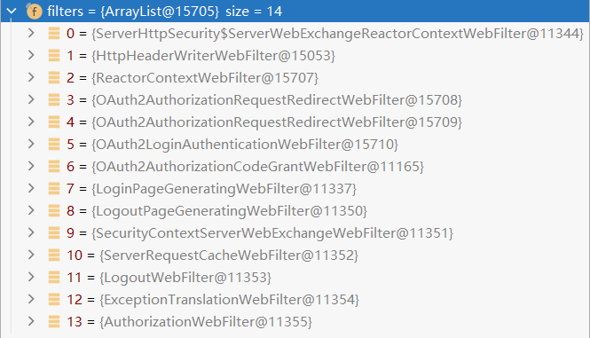
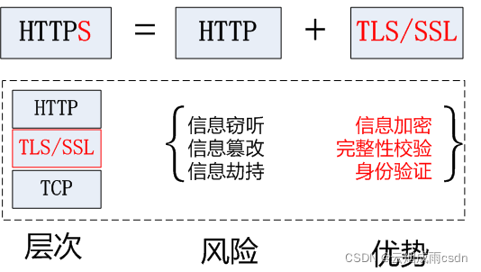
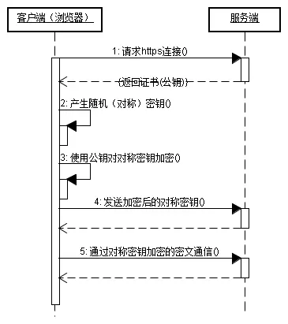
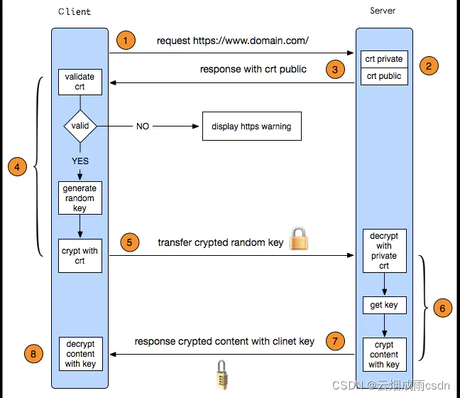

# 网络安全

1. 检查 Request Headers 中的 Refer 信息：
   通过`request.getHeader("referer")`获取 Refer 的值，检查是来自本域的请求。
2. 在 Chrome DevTools 的 Application 中：
   1. Secure：
      当设置为`true`时，表示创建的 Cookie 会被以安全的形式向服务器传输，也就是只能在 HTTPS 连接中被浏览器传递到服务器端进行会话验证，如果是 HTTP 连接则不会传递该信息，所以不会被窃取到 Cookie 的具体内容。
   2. HttpOnly：
      如果在Cookie中设置了`HttpOnly`属性，那么通过程序（JavaScript、Applet等）将无法读取到 Cookie 信息，这样能有效的防止 XSS 攻击。

# 会话

## 辨析 SessionCreationPolicy 和 SessionAuthenticationStrategy

在 Spring Security 的 `HttpSecurity` 中，`sessionCreationPolicy` 和 `sessionAuthenticationStrategy` 是用于管理会话的两个不同方面的配置。它们有着不同的目的，分别用于控制会话的创建策略和处理身份验证时如何使用会话。

### 1. `SessionCreationPolicy` （会话创建策略）

`SessionCreationPolicy` 是用于控制 Spring Security 如何创建和使用 HTTP 会话的策略。它决定了应用程序中何时创建会话，以及是否使用现有的会话。

#### 主要策略类型

Spring Security 提供了几种 `SessionCreationPolicy` 策略：

- **`ALWAYS`**：
  - 每次请求都会创建新的会话，或者如果已有会话，则使用当前会话。
  - 这种策略会确保无论是否需要，Spring Security 都会始终创建会话。
  
- **`IF_REQUIRED`**（默认值）：
  - 如果需要时才创建会话（例如，进行表单登录时会自动创建会话）。
  - 如果已经存在会话，Spring Security 会复用已有的会话；如果没有，会在需要时（如用户登录时）创建一个。
  
- **`NEVER`**：
  - Spring Security 不会主动创建会话，但如果存在会话，它可以使用这个会话。
  - 适用于那些不希望通过 Spring Security 创建会话，但仍然允许应用程序其他部分创建的场景。
  
- **`STATELESS`**：
  - 完全不创建会话，也不使用会话。
  - 适用于无状态的 RESTful API，通常与基于 JWT 的认证一起使用。每个请求都是独立的，不保留任何服务器端的会话状态。

#### `SessionCreationPolicy` 使用示例

以下是配置不同会话策略的示例：

```java
@EnableWebSecurity
public class SecurityConfig extends WebSecurityConfigurerAdapter {

    @Override
    protected void configure(HttpSecurity http) throws Exception {
        http
            .authorizeRequests()
                .antMatchers("/public/**").permitAll()
                .anyRequest().authenticated()
            .and()
            .sessionManagement()
                .sessionCreationPolicy(SessionCreationPolicy.STATELESS) // 无状态
            .and()
            .formLogin(); // 使用表单登录
    }
}
```

#### `SessionCreationPolicy` 的典型使用场景

- **无状态应用（STATELESS）**：在 RESTful API 中很常见，通常用于微服务架构，结合 JWT 认证机制，不使用服务器端会话。
- **有状态应用（ALWAYS/IF_REQUIRED）**：适用于传统的 Web 应用程序（如表单登录），在用户登录时创建会话以保存用户状态。
- **限制会话创建（NEVER）**：应用程序可能依赖其他组件（如应用服务器）创建的会话，但不希望 Spring Security 主动创建。

### 2. `SessionAuthenticationStrategy` （会话身份验证策略）

`SessionAuthenticationStrategy` 控制的是**身份验证成功时**，如何处理会话。它的重点在于处理用户成功登录后的会话管理行为，比如当用户登录时，是否应该重新创建会话、使旧会话失效或执行其他操作。

#### 主要策略类型

Spring Security 提供了几种常见的 `SessionAuthenticationStrategy` 实现：

- **`ChangeSessionIdAuthenticationStrategy`**：
  - 当用户登录成功时，会更改现有会话的 ID，而不丢失会话中的内容。这是防止会话固定攻击的常用策略。
  - 适合大多数应用场景，能够保证会话安全性而不会丢失用户之前的会话信息。
  
- **`ConcurrentSessionControlAuthenticationStrategy`**：
  - 处理并发会话的策略，限制同一用户的会话数量。
  - 通常用于阻止一个用户在多个设备上同时登录（防止并发登录）。
  
- **`RegisterSessionAuthenticationStrategy`**：
  - 用于记录会话信息，通常与并发会话控制结合使用，管理当前用户会话的生命周期。
  
- **`NullAuthenticatedSessionStrategy`**：
  - 什么都不做。适合无状态的应用场景，如使用 JWT 的 RESTful API，不需要使用会话。当配置了`SessionCreationPolicy.STATELESS` 时，通常**不需要显式配置 `NullAuthenticatedSessionStrategy`**。这是因为在 `SessionCreationPolicy.STATELESS` 模式下，Spring Security 会自动避免使用或创建会话，因此不会触发与会话相关的操作，像是 `SessionAuthenticationStrategy` 这样的配置实际上不会生效。

#### `SessionAuthenticationStrategy` 使用示例

以下是配置不同会话身份验证策略的示例：

```java
@EnableWebSecurity
public class SecurityConfig extends WebSecurityConfigurerAdapter {

    @Override
    protected void configure(HttpSecurity http) throws Exception {
        http
            .authorizeRequests()
                .antMatchers("/public/**").permitAll()
                .anyRequest().authenticated()
            .and()
            .sessionManagement()
                .sessionCreationPolicy(SessionCreationPolicy.ALWAYS) // 始终创建会话
            .and()
            .formLogin()
            .and()
            .sessionManagement()
                .sessionAuthenticationStrategy(new ChangeSessionIdAuthenticationStrategy()); // 认证成功后更改会话ID
    }
}
```

#### `SessionAuthenticationStrategy` 的典型使用场景

- **防止会话固定攻击**：`ChangeSessionIdAuthenticationStrategy` 是常见的防御措施，防止攻击者通过盗用会话 ID 来冒充用户。
- **并发会话控制**：通过 `ConcurrentSessionControlAuthenticationStrategy` 来限制每个用户的最大会话数量。
- **无状态应用**：在无状态应用中，通常会使用 `NullAuthenticatedSessionStrategy`，因为不需要任何会话管理。

### 区别总结

- **`SessionCreationPolicy`**：
  - 关注的是**何时创建会话**以及是否使用会话。它控制会话的创建与管理逻辑，决定是否在请求过程中创建会话，适用于会话的整体策略管理。
  - 典型场景：是否为每个用户请求创建新会话（`ALWAYS`）、只在需要时创建会话（`IF_REQUIRED`）、或完全不创建会话（`STATELESS`）。

- **`SessionAuthenticationStrategy`**：
  - 关注的是**用户成功认证后如何处理会话**。主要用于处理身份验证成功时的会话行为，例如是否重新生成会话 ID、限制并发会话等。
  - 典型场景：防止会话固定攻击（`ChangeSessionIdAuthenticationStrategy`）、控制并发会话（`ConcurrentSessionControlAuthenticationStrategy`）等。

### 使用关系
- **`SessionCreationPolicy`** 决定了**是否以及何时创建会话**，主要控制会话的生命周期管理。
- **`SessionAuthenticationStrategy`** 决定了**用户认证成功后如何处理会话**，例如是否重新生成会话 ID、防止固定会话攻击等。

这两者是独立但互补的配置项，共同决定了应用中会话的创建、使用和管理策略。

# Filter

# WebSecurity

# WebFluxSecurity

## Spring Security 配置

Spring Security 设置要采用响应式配置，基于 WebFlux 中 WebFilter 实现，与 Spring MVC 的 Security 是通过 Servlet 的 Filter 实现类似，也是一系列 Filter 组成的过滤链。
 Reactive 与传统 MVC 配置对应：

|                       WebFlux                        |             MVC              |       作用       |
| :--------------------------------------------------: | :--------------------------: | :--------------: |
|                @EnableWebFluxSecurity                |      @EnableWebSecurity      | 开启security配置 |
|          ServerAuthenticationSuccessHandler          | AuthenticationSuccessHandler | 登录成功Handler  |
|          ServerAuthenticationFailureHandler          | AuthenticationFailureHandler | 登陆失败Handler  |
| ReactiveAuthorizationManager\<AuthorizationContext\> |     AuthorizationManager     |     认证管理     |
|           ServerSecurityContextRepository            |    SecurityContextHolder     | 认证信息存储管理 |
|              ReactiveUserDetailsService              |      UserDetailsService      |     用户登录     |
|             ReactiveAuthorizationManager             |    AccessDecisionManager     |     鉴权管理     |
|            ServerAuthenticationEntryPoint            |   AuthenticationEntryPoint   |  未认证Handler   |
|              ServerAccessDeniedHandler               |     AccessDeniedHandler      | 鉴权失败Handler  |

建立步骤：

配置类：

```java
@EnableWebFluxSecurity
public class MyWebFluxSecurityConfiguration {
    /**
     * 获取用户详情服务
     */
    @Autowired
    ReactiveUserDetailsService userDetailsService;

    @Autowired
    PermissionMapper permissionMapper;

    /**
     * 密码编码器
     *
     * @return 密码编码器
     */
    @Bean
    PasswordEncoder passwordEncoder() {
        return new SCryptPasswordEncoder();
    }

    /**
     * 配置获取用户详情服务，配置密码编码器，由 AuthenticationWebFilter 持有
     *
     * @return 鉴权管理器
     */
    @Bean
    ReactiveAuthenticationManager reactiveAuthenticationManager() {
        UserDetailsRepositoryReactiveAuthenticationManager manager = new UserDetailsRepositoryReactiveAuthenticationManager(userDetailsService);
        manager.setPasswordEncoder(passwordEncoder());
        return manager;
    }

    @Bean
    <T> ReactiveAuthorizationManager<T> reactiveAuthorizationManager() {
        return new MyReactiveAuthorizationManager<>(permissionMapper);
    }

    @Bean
    public SecurityWebFilterChain securityWebFilterChain(ServerHttpSecurity security) {
        return security
                .authorizeExchange() // 设置 AuthorizationWebFilter
                .pathMatchers(HttpMethod.OPTIONS).permitAll()
                .pathMatchers("/login", "/logout").permitAll()
                .pathMatchers("/user").access(reactiveAuthorizationManager())
                .anyExchange().authenticated().and()
                .formLogin().and()
                // .loginPage("/login").and()
                .logout().logoutUrl("/logout").and()
                .csrf().csrfTokenRepository(CookieServerCsrfTokenRepository.withHttpOnlyFalse()).and()
                .cors().disable()
                .httpBasic().disable()
                .build();
    }
}
```

授权管理：

```java
public class MyReactiveAuthorizationManager<T> implements ReactiveAuthorizationManager<T> {
    private PermissionMapper mapper;

    public void setMapper(PermissionMapper mapper) {
        this.mapper = mapper;
    }

    public MyReactiveAuthorizationManager(PermissionMapper mapper) {
        this.mapper = mapper;
    }

    @Override
    public Mono<AuthorizationDecision> check(Mono<Authentication> authentication, T object) {
        ServerWebExchange exchange = ((AuthorizationContext) object).getExchange();
        String url = exchange.getRequest().getPath().value();
        List<String> permissions = mapper.findPermissionByUrl(url);
        return authentication
                .filter(a -> a.isAuthenticated())
                .flatMapIterable(a -> a.getAuthorities())
                .map(g-> g.getAuthority())
                .any(a -> permissions.contains(a))
                .map( hasAuthority -> new AuthorizationDecision(hasAuthority))
                .defaultIfEmpty(new AuthorizationDecision(false));
    }
}
```

数据库用户信息服务类：

```java
@Service
public class MyUserDetailsService implements ReactiveUserDetailsService {
    @Autowired
    private UserMapper userMapper;
    
    @Autowired
    private PermissionMapper permissionMapper;

    @Override
    public Mono<UserDetails> findByUsername(String username) {
        return Mono.just(userService.loadUserByUsername(username));
    }
    
    public UserDetails loadUserByUsername(String username) {
        List<SysUser> users = userMapper.findByUserName(username);
        if (users.isEmpty()) {
            throw new UsernameNotFoundException("user: " + username + " do not exist!");
        }
        SysUser user = users.get(0);
        // 获取该用户所有角色的所有权限 Spring Security 中角色等于权限加 ROLE_ 前缀
        List<Permission> permissions = permissionMapper.findByAdminUserId(user.getId());
        List<GrantedAuthority> grantedAuthorities = new ArrayList<>();
        for (Permission permission : permissions) {
            if (permission != null && permission.getName() != null) {
                // 此处将权限信息添加到 GrantedAuthority 对象中，在后面进行全权限验证时会使用 GrantedAuthority 对象。
                GrantedAuthority ga = new SimpleGrantedAuthority(permission.getName());
                grantedAuthorities.add(ga);
            }
        }
        return new User(user.getUsername(), user.getPassword(), grantedAuthorities);
    }
}
```

---

## 初始化顺序

注解 EnableWebFluxSecurity.java 向容器中注入配置类 Bean：

```java
@Import({ServerHttpSecurityConfiguration.class, WebFluxSecurityConfiguration.class, ReactiveOAuth2ClientImportSelector.class})
@Configuration
```

自定义的配置类 MyWebFluxSecurityConfig 通过 ServerHttpSecurity.java 的`build()`方法自行向容器中注入 SecurityWebFilterChain 的 Bean：

```java
@EnableWebFluxSecurity
public class MyWebFluxSecurityConfig {
    @Bean
    public SecurityWebFilterChain securityWebFilterChain(ServerHttpSecurity security) {
        return security.build();
    }
}
```

上述 SecurityWebFilterChain 的实现类为 MatcherSecurityWebFilterChain，向其内部填充过滤器：

```java
public SecurityWebFilterChain build() {
    // 省略异常
    // 省略 HttpHeaderWriterWebFilter
    // 省略 securityContextRepository ReactorContextWebFilter
    // 省略 HttpsRedirectWebFilter
    // 省略 CsrfWebFilter
    // 省略 CorsWebFilter
    // 省略 httpBasic AuthenticationWebFilter
    // 省略 formLogin AuthenticationWebFilter
    // 省略 oauth2Login OAuth2AuthorizationRequestRedirectWebFilter 和 AuthenticationWebFilter
    // 省略 resourceServer AuthenticationWebFilter
    // 省略 client OAuth2AuthorizationCodeGrantWebFilter 和 OAuth2AuthorizationRequestRedirectWebFilter
    // 省略 loginPage LoginPageGeneratingWebFilter 和 LogoutPageGeneratingWebFilter
    // 省略 logout LogoutWebFilter
    // 省略 ServerRequestCacheWebFilter
    // 省略 SecurityContextServerWebExchangeWebFilter
    // 省略 authorizeExchange AuthorizationWebFilter 和 ExceptionTranslationWebFilter
    
    // 将 webFilters 中已有的过滤器先排序一次
    AnnotationAwareOrderComparator.sort(this.webFilters);
    // 过滤器列表
    List<WebFilter> sortedWebFilters = new ArrayList<>();
    // 将可排序且已排序的过滤器放入 sortedWebFilters
    this.webFilters.forEach( f -> {
        // 判断是否是已排序
        if (f instanceof OrderedWebFilter) {
            f = ((OrderedWebFilter) f).webFilter;
        }
        sortedWebFilters.add(f);
    });
    // ServerWebExchangeReactorContextWebFilter 没有实现 Ordered 不能排序，直接放入列表头
    sortedWebFilters.add(0, new ServerWebExchangeReactorContextWebFilter());
    return new MatcherSecurityWebFilterChain(getSecurityMatcher(), sortedWebFilters);
}
```



|                          过滤器（生成顺序） |   序号    | 功能                                                 |
| ------------------------------------------: | :-------: | ---------------------------------------------------- |
|                   HttpHeaderWriterWebFilter |    100    |                                                      |
|                     ReactorContextWebFilter |    500    |                                                      |
|                      HttpsRedirectWebFilter |    200    |                                                      |
|                               CsrfWebFilter |    400    | 检查、验证、生成 Token                               |
|                               CorsWebFilter |    300    |                                                      |
|                4 个 AuthenticationWebFilter | 600 ~ 800 | HttpBasic 登录、Form 登录、OAuth 登录和资源 JWT 验证 |
| OAuth2AuthorizationRequestRedirectWebFilter |    600    |                                                      |
|       OAuth2AuthorizationCodeGrantWebFilter |    900    |                                                      |
|                LoginPageGeneratingWebFilter |   1000    |                                                      |
|               LogoutPageGeneratingWebFilter |   1100    |                                                      |
|                             LogoutWebFilter |   1400    |                                                      |
|                 ServerRequestCacheWebFilter |   1300    |                                                      |
|   SecurityContextServerWebExchangeWebFilter |   1200    |                                                      |
|               ExceptionTranslationWebFilter |   1500    |                                                      |
|                      AuthorizationWebFilter |   1600    |                                                      |
|    ServerWebExchangeReactorContextWebFilter |    无     |                                                      |

WebFluxSecurityConfiguration.java 自动装配的过滤器链列表`securityWebFilterChains`，列表内有上述`MatcherSecurityWebFilterChain`的 Bean：

```java
@Autowired(required = false)
private List<SecurityWebFilterChain> securityWebFilterChains;
```

向容器中注入 WebFilterChainProxy 的 Bean，并让其持有`securityWebFilterChains`：

```java
public static final int WEB_FILTER_CHAIN_FILTER_ORDER = 0 - 100;

private static final String BEAN_NAME_PREFIX = "org.springframework.security.config.annotation.web.reactive.WebFluxSecurityConfiguration.";

private static final String SPRING_SECURITY_WEBFILTERCHAINFILTER_BEAN_NAME = BEAN_NAME_PREFIX + "WebFilterChainFilter";

@Bean(SPRING_SECURITY_WEBFILTERCHAINFILTER_BEAN_NAME)
@Order(value = WEB_FILTER_CHAIN_FILTER_ORDER)
public WebFilterChainProxy springSecurityWebFilterChainFilter() {
    return new WebFilterChainProxy(getSecurityWebFilterChains());
}

private List<SecurityWebFilterChain> getSecurityWebFilterChains() {
    List<SecurityWebFilterChain> result = this.securityWebFilterChains;
    if (ObjectUtils.isEmpty(result)) {
        return Arrays.asList(springSecurityFilterChain());
    }
    return result;
}
```

在 WebFluxSecurityConfiguration 之后自动装配的 HttpHandlerAutoConfiguration 中的 AnnotationConfig 向容器中注入 HttpHandler 的 Bean：

```java
@Bean
public HttpHandler httpHandler() {
    return WebHttpHandlerBuilder.applicationContext(this.applicationContext).build();
}
```

其中`builder()`方法会生成 HttpHandler：

```java
public HttpHandler build() {
    WebHandler decorated = new FilteringWebHandler(this.webHandler, this.filters);
    decorated = new ExceptionHandlingWebHandler(decorated,  this.exceptionHandlers);

    HttpWebHandlerAdapter adapted = new HttpWebHandlerAdapter(decorated);
    // 省略部分配置代码......
    adapted.afterPropertiesSet();

    return adapted;
}
```

其中`decorated`的构造器`FilteringWebHandler`会将`filters`中的过滤器包装成 DefaultWebFilterChain 并赋给成员变量`chain`：

```java
private final DefaultWebFilterChain chain;

public FilteringWebHandler(WebHandler handler, List<WebFilter> filters) {
    super(handler);
    this.chain = new DefaultWebFilterChain(handler, filters);
}
```

**不同于 Servlet 模式的 Security 的 Cookie 键为 JSESSION，Reactive 模式的 WebFlux Security 的默认 Cookie 键为 SESSION**

## 辨析 ServerHttpSecurity 和 HttpSecurity

`ServerHttpSecurity` 和 `HttpSecurity` 是 Spring Security 框架中用于配置安全性的两个类，但它们适用于不同的编程模型和应用架构。它们的区别主要在于所应用的上下文（reactive 与 servlet）和设计目的：

### 1. `HttpSecurity`
`HttpSecurity` 是 Spring Security 中用于传统的 Servlet-based 应用的安全配置类，适用于基于 Spring MVC 或基于 servlet 的 Web 应用。它提供了配置 HTTP 请求安全性的机制，通常用于同步编程模型。

#### 典型的使用场景：
- 用于基于 Spring MVC 框架的应用程序（例如使用 `@Controller` 和 `DispatcherServlet` 的应用）。
- 配置方式依赖于 servlet 容器（如 Tomcat、Jetty）。
- 支持传统的 servlet filters。

#### 代码示例：
```java
@EnableWebSecurity
public class SecurityConfig extends WebSecurityConfigurerAdapter {
    @Override
    protected void configure(HttpSecurity http) throws Exception {
        http
            .authorizeRequests()
                .antMatchers("/admin/**").hasRole("ADMIN")
                .antMatchers("/user/**").hasRole("USER")
                .anyRequest().authenticated()
            .and()
            .formLogin();
    }
}
```

### 2. `ServerHttpSecurity`
`ServerHttpSecurity` 是 Spring Security 提供的用于基于 Spring WebFlux（Reactive Programming 模型）的应用的安全配置类。它适用于响应式编程模型，通常用于构建响应式 Web 应用和微服务架构。

#### 典型的使用场景：
- 用于基于 Spring WebFlux 的应用程序（基于响应式流的非阻塞框架）。
- 适用于响应式服务器，如 Netty 或 Undertow。
- 支持响应式的过滤器链和非阻塞 IO。
  
#### 代码示例：
```java
@EnableWebFluxSecurity
public class SecurityConfig {
    @Bean
    public SecurityWebFilterChain securityWebFilterChain(ServerHttpSecurity http) {
        return http
            .authorizeExchange()
                .pathMatchers("/admin/**").hasRole("ADMIN")
                .pathMatchers("/user/**").hasRole("USER")
                .anyExchange().authenticated()
            .and()
            .formLogin()
            .and()
            .build();
    }
}
```

### 主要区别
1. **编程模型**：
   - `HttpSecurity`：用于同步的 servlet-based 应用。
   - `ServerHttpSecurity`：用于响应式的 WebFlux 应用。

2. **底层框架**：
   - `HttpSecurity`：基于 Servlet API 和 Spring MVC。
   - `ServerHttpSecurity`：基于 WebFlux 响应式框架，使用非阻塞的 IO 模型。

3. **服务器容器**：
   - `HttpSecurity`：通常与 Tomcat、Jetty 等 servlet 容器一起使用。
   - `ServerHttpSecurity`：与 Netty、Undertow 等非阻塞响应式服务器一起使用。

4. **过滤器机制**：
   - `HttpSecurity`：使用 servlet filter 机制。
   - `ServerHttpSecurity`：使用 WebFlux 的 `WebFilter` 机制。

### 总结
- 如果你的项目是基于传统的 servlet 和 Spring MVC 架构的 Web 应用，应该使用 `HttpSecurity`。
- 如果你的项目是基于 Spring WebFlux 响应式框架的应用，应该使用 `ServerHttpSecurity`。

# HTTPS



Https 请求相当于两次 Http 请求，第一次获取公钥，第二次发送对称密钥并获取内容。

**HTTPS协议 = HTTP协议 + SSL/TLS协议**

https://www.cnblogs.com/muffe/p/11635124.html

https://blog.csdn.net/qq_43437874/article/details/121631195





## 生成和配置证书

https://docs.oracle.com/en/java/javase/11/tools/keytool.html

```shell
# 官网示例
keytool -genkeypair -keystore root.jks -alias root -ext bc:c
keytool -genkeypair -keystore ca.jks -alias ca -ext bc:c
keytool -genkeypair -keystore server.jks -alias server
 
keytool -keystore root.jks -alias root -exportcert -rfc > root.pem
 
keytool -storepass <passwd> -keystore ca.jks -certreq -alias ca |
    keytool -storepass <passwd> -keystore root.jks
    -gencert -alias root -ext BC=0 -rfc > ca.pem
keytool -keystore ca.jks -importcert -alias ca -file ca.pem
 
keytool -storepass <passwd> -keystore server.jks -certreq -alias server |
    keytool -storepass <passwd> -keystore ca.jks -gencert -alias ca
    -ext ku:c=dig,kE -rfc > server.pem
cat root.pem ca.pem server.pem |
    keytool -keystore server.jks -importcert -alias server
```

生成密钥对和证书：

```shell
# 生成根密钥对
keytool -genkeypair -alias root -keystore root.jks -keyalg RSA -storepass 123456 -keypass 123456 -validity 365 -dname 'CN=LuJin, OU=CESI, O=CESI, L=Beijing, ST=Beijing, C=CN' -ext bc:c
# 生成中间密钥对
keytool -genkeypair -alias ca -keystore ca.jks -keyalg RSA -storepass 123456 -keypass 123456 -validity 365 -dname 'CN=LuJin, OU=CESI, O=CESI, L=Beijing, ST=Beijing, C=CN' -ext bc:c
# 生成服务密钥对
keytool -genkeypair -alias server -keystore server.jks -keyalg RSA -storepass 123456 -keypass 123456 -validity 365 -dname 'CN=LuJin, OU=CESI, O=CESI, L=Beijing, ST=Beijing, C=CN'

# 导出根证书
keytool -exportcert -alias root -keystore root.jks -storepass 123456 -rfc > root.pem

# 生成中间证书
keytool -certreq -alias ca -keystore ca.jks -storepass 123456 | keytool -gencert -alias root -keystore root.jks -storepass 123456 -validity 365 -ext bc=0 -rfc > ca.pem
# 拼接证书链
cat root.pem >> ca_chain.pem
cat ca.pem >> ca_chain.pem
# 中间密钥库导入证书链
keytool -importcert -alias ca -keystore ca.jks -storepass 123456 -file ca_chain.pem

# 生成服务证书 jdk15之前dns首字必须为字母
keytool -certreq -alias server -keystore server.jks -storepass 123456 | keytool -gencert -alias ca -keystore ca.jks -storepass 123456 -validity 365 -ext san=dns:localhost,dns:127.0.0.1,ip:127.0.0.1 -ext ku:c=dig,keyEncipherment -rfc > server.pem
# 拼接证书链
cat ca_chain.pem >> server_chain.pem
cat server.pem >> server_chain.pem
# 服务密钥库导入证书链
keytool -importcert -alias server -keystore server.jks -storepass 123456 -file server_chain.pem
```

导入到 jdk，其中`changeit`为 jdk 默认存储密码：

```cmd
keytool -import -trustcacerts -alias server -keystore "%JAVA_HOME%/lib/security/cacerts" -keypass changeit -file server_chain.pem
```

```powershell
keytool -import -trustcacerts -alias server -keystore "$Env:JAVA_HOME/lib/security/cacerts" -keypass changeit -file server_chain.pem
```

提取公钥：

```shell
keytool -list -rfc --keystore server.jks | openssl x509 -inform pem -pubkey
```

将密钥对转换为 PKCS12 格式：

```shell
keytool -importkeystore -srckeystore server.jks -destkeystore server.p12 -deststoretype PKCS12 -srcalias server -deststorepass 123456 -destkeypass 123456
```

提取私钥：

```shell
openssl pkcs12 -nodes -in server.p12 -out private.key
```

配置文件 application.yml：

```yaml
server:
  ssl:
    enabled: true
    key-alias: server
    key-store: classpath:server.jks
    key-store-type: jks
    key-password: 123456
    key-store-password: 123456
```

将密钥库 server.jks 放入`server.ssl.key-store`对应路径下，导入证书到“浏览器 - 设置 - 隐私和安全 - 安全 - 管理证书 - 颁发机构”。

[JDK 的证书库安装证书](https://blog.csdn.net/oscar999/article/details/127991038)
