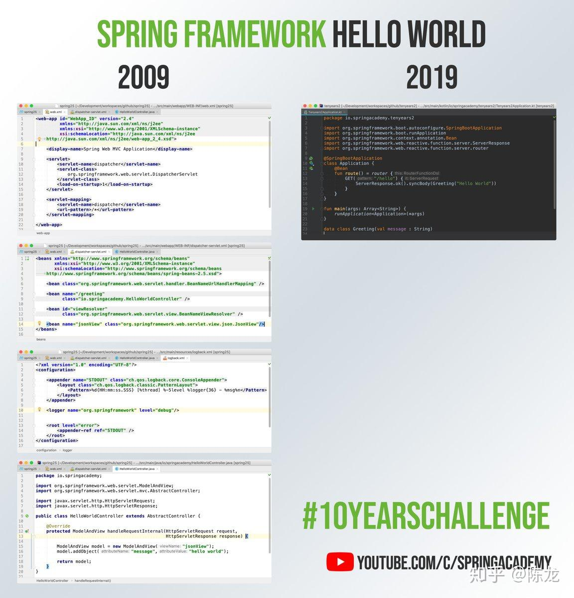
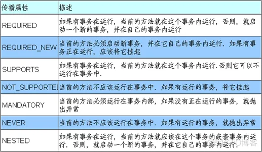
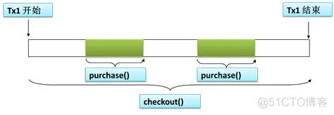

# Spring 基础

[URL结构](https://dmitripavlutin.com/parse-url-javascript/)：





## MVC 结构

> 一般来说，Controller是Handler，但Handler不一定是Controller。
>
> 例如：HttpRequestHandler、WebRequestHandler、MessageHandler都是可以使用DispatcherServlet的处理程序。（Controller是执行Web请求并返回视图的处理程序。）
>
> 简而言之，Handler只是一个术语，它既不是类也不是接口它负责执行映射。

## 配置文件

[加载顺序](https://docs.spring.io/spring-boot/docs/2.3.3.RELEASE/reference/html/spring-boot-features.html#boot-features-external-config)

Application: application.yml > appliction.properties > application-xxx.yml > application-xxx.properties

若 application.yml 和 bootstrap.yml 在同一目录下，bootstrap.yml 先加载 application.yml 后加载。bootstrap.yml 用于应用程序上下文的引导阶段。bootstrap.yml 由父 SpringApplicationContext 加载。bootstrap.yml 有高优先级不会被覆盖。

> In Spring Boot, YAML files can be overridden by other YAML properties files.
>
> Prior to version 2.4.0, YAML properties were overridden by properties files in the following locations, in order of highest precedence first:
>
> - Profiles' properties placed outside the packaged jar
> - Profiles' properties packaged inside the packaged jar
> - Application properties placed outside the packaged jar
> - Application properties packaged inside the packaged jar
>
> As of Spring Boot 2.4, external file always override packaged files, regardless of whether its profile-specific or not.

[bootstrap.yml configuration not processed anymore with Spring Cloud 2020.0](https://cloudstack.ninja/pavan-jadda/bootstrap-yml-configuration-not-processed-anymore-with-spring-cloud-2020-0/)

> properties in YAML files will be replaced by HashiCorp Vault properties during startup. For this, I use Spring Cloud Vault library. Everything works as expected in Spring Boot 2.3.x
>
> When I try to upgrade the project to Spring Boot 2.4.0 with Spring Cloud Vault 3.0.0-SNAPSHOT version, the properties are not being replaced

spring.profiles.include可以加载多个yml文件，参考：[spring.profiles.active和spring.profiles.include的使用与区别](https://blog.csdn.net/wysghmbb/article/details/107175416)

Spring的生命周期不仅涉及到Bean的创建和销毁，还包括整个Spring容器的生命周期。从Spring容器的启动、初始化、管理Bean，到最终关闭和销毁，这个过程涉及多层机制的协同运作。要了解Spring的生命周期，就必须从Spring容器的启动与关闭，以及容器中Bean的创建和管理两个方面进行讲解。

## Spring生命周期的主要环节如下：

---

### 1. **Spring容器启动**

Spring的生命周期从容器的启动开始。Spring容器的核心接口是`ApplicationContext`，它是`BeanFactory`的扩展，提供了更加完整的容器功能。在启动时，Spring会根据不同的配置方式（如XML、Java配置类、注解扫描等）加载和解析Bean的定义，并准备实例化和管理这些Bean。

#### 主要步骤：
- **加载配置**：容器会根据XML配置文件、注解或Java类来加载Bean定义。
  - 例如，`ClassPathXmlApplicationContext`用于加载XML配置，`AnnotationConfigApplicationContext`用于加载Java配置类。
- **解析Bean定义**：Spring会解析Bean的配置和注解，将每个Bean的定义存储到`BeanDefinition`对象中，表示它们的元数据。
- **创建BeanFactory**：Spring会创建一个`BeanFactory`来存储所有的Bean定义及其关系。这时，Bean并未被真正创建，仅定义了如何创建。

### 2. **Bean实例化与依赖注入**

Spring容器在启动过程中，会根据Bean定义创建和初始化Bean。Spring采用了**延迟加载（Lazy Initialization）**和**预加载（Eager Initialization）**两种策略。默认情况下，Spring会预加载所有单例Bean，除非特定声明为延迟加载。

#### 主要步骤：
- **Bean实例化**：在容器启动过程中，Spring会实例化Bean，通常通过构造函数、工厂方法或反射机制创建Bean实例。
- **依赖注入**：Spring会根据Bean定义中的依赖关系，通过构造函数、setter方法或字段注入的方式注入依赖。
  - **构造器注入**：在实例化时通过构造函数传递依赖。
  - **Setter注入**：在实例化后，通过setter方法注入依赖。
  - **字段注入**：通过注解（如`@Autowired`）注入Bean的依赖。

在这一步，Bean实例化和依赖注入已经完成，Spring容器开始为每个Bean进行配置。

### 3. **Spring容器的初始化**

容器完成了Bean的加载和依赖注入后，会继续执行Bean的初始化过程。此时，Spring容器提供了一些扩展点供开发者进行定制化操作。

#### 主要步骤：
- **Aware接口回调**：如果某个Bean实现了Spring的`Aware`接口（如`BeanFactoryAware`、`ApplicationContextAware`），Spring会在Bean初始化时回调这些方法，以便Bean可以获得对容器资源的访问权限。
- **BeanPostProcessor**：在Bean初始化前后，Spring会调用所有已注册的`BeanPostProcessor`，允许对Bean实例进行额外的处理或代理操作。这是AOP代理的关键点，AOP会在这里将切面逻辑织入Bean中。
- **Bean的初始化**：可以通过多种方式定义Bean的初始化行为，例如：
  - 使用`@PostConstruct`注解。
  - 实现`InitializingBean`接口的`afterPropertiesSet()`方法。
  - 在配置中指定`init-method`。

### 4. **容器准备就绪**

当Spring容器中的所有Bean都初始化完成后，整个容器进入**就绪状态**。此时，Spring容器处于稳定的运行状态，应用程序可以正常运行，所有Bean可以随时被使用。

- 在Web应用中，Spring容器会通过ServletContext启动（例如`DispatcherServlet`），并进入监听请求和调度控制器的阶段。
- 在桌面或命令行应用中，容器则会等待输入或根据逻辑持续运行。

### 5. **Bean的使用阶段**

在容器运行的过程中，应用程序会根据需要获取Bean来执行业务逻辑。Spring容器通过依赖注入、AOP等机制保证每个Bean的依赖、代理和功能都可以正常运作。

- **Scope与生命周期控制**：根据Bean的作用域（如`singleton`、`prototype`、`request`、`session`等），Spring会控制Bean的实例化和销毁过程。
  - 单例（`singleton`）Bean在整个容器生命周期中只有一个实例。
  - 原型（`prototype`）Bean每次请求时都会生成新的实例。
  - 对于`request`和`session`作用域的Bean，Spring会在Web请求的生命周期内控制Bean的创建和销毁。

### 6. **Spring容器的关闭**

当应用程序停止或Spring容器被显式关闭时（例如通过`close()`方法或在Web应用中通过`ServletContextListener`关闭时），Spring会开始销毁容器内的Bean并释放资源。

#### 主要步骤：
- **执行销毁方法**：在容器关闭之前，Spring会执行每个Bean的销毁方法。类似于初始化，销毁方法也可以通过多种方式定义：
  - 实现`DisposableBean`接口，执行其`destroy()`方法。
  - 使用`@PreDestroy`注解定义的销毁方法。
  - 在配置文件中指定`destroy-method`。
  
- **关闭容器**：容器关闭后，Spring将释放所有的资源，包括缓存的Bean、线程池、数据库连接等。这意味着容器中的所有Bean都将被销毁，整个应用程序的生命周期到此结束。

---

### Spring完整生命周期总结

1. **容器启动**：加载配置文件或注解，解析Bean定义，创建`BeanFactory`。
2. **Bean实例化与依赖注入**：根据Bean定义实例化Bean，并注入依赖。
3. **容器初始化**：回调`Aware`接口，执行`BeanPostProcessor`，初始化Bean。
4. **容器就绪**：所有Bean初始化完毕，容器进入就绪状态，准备处理请求。
5. **使用Bean**：应用程序根据需要使用容器中的Bean。
6. **容器关闭**：容器被显式关闭或应用程序终止，销毁Bean并释放资源。

### 主要扩展点：
- **`BeanPostProcessor`**：在Bean初始化前后进行自定义处理。
- **`ApplicationContextAware`**：在Bean中获取到`ApplicationContext`实例。
- **`@PostConstruct`与`@PreDestroy`**：用于自定义初始化和销毁方法。
- **AOP**：通过切面编程，在Bean生命周期的合适时机植入切面逻辑。

通过这些生命周期的管理机制，Spring不仅仅是简单的Bean工厂，它是一个完整的应用程序框架，管理从启动到销毁的整个生命周期。

## Spring Boot 的启动

```java
public SpringApplication(ResourceLoader resourceLoader, Class<?>... primarySources) {
    this.resourceLoader = resourceLoader;
    Assert.notNull(primarySources, "PrimarySources must not be null");
    this.primarySources = new LinkedHashSet<>(Arrays.asList(primarySources)); // step 1
    this.webApplicationType = WebApplicationType.deduceFromClasspath(); // step 2
    this.bootstrappers = new ArrayList<>(getSpringFactoriesInstances(Bootstrapper.class)); // step 3
    setInitializers((Collection) getSpringFactoriesInstances(ApplicationContextInitializer.class)); // step 4
    setListeners((Collection) getSpringFactoriesInstances(ApplicationListener.class)); // step 5
    this.mainApplicationClass = deduceMainApplicationClass(); // step 6
}
```

1. 初始化 SpringApplication：`new SpringApplication(primarySources)`
   1. 将启动类放入`primarySources`，这是最初的 bean 类型数组
   2. 推算当前 web 应用类型`webApplicationType`（Servlet 还是 Reactive）
   3. `getSpringFactoriesInstances`读取`Bootstrapper`引导类，使用给定的类加载器从`META-INF/spring.factories`加载给定类型的工厂实现的完全限定类名（自动装配，约定优于配置）
   4. `getSpringFactoriesInstances`读取`ApplicationContextInitializer`应用上下文初始化器，使用给定的类加载器从`META-INF/spring.factories`加载给定类型的工厂实现的完全限定类名
   5. `getSpringFactoriesInstances`读取`ApplicationListener`应用监听器，使用给定的类加载器从`META-INF/spring.factories`加载给定类型的工厂实现的完全限定类名
   6. 将 main 方法所在的类放入`mainApplicationClass`
2. 运行`run`方法：
   1. `createApplicationContext`创建默认上下文`AnnotationConfigServletWebServerApplicationContext`持有`DefaultListableBeanFactory`（Spring Cloud 下会先创建父上下文`AnnotationConfigApplicationContext`）
   2. `refreshContext`
      1. 向 JVM 运行时注册一个关闭钩子，在 JVM 关闭时关闭此上下文，除非当时它已经关闭。
      2. `refresh`方法加载 IoC 容器，创建 BeanFactory


## 事务

在 Spring 中，`@Transactional` 注解用于声明事务的传播行为（Propagation behavior），它定义了在事务嵌套或者多个事务调用的场景下，当前方法应如何处理现有事务。传播行为控制事务的边界和行为，确保在不同场景下，事务能够正确地传播或启动，避免不一致的事务操作。

注意：

1. 内部方法调用是不走代理的，注解是不起作用的。需要利用`this.getClass().cast(AopContext.currentProxy())`获取代理的对象。也可以通过循环依赖，自己持有自己；
2. 有事务交织时，要把事务的控制放在同一线程；
3. 如果通过`try...catch`捕捉异常要记得继续向上`throw`抛出；
4. 抛出异常时，要确定异常的类型符合`rollback`参数，或者用默认的回滚范围`RuntimeException`包裹；
5. 数据源和事务管理器要与事务对应；
6. 避免大事务，最小粒度控制，不要将查询等也管理起来。会造成数据库死锁，大大降低性能；

Spring 提供了 7 种传播行为，下面是每种传播行为的解释及其作用：



### 1. **REQUIRED** （默认）



   - **作用**：如果当前存在事务，则加入当前事务；如果当前没有事务，则创建一个新的事务。
   - **场景**：大多数情况下使用的传播行为，适用于需要在一个事务中进行操作的场景，不论外层是否有事务。
   - **示例**：方法 A 调用了方法 B。如果方法 A 有事务，方法 B 就加入这个事务；如果方法 A 没有事务，则方法 B 会创建一个新的事务。

### 2. **REQUIRES_NEW**


   - **作用**：无论当前是否存在事务，都会创建一个新的事务。当前事务（如果存在）会被挂起，不使用调用者的事务，直到新事务完成。
   - **场景**：适用于需要始终执行新的事务，且不受外部事务影响的场景。
   - **示例**：如果方法 A 有事务，而方法 B 使用 `REQUIRES_NEW`，则方法 A 的事务会在调用方法 B 时暂时挂起，方法 B 完成后，再恢复方法 A 的事务。

### 3. **SUPPORTS**
   - **作用**：如果当前存在事务，则加入当前事务；如果没有事务，则以非事务方式执行。
   - **场景**：适用于事务不是必须的场景。如果外部方法有事务，则参与事务；如果没有事务，则不需要开启事务。
   - **示例**：方法 A 没有事务，则方法 B 在调用时也不会开启事务；如果方法 A 有事务，方法 B 则加入该事务。

### 4. **NOT_SUPPORTED**
   - **作用**：不支持事务。如果当前存在事务，事务会被挂起，并以非事务方式执行方法。
   - **场景**：适用于不需要事务的操作，并且避免在有事务的情况下执行。
   - **示例**：方法 A 有事务，调用方法 B（`NOT_SUPPORTED`），方法 A 的事务会挂起，直到方法 B 执行完毕，再恢复方法 A 的事务。

### 5. **MANDATORY**
   - **作用**：必须在现有事务中执行。如果当前没有事务，抛出异常。
   - **场景**：适用于必须在事务中执行的方法，不能在没有事务的情况下执行。
   - **示例**：如果方法 A 没有事务，调用方法 B（`MANDATORY`）时会抛出异常；如果方法 A 有事务，方法 B 则加入该事务。

### 6. **NEVER**
   - **作用**：不允许在事务中执行。如果当前存在事务，抛出异常；如果没有事务，则以非事务方式执行。
   - **场景**：适用于绝对不需要事务的场景。
   - **示例**：如果方法 A 有事务，调用方法 B（`NEVER`）时会抛出异常；如果方法 A 没有事务，方法 B 正常执行。

### 7. **NESTED**
   - **作用**：如果当前存在事务，则创建一个嵌套事务（内层事务）；如果当前没有事务，则创建一个新的事务。嵌套事务可以独立回滚（利用 MySQL 自带的`savepoint`存档点），但依赖于外部事务的提交。
   - **场景**：适用于某些操作可能失败，需要回滚，但不影响外层事务的场景。
   - **示例**：如果方法 A 有事务，方法 B 使用 `NESTED` 则创建嵌套事务。如果方法 B 失败，B 的事务可以回滚，而方法 A 的事务可以继续提交或回滚。

### 总结
`@Transactional` 的传播行为主要用于控制在嵌套调用时，事务应该如何进行传播或创建新的事务。这些传播行为让开发者能够灵活地控制方法在事务中的行为，确保在复杂的业务逻辑中，事务的一致性和隔离性能够得到保证。
