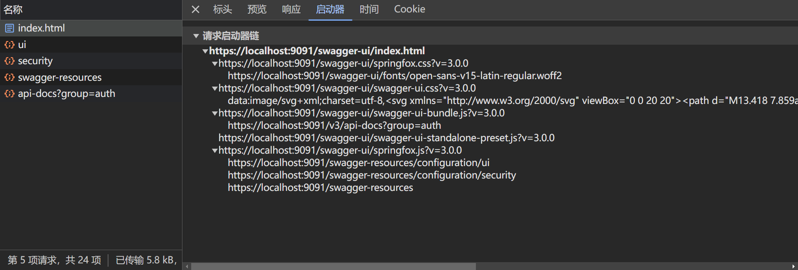

添加依赖：

```xml
<dependency>
  <groupId>io.springfox</groupId>
  <artifactId>springfox-swagger-ui</artifactId>
</dependency>

<dependency>
  <groupId>io.springfox</groupId>
  <artifactId>springfox-spring-webflux</artifactId>
</dependency>

<!-- Open Api -->
<dependency>
  <groupId>io.springfox</groupId>
  <artifactId>springfox-oas</artifactId>
</dependency>
```

常用注解说明：

- `@Api`： 用于类，标识这个类是swagger的资源
- `@ApiIgnore`： 用于类，忽略该`Controller`，指不对当前类做扫描
- `@ApiOperation`： 用于方法，描述`Controller`类中的`method`接口
- `@ApiParam`： 用于参数，单个参数描述，与`@ApiImplicitParam`不同的是，他是写在参数左侧的。如 `@ApiParam(name = "username", value = "用户名") Stringusername`
- `@ApiModel`： 用于类，表示对类进行说明，用于参数用实体类接收
- `@ApiProperty`：用于方法，字段，表示对`model`属性的说明或者数据操作更改
- `@ApiImplicitParam`： 用于方法，表示单独的请求参数
- `@ApiImplicitParams`： 用于方法，包含多个`@ApiImplicitParam`
- `@ApiResponse`： 用于方法，描述单个出参信息
- `@ApiResponses`： 用于方法，包含多个`@ApiResponse`
- `@ApiError`：用于方法，接口错误所返回的信息

@ApiOperation：描述一个类的一个方法(一个接口)
- value=“说明方法的作用”
- notes=“方法的备注说明”

@ApiImplicitParams：描述由多个 @ApiImplicitParam 注解的参数组成的请求参数列表

@ApiImplicitParam ：描述一个请求参数，可以配置参数的中文含义，还可以给参数设置默认值
- name：参数名
- value：参数的汉字说明、解释
- required：参数是否必须传
- dataType ：参数类型，默认String，其它值dataType=“int”
- defaultValue：参数的默认值
- paramType：参数放在哪个地方
  - header --> 请求参数的获取：@RequestHeader
  - query --> 请求参数的获取：@RequestParam
  - path（用于restful接口）–> 请求参数的获取：@PathVariable
  - body（请求体）–> @RequestBody User user
  - form（普通表单提交）

Swagger-ui 页面渲染步骤：



/swagger-ui/index.html → springfox.js → /swagger-resources → swagger-ui-bundle.js → /v3/api-docs

ApiResourceController.class 接收：

- `/swagger-resources`
- `/swagger-resources/configuration/ui`
- /swagger-resources/configuration/security`

Swagger2ControllerWebFlux.class 或 Swagger2ControllerWebMvc.class 接收：

- `/v2/api-docs`

`/swagger-ui/index.html`在`classpath:/META-INF/resources/webjars/springfox-swagger-ui/`中生成。

```java
@Configuration
@EnableOpenApi
public class SwaggerConfig {

    @Bean
    public Docket gatewayDocket(Environment environment) {
        // 根据环境判断是否开启 Swagger
        boolean externallyConfiguredFlag = environment.acceptsProfiles(Profiles.of("default", "dev", "test"));
        // 接口概述
        ApiInfo info = new ApiInfoBuilder()
                .title("项目名称")
                .version("0.1.0")
                .description("网关接口测试文档")
                .contact(new Contact("作者", null, "author@gmail.com"))
                .build();
        // 安全协议
        List<SecurityScheme> schemes = Collections.singletonList(OAuth2Scheme.OAUTH2_PASSWORD_FLOW_BUILDER
                .name("授权服务")
                .tokenUrl("/auth/oauth/token")
                .scopes(Collections.singletonList(new AuthorizationScope("write", "写入权限")))
                .build()
        );
        // 安全上下文
        List<SecurityContext> contexts = Collections
                .singletonList(SecurityContext
                        .builder()
                        .securityReferences(Collections
                                .singletonList(SecurityReference
                                        .builder()
                                        .reference("Authorization")
                                        .scopes(new AuthorizationScope[]{
                                                new AuthorizationScope("write", "写入权限")
                                        })
                                        .build()))
                        .build());
        
        return new Docket(DocumentationType.OAS_30)
                .apiInfo(info)
                .enable(externallyConfiguredFlag)
                .host("localhost")
                .securitySchemes(schemes)
                .securityContexts(contexts)
                .groupName("gateway")
                .select()
                .apis(RequestHandlerSelectors.withClassAnnotation(Api.class))
                .paths(PathSelectors.any())
                .build();
    }
}
```

将以下路径加入 CORS 放行：

- /swagger-ui/**
- /webjars/**
- /swagger-resources/**
- /v2/**
- /v3/**