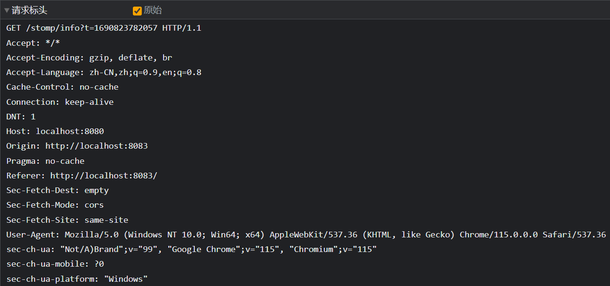
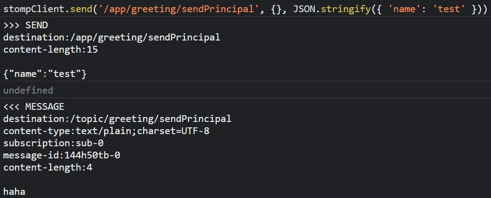

## WebSocket

[一篇文章彻底搞懂websocket协议的原理与应用（一）](https://zhuanlan.zhihu.com/p/581974844)

[一篇文章彻底搞懂websocket协议的原理与应用（二）](https://zhuanlan.zhihu.com/p/581980655)

|TCP/IP 五层模型|协议|
| :----: | :-------------------------------------: |
| 应用层 | HTTP, WebSocket, SOAP, DNS, FTP, Telnet, SMTP, P2P, EMAIL/POP |
| 传输层 |                TCP, UDP                 |
| 网络层 |                IP, ICMP, RIP, IGMP                |
| 数据链路层 |                ARP, RARP, IEEE802.3, PPP, CSMA/CD                |
| 物理层 | Manchester, MLT-3, 4A, PAM5, FE自协商 |

**WebSocket 是基于 TCP的应用层协议。**需要特别注意的是，虽然 WebSocket 协议在建立连接时会使用HTTP 协议，但这并不意味着 WebSocket 协议是基于 HTTP 协议实现的。

WebSocket 与 HTTP（短连接，短轮询）区别：

- 通信方式不同

  WebSocket 是双向通信模式，客户端与服务器之间只有在握手阶段是使用 HTTP 协议的“**请求-响应**”模式交互，而一旦连接建立之后的通信则使用**双向**模式交互，不论是客户端还是服务端都可以随时将数据发送给对方；而 HTTP 协议则**至始至终**都采用“请求-响应”模式进行通信。也正因为如此，HTTP 协议的通信效率没有 WebSocket 高。

- 协议格式不同

  HTTP 协议的一个数据包就是一条完整的消息；而 **WebSocket 客户端与服务端通信的最小单位是帧（frame）**，由 1 个或多个帧组成一条完整的消息。即：发送端将消息切割成多个帧，并发送给服务端；服务端接收消息帧，并将关联的帧重新组装成完整的。


[什么是轮询、长轮询、长连接](https://mp.weixin.qq.com/s?__biz=MzA4ODIyMzEwMg==&mid=2447536690&idx=1&sn=df30a28f4f74dadefec2e4b67accb2b6&chksm=843bae23b34c27352e44b889e6f109d1e62f97bc7ed08814c4b5718061945a60aad6ed3a3547&scene=21#wechat_redirect)，实际上 HTTP 根本不分长连接和短连接，或者说“ HTTP 的长短连接，其实是在 TCP 连接中实现的 ”：

> **HTTP 协议的长连接和短连接，本质上是 TCP 协议的长连接和短连接。**HTTP 属于应用层协议，在传输层使用 TCP 协议，在网络层使用IP协议。 IP 协议主要解决网络路由和寻址问题，TCP 协议主要解决如何在 IP 层之上可靠地传递数据包，使得网络上接收端收到发送端所发出的所有包，并且接受顺序与发送顺序一致。TCP 协议是可靠的、面向连接的。TCP 才负责连接，只有负责传输的这一层才需要建立连接。
>
> 在 HTTP/1.0 中默认使用短连接。也就是说，客户端和服务器每进行一次 HTTP 操作，就建立一次连接，任务结束就中断连接。当客户端浏览器访问的某个 HTML 或其他类型的 Web 页中包含有其他的 Web 资源（如 JavaScript 文件、图像文件、CSS 文件等），每遇到这样一个 Web 资源，浏览器就会重新建立一个 HTTP 会话。
>
> 而从 HTTP/1.1 起，默认使用长连接，用以保持连接特性。使用长连接的 HTTP 协议，会在响应头加入这行代码（但要服务器和客户端都设置）：Connection: keep-alive

WebSocket 与 HTTP 长连接的区别（HTTP 长连接的缺点）：

- 队头阻塞：

  如果仅仅使用一个连接，它需要发起请求、等待响应，之后才能发起下一个请求。在请求应答过程中，如果出现任何状况，剩下所有的工作都会被阻塞在那次请求应答之后。这就是“**队头阻塞**”，它会阻碍网络传输和 Web 页面渲染，**直至失去响应**。为了防止这种问题，现代浏览器会针对单个域名开启 6 个连接，通过各个连接分别发送请求。它实现了某种程度上的并行，但是每个连接仍会受到“队头阻塞”的影响。

- pipline：

  为解决队头阻塞这个问题，提出了 pipline 方案。虽然在一个 TCP 通道中实现了多个http并发，但因为该方案有缺陷，大部分浏览器默认是关闭 pipeline 的。

  其一是因为返回的时候是会阻塞的，谁先到达，谁先返回，**顺序绝对不能乱**。另一个 pipeline 限制是，**只能是幂等请求**（get、head等）才能应用 pipeline。


与HTTP/2的区别：

|                |           HTTP/2            |     WebSocket     |
| :------------: | :-------------------------: | :---------------: |
|    Headers     |      Compressed(HPACK)      |       None        |
|     Binary     |              ✔              | Binary or Textual |
|  Multiplexing  |              ✔              |         ✔         |
| Prioritization |              ✔              |         ❌         |
|  Compression   |              ✔              |         ✔         |
|   Direction    | Client/Server + Server Push |   Bidirectional   |
|  Full-Duplex   |              ✔              |         ✔         |

---

### 请求与响应

通过 JavaScript 创建的 WebSocket 实例：


- binaryType：使用二进制的数据类型连接；
- bufferedAmount（只读）：未发送至服务器的字节数；
- extensions（只读）：服务器选择的扩展，如`permessage-deflate`会使用deflate算法将payload进行压缩；
- onclose：用于指定连接关闭后的回调函数；
- onerror：用于指定连接失败后的回调函数；
- onmessage：用于指定当从服务器接受到信息时的回调函数；
- onopen：用于指定连接成功后的回调函数；
- protocol（只读）：用于返回服务器端选中的子协议的名字；
- readyState（只读）：返回当前WebSocket的连接状态，共有4种状态：
  - CONNECTING：正在连接中，对应的值为0；
  - OPEN：已经连接并且可以通讯，对应的值为1；
  - CLOSING：连接正在关闭，对应的值为2；
  - CLOSED：连接已关闭或者没有连接成功，对应的值为3；
- url（只读）：返回值为当构造函数创建WebSocket实例对象时URL的绝对路径。

通过HTTP升级协议建立WebSocket：


请求（No. 537）头：


- GET ws://localhost…… HTTP/1.1 ：打开阶段握手，使用http1.1协议；
- `Upgrade：websocket`：表示请求为特殊http请求，请求的目的是要将客户端和服务端的通信协议从http升级为websocket；
- `Sec-websocket-key`：Base64 encode 的值，是浏览器随机生成的。客户端向服务端提供的握手信息。

响应（No. 541）头：


- HTTP `101 Switching Protocol`（协议切换）状态码表示**服务器**同意**客户端升级协议**的请求对协议进行切换；
- `Connection: upgrade`该Connection头被设置为`upgrade`以表示升级的要求；
- `Upgrade: websocket`所述Upgrade标头指定的一个或多个以逗号分隔的协议名称；
- `Sec-websocket-accept`: 将请求头中的`Set-websocket-key`添加字符串并做SHA-1加密后做Base64编码，告知客户端服务器能够发起websocket连接。

https://blog.csdn.net/qq_21137441/article/details/122576173

在浏览器 DevTools 的网络中，选取 WS 请求，可以看到凭借此请求建立的 WebSocket 发送和接受的全部消息：前端向后端发送了一条信息“WebSocket前端连接成功”，然后后端又向前端发送了一条信息“WebSocket后端连接成功”。


---

### 帧

WebSocket frame（帧）结构：

帧的发送接收端口与HTTP的请求响应端口一致，是同一个连接，都是浏览器（客户端）的端口，例如图中的 8080。

https://blog.csdn.net/weixin_42517691/article/details/121493939


带有`MASKED`是客户端发送给服务端的，不带的则是服务端发送给客户端的，详见帧结构`MASK`。


https://pic1.zhimg.com/80/v2-b1c04497d138689f6b9e4e62a29c07d0_720w.webp

```
Frame format:

      0                   1                   2                   3
      0 1 2 3 4 5 6 7 8 9 0 1 2 3 4 5 6 7 8 9 0 1 2 3 4 5 6 7 8 9 0 1
     +-+-+-+-+-------+-+-------------+-------------------------------+
     |F|R|R|R| opcode|M| Payload len |    Extended payload length    |
     |I|S|S|S|  (4)  |A|     (7)     |             (16/64)           |
     |N|V|V|V|       |S|             |   (if payload len==126/127)   |
     | |1|2|3|       |K|             |                               |
     +-+-+-+-+-------+-+-------------+ - - - - - - - - - - - - - - - +
     |     Extended payload length continued, if payload len == 127  |
     + - - - - - - - - - - - - - - - +-------------------------------+
     |                               |Masking-key, if MASK set to 1  |
     +-------------------------------+-------------------------------+
     | Masking-key (continued)       |          Payload Data         |
     +-------------------------------- - - - - - - - - - - - - - - - +
     :                     Payload Data continued ...                :
     + - - - - - - - - - - - - - - - - - - - - - - - - - - - - - - - +
     |                     Payload Data continued ...                |
     +---------------------------------------------------------------+
```

- FIN：1位，用于描述消息是否结束，如果为1则该消息为消息尾部，如果为0则还有后续数据包；
- RSV1~3：各1位，用于扩展定义，如果没有扩展约定的情况则必须为0；
- opcode：4位，用于表示消息接收类型，如果接收到未知的opcode，接收端必须关闭连接。RFC6455定义的opcode共有如下几种：
  - 0x0：附加数据帧，当前数据帧为分片的数据帧；
  - 0x1：文本数据帧，采用UTF-8编码；
  - 0x2：二进制数据帧；
  - 0x3~0x7：暂时无定义，为以后的非控制帧保留；
  - 0x8：连接关闭；
  - 0x9：ping；
  - 0xA：pong；
  - 0xB~0xF：暂时无定义，为以后的控制帧保留；
- MASK：1位，用于标识PayloadData是否经过掩码处理。服务端发送给客户端的数据帧不能使用掩码，客户端发送给服务端的数据帧必须使用掩码。如果一个帧的数据使用了掩码，那么在Maksing-key部分必须是一个32个bit位的掩码，用来给服务端解码数据（Masking-key和Masked Payload）；
- Payload len：数据的长度：默认位7个bit位。如果数据的长度小于125个字节（注意：是字节）则用默认的7个bit来标示数据的长度。如果数据的长度为126个字节，则用后面相邻的2个字节来保存一个16bit位的无符号整数作为数据的长度。如果数据的长度大于126个字节，则用后面相邻的8个字节来保存一个64bit位的无符号整数作为数据的长度；
- Extended payload length：payload len本来是只能用7bit来表达的，也就是最多一个frame的payload只能有127个字节，为了表示更大的长度，给出的解决方案是添加扩展payload len字段。当payload实际长度超过126（包括），但在2^16-1长度内，则将payload len置为126，payload的实际长度由长为16bit的extended payload length来表达。当payload实际长度超过216（包括），但在264-1长度内，则将payload置为127，payload的实际长度由长为64bit的extended payload length来表达；
- Masking-key：如果MASK设置位0，则该部分可以省略，如果MASK设置位1，则Masking-key是一个32位的掩码。用来解码客户端发送给服务端的数据帧得到Masked Payload：
  - 出于安全考虑，客户端必须在它发送到服务端的所有帧中**添加**掩码；
  - 服务端收到**没有添加**掩码的数据帧以后，必须立即关闭连接；
  - 服务端**不能**在它发送到客户端的任何帧中添加掩码，直接发ASCII码；
  - 客户端在收到**添加了**掩码的数据帧以后，必须立即关闭连接；

- Masked Payload：如果MASK设置位0，则该部分可以省略，如果MASK设置位1，Payload会与Masking-key做掩码运算（每8位做一次XOR运算）得到Masked Payload用作实际传输。例如：5e32,8729，5e32,8729,5e32 XOR ca48,cdc9,c9b5 = 947a,4ae0,9787；
- Payload Data：该部分，也是最后一部分，是帧真正要发送的数据，包括了**扩展数据**和**应用数据**，可以是任意长度。在某些场景下，扩展数据的长度可能为零。

控制帧：

控制帧可能插在一个Message的多个分片之间，但一个Message的分片不能交替传输(除非有扩展特别定义)。

控制帧不可分片。

分片需要按照分送方提交顺序传递给接收方，但由于IP路由特性，实际并不能保证顺序到达。

控制帧包括:

- Close：用于关闭连接，可以携带数据，表示关闭原因。

  

- Ping：可以携带数据。

- Pong：用于Keep-alive，返回最近一次Ping中的数据，可以只发送Pong帧，做单向心跳。

| 状态码 | 说明                                                         |
| :----: | :----------------------------------------------------------- |
|  1000  | 正常关闭                                                     |
|  1001  | 离开，服务端停止服务或客户端关闭                             |
|  1002  | 协议错误                                                     |
|  1003  | 无法接受的数据帧类型，比如只支持文本却收到二进制             |
|  1004  | 保留                                                         |
|  1005  | 只用于本地通知上层应用没有状态                               |
|  1006  | 只用于本地通知上层应用连接异常关闭                           |
|  1007  | 接收到一个与opcode不符合的message                            |
|  1008  | 违反策略，用于没有合适的状态码或屏蔽具体关闭原因             |
|  1009  | 消息过长                                                     |
|  1010  | 响应头中有Sec-WebSocket-Extensions，但取值不是请求头中的子集，客户端判定连接失败而关闭连接 |
|  1011  | 服务端遇到异常无法提供服务                                   |
|  1012  | 用于本地通知上层应用TLS连接失败导致连接无法建立              |

## Sping Integration IP

`@MessageMapping`必须和`@Controller`或`@RestController`搭配使用。

## STOMP

**S**imple (or **S**treaming) **T**ext **O**rientated **M**essaging **P**rotocol

STOMP 是一个更高级的协议，它的前身是 TTMP 协议（一个简单的基于文本的协议），专为消息中间件设计。是属于消息队列的一种协议, 和 AMQP, JMS 平级。它的简单性恰巧可以用于定义 WebSocket 的消息体格式。STOMP 协议很多 MQ 都已支持, 比如 RabbitMq, ActiveMq。生产者（发送消息）、消息代理、消费者（订阅然后收到消息）。它使用一个基于帧（frame）的格式来定义消息，与HTTP的 request 和 response 类似。下文主要讲述 stomp 在 websocket 中的配置，以及与 session 的集合做点对点通信，以及微信小程序等需要ws/wss 协议时候前后端的配置。


通过JavaScript创建的SockJS实例：


通过JavaScript创建的STOMP实例：


stomp实例的ws属性持有sockjs实例：stompClient.ws === socket

通过HTTP升级协议建立WebSocket：


第一个 HTTP 请求头（No. 344）：



第一个 HTTP 响应头（No. 348）：


响应数据：


第二个 HTTP 请求头（No. 355）：


第二个 HTTP 响应头（No. 359）：


STOMP frame（帧）结构：

帧的发送接收（No. 361）端口号 14901，同时也是第二个 HTTP 的请求（No. 355）发起的端口号，是由第一个 HTTP 的请求（No. 344）发起的端口号 14900 加 1，都是客户端（浏览器）的端口，这里服务端的端口为 8080。


在浏览器 DevTools 的网络中，选取 WS 请求，可以看到凭借此请求建立的 WebSocket 发送和接受的全部消息，其中“o”为建立连接，“h”为心跳检测，间隔时间为 1000ms（由`StompEndpointRegistry`设置）：


在通道拦截器的`preSend`方法处拦截，可以获取到发送消息时携带的 header 和 JSON 数据体等：


### Heart Beat


ChatGPT-4o：

> 在 Spring WebSocket STOMP 支持中，`StompEndpointRegistry` 和 `MessageBrokerRegistry` 都可以配置心跳，但它们针对的对象和作用范围有所不同。
>
> ### StompEndpointRegistry
>
> `StompEndpointRegistry` 主要用于配置 STOMP 端点，包括启用 SockJS 支持和配置心跳等参数。这些设置通常影响客户端和服务器之间的直接 WebSocket 连接。
>
> #### 用途和配置方法
>
> - **配置 WebSocket STOMP 端点**：指定客户端连接到服务器的 STOMP 端点。
> - **配置 SockJS 支持**：启用 SockJS 作为 WebSocket 的回退选项。
> - **配置心跳**：设置心跳参数影响 WebSocket 连接上的心跳行为。
>
> 示例配置：
>
> ```java
> import org.springframework.context.annotation.Configuration;
> import org.springframework.web.socket.config.annotation.EnableWebSocketMessageBroker;
> import org.springframework.web.socket.config.annotation.StompEndpointRegistry;
> import org.springframework.web.socket.config.annotation.WebSocketMessageBrokerConfigurer;
> 
> @Configuration
> @EnableWebSocketMessageBroker
> public class WebSocketConfig implements WebSocketMessageBrokerConfigurer {
> 
>     @Override
>     public void registerStompEndpoints(StompEndpointRegistry registry) {
>         registry.addEndpoint("/ws")
>                 .withSockJS()
>                 .setHeartbeatTime(10000);  // 设置SockJS的心跳时间
>     }
> }
> ```
>
> 在这个例子中，`setHeartbeatTime` 设置了 SockJS 的心跳时间。如果你不使用 SockJS，标准的 WebSocket 连接并没有直接在 `StompEndpointRegistry` 上的心跳配置。
>
> ### MessageBrokerRegistry
>
> `MessageBrokerRegistry` 用于配置消息代理，涉及服务器端的消息路由和心跳机制。这个配置影响的是消息代理与客户端之间的心跳行为。
>
> #### 用途和配置方法
>
> - **配置简单消息代理或完整的消息代理（如 RabbitMQ）**：定义消息路由规则。
> - **配置心跳机制**：设置心跳参数，影响消息代理与客户端之间的心跳行为。
>
> 示例配置：
>
> ```java
> import org.springframework.context.annotation.Configuration;
> import org.springframework.messaging.simp.config.MessageBrokerRegistry;
> import org.springframework.web.socket.config.annotation.EnableWebSocketMessageBroker;
> import org.springframework.web.socket.config.annotation.WebSocketMessageBrokerConfigurer;
> 
> @Configuration
> @EnableWebSocketMessageBroker
> public class WebSocketConfig implements WebSocketMessageBrokerConfigurer {
> 
>     @Override
>     public void configureMessageBroker(MessageBrokerRegistry config) {
>         config.enableSimpleBroker("/topic", "/queue")
>               .setHeartbeatValue(new long[]{10000, 10000});  // 设置消息代理的心跳值
>     }
> }
> ```
>
> 在这个例子中，`setHeartbeatValue` 设置了消息代理与客户端之间的心跳时间。
>
> ### 区别总结
>
> - **`StompEndpointRegistry`**:
>   - 用于配置 STOMP 端点，影响客户端与服务器之间的 WebSocket 连接。
>   - 主要用于初始化 WebSocket 端点，配置 SockJS 和基本的心跳行为。
>
> - **`MessageBrokerRegistry`**:
>   - 用于配置消息代理，影响消息代理与客户端之间的心跳机制。
>   - 主要用于配置消息路由、简单消息代理或完整的消息代理（如 RabbitMQ），以及心跳机制。
>
> 两者配置的心跳机制是针对不同层次的连接，`StompEndpointRegistry` 主要针对初始连接和传输层，`MessageBrokerRegistry` 则针对应用层消息传递中的心跳机制。因此，如果你在配置 STOMP 心跳时，需要明确你想要调整的是哪个层次的心跳机制，并根据具体需求进行配置。

### Principal

### MessageMapping

https://blog.csdn.net/u011943534/article/details/97098687

## Spring Boot 整合 WebSocket 的多种方式

### EnableWebSocket  + ServerEndpoint

1. pom.xml

    ```xml
    <dependency>
       <groupId>org.springframework.boot</groupId>
       <artifactId>spring-boot-starter-websocket</artifactId>
    </dependency>
    ```

2. WebSocketConfig.java

    注入ServerEndpointExporter，这个bean会自动注册使用了`@ServerEndpoint`注解声明的WebSocket Endpoint。注意，如果要使用**独立的servlet容器**，而不是直接使用SpringBoot的内置容器，比如**外部容器部署war包**，就不要注入ServerEndpointExporter，因为它将由容器自己提供和管理。

    ```java
    @Configuration
    @EnableWebSocket
    public class WebSocketConfig {
        @Bean
        public ServerEndpointExporter exporter() {
            return new ServerEndpointExporter();
        }
    }
    ```

3. MyWebSocket.java

    ```java
    @Component
    @ServerEndpoint("/myWs/{userId}")
    public class MyWebSocket {
        /**
         * Component注解是Lite模式，MyWebSocket是多例的，只有生成的第一个对象是被容器管理的bean
         */
        private static final CopyOnWriteArraySet<MyWebSocket> WS_POOL = new CopyOnWriteArraySet<>();
        
        public Session session;
        
        public Integer userId;
        
        /**
         * 连接成功
         */
        @OnOpen
        public void onOpen(Session session, @PathParam("userId") Integer userId) {
            this.session = session;
            this.userId = userId;
            if (WS_POOL.contains(this)) {
                WS_POOL.remove(this);
            }
            WS_POOL.add(this);
            System.out.println("连接成功：" + userId);
        }
    
        /**
         * 连接关闭
         */
        @OnClose
        public void onClose(Session session) {
            set.remove(this);
            System.out.println("连接关闭：" + this.userId);
        }
    
        /**
         * 接收到消息
         */
        @OnMessage
        public String onMsg(String text) throws IOException {
            return "servet 发送：" + text;
        }
        
        /**
         * 群发消息
         */
        public void broadcast(String message) throws Exception {
            // 遍历客户端
            for (MyWebSocket ws : WS_POOL) {
                System.out.println("广播消息：" + message);
                // 服务器主动推送
                ws.session.getBasicRemote().sendText(message);
            }
        }
        
        /**
         * 指定用户发送消息
         */
        public void sendMessage(Integer userId, String message) throws Exception {
            Session session = null;
            for (MyWebSocket ws : WS_POOL) {
                if (Objects.equals(ws.userId, userId)) {
                    session = ws.session;
                    break;
                }
            }
            if (session != null) {
                // 服务器主动推送
                session.getBasicRemote().sendText(message);
            } else {
                System.out.println("没有找到你指定ID的会话，userId:" + userId);
            }
        }
    }
    ```

### EnableWebSocket +  WebSocketConfigurer

1. pom.xml

    ```xml
    <dependency>
        <groupId>org.springframework.boot</groupId>
        <artifactId>spring-boot-starter-websocket</artifactId>
    </dependency>
    ```

2. WebSocketConfig.java

    设置拦截器和跨域放行的域名，拦截器加入拦截链：

    ```java
    @Configuration
    @EnableWebSocket
    public class WebSocketConfig implements WebSocketConfigurer {
        /**
         * 跨域地址
         */
        @Value("${cors-filter.access-control-allow-origin}")
        private String accessControlAllowOrigin;
        
        @Resource
        @Qualifier("webSocketInterceptor")
        private WebSocketInterceptor interceptor;
    
        @Resource
        @Qualifier("webSocketHandler")
        private WebSocketHandler handler;
    
        @Override
        public void registerWebSocketHandlers(WebSocketHandlerRegistry registry) {
            registry.addHandler(handler, "/ws")
                	.addInterceptors(interceptor)
                	.setAllowedOrigins(accessControlAllowOrigin);
        }
    }
    ```

3. HandshakeInterceptor.java

    先被拦截器拦截，然后被处理器拦截：

    ```java
    @Component
    public class WebSocketInterceptor implement HandShakeInterceptor {
        @Override
        public boolean beforeHandshake(ServerHttpRequest request, ServerHttpResponse response, WebSocketHandler wsHandler, Map<String, Object> attributes) throws Exception {
            // 预设的 OriginHandshakeInterceptor 会在此判断域名是否同源
            return true;
        }
        
        @Override
        public void afterHandshake(ServerHttpRequest request, ServerHttpResponse response, WebSocketHandler wsHandler, Exception exception) {
            
        }
    }
    ```

4. WebSocketHandler.java

    ```java
    @Component
    public class WebSocketHandler extends TextWebSocketHandler {
        @Override
        public void afterConnectionEstablished(WebSocketSession session) throws Exception {
            WebSocketSessionUtil.put(session.getId(), session);
            super.afterConnectionEstablished(session);
        }
    
        @Override
        public void handleMessage(WebSocketSession session, WebSocketMessage<?> message) throws Exception {
            log.info("WebSocket后端连接成功: [ID=" + session.getId() + ", Message=" + message.getPayload() + "]");
            super.handleMessage(session, message);
        }
        
        @Override
        protected void handleTextMessage(WebSocketSession session, TextMessage message) throws Exception {
            log.info("WebSocket后端连接成功: [ID=" + session.getId() + ", Message=" + message.getPayload() + "]");
            super.handleTextMessage(session, message);
        }
    
        @Override
        public void handleTransportError(WebSocketSession session, Throwable exception) throws Exception {
            log.error("WebSocket传输异常", exception);
            super.handleTransportError(session, exception);
        }
    
        @Override
        public void afterConnectionClosed(WebSocketSession session, CloseStatus status) throws Exception {
            WebSocketSessionUtil.removeAndClose(session.getId(), status);
            super.afterConnectionClosed(session, status);
        }
    }
    ```

5. WebSocketSessionUtil.java

    ```java
    public class WebSocketSessionUtil {
        /**
         * 会话池
         */
        public static final Map<Object, WebSocketSession> SESSION_MAP = new ConcurrentHashMap<>();
    
        public static WebSocketSession put(Object key, WebSocketSession session) {
            return SESSION_MAP.put(key, session);
        }
    
        public static WebSocketSession get(Object key) {
            return SESSION_MAP.get(key);
        }
    
        public static WebSocketSession remove(Object key) {
            return SESSION_MAP.remove(key);
        }
    
        public static WebSocketSession removeAndClose(Object key, CloseStatus status) {
            WebSocketSession session = remove(key);
            if (session != null) {
                try {
                    session.close(status);
                } catch (IOException e) {
                    e.printStackTrace();
                    log.error("关闭WebSocket会话失败: [key=" + key + ", status=" + status + "]" , e);
                }
            }
            return session;
        }
    }
    ```

6. 服务器向客户端发送消息：

   ```java
   session.sendMessage(new TextMessage(message));
   ```

   避免线程冲突：

   ```java
   /**
    * 自旋锁
    */
   private static final AtomicReference<WebSocketSession> ATOMIC_REFERENCE = new AtomicReference<>();
   
   /**
    * 多线程发送消息
    */
   public void multiSend() {
       for (WebSocketSession session : WebSocketSessionUtil.SESSION_MAP.values()) {
           try {
               // 加锁 如果自旋锁已经是session了，说明有别的线程在占用，循环等待
               while (!ATOMIC_REFERENCE.compareAndSet(null, session));
               session.sendMessage(new TextMessage(message));
           } catch (IOException e) {
               e.printStackTrace();
               log.error("WebSocket发送消息失败: [ID=" + session.getId() + ", message=" + message + "]", e);
           } finally {
               // 解锁 当前线程使用结束，自旋锁恢复null
               ATOMIC_REFERENCE.compareAndSet(session, null);
           }
       }
   }
   ```

7. javascript

   ```javascript
   <script type="text/javascript">
     window.onload = () => {
       if (!'WebSocket' in window) {
         return
       }
       
       ws = new WebSocket("ws://localhost:8080/ws")
       
       ws.onopen = () => {
         ws.send("WebSocket前端连接成功")
       }
       
       ws.onmessage = msg => {
         console.log(msg.data)
       }
       
       ws.onerror = evt => {
         console.log("WebSocket连接错误", evt)
       }
       
       ws.onclose = () => {
         console.log("WebSocket连接关闭")
       }
       
       window.onbeforeunload = () => {
         ws.close()
       }
     }
     
     ws.send("hello world")
   </script>
   ```

### EnableWebSocketMessageBroker  + WebSocketMessageBrokerConfigurer（STOMP）

1. pom.xml

    ```xml
    <dependency>
        <groupId>org.springframework.boot</groupId>
        <artifactId>spring-boot-starter-websocket</artifactId>
    </dependency>
    ```

2. STOMPConfig.java + ChannelInterceptor

    ```java
    @Configuration
    @EnableWebSocketMessageBroker
    public class STOMPConfig implements WebSocketMessageBrokerConfigurer {
        /**
         * 跨域地址
         */
        @Value("${cors-filter.access-control-allow-origin}")
        private String accessControlAllowOrigin;
    
        /**
         * 暴露一个基于WebSocket/SockJS的STOMP端点
         */
        @Override
        public void registerStompEndpoints(StompEndpointRegistry registry) {
            registry.addEndpoint("/stomp").setAllowedOrigins(accessControlAllowOrigin).withSockJS().setHeartbeatTime(1000);
            WebSocketMessageBrokerConfigurer.super.registerStompEndpoints(registry);
        }
    
        /**
         * 代理
         */
        @Override
        public void configureMessageBroker(MessageBrokerRegistry registry) {
            // 如果destination以"/app"开头，则消息路由给@Controller + @MessageMapping的消息处理方法，默认是"/"
            registry.setApplicationDestinationPrefixes("/app");
            // 指定用户一对一通信
            registry.setUserDestinationPrefix("/user")
            // 下面路径的destination广播给所有其它客户端，前端也可以通过此路径发送给订阅此路径的所有前端
            registry.enableSimpleBroker("/topic");
        }
    
        /**
         * 设置拦截器
         */
        @Override
        public void configureClientInboundChannel(ChannelRegistration registration) {
            registration.interceptors(channelInterceptor());
        }
    
        /**
         * 通道拦截器
         */
        @Bean
        public ChannelInterceptor channelInterceptor() {
            return new ChannelInterceptor() {
                /**
                 * 可以在此处认证用户
                 */
                @Override
                public Message<?> preSend(Message<?> message, MessageChannel channel) {
                    StompHeaderAccessor accessor = MessageHeaderAccessor.getAccessor(message, StompHeaderAccessor.class);
                    if (accessor != null && StompCommand.CONNECT.equals(accessor.getCommand())) {
                        // 设置Principal对象，可在Controller中获取
                        accessor.setUser(() -> "haha");
                    }
                    return ChannelInterceptor.super.preSend(message, channel);
                }
    
                @Override
                public void postSend(Message<?> message, MessageChannel channel, boolean sent) {
                    ChannelInterceptor.super.postSend(message, channel, sent);
                }
    
                @Override
                public void afterSendCompletion(Message<?> message, MessageChannel channel, boolean sent, Exception ex) {
                    ChannelInterceptor.super.afterSendCompletion(message, channel, sent, ex);
                }
    
                @Override
                public boolean preReceive(MessageChannel channel) {
                    return ChannelInterceptor.super.preReceive(channel);
                }
    
                @Override
                public Message<?> postReceive(Message<?> message, MessageChannel channel) {
                    return ChannelInterceptor.super.postReceive(message, channel);
                }
    
                @Override
                public void afterReceiveCompletion(Message<?> message, MessageChannel channel, Exception ex) {
                    ChannelInterceptor.super.afterReceiveCompletion(message, channel, ex);
                }
            };
        }
    }
    ```

3. STOMPController.java

    配合`@Controller`，`@MessageMapping`是前端的endpoint作为后端的接受， 而`@SendTo`作为后端向前端订阅者推送。`@MessageMapping`标注的方法，只会处理**SEND**发送的消息。`@MessageMapping`如果<u>不配合</u>`@`SendTo使用，如果方法有返回值则会将直接发给各个代理，例如下面的例子会在`/app/greeting/sendPrincipal`接收到然后发给`/topic/greeting/sendPrincipal`，也就是把路径中应用前缀（application destination prefix）的部分换成代理前缀（simple broker）。

    可以看到左边加`@SendTo`与右边不加，发送MESSAGE的destination不同：

    

    `@SendToUser`表示要将消息发送给指定的用户，会自动在消息目的地前补上用户前缀（user destination prefix）。当`broadcast=true`时，会广播给所有订阅（SUBSCRIBE）了“userDestinationPrefix + sendToUser.value”地址的用户，例如下文中的`/user/topic`。当`broadcast=false`时，只会发送给消息来源用户“userDestinationPrefix + **username** + sendToUser.value”。Spring按照以下规则确定username：

    - 如果当前会话的Principal存在，则取`Principal.getName()`作为用户名

    - 否则，取会话标识符，会话标识符来自消息头中的`simpSessionId`字段

    ~~当允许同一个用户在多个浏览器中登录时，要注意这个情况，如果Principal存放登录名，客户端可能接收到不期望的消息。~~不论是`@SendTo`还是`@SendToUser`，他们的底层实现都是依赖了`SimpMessageTemplate`。其中`@SendTo`依赖的是`convertAndSend`方法，`@SendToUser`依赖的是`convertAndSendToUser`方法，这两个方法最终又是依赖的`SimpMessageTemplate.doSend`方法和`SimpMessageTemplate.sendInternal`方法。而后`/user/{username}/topic`（如果Principal对象没有name则是`/user/{sessionId}/topic`）被`UserDestinationMessageHandler`和`DefaultUserDestinationResolver`转换为真实的地址`/topic-user{sessionId}`，并再次通过`SimpMessageTemplate.doSend`方法和`SimpMessageTemplate.sendInternal`方法发送到真实的地址。

    Principal有name：

    

    Principal没有name：

    

    `@SubscribeMapping`标注的方法，只会处理**SUBSCRIBE**发送的消息。在接受到匹配的目的地的订阅时，对消息做出反应。如果配合`@SendTo`则会发送到指定代理，否则原路径返回。

    原路径SUBCRIBE和发送路径MESSAGE都是`/app/greeting/sub`：

    

    ```java
    @RestController
    @MessageMapping("/greeting")
    public class STOMPController {
        @Resource
        private SimpUserRegistry userRegistry;
    
        /**
         * 此消息处理方法处理/app/greeting/principle这一目标
         */
        @MessageMapping("/principal")
        public void principal(Principal principal, StompHeaderAccessor accessor) {
            System.out.println(userRegistry.getUsers());
            System.out.println(principal.getName());
        }
    
        /**
         * 此消息处理方法处理/app/greeting/sendPrinciple这一目标，并将返回结果发送给/topic
         */
        @MessageMapping("/sendPrincipal")
        @SendTo("/topic") // 不加则会发给/topic/greeting/sendPrincipal
        public String sendPrincipal(Principal principal, StompHeaderAccessor accessor) {
            System.out.println(userRegistry.getUsers());
            return principal.getName();
        }
        
        @SubscribeMapping("/sub")
        @SendTo("/app/greeting/sub")
        public String subscribePrincipal(Principal principal, StompHeaderAccessor accessor) {
            System.out.println(userRegistry.getUsers());
            return principal.getName();
        }
        
        /**
         * 此消息处理方法处理/app/greeting/sendToPrinciple这一目标，并将返回结果只发送给发送者的/user/topic
         */
        @MessageMapping("/sendToPrincipal")
        @SendToUser(value = "/topic", broadcast = false)
        public String sendToPrincipal(Principal principal, StompHeaderAccessor accessor) {
            System.out.println(userRegistry.getUsers());
            return principal.getName();
        }
    }
    ```

4. 任意位置发送消息

    ```java
    @Autowired
    private SimpMessagingTemplate template;
    
    @Autowired
    private SimpMessageSendingOperations operations;
    
    public void send(String msg) {
        // 任意位置发送消息 destination: /topic
        template.convertAndSend("/topic", msg);
        // destination: /user/Tom/topic
        operations.convertAndSendToUser("Tom", "/topic", msg);
    }
    ```

5. javascript

   ```javascript
   <script src="js/sockjs.min.js"></script>
   <script src="js/stomp.min.js"></script>
   <script type="text/javascript">
     let socket = null
     
     let stompClient = null
     
     let connect = () => {
       socket = new SockJS('http://localhost:8080/stomp')
       stompClient = Stomp.over(socket)
       // CONNECT
       stompClient.connect({
         token: '123' // 此处可以携带键值对
       }, frame => {
         // SUBSCRIBE
         stompClient.subscribe('/topic', msg => {
           console.log(msg.body)
         })
       })
     }
     
     let disconnect = () => {
       if (stompClient !== null) {
         // DISCONNECT
         stompClient.disconnect()
       }
       console.log("Disconnected")
     }
   
     // 载入时连接
     window.onload = connect
     // 刷新前关闭连接
     window.onbeforeunload = disconnect
   
     // SEND
     // destinationPath = applicationDestinationPrefix + messageMappingValue
     stompClient.send('/app/greeting/principal', {}, JSON.stringify({ 'name': 'Tom' }))
   </script>
   ```

### Netty

1. pom.xml

   ```xml
   <dependency>
       <groupId>io.netty</groupId>
       <artifactId>netty-all</artifactId>
   </dependency>
   ```

2. MyNettyServer.java

3. MyChannelPool.java

4. MyWebSocketHandler.java

5. javascript

### WebFlux

### TIO


[loadrunner下websocket协议性能测试（一）](https://blog.csdn.net/weixin_42517691/article/details/121493939)

[springboot学习(二十一) springboot中websocket使用@MessageMapping接收各种类型数据](https://blog.csdn.net/u011943534/article/details/97098687)


[https://blog.csdn.net/qq_21137441/article/details/122576173]: 
[https://blog.csdn.net/weixin_42517691/article/details/121493939]: 
