# 日志

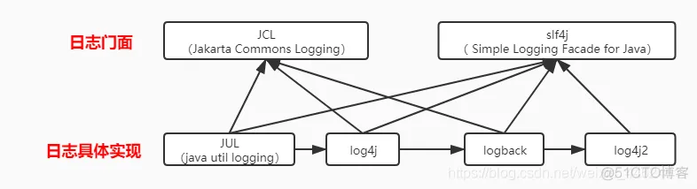

## 发展历程

1. log4j（作者Ceki Gülcü）出来时就等到了广泛的应用（注意这里是直接使用，而不是实现框架），是Java日志事实上的标准，并成为了Apache的项目；
2. Apache要求把log4j并入到JDK，SUN拒绝，并在jdk1.4版本后增加了JUL（java.util.logging）；
3. 毕竟是JDK自带的，JUL也有很多人用。同时还有其他日志组件，如SimpleLog等。这时如果有人想换成其他日志组件，如log4j换成JUL，因为api完全不同，就需要改动代码；
4. Apache见此，开发了JCL（Jakarta Commons Logging），即commons-logging-xx.jar。它只提供一套通用的日志接口api，并不提供日志的实现。很好的设计原则嘛，依赖抽象而非实现。这样应用程序可以在运行时选择自己想要的日志实现组件；
5. 这样看上去也挺美好的，但是log4j的作者觉得JCL不好用，自己开发出slf4j，它跟JCL类似，本身不替供日志具体实现，只对外提供接口或门面。目的就是为了替代JCL。同时，还开发出logback，一个比log4j拥有更高性能的组件，目的是为了替代log4j；
6. Apache参考了logback,并做了一系列优化，推出了log4j2。

## 体系架构

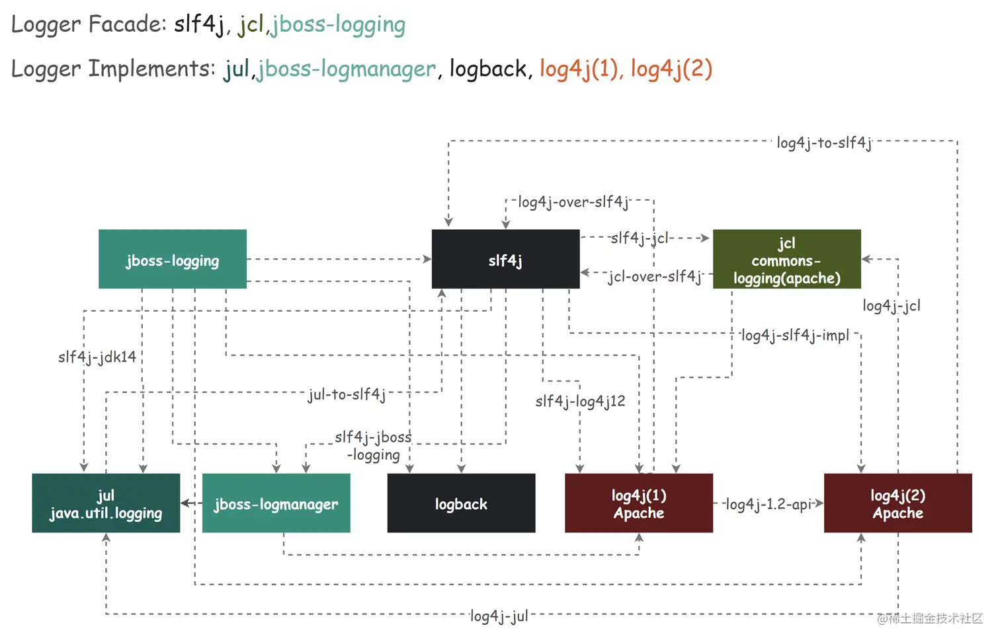

门面（接口）、框架（产品、实现）和桥接器、适配器之间的关系（其中Log4j2分离为log4j-api和log4j-core，slf4j-log4j12现改名为slf4j-reload4j）：

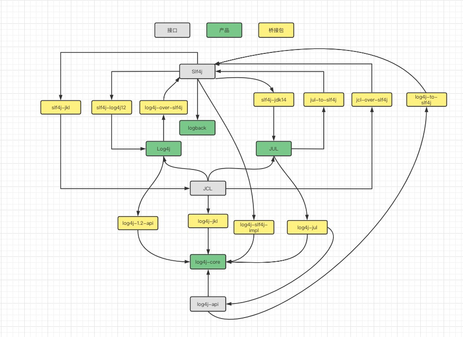

- 适配器：当项目使用了两种日志框架，可以使用适配器进行统一
  例：一个项目同时使用了jul+jcl和 log4j+slf4j的日志框架，现在需要统一，即可以将jul或者jcl通过导入适配
  器依赖的形式，整合到slf4j上面来实现。
- 桥接器：日志框架要在日志门面使用的桥梁
  也就是说，当引入了logback日志框架和slf4j日志门面的maven依赖后，还需要引入对应的桥接器依赖，才能
  使日志运行。
- 桥接器只能有一个(slf4j只能运行一个)。
- logback和slf4j之间没有桥接或适配，因为logback-classic.jar实现了StaticLoggerBinder.class。

❗❗❗注意：==**适配器**（Adaptor）会拦截接口/实现重定向到接口（接口/实现→接口），**桥接器**（Bridge）会拦截接口重定向到实现（接口→实现）==❓，所以**依赖之间不能形成单向闭环**（接口→桥接器→实现→适配器→接口），否则接口或实现会被桥接器和适配器无限循环拦截并重定向，造成**栈内存溢出**（ Stack Overflow）：

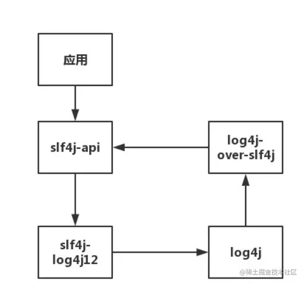

例如在使用 log4j2 作为实现框架时，如果不注意排除 spring-boot-starter-logging（其中 **log4j-to-slf4j** 会形成闭环，是罪魁祸首），则会抛出异常：

```
SLF4J: Class path contains multiple SLF4J bindings.
SLF4J: Found binding in [jar:file:/D:/Program_Data/maven_repository/org/apache/logging/log4j/log4j-slf4j-impl/2.13.3/log4j-slf4j-impl-2.13.3.jar!/org/slf4j/impl/StaticLoggerBinder.class]
SLF4J: Found binding in [jar:file:/D:/Program_Data/maven_repository/ch/qos/logback/logback-classic/1.2.3/logback-classic-1.2.3.jar!/org/slf4j/impl/StaticLoggerBinder.class]
SLF4J: See http://www.slf4j.org/codes.html#multiple_bindings for an explanation.
SLF4J: Actual binding is of type [org.apache.logging.slf4j.Log4jLoggerFactory]

java.lang.ExceptionInInitializerError
...
Caused by: org.apache.logging.log4j.LoggingException: log4j-slf4j-impl cannot be present with log4j-to-slf4j
...
```

**上述闭环为：slf4j-api → log4j-slf4j-impl → log4j-core → log4j-to-slf4j → slf4j-api**

[日志搭配和重构实例](https://juejin.cn/post/6905026199722917902#heading-35)

注意：

1. 桥接器如果配置在适配器的上方，则执行报错，不能同时出现；
2. 桥接器如果配置在适配器的下方，则不会执行桥接器，没有任何意义；
3. 在实际开发中，我们不要在pom.xml中同时给出适配器和桥接器。

解决日志框架共存/冲突问题其实很简单，只要遵循几个原则：

1. 统一使用一套日志实现；
2. 删除多余的无用日志依赖；
3. 如果有引用必须共存的话，那么就移除原始包，使用“over”类型的包（over类型的包复制了一份原始接口，重新实现）；
4. 不能over的，使用日志抽象提供的指定方式，例如`jboss-logging`中，可以通过`org.jboss.logging.provider`环境变量指定一个具体的日志框架实现。

项目里统一了日志框架之后，无论用那种日志框架打印，最终还是走向我们中转/适配后的唯一一个日志框架。

建议：

- 使用日志接口的api而不是日志产品的api，这样也符合依赖倒置原则；

- 依赖选择一个即可；

- 把日志产品依赖设置为`optional=true`和`scope=runtime`，其中`optional`设置为`true`是为了依赖不会被传递，比如别人引用了这个jar，就会被迫使用不想使用的依赖：

    ```xml
    <dependency>
        <groupId>org.apache.logging.log4j</groupId>
        <artifactId>log4j-core</artifactId>
        <version>${log4j.version}</version>
        <optional>true</optional>
    </dependency>
    ```

    而`scope`设置为`runtime`，是可以保证日志的产品的依赖只有在运行时需要，编译时不需要，这样，开发人员就不会在编写代码的过程中使用到日志产品的API了：

    ```xml
    <dependency>
        <groupId>org.apache.logging.log4j</groupId>
        <artifactId>log4j-slf4j-impl</artifactId>
        <version>${log4j.version}</version>
        <scope>runtime</scope>
    </dependency>
    ```

Thread类有一个处理未捕获异常的属性`defaultUncaughtExceptionHandler`，通过设置属性值将未捕获的异常记录日志：

```java
@Slf4j
public class LogErrorUncaughtExceptionHandler implements Thread.UncaughtExceptionHandler {
    public void uncaughtException(Thread t, Throwable ex) {
        log.error("未捕获异常", ex);
    }
}
```
主线程设置如下，例如springboot main方法：

```java
Thread.setDefaultUncaughtExceptionHandler(new LogErrorUncaughtExceptionHandler());
```

## 日志门面

日志门面解决系统与日志框架的**耦合性**。JCL和Slf4j之间可以通过slf4j-jkl（Slf4j重定向到JCL）和jcl-over-slf4j（JCL重定向到Slf4j ）桥接。

阿里开发手册：

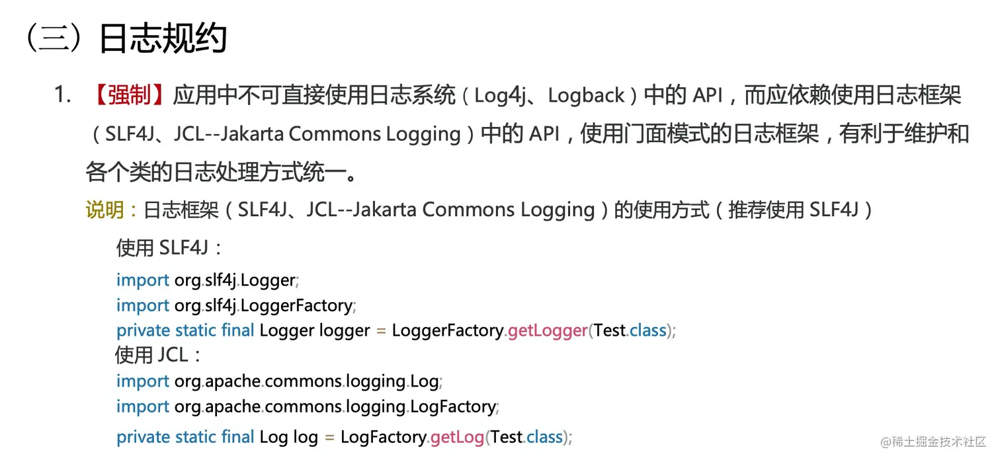

**这样做的最大好处，就是业务层的开发不需要关心底层日志框架的实现及细节，在编码的时候也不需要考虑日后更换框架所带来的成本。这也是门面模式所带来的好处。**

### JCL

Apache Jakarta通用日志（Jakarta Commons Logging），发布于2002年（晚于JUL），为 "所有的Java日志实现"提供一个统一的接口，它自身也提供一个日志的实现，但是功能非常常弱，一般不会单独使用它。允许开发人员使用不同的具体日志实现工具：Log4j、JUL。


实现机制：

区别于Slf4j在**编译时期**的**静态绑定**，JCL通过**动态查找**机制，在**程序运行**时，使用自己的ClassLoader寻找和载入本地具体的实现。详细策略可以查看commons-logging-*.jar包中的org.apache.commons.logging.impl.LogFactoryImpl.java文件。由于Osgi不同的插件使用独立的ClassLoader，Osgi的这种机制保证了插件互相独立, 其机制限制了Commons Logging在Osgi中的正常使用。

引入：

```xml
<dependency>
    <groupId>commons-logging</groupId>
    <artifactId>commons-logging</artifactId>
</dependency>
```

使用：

```java
import org.apache.commons.logging.Log;
import org.apache.commons.logging.LogFactory;

public class MyClass {
    // 实现优先级：Log4j > JUL > JCL.SimpleLog
    private static final Log log = LogFactory.getLog(MyClass.class);

    void foo() {
        log.info("This is an info message");
    }
}
```

此处Log的具体实现类，优先查找Log4j实现，没有则查找JUL实现，没有则使用JCL的SimpleLog实现。

[Spring4和Spring5日志中的不同](https://juejin.cn/post/6905026199722917902#heading-39)：

- Spring4使用的是**原生的JCL**（common-logging），所以在有Log4j的时候使用Log4j打印日志，没有的时候使用JUL打印日志。

- Spring5中依然使用的是JCL，但是不是原生的，**是经过改造的JCL**（spring-jcl），默认使用的是JUL，而原生JCL中默认使用的是Log4j。

### Slf4j⭐

简单日志门面（Simple Logging Facade for Java），发布于2005年。它不是一个真正的日志实现，而是一个抽象层（ abstraction layer），它允许你在后台使用任意一个日志实现。

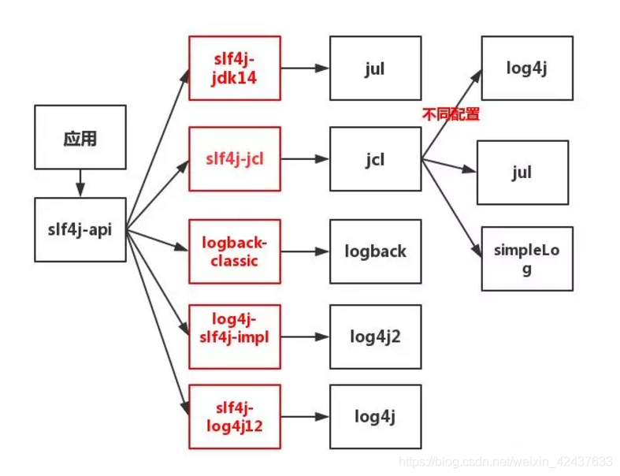

实现机制：

区别于JCL在**程序运行**时的**动态查找**，Slf4j在**编译期间**，**静态绑定**本地的Log库，因此可以在Osgi中正常使用。它是通过查找类路径下org.slf4j.impl.StaticLoggerBinder，然后在StaticLoggerBinder中进行绑定。

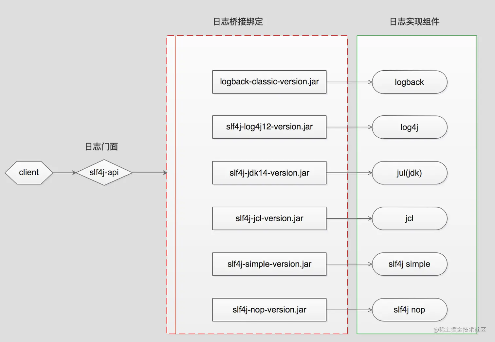

按上图引入，搭配6种实现方式，**注意按需移除Spring Boot自带日志spring-boot-starter-logging**：

```xml
<dependency>
    <groupId>org.slf4j</groupId>
    <artifactId>slf4j-api</artifactId>
</dependency>
<!--搭配slf4j内置实现-->
<dependency>
    <groupId>org.slf4j</groupId>
    <artifactId>slf4j-simple</artifactId>
</dependency>
<!--或者搭配jul实现-->
<dependency>
    <groupId>org.slf4j</groupId>
    <artifactId>slf4j-jdk14</artifactId>
</dependency>
<!--或者搭配logback实现，其实作为api的classic已经包含core了-->
<dependency>
    <groupId>ch.qos.logback</groupId>
    <artifactId>logback-classic</artifactId>
</dependency>
<dependency>
    <groupId>ch.qos.logback</groupId>
    <artifactId>logback-core</artifactId>
</dependency>
<!--或者搭配log4j实现-->
<dependency>
    <groupId>org.slf4j</groupId>
    <artifactId>slf4j-reload4j</artifactId>
</dependency>
<dependency>
    <groupId>log4j</groupId>
    <artifactId>log4j</artifactId>
</dependency>
<!--或者搭配log4j2实现，其实桥接器已经包含api和core了-->
<dependency>
    <groupId>org.apache.logging.log4j</groupId>
    <artifactId>log4j-slf4j-impl</artifactId>
</dependency>
<dependency>
    <groupId>org.apache.logging.log4j</groupId>
    <artifactId>log4j-api</artifactId>
</dependency>
<dependency>
    <groupId>org.apache.logging.log4j</groupId>
    <artifactId>log4j-core</artifactId>
</dependency>
<!--或者彻底关闭日志-->
<dependency>
    <groupId>org.slf4j</groupId>
    <artifactId>slf4j-nop</artifactId>
</dependency>
```

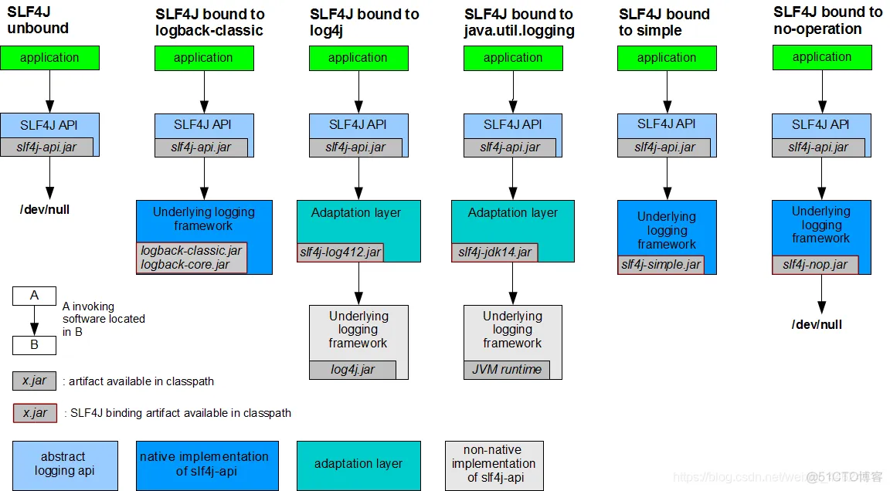

| **jar包名**                           | **说明**                                                     |
| ------------------------------------- | ------------------------------------------------------------ |
| slf4j-log4j12.jar/slf4j-reload4j      | Log4j的桥接器，你需要将log4j.jar加入Classpath。              |
| slf4j-jdk14.jar                       | java.util.logging的桥接器，JDK原生日志框架。                 |
| slf4j-nop.jar                         | NOP桥接器，默默丢弃一切日志。                                |
| slf4j-simple.jar                      | 一个简单实现的桥接器，该实现输出所有事件到System.err。只有Info以及高于该级别的消息被打印，在小型应用中它也许是有用的。 |
| slf4j-jcl.jar                         | Jakarta Commons Logging的桥接器。这个桥接器将Slf4j所有日志委派给JCL。 |
| logback-classic.jar和logback-core.jar | Slf4j的原生实现，Logback直接实现了Slf4j的接口（StaticLoggerBinder.class），因此使用Slf4j与Logback的结合使用也意味更小的内存与计算开销。 |
| log4j-slf4j-impl.jar                  | Log4j2的桥接器，你需要将log4j2-api.jar和log4j2-core.jar加入Classpath。 |
| log4j-api.jar和log4j-core.jar         | Log4j2的接口和框架。                                         |

重构，通过桥接器拦截其他日志重定向到Slf4j，其中logback是默认实现不用拦截：

```xml
<dependency>
    <groupId>org.slf4j</groupId>
    <artifactId>slf4j-api</artifactId>
</dependency>
<!--拦截jcl-->
<dependency>
    <groupId>org.slf4j</groupId>
    <artifactId>jcl-over-slf4j</artifactId>
</dependency>
<!--拦截log4j-->
<dependency>
    <groupId>org.slf4j</groupId>
    <artifactId>log4j-over-slf4j</artifactId>
</dependency>
<!--拦截jul-->
<dependency>
    <groupId>org.slf4j</groupId>
    <artifactId>jul-to-slf4j</artifactId>
</dependency>
<!--拦截log4j2-->
<dependency>
    <groupId>org.apache.logging.log4j</groupId>
    <artifactId>log4j-to-slf4j</artifactId>
</dependency>
```


| **jar包名**          | **作用**                                        |
| -------------------- | ----------------------------------------------- |
| log4j-over-slf4j.jar | 将Log4j重定向到Slf4j                            |
| jcl-over-slf4j.jar   | 将Commons Logging里的Simple Logger重定向到slf4j |
| jul-to-slf4j.jar     | 将Java Util Logging重定向到Slf4j                |
| log4j-to-slf4j.jar   | 将Log4j2重定向到Slf4j                           |

❗❗❗注意：不能让重定向形成闭环（~~适配器slf4j-reload4j + 桥接器log4j-over-slf4j~~），会造成栈内存溢出（Stack Overflow）：


使用：

```java
private static final Logger logger = LoggerFactory.getLogger(Test.class);
...
logger.info("info message");
...
```

⭐门面调用框架过程部分源码分析：

| **类与接口**                             | **用途**                                                     |
| ---------------------------------------- | ------------------------------------------------------------ |
| org.slf4j.LoggerFactory(class)           | 给调用方提供的创建Logger的工厂类，在编译时绑定具体的日志实现组件 |
| org.slf4j.Logger(interface)              | 给调用方提供的日志记录抽象方法，例如debug(String msg),info(String msg)等方法 |
| org.slf4j.ILoggerFactory(interface)      | 获取的Logger的工厂接口，具体的日志组件实现此接口             |
| org.slf4j.helpers.NOPLogger(class)       | 对org.slf4j.Logger接口的一个没有任何操作的实现，也是Slf4j的默认日志实现 |
| org.slf4j.impl.StaticLoggerBinder(class) | 与具体的日志实现组件实现的桥接类，具体的日志实现组件需要定义org.slf4j.impl包，并在org.slf4j.impl包下提供此类，注意在slf4j-api-version.jar中不存在org.slf4j.impl.StaticLoggerBinder，在源码包slf4j-api-version-source.jar中才存在此类 |

LoggerFactory.class

```java
/**
 * Return a logger named according to the name parameter using the
 * statically bound {@link ILoggerFactory} instance.
 * 
 * @param name The name of the logger.
 * @return logger
 */
public static Logger getLogger(String name) {
    // 1.生成一个工厂类实例
    ILoggerFactory iLoggerFactory = getILoggerFactory();
    // 2.根据类名获取logger
    return iLoggerFactory.getLogger(name);
}
```

上述获取 Log 的过程大致分成 2 个阶段，以 Slf4j + Log4j2 为例：

1. 获取ILoggerFactory的过程 （从字面上理解就是生产Logger的工厂）：

   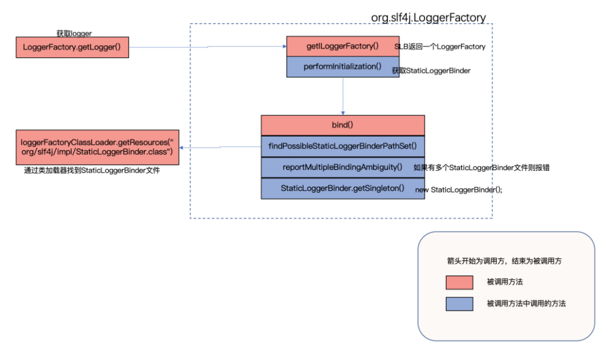

   1. 从类路径中寻找`org/slf4j/impl/StaticLoggerBinder.class`类：

      ```java
      ClassLoader.getSystemResources("org/slf4j/impl/StaticLoggerBinder.class");
      ```

      如果找到多个，则输出`Class path contains multiple SLF4J bindings`，表示有多个日志实现与Slf4j进行了绑定。

      > SLF4J API is designed to bind with one and only one underlying logging framework at a time. If more than one binding is present on the class path, SLF4J will emit a warning, listing the location of those bindings.

      SLF4J API被设计为一次只绑定一个底层日志框架。如果类路径上存在多个绑定，SLF4J将发出警告，列出这些绑定的位置。

      > The warning emitted by SLF4J is just that, a warning. Even when multiple bindings are present,SLF4J will pick one logging framework/implementation and bind with it. The way SLF4J picks a binding is determined by the JVM and for all practical purposes should be considered random.

      SLF4J发出的警告只是警告。即使存在多个绑定，SLF4J也会选择一个日志框架/实现并与之绑定。SLF4J选择绑定的方式**由JVM决定**，就所有实际目的而言，应视为**随机**的。

      所谓的桥接包，就是实现StaticLoggerBinder类，用来连接Slf4j和日志框架。因为Log4j和Log4j2刚开始没有StaticLoggerBinder这个类，为了不改变程序结构，只能重新写一个新的jar来实现StaticLoggerBinder。而Logback出现在Slf4j之后，于是在logback-classic.jar中实现了StaticLoggerBinder，所以就不需要桥接包；

   2. 选取第一个由JVM加载的实现类的StaticLoggerBinder.class，在初始化时创建一个常量单例。由于log4j-slf4j-impl依赖的路径下有`org/slf4j/impl/StaticLoggerBinder.class`，所以会选择log4j-slf4j-impl中的StaticLoggerBinder来创建单例对象：

      ```java
      /**
       * The unique instance of this class.
       */
      private static final StaticLoggerBinder SINGLETON = new StaticLoggerBinder();
      
      /**
       * Private constructor to prevent instantiation
       */
      private StaticLoggerBinder() {
          loggerFactory = new Log4jLoggerFactory();
      }
      ```

   3. slf4j-api.jar中的LoggerFactory.class根据上述创建的StaticLoggerBinder单例，返回一个ILoggerFactory实例：

      ```java
      /**
       * Return the {@link ILoggerFactory} instance in use.
       * <p/>
       * <p/>
       * ILoggerFactory instance is bound with this class at compile time.
       * 
       * @return the ILoggerFactory instance in use
       */
      public static ILoggerFactory getILoggerFactory() {
          if (INITIALIZATION_STATE == UNINITIALIZED) {
              synchronized (LoggerFactory.class) {
                  if (INITIALIZATION_STATE == UNINITIALIZED) {
                      INITIALIZATION_STATE = ONGOING_INITIALIZATION;
                      performInitialization();
                  }
              }
          }
          switch (INITIALIZATION_STATE) {
          case SUCCESSFUL_INITIALIZATION:
              return StaticLoggerBinder.getSingleton().getLoggerFactory();
          // other cases ...
          throw new IllegalStateException("Unreachable code");
      }
      ```
      
      log4j-slf4j-impl中的StaticLoggerBinder.class：
      
      ```java
      /**
       * Returns the singleton of this class.
       *
       * @return the StaticLoggerBinder singleton
       */
      public static StaticLoggerBinder getSingleton() {
          return SINGLETON;
      }
      
      /**
       * Returns the factory.
       * @return the factor.
       */
      @Override
      public ILoggerFactory getLoggerFactory() {
          return loggerFactory;
      }
      ```

2. 根据ILoggerFactory获取Logger的过程，以Log4j2的Log4jLoggerFactory为例：

   通过log4j-api依赖中的org.apache.logging.log4j.api.AbstractLoggerAdapter.class查找并返回logger：

   ```java
   @Override
   public L getLogger(final String name) {
       // 1.获取Log4jLoggerFactory的上下文
       final LoggerContext context = getContext();
       // 2.获取上下文中的所有logger
       final ConcurrentMap<String, L> loggers = getLoggersInContext(context);
       // 3.根据类名找，如果找到则直接返回
       final L logger = loggers.get(name);
       if (logger != null) {
           return logger;
       }
       // 4.如果找不到则新生成并返回
       loggers.putIfAbsent(name, newLogger(name, context));
       return loggers.get(name);
   }
   ```

   其中，生成logger则依靠log4j-slf4j-impl依赖中的Log4jLoggerFactory.class：

   ```java
   @Override
   protected Logger newLogger(final String name, final LoggerContext context) {
       // 校验是否为根日志
       final String key = Logger.ROOT_LOGGER_NAME.equals(name) ? LogManager.ROOT_LOGGER_NAME : name;
       // 验证上下文，并通过上下文寻找或生成logger，并把ExtendedLogger包装成Log4jLogger
       return new Log4jLogger(validateContext(context).getLogger(key), name);
   }
   ```

   最终在核心依赖log4j-core中的LoggerContext.class中生成logger：

   ```java
   /**
    * Gets a Logger from the Context.
    *
    * @param name The name of the Logger to return.
    * @return The Logger.
    */
   @Override
   public Logger getLogger(final String name) {
       return getLogger(name, null);
   }
   
   /**
    * Obtains a Logger from the Context.
    *
    * @param name The name of the Logger to return.
    * @param messageFactory The message factory is used only when creating a logger, subsequent use does not change the logger but will log a warning if mismatched.
    * @return The Logger.
    */
   @Override
   public Logger getLogger(final String name, final MessageFactory messageFactory) {
       // Note: This is the only method where we add entries to the 'loggerRegistry' ivar.
       Logger logger = loggerRegistry.getLogger(name, messageFactory);
       if (logger != null) {
           AbstractLogger.checkMessageFactory(logger, messageFactory);
           return logger;
       }
   	// 如果没有则通过Logger自身的构造器生成
       logger = newInstance(this, name, messageFactory);
       loggerRegistry.putIfAbsent(name, messageFactory, logger);
       return loggerRegistry.getLogger(name, messageFactory);
   }
   
   // LOG4J2-151: changed visibility from private to protected
   protected Logger newInstance(final LoggerContext ctx, final String name, final MessageFactory messageFactory) {
       return new Logger(ctx, name, messageFactory);
   }
   ```

   log4j-api依赖中的LoggerRegistry是供LoggerContext实现使用的便利类，同样先找是否有已经生成的logger，这是在loggerRegistry中添加实例的唯一方法。这里传入`getLogger`方法的`messageFactory`为`null`，对应的factory名是`log4j2.messageFactory`，所以会在loggerRegistry持有的map中的一个名叫`log4j2.messageFactory`的子map中查找logger，如果没有这个子map则会添加：

   ```java
   // 常量字符串的值为log4j2.messageFactory
   private static final String DEFAULT_FACTORY_KEY = AbstractLogger.DEFAULT_MESSAGE_FACTORY_CLASS.getName();
   
   // 父map
   private final Map<String, Map<String, T>> map;
   
   /**
    * Returns an ExtendedLogger.
    * @param name The name of the Logger to return.
    * @param messageFactory The message factory is used only when creating a logger, subsequent use does not change the logger but will log a warning if mismatched.
    * @return The logger with the specified name.
    */
   public T getLogger(final String name, final MessageFactory messageFactory) {
       // 查找或生成子map，并试图从中获取logger
       return getOrCreateInnerMap(factoryKey(messageFactory)).get(name);
   }
   
   private Map<String, T> getOrCreateInnerMap(final String factoryName) {
       // 在父map中查找并返回子map，如果没有则先生成并加入
       Map<String, T> inner = map.get(factoryName);
       if (inner == null) {
           // 此处生成的是ConcurrentHashMap
           inner = factory.createInnerMap();
           map.put(factoryName, inner);
       }
       return inner;
   }
   ```

## 日志框架

日志框架是日志的具体实现。

### Log4j

Logging for Java，Apache的一个开源项目，发布于1999年。可以控制日志信息输送的目的地是控制台、文件、GUI组件等，可以控制每一条日志的输出格式，这些可以通过一个配置文件来灵活地进行配置，而不需要修改应用的代码。虽然已经于2015年停止维护了，但目前绝大部分企业都是用的log4j。

引入：

```xml
<dependency>
    <groupId>log4j</groupId>
    <artifactId>log4j</artifactId>
</dependency>
```

使用：

```java
import org.apache.log4j.Logger;

public class MyClass {
    private static final Logger logger = Logger.getLogger(MyClass.class);

    void foo() {
        logger.info("This is an info message");
    }
}
```

开启log4j 内置日志记录（是否屏蔽输出信息中的调试信息）：

```java
import org.apache.log4j.helpers.LogLog;
...
LogLog.setInternalDebugging(true);
```

### JUL

Java Util Logging，JDK在1.4版本中引入的Java原生日志框架，发布于2002年（早于JCL）。使用时不需要另外引用第三方类库。

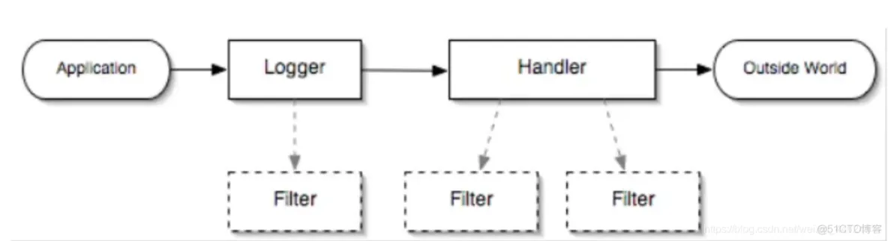

- Loggers：被称为记录器，应用程序通过获取Logger对象，调用其API来来发布日志信息。Logger通常时应用程序访问日志系统的入口程序；
- Appenders：也被称为Handlers，每个Logger都会关联一组Handlers，Logger会将日志交给关联Handlers处理，由Handlers负责将日志做记录。Handlers在此是一个抽象，其具体的实现决定了日志记录的位置可以是控制台、文件、网络上的其他日志服务或操作系统日志等；
- Layouts：也被称为Formatters，它负责对日志事件中的数据进行转换和格式化。Layouts决定了数据在一条日志记录中的最终形式；
- Level：每条日志消息都有一个关联的日志级别。该级别粗略指导了日志消息的重要性和紧迫，我可以将Level和Loggers，Appenders做关联以便于我们过滤消息；
- Filters：过滤器，根据需要定制哪些信息会被记录，哪些信息会被放过。

其中日志的级别有：

| 级别 | OFF                 | SEVERE | WARNING | INFO（默认级别） | CONFIG | FINE | FINER | FINEST | ALL                 |
| ---- | ------------------- | ------ | ------- | ---------------- | ------ | ---- | ----- | ------ | ------------------- |
| 值   | `Integer.MAX_VALUE` | 1000   | 900     | 800              | 700    | 500  | 400   | 300    | `Integer.MIN_VALUE` |

使用：

```java
import java.util.logging.Level;
import java.util.logging.Logger;

public class MyClass {
    private static final Logger logger = Logger.getLogger(MyClass.class);

    void foo() {
        logger.info("This is an info message");
        logger.log(Level.INFO, "This is an info message too");
    }
}
```

流程原理：

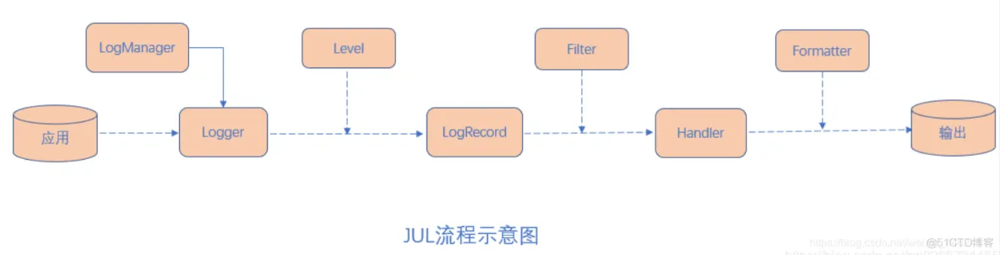

1. 初始化LogManager：
   - LogManager加载logging.properties配置；
   - 添加Logger到LogManager；
2. 从单例LogManager获取Logger；
3. 设置级别Level，并指定日志记录LogRecord；
4. Filter提供了日志级别之外更细粒度的控制；
5. Handler是用来处理日志输出位置；
6. Formatter是用来格式化LogRecord的。

### LogBack

Log4j的一个改良版本，发布于2006年。可以看到spring-boot默认包含了logback-classic，并使用Slf4j作为日志门面：

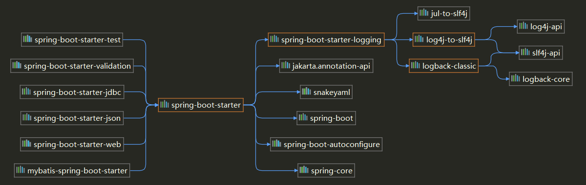

引入：

```xml
<!--slf4j 日志门面-->
<dependency>
    <groupId>org.slf4j</groupId>
    <artifactId>slf4j-api</artifactId>
</dependency>
<!--logback 日志实现-->
<dependency>
    <groupId>ch.qos.logback</groupId>
    <artifactId>logback-classic</artifactId>
</dependency>
```

如果要用别的日志框架时，需要排除默认依赖：

```xml
<dependency>
    <groupId>org.springframework.boot</groupId>
    <artifactId>spring-boot-starter-web</artifactId>
    <exclusions>
        <!--移除掉 spring boot 默认的日志启动器-->
        <exclusion>
            <groupId>org.springframework.boot</groupId>
            <artifactId>spring-boot-starter-logging</artifactId>
        </exclusion>
    </exclusions>
</dependency>
```

使用：

```java
import org.slf4j.Logger;
import org.slf4j.LoggerFactory;

public class MyClass {
    public static final Logger logger = LoggerFactory.getLogger(MyClass.class);
    
    void foo() {
        logger.info("This is an info message");
    }
}
```

配置：

[Logback中文文档（三）：配置](https://www.cnblogs.com/yw0219/p/9320846.html)

[Logback中文文档（四）：Appender ](https://www.cnblogs.com/yw0219/p/9361040.html)

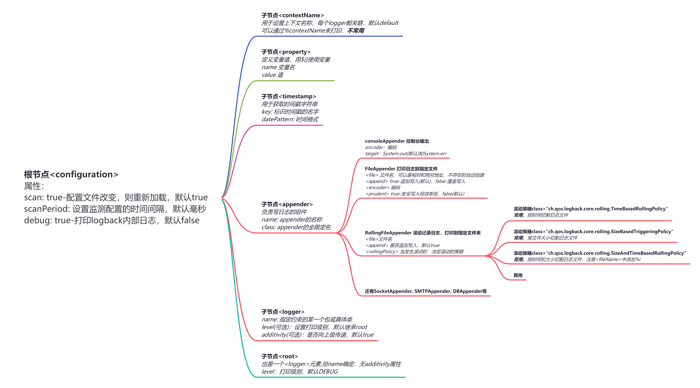

logback.xml配置文件的基本结构可以描述为`<configuration>`元素，包含零个或多个`<appender>`元素，后跟零个或多个`<logger>`元素，后跟最多一个`<root>`元素(也可以没有)。下图说明了这种基本结构：


- Appender：用于指定日志输出的目的地，目的地可以是控制台、文件、数据库等等：

  

  - Encoder：编码器负责控制输出日志的格式，将事件转换为字节数组以及将该字节数组写入输出流：
    - Layout：负责把事件转换成字符串，格式化的日志信息的输出。在logback中Layout对象被封装在Encoder中；

  - Filter：过滤器，最重要的两个过滤器为LevelFilter和ThresholdFilter；

- Logger：记录器，把它关联到应用的对应的context上后，主要用于存放日志对象，也可以定义日志类型、级别。请注意，与 log4j 不同，在配置给定日志记录器时，logback-classic不会关闭或删除任何先前引用的附加器；

- Root：根记录器，它支持单个属性，即level属性。它不允许任何其他属性，因为additivity标志不适用于根记录器。此外，由于根记录器已被命名为“ROOT”，因此它也不允许使用name属性。

[logback.xml配置文件详情](https://logback.qos.ch/manual/configuration.html)⭐

```xml
<?xml version = "1.0" encoding = "UTF-8"?>
<!--logback.xml会先application.properties加载，而logback-spring.xml会后于application.properties加载-->
<configuration scan="true" scanPeriod="30 seconds">
    <define name="LOG_HOME" class="com.component.GetLogHome"/>

    <appender name = "STDOUT" class = "ch.qos.logback.core.ConsoleAppender">
        <encoder>
            <pattern>[%d{yyyy-MM-dd'T'HH:mm:ss.sss'Z'}] [%C] [%t] [%L] [%-5p] %m%n</pattern>
        </encoder>
    </appender>
     
    <!--异步输出-->
    <appender name="ASYNC-STDOUT" class="ch.qos.logback.classic.AsyncAppender">
        <!-- 不丢失日志.默认的,如果队列的80%已满,则会丢弃TRACT、DEBUG、INFO级别的日志 -->
        <discardingThreshold>0</discardingThreshold>
        <!-- 更改默认的队列的深度,该值会影响性能.默认值为256 -->
        <queueSize>256</queueSize>
        <!-- 添加附加的appender,最多只能添加一个,必须添加一个才有用 -->
        <appender-ref ref="STDOUT"/>
    </appender>

    <appender name = "FILE" class = "ch.qos.logback.core.rolling.RollingFileAppender">
        <!--可以获取到application.properties或application.yml中的配置logging.path和logging.file-->
        <File>${LOG_HOME}${LOG_FILE}RELOAD.log</File>
        <encoder>
            <pattern>[%d{yyyy-MM-dd'T'HH:mm:ss.sss'Z'}] [%C] [%t] [%L] [%-5p] %m%n</pattern>
        </encoder>
        <rollingPolicy class="ch.qos.logback.core.rolling.FixedWindowRollingPolicy">
            <fileNamePattern>${LOG_HOME}${LOG_FILE}.%i.log.zip</fileNamePattern>
            <minIndex>1</minIndex>
            <maxIndex>2</maxIndex>
        </rollingPolicy>
        <triggeringPolicy class="ch.qos.logback.core.rolling.SizeBasedTriggeringPolicy">
            <!--启动Eureka时不能获取application.properties中的logging.file.max-size-->
            <!--<maxFileSize>${LOG_FILE_MAX_SIZE}</maxFileSize>-->
            <maxFileSize>10kb</maxFileSize>
        </triggeringPolicy>
    </appender>

    <root level = "INFO">
        <appender-ref ref = "FILE"/>
        <appender-ref ref = "STDOUT"/>
        <appender-ref ref = "ASYNC-STDOUT"/>
    </root>
</configuration>
```

❗❗❗注意，AsyncAppender 异步记录 ILoggingEvents。它只充当事件派发器，因此**必须引用另一个appender才能做任何有用的事情**。

自定义Appender：

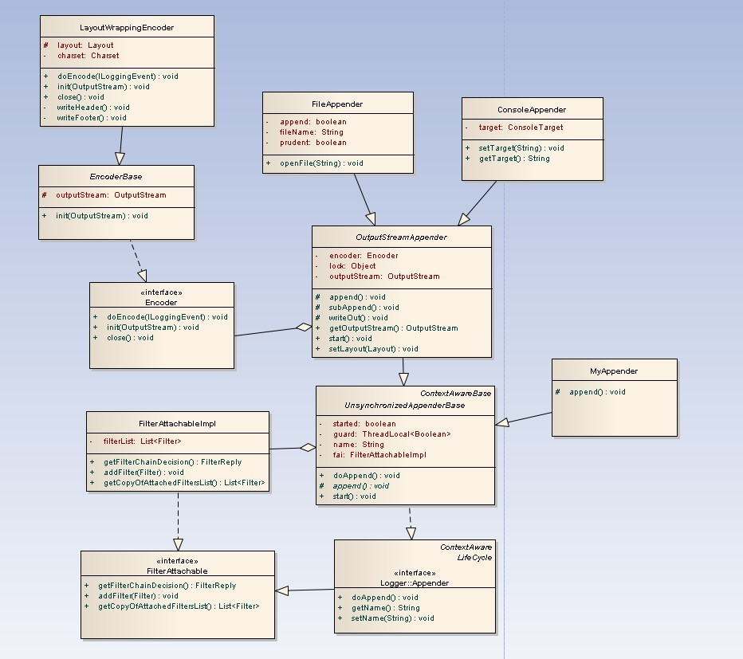

通过子类化AppenderBase，您可以轻松编写自己的应用程序。AppenderBase支持过滤器、状态信息和大多数appenders共享的其他功能。派生类只需实现一个方法，即`append(Object eventObject)`：

```java
@Getter
@Setter
public class MyLogbackAppender extends UnsynchronizedAppenderBase<ILoggingEvent> {
    Layout<ILoggingEvent> layout;
    
    //自定义配置 
    String printString;

    @Override
    public void start() {
        // 这里可以做些初始化判断 比如layout不能为null ,
        if (layout == null) {
            addWarn("Layout was not defined");
        }
        // 或者写入数据库 或者redis时 初始化连接等等
		super.start();
    }


    @Override
    public void stop() {
        // 释放相关资源，如数据库连接，redis线程池等等
        System.out.println("logback-stop方法被调用");
        if(!isStarted()) {
            return;
        }
        super.stop();
    }

    @Override
    public void append(ILoggingEvent event) {
        if (event == null || !isStarted()) {
            return;
        }
        // 此处自定义实现输出             
        // 获取输出值：event.getFormattedMessage()
        // System.out.print(event.getFormattedMessage());
        // 格式化输出        
        System.out.print(printString + "：" + layout.doLayout(event));
    }
}
```

当你运行了以上的自定义Appender后，停止应用时，你会发现定义的`stop`方法并没有被执行。还需要配置一个`ShutdownHook`系统钩子，使得在JVM在退出时之前会调用：

- 在Java中注册关闭钩子：

  ```java
  Runtime.getRuntime().addShutdownHook(new Thread(new Runnable() {
      @Override
      public void run() {
          // 执行资源释放操作
      }
  }));
  ```

- 在SpringBoot的启动配置文件application.properties中注册关闭钩子：

  ```properties
  logging.register-shutdown-hook=true
  ```

- 在SpringBoot的启动类中通过注册`DelayingShutdownHook`来注册关闭钩子；

- 在Logback的日志配置文件logback-spring.xml中注册关闭钩子：

  ```xml
  <shutdownHook class="ch.qos.logback.core.hook.DelayingShutdownHook"/>
  ```

在应用运行中重新加载配置：

例如，修改滚动文件保存路径的思路：

`LoggerUtil.reloadLogger() -> PropertyDefinerBase.getPropertyValue() -> <define> -> <appender>`

1. 继承PropertyDefinerBase：

   ```java
   public class LogPath extends PropertyDefinerBase {
       private static String logPath = "E:/old_path/";
       
       @Override
       public String getPropertyValue() {
           return logPath;
       }
       
       public void setLogPath(String logPath) {
           this.logPath = logPath;
       }
   }
   ```

2. 配置文件中绑定获取属性的类：

   ```xml
   <define name="LOG_HOME" class="com.component.LogPath"/>
   ...
   <appender name = "FILE" class = "ch.qos.logback.core.rolling.RollingFileAppender">
       <File>${LOG_HOME}${LOG_FILE}.RELOADED.log</File>
       ...
   </appender>
   ```

3. 重新载入配置的工具类：
    ```java
    /**
     * 重新载入日志配置
     */
    public class LoggerUtil {
        public static void reloadLogger() {
            LoggerContext loggerContext = (LoggerContext) LoggerFactory.getILoggerFactory();
    
            ContextInitializer ci = new ContextInitializer(loggerContext);
            URL url = ci.findURLOfDefaultConfigurationFile(true);
    
            try {
                JoranConfigurator configurator = new JoranConfigurator();
                configurator.setContext(loggerContext);
                loggerContext.reset();
                configurator.doConfigure(url);
            } catch (JoranException je) {
                // StatusPrinter will handle this
                je.printStackTrace();
            }
            StatusPrinter.printInCaseOfErrorsOrWarnings(loggerContext);
        }
    }
    ```

4. 在控制器中使用：

    ```java
    @RestController
    @RequestMapping("/logger")
    public class LoggerController {
        @RequestMapping("/reload")
        public String reloadLogger(@RequestParam(required = false, defaultValue = "E:/new_path/") String logPath) {
            GetLogHome.setLogPath(logPath);
            LoggerUtil.reloadLogger();
            return "redirect logger to /"" + logPath + "/"";
        }
    }
    ```

### Log4j2⭐

Logging for Java Ⅱ，发布于2014年，不仅仅是Log4j的一个升级版本，它从头到尾都被重写了。**但是与Log4j不兼容。**

特征：

- **性能提升**：
  - 最强的同步和异步性能：在多线程场景中，异步记录器的吞吐量比 Log4j 1.x 和 Logback 高 18 倍，延迟低；
  - 极高的 I/O 性能：Log4j2 还提供了一个 MemoryMappedFileAppender，I/O 部分使用 MemoryMappedFile 来实现；

- **参数格式化**：既支持 Slf4j 的`{}`占位符，又支持形如`String.format`的格式化参数用法；
- **惰性日志**（Lazy Logging）：如果未启用相应的日志级别，则可避免生成日志信息，从而提高使用日志的应用程序的性能；
- **自定重新加载配置**：与Logback<u>一样</u>，Log4j2可以在修改时**自动重载加载配置**。与Logback<u>不同</u>，它会在从重新配置发生时**不会丢失日志事件**；
- **高级过滤**：与 Logback 一样，Log4j2 支持基于 Log 事件中的上下文数据，标记，正则表达式和其他组件进行过滤。此外，过滤器还可以与记录器关联。与 Logback 不同，Log4j2 可以在任何这些情况下使用通用的Filter类；
- **插件架构**：Log4j2 使用插件模式配置组件。因为，无需编写代码来创建和配置 Appender、Layout、Pattern Converter 等。在配置了的情况下，Log4j2 自动识别插件并使用他们；
- **无垃圾回收机制（Garbage-free）**：在稳态日志记录期间，**Log4j2在独立应用程序中是无垃圾的**，在web应用程序中是低垃圾。这减少了垃圾收集器的压力，并且可以提供更好的响应性能。

可以看到 log4j2 已经包含了 slf4j 门面：

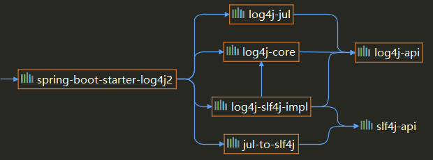

- log4j-jul：适配器，java.util.logging的Log4j2实现，[提供了一种在Log4j2和JUL之间进行桥接的方式，可以通过JUL API来使用Log4j2实现的日志记录功能](https://juejin.cn/s/org.apache.logging.log4j.jul.logmanager%20maven)；
- jul-to-slf4j：java.util.logging到Slf4j的桥梁，包含一个java.util.logging (JUL)处理程序，即`SLF4JBridgeHandler`，它将所有传入的JUL记录路由到Slf4j API。简单来说，就是将原本Java Util Logging API的日志输出重定向到Slf4j日志框架。

引入，移除默认依赖并添加Log4j2，这里不仅需要导入Slf4j的日志门面技术，还需要导入Log4j2的日志门面，Slf4j门面调用的是Log4j2的门面，再由Log4j2的门面调用Log4j2的实现：

```xml
<dependency>
    <groupId>org.springframework.boot</groupId>
    <artifactId>spring-boot-starter-web</artifactId>
    <exclusions>
        <!--移除掉 spring boot 默认的日志启动器-->
        <exclusion>
            <groupId>org.springframework.boot</groupId>
            <artifactId>spring-boot-starter-logging</artifactId>
        </exclusion>
    </exclusions>
</dependency>
<!--引用 log4j2 spring boot 启动器，内部依赖了 slf4j、log4j-->
<dependency>
    <groupId>org.springframework.boot</groupId>
    <artifactId>spring-boot-starter-log4j2</artifactId>
</dependency>
```

具体引入源码参考上文中Slf4j的源码。

日志输出代码，一般有人可能在代码中使用如下方式输出：

```java
Object entry = new SomeObject(); 
logger.debug("The entry is " + entry);
```

上面看起来没什么问题，但是会存在构造消息参数的成本，即将`entry`转换成字符串相加。并且无论是否记录消息，都是如此，即：那怕日志级别为INFO，也会执行括号里面的操作，但是日志不会输出，下面是优化后的写法：

```java
if (logger.isDebugEnabled()) { 
    Object entry = new SomeObject(); 
    logger.debug("The entry is " + entry);
}
```

第二种首先对设置的日志级别进行了判断，如果为debug模式，才进行参数的构造，对第一种写法进行了改善。不过还有最好的写法，使用占位符：

```java
Object entry = new SomeObject(); 
logger.debug("The entry is {}.", entry);
```


只有在评估是否记录之后，并且只有在决策是肯定的情况下，记录器实现才会格式化消息并将`{}`对替换为条目的字符串值。换句话说，当禁用日志语句时，此表单不会产生参数构造的成本。Logback作者进行测试得出：第一种和第三种写法将产生完全相同的输出。但是，在禁用日志记录语句的情况下，第三个变体将比第一个变体优于至少30倍。

[惰性日志（Lazy Logging）](https://www.baeldung.com/log4j-2-lazy-logging)：

以下日志内容在不需要打印时也会生成，降低性能：

```java
logger.trace("Number is {}", getRandomNumer());
```

可以通过判断日志级别避免：

```java
if (logger.isTraceEnabled()) {
    logger.trace("Number is {}", getRandomNumer());
}
```

进一步通过使用Lambda表达式简化上述写法，这就是**惰性日志**：

```java
logger.trace("Number is {}", () -> getRandomNumber());

logger.trace("Name is {} and age is {}", () -> getName(), () -> getRandomNumber());
```

#### Configuration

Log4j2运行的流程如下所示：

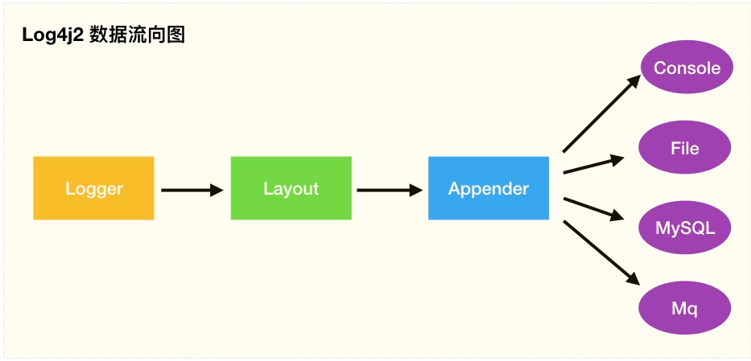

Log4j2默认在classpath下查找配置文件，可以修改配置文件的位置。log4j 2.x版本不再支持像1.x中的.properties后缀的文件配置方式，2.x版本配置文件后缀名只能为".xml",".json"或者".jsn"。系统选择配置文件的优先级（从先到后）如下：

1. classpath下的名为log4j2-test.json或者log4j2-test.jsn的文件；
2. classpath下的名为log4j2-test.xml的文件；
3. classpath下名为log4j2.json或者log4j2.jsn的文件；
4. classpath下名为log4j2.xml的文件；
5. classpath下名为log4j2-spring.json或者log4j2-spring.jsn的文件；
6. classpath下名为log4j2-spring.xml的文件。

我们一般默认使用log4j2.xml进行命名。如果本地要测试，可以把log4j2-test.xml放到classpath，而正式环境使用log4j2.xml，则在打包部署的时候不要打包log4j2-test.xml即可。

JVM启动命令：

```shell
-Dlogging.config=/path/to/log4j2.xml
```

application.yml配置：

```yaml
logging:
  config: classpath:log4j2.xml
```

❗❗❗注意，当配置文件的名称不止有log4j2.xml时，需要在application.yml配置文件中，配置下面的属性指定日志文件的位置：

```yaml
logging:
  log4j2:
    config:
      override: 
      	- classpath:其他名称1.xml
      	- classpath:其他名称2.xml
```

可以通过`<xi:include>`引入外部配置文件：

```xml
<configuration status="warn" name="XIncludeDemo">
    <xi:include href="log4j-xinclude-appenders.xml"/>
    <xi:include href="log4j-xinclude-loggers.xml"/>
</configuration>
```

[log4j2-spring.xml配置文件详情](https://logging.apache.org/log4j/2.x/manual/configuration.html)⭐

```xml
<?xml version="1.0" encoding="UTF-8"?>
<!--status 属性用于配置 Log4j2 内部的的日志级别-->
<!--Log4j2 可以自动检测配置文件的变化，monitorInterval 属性可以配置自动检测配置文件的时间，这个属性最小的值为 5，代表 5 秒检测一次-->
<Configuration status="debug" strict="true" name="XMLConfigTest" monitorInterval="30"
               packages="org.apache.logging.log4j.test">
    <Properties>
        <Property name="filename">target/test.log</Property>
    </Properties>
    <Filter type="ThresholdFilter" level="trace"/>
 	
    <!--附加器 负责将日志输出到特定的目标-->
    <Appenders>
        <Console name="STDOUT">
            <!--输出格式-->
            <PatternLayout pattern="%m MDC%X%n"/>
            <!--过滤器-->
            <Filters>
                <MarkerFilter marker="FLOW" onMatch="DENY" onMismatch="NEUTRAL"/>
                <MarkerFilter marker="EXCEPTION" onMatch="DENY" onMismatch="ACCEPT"/>
            </Filters>
		</Console>
    	
        <Console name="FLOW">
            <PatternLayout pattern="%C{1}.%M %m %ex%n"/><!-- class and line number -->
            <Filters>
                <MarkerFilter marker="FLOW" onMatch="ACCEPT" onMismatch="NEUTRAL"/>
                <MarkerFilter marker="EXCEPTION" onMatch="ACCEPT" onMismatch="DENY"/>
            </Filters>
        </Console>
    	
        <File name="File" fileName="${filename}">
            <PatternLayout pattern="%d %p %C{1.} [%t] %m%n"/>
        </File>
    
        <RollingFile name="RollingFile" fileName="${FILE_PATH}/info.log" filePattern="${FILE_PATH}/INFO-%d{yyyy-MM}_%i.log.gz">
            <Filters>
                <!--onMatch大于等于，onMismatch小于-->
                <ThresholdFilter level="info" onMatch="ACCEPT" onMismatch="DENY"/>
            </Filters>
            <Policies>
                <!--时间触发策略-->
                <TimeBasedTriggeringPolicy interval="1" modulate="true" maxRandomDelay="0"/>
                <!--文件大小触发策略-->
                <SizeBasedTriggeringPolicy size="10MB"/>
            </Policies>
            <PatternLayout pattern="${LOG_PATTERN}"/>
        </RollingFile>
    
        <Socket name="Socket" host="localhost" port="9001" protocol="UDP">
            <JsonLayout properties="true"/>
            <Filters>
                <ThresholdFilter level="info" onMatch="ACCEPT" onMismatch="DENY"/>
            </Filters>
        </Socket>
    
        <JDBC name="Database" tableName="dbo.application_log">
            <DataSource jndiName="java:/comp/env/jdbc/LoggingDataSource"/>
            <Column name="eventDate" isEventTimestamp="true"/>
            <Column name="level" pattern="%level"/>
            <Column name="logger" pattern="%logger"/>
            <Column name="message" pattern="%message"/>
            <Column name="exception" pattern="%ex{full}"/>
        </JDBC>
  	</Appenders>
 
    <!--记录器 负责捕捉日志事件，并将它们传递给关联的Appender，只有当日志事件的级别大于或等于level的级别时才会传递-->
    <Loggers>
        <!--Root Logger主要作用是提供默认的日志级别和Appender设置，当一个普通Logger没有显式地设置级别或Appender时，它会继承Root Logger的设置-->
        <Root level="trace">
        	<AppenderRef ref="STDOUT"/>
            <AppenderRef ref="FLOW"/>
            <AppenderRef ref="RollingFile"/>
            <AppenderRef ref="Socket"/>
            <AppenderRef ref="Database"/>
        </Root>

        <!--普通Logger（也称为非Root Logger或自定义Logger）都是Root Logger的子Logger-->
        <Logger name="org.apache.logging.log4j.test1" level="debug">
            <ThreadContextMapFilter>
            	<KeyValuePair key="test" value="123"/>
            </ThreadContextMapFilter>
            <AppenderRef ref="STDOUT"/>
    	</Logger>

        <!--默认情况下，additivity设置为true，表示日志事件会被传递给祖先Logger。当将additivity设置为false时，日志事件将不会被传递给祖先Logger，仅在当前Logger中处理-->
        <Logger name="org.apache.logging.log4j.test2" level="debug" additivity="false">
        	<AppenderRef ref="File"/>
        </Logger>

        <!-- 第三方日志系统 -->
        <Logger name="org.springframework.core" level="info"/>
        <Logger name="org.springframework.beans" level="info"/>
        <Logger name="org.springframework.context" level="info"/>
        <Logger name="org.springframework.web" level="info"/>
        <Logger name="org.jboss.netty" level="warn"/>
        <Logger name="org.apache.http" level="warn"/>
    </Loggers>
</Configuration>
```

##### 日志级别

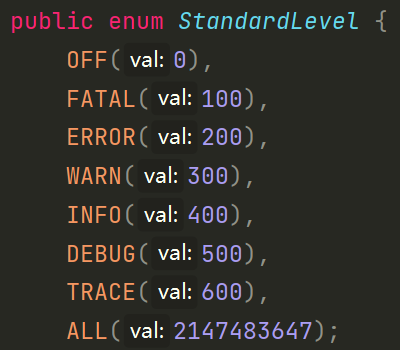

当日志事件的级别大于或等于`level`的级别时才会传递，Log4j2中内置的日志级别有：

| 级别 | OFF  | FATAL | ERROR | WARN | INFO | DEBUG（默认级别） | TRACE |         ALL         |
| :--: | :--: | :---: | :---: | :--: | :--: | :---------------: | :---: | :-----------------: |
|  值  |  0   |  100  |  200  | 300  | 400  |        500        |  600  | `Integer.MAX_VALUE` |

如果这些日志还不满足需求，可以自定义日志的级别，可以在配置文件当中定义，也可以在代码中直接定义。每一个自定义的日志都由两部分组成，**级别名称**和**级别的值**，可以通过`<CustomLevel>`根据自己的需要进行定义：

```xml
<CustomLevels>
    <CustomLevel name="DIAG" intLevel="350" />
    <CustomLevel name="NOTICE" intLevel="450" />
    <CustomLevel name="VERBOSE" intLevel="550" />
</CustomLevels>
 
<Loggers>
    <Root level="trace">
      <AppenderRef ref="Console" level="diag" />
    </Root>
</Loggers>
```

也可以在java语句中设置：

```java
logger.log(Level.forName("CUSTOMER_LEVEL", 350), "customer level");
```

动态切换日志级别：

```java
public class LoggerLevelUtil {
    private static final Logger logger = LogManager.getLogger(Log4j2Test.class);
    
    public static void changeToFatal() {
        logger.fatal("fatal...");
        logger.error("error...");

        // LoggerContext getContext(final boolean currentContext):获取log4j日志上下文,false表示返回合适调用方的上下文
        LoggerContext loggerContext = (LoggerContext) LogManager.getContext(false);
        // 返回当前配置，发生重新配置时，将替换该配置。
        Configuration configuration = loggerContext.getConfiguration();
        // 查找记录器名称的相应 LoggerConfig
        LoggerConfig loggerConfig = configuration.getLoggerConfig(LogManager.ROOT_LOGGER_NAME);
        // 设置日志级别，如果 level 值不属于 ALL、TRACE、DEBUG、INFO、WARN、ERROR、FATAL、OFF，则默认会设置为 DEBUG
        loggerConfig.setLevel(Level.toLevel("FATAL"));
        // 根据当前配置更新所有记录器
        loggerContext.updateLoggers();
        // 查询 root(根)日志输出级别结果返回
        System.out.println("设置后的Root日志级别: " + LogManager.getRootLogger().getLevel().name());

        logger.fatal("fatal...");
        logger.error("error...");
    }
}
```

打印结果：

```
15:27:25.768 [main] FATAL com.xyz.Log4j2Test - fatal...
15:27:25.768 [main] ERROR com.xyz.Log4j2Test - error...
设置后的Root日志级别: FATAL
15:27:25.778 [main] FATAL com.xyz.Log4j2Test - fatal...
```

##### Appender

附加器，负责将日志输出到特定的目标。

自定义Appender：

```java
@Plugin(name = "Stub", category = "Core", elementType = "appender", printObject = true)
public final class StubAppender extends AbstractOutputStreamAppender<StubManager> {
 
    private StubAppender(
            String name,
            Layout<? extends Serializable> layout,
            Filter filter,
            boolean ignoreExceptions,
            StubManager  manager) {
        super(name, layout, filter, ignoreExceptions, true, manager);
    }
 
    @PluginFactory
    public static StubAppender createAppender(
            @PluginAttribute("name") String name,
            @PluginAttribute("ignoreExceptions") boolean ignoreExceptions,
            @PluginElement("Layout") Layout layout,
            @PluginElement("Filters") Filter filter) {
 
        if (name == null) {
            LOGGER.error("No name provided for StubAppender");
            return null;
        }
 
        StubManager manager = StubManager.getStubManager(name);
        if (manager == null) {
            return null;
        }
        if (layout == null) {
            layout = PatternLayout.createDefaultLayout();
        }
        return new StubAppender(name, layout, filter, ignoreExceptions, manager);
    }
}
```

###### Layout

Layout 配置支持多种方式：CSV、GELF、HTML、JSON、JSON Template、Pattern、RFC-5424、Serialized、Syslog、XML、YAML。用的最多的方式就是`PatternLayout`，就是通过正则表达式来格式化日志，应用的也最多，基本配置如下：

```xml
<PatternLayout>
    <Pattern>%d %p %c{1.} [%t] %m%n</Pattern>
</PatternLayout>
```
格式化输出采用类似于C语言的`printf`，各占位符含义：
- `%d`：表示时间，默认情况下表示打印完整时间戳 `2012-11-02 14:34:02,123`，可以调整`%d`后面的参数来调整输出的时间格；
- `%p`：表示输出日志的等级，可以使用`%highlight{%p}`来高亮显示日志级别；
- `%c`：用来输出类名，默认输出的是完整的包名和类名，`%c{1.}`输出包名的首字母和完整类名；
- `%t`：表示线程名称；
- `%m`：表示代码中指定的日志内容，`%M`表示方法名称；
- `%n`：表示换行符；
- `%L`：表示打印日志的代码行数；
- `%r`：输出自应用启动到输出该log信息耗费的毫秒数；
- `%l`：输出日志时间发生的位置，包括类名、线程和代码中的行数，如：`Test.main(Test.java:10)`；
- `%F`：输出日志消息产生时所在的文件名。

日志打印彩色高亮：

`%highlight{}`

JVM启动命令：

```shell
-Dlog4j.skipJansi=false
```

log4j2.component.properties配置文件中：

```properties
log4j.skipJansi=false
```

自定义Layout：

```java
@Plugin(name = "SampleLayout", category = "Core", elementType = "layout", printObject = true)
public class SampleLayout extends AbstractStringLayout {
 
    protected SampleLayout(boolean locationInfo, boolean properties, boolean complete,
                           Charset charset) {
    }
 
    @PluginFactory
    public static SampleLayout createLayout(
			@PluginAttribute("locationInfo") boolean locationInfo,
            @PluginAttribute("properties") boolean properties,
            @PluginAttribute("complete") boolean complete,
            @PluginAttribute(value = "charset", defaultStringValue = "UTF-8") Charset charset) {
        return new SampleLayout(locationInfo, properties, complete, charset);
    }
}
```

###### Filter

过滤器的参数`onMatch`和`onMismatch`都有三个属性值，分别为`ACCEPT`、`DENY`和`NEUTRAL`。这个配置会输出error及以上的日志级别，也就是`onMatch`匹配的是 **大于等于** 该等级的日志，输出的就是error和fatal：

```XML
<ThresholdFilter level="error" onMatch="ACCEPT" onMismatch="DENY"/>
```

一个相反的配置，这个配置会输出error以下的日志级别，也就是`onMismatch`匹配的是 **小于** 该等级的日志，输出的就是warn，info，debug，trace：

```XML
<ThresholdFilter level="error" onMatch="DENY" onMismatch="ACCEPT"/>
```

以下第二个过滤器是不起作用的，输出的是warn，info，debug，trace：

```xml
<ThresholdFilter level="error" onMatch="DENY" onMismatch="ACCEPT"/>
<ThresholdFilter level="warn" onMatch="ACCEPT" onMismatch="DENY"/>
```

为了让第2个过滤器起作用，可以把上述配置修改如下，只输出了warn等级的日志。对比上下两个配置可以知道，其实只是把第一个过滤器的不匹配过滤策略字段从`ACCEPT`修改为`NEUTRAL` ：

```xml
<ThresholdFilter level="error" onMatch="DENY" onMismatch="NEUTRAL"/>
<ThresholdFilter level="warn" onMatch="ACCEPT" onMismatch="DENY"/>
```

结论：当使用多个过滤器时，如果想要后面的过滤器起效，不能使用`ACCEPT`，而应该使用`NEUTRAL`，才能够把数据往过滤器链的下一环继续传递。`onMatch="NEUTRAL"`表示该级别及以上的，由下一个过滤器处理，如果当前是最后一个，则匹配该级别及以上。`onMismatch="NEUTRAL"`表示该级别以下的，由下一个过滤器处理，如果当前是最后一个，则匹配该级别以下的。

自定义Filter：

```java
@Plugin(name = "ThresholdFilter", category = "Core", elementType = "filter", printObject = true)
public final class ThresholdFilter extends AbstractFilter {
 
    private final Level level;
 
    private ThresholdFilter(Level level, Result onMatch, Result onMismatch) {
        super(onMatch, onMismatch);
        this.level = level;
    }
 
    public Result filter(Logger logger, Level level, Marker marker, String msg, Object[] params) {
        return filter(level);
    }
 
    public Result filter(Logger logger, Level level, Marker marker, Object msg, Throwable t) {
        return filter(level);
    }
 
    public Result filter(Logger logger, Level level, Marker marker, Message msg, Throwable t) {
        return filter(level);
    }
 
    @Override
    public Result filter(LogEvent event) {
        return filter(event.getLevel());
    }
 
    private Result filter(Level level) {
        return level.isAtLeastAsSpecificAs(this.level) ? onMatch : onMismatch;
    }
 
    @Override
    public String toString() {
        return level.toString();
    }
 
    /**
     * Create a ThresholdFilter.
     * @param loggerLevel The log Level.
     * @param match The action to take on a match.
     * @param mismatch The action to take on a mismatch.
     * @return The created ThresholdFilter.
     */
    @PluginFactory
    public static ThresholdFilter createFilter(
            @PluginAttribute(value = "level", defaultStringValue = "ERROR") Level level,
            @PluginAttribute(value = "onMatch", defaultStringValue = "NEUTRAL") Result onMatch,
            @PluginAttribute(value = "onMismatch", defaultStringValue = "DENY") Result onMismatch) {
        return new ThresholdFilter(level, onMatch, onMismatch);
    }
}
```

###### Policy

策略器。

##### Logger

记录器，负责捕捉日志事件，并将它们传递给关联的Appender，只有当日志事件的级别大于或等于`level`的级别时才会传递。Root Logger主要作用是提供默认的日志级别和Appender设置，当一个普通Logger没有显式地设置级别或Appender时，它会继承Root Logger的设置。普通Logger（也称为非Root Logger或自定义Logger）都是Root Logger的子Logger。默认情况下，`additivity`设置为`true`，表示日志事件会被传递给祖先Logger。当将`additivity`设置为`false`时，日志事件将不会被传递给祖先Logger，仅在当前Logger中处理。

在程序中，当我们使用log.info()或其他日志方法时，Log4j2会根据当前类路径来查找匹配的Logger。具体来说，Log4j2首先会检查当前类路径是否与配置文件中定义的某个Logger的名称完全匹配。如果没有找到完全匹配的Logger，Log4j2会沿着类路径逐级向上查找，直到找到一个匹配的Logger。如果没有找到任何匹配的Logger，Log4j2会使用Root Logger的设置。举个例子，假设我们有以下配置：

```xml
<Loggers>
    <Logger name="com.example" level="info">
        <AppenderRef ref="Console"/>
    </Logger>
    <Logger name="com.example.subpackage" level="debug">
    	<AppenderRef ref="Console"/>
    </Logger>
    <Root level="warn">
    	<AppenderRef ref="Console"/>
    </Root>
</Loggers>
```

现在，我们在名为com.example.subpackage.MyClass的类中使用log.info()：

```java
import org.apache.logging.log4j.Logger;
import org.apache.logging.log4j.LogManager;

public class MyClass {
    private static final Logger log = LogManager.getLogger(com.example.subpackage.MyClass.class);

    void foo() {
        log.info("This is an info message");
    }
}
```

在这种情况下，Log4j2会按照以下顺序查找匹配的Logger：

1. 首先，查找名称为`com.example.subpackage.MyClass`的Logger。在这个例子中，没有找到匹配的Logger。
2. 然后，查找名称为`com.example.subpackage`的Logger。在这个例子中，找到了一个匹配的Logger，级别为DEBUG。
3. 由于已经找到了匹配的Logger，Log4j2会使用该Logger的设置进行日志记录。

注意：如果在步骤2中没有找到匹配的Logger，Log4j2会继续沿着类路径向上查找，直到找到一个匹配的Logger，或者使用Root Logger。所以，总结一下，**Log4j2是通过类路径（包路径）来查找和匹配Logger的。**这样可以让我们针对不同的包和类设置不同的日志策略。

##### 异步优化

默认情况下，一条日志信息需要被Appender处理完成之后才算是记录完成，在记录日志的过程中，程序不会往下执行，如果日志很大，就会对程序的性能造成影响，整个过程是同步的，所以优化的思路是把日志记录的过程变成**异步**，让日志记录不会影响程序的执行。所以 Logger在获取到日志信息之后，不会立马进行日志格式化和存储，会先把日志信息放到一个**队列**中。其中，AsyncAppender采用了**ArrayBlockingQueue**来保存需要异步输出的日志事件；AsyncLogger则使用了**Disruptor**框架来实现高吞吐。

###### 异步Appender

AsyncAppender是通过引用别的Appender来实现的，当有日志事件到达时，会开启另外一个线程来处理他们。AsyncAppender默认使用Java中自带的类库（util类库），不需要导入外部类库。AsyncAppender应该是在它引用Appender之后配置，因为如果在Appender的时候出现异常，对应用来说是无法感知的。当使用此Appender的时候，在多线程的环境下需要注意，阻塞队列容易受到锁争用的的影响，这可能会对性能产生影响。这个时候，我们需要使用无锁的异步记录器（AsyncLogger）。

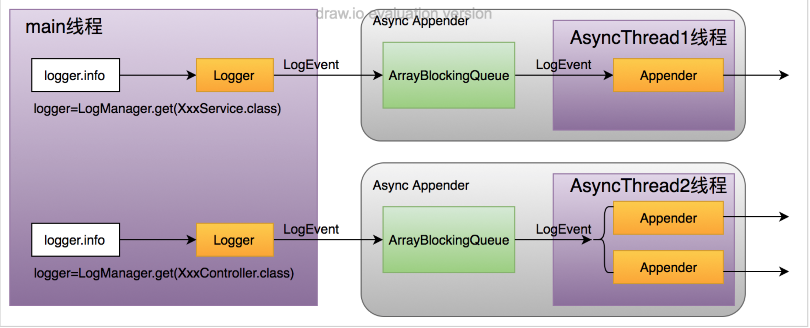

每个Async Appender，内部维护了一个ArrayBlockingQueue，并将创建一个线程用于输出日志事件，如果配置了多个AppenderRef，将分别使用对应的Appender进行日志输出。

配置到log4j2-spring.xml中：

```xml
<!--配置异步日志（AsyncAppender）-->
<Appenders>
    <Async name="myAsync">
        <!--将控制台输出做异步的操作-->
        <AppenderRef ref="consoleAppender"/>
    </Async>
</Appenders>
```

AsyncAppender的常用参数：

| 参数名 | 类型 | 说明 |
| --- | --- | --- |
| `name` | `String` | Async Appender的名字 |
| `AppenderRef` | `String` | 异步调用的Appender的名字，可以配置多个 |
| `blocking`  | `Boolean` | 默认为`true`。如果为`true`，appender将一直等待直到queue中有空闲；如果为`false`，当队列满的时候，日志事件将被丢弃。(如果配置了error appender，要丢弃的日志事件将由error appender处理) |
| `bufferSize` | `Integer` | 队列中可存储的日志事件的最大数量，默认为128。(源码中为128，Log4j2官网为1024，官网信息有误) |

关于AsyncAppender的其他参数，可参考Log4j2对[AsyncAppender](http://logging.apache.org/log4j/2.x/manual/appenders.html#AsyncAppender)的详细介绍。

###### 异步Logger⭐

[Disruptor搭配Log4j2](https://juejin.cn/post/6844904146504515598)

[Log4j2基于Disruptor异步日志优化(部分源码学习)](https://segmentfault.com/a/1190000041025229)


Log4j2优越的性能其原因在于Log4j2使用了LMAX，一个无锁的线程间通信库代替了logback和log4j之前的队列，并发性能大大提升。AsyncLogger才是Log4j2实现异步最重要的功能体现，也是官方推荐的异步方式。它可以使调用Logger.log返回更快。其中包括**全局异步**和**混合异步**：

- 全局异步：所有的日志都异步的记录，在配置文件上下不用做任何的改动，只需要在JVM启动的时候增加一个参数即可实现，不够灵活，实际开发中使用较少；
- 混合异步：你可以同时在应用中使用同步日志和异步日志，这使得日志的配置方式更加的灵活。混合日志需要修改配置文件来实现，使用`<AsyncLogger>`标记配置，实际开发中使用较多。

Disruptor是英国外汇交易公司LMAX开发的一个高性能队列，基于Disruptor开发的系统单线程能支撑每秒600万订单。目前，包括Apache Strom、Log4j2在内的很多知名项目都应用了Disruptor来获取高性能。Disruptor框架内部核心数据结构为RingBuffer，其为无锁环形队列：

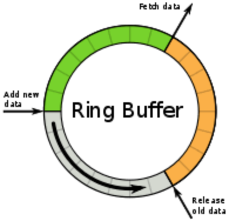

 单线程每秒能够处理600万订单，Disruptor为什么这么快：

1. lock-free-使用了CAS来实现线程安全：

   - ArrayBlockingQueue使用锁实现并发控制，当get或put时，当前访问线程将上锁，当多生产者、多消费者的大量并发情形下，由于锁竞争、线程切换等，会有性能损失；
   - Disruptor通过CAS实现多生产者、多消费者对RingBuffer的并发访问。CAS相当于乐观锁，其性能优于Lock的性能；

2. 使用缓存行填充解决伪共享问题：

   - 计算机体系结构中，内存的访问速度远远低于CPU的运行速度，在内存和CPU之间，加入Cache，CPU首先访问Cache中的数据，CaChe未命中，才访问内存中的数据；

   - 伪共享：Cache是以缓存行（cache line）为单位存储的，当多个线程修改互相独立的变量时，如果这些变量共享同一个缓存行，就会无意中影响彼此的性能。

     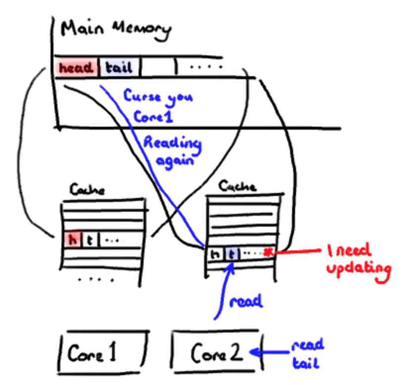

Disruptor有着非常好的性能，在Log4j2中加上Disruptor之后，我们的日志处理流程就变成了下面这样：

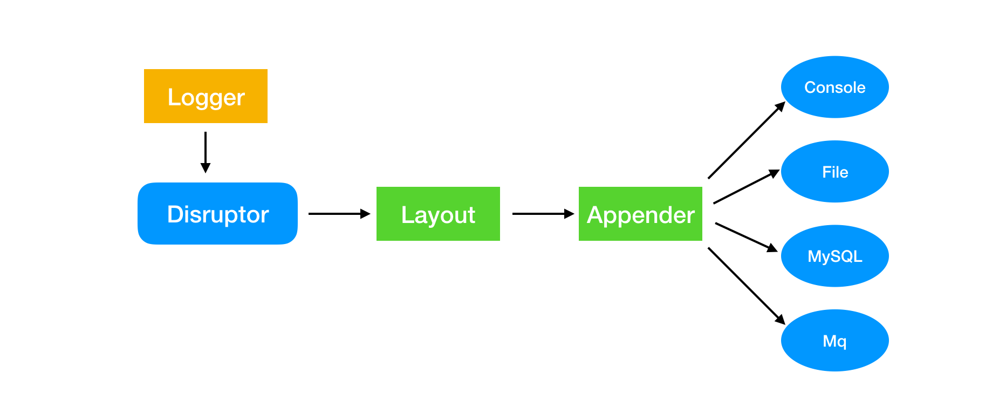

在加载log4j2.xml的启动阶段，如果检测到配置了AsyncRoot或AsyncLogger，将启动一个disruptor实例：

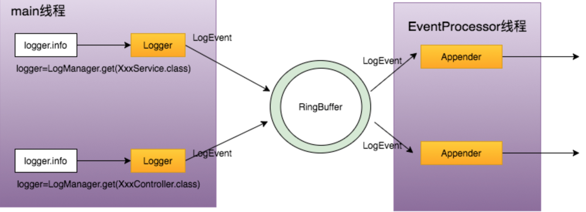

main线程作为生产者，EventProcessor线程作为消费者：

- 生产者生产消息：
  - 当运行到类似于logger.info、logger.debug的输出语句时，将生成的LogEvent放入RingBuffer中。

- 消费者消费消息：
  - 如果RingBuffer中有LogEvent需要处理，EventProcessor线程从RingBuffer中取出LogEvent，调用Logger相关联的Appender输出LogEvent（具体输出过程与同步过程相同，同样需要过滤器过滤、PatternLayout格式化等步骤）；
  - 如果RingBuffer中没有LogEvent需要处理，EventProcessor线程将处于等待阻塞状态（默认策略）；

需要注意的是，虽然在log4j2.xml中可以配置多个AsyncLogger，但是并不是每个AsyncLogger对应着一个处理线程，而是仅仅有一个EventProcessor线程进行日志的异步处理。

引入Disruptor异步日志：

```xml
<dependency>
    <groupId>com.lmax</groupId>
    <artifactId>disruptor</artifactId>
    <version>3.4.4</version>
</dependency>
```

全局异步，添加到JVM启动命令中：

```shell
-DLog4jContextSelector=org.apache.logging.log4j.core.async.AsyncLoggerContextSelector
```

或者在`resourse/log4j2.component.properties`文件中添加：

```properties
Log4jContextselector=org.apache.logging.log4j.core.async.AsyncLoggerContextSelector
```

混合异步，配置到log4j2-spring.xml中：

```xml
<loggers>
    <!--disruptor异步日志-->
    <AsyncLogger name="DisruptorLogger" level="info" includeLocation="false">
        <AppenderRef ref="RandomAccessFile"/>
    </AsyncLogger>
    <AsyncRoot level="info" includeLocation="false">
        <appender-ref ref="RandomAccessFile"/>
    </AsyncRoot>
</loggers>
```

总结：

1. 配置滚动日志的时候，若不需要压缩日志，filePattern的文件名不要以gz结尾；
2. 使用Disruptor异步日志的时候，不要同时使用全局异步和混合异步，否则日志对象将会多一次中间传递：
   `app -> RingBuffer-1 -> thread a -> RingBuffer-2 -> thread b -> disk`
   这会带来不必要的性能损耗；
3. 给`RollingRandomAccessFile`配置`immediateFlush="false"`属性（默认为`true`），这样让I/O线程批量刷盘（这里其实涉及到native方法调用的性能问题）；
4. `includeLocation="false"`表示去除日志记录中的行号信息，行号信息非常的影响日志记录的效率（生产中都不加这个行号），严重的时候可能记录的比同步的日志效率还有低；
5. 可以结合资源情况是否要配置`AsyncLogger.SynchronizeEnqueueWhenQueueFull=false`和`AsyncLoggerConfig.SynchronizeEnqueueWhenQueueFull=false`；
6. 结合实际情况是否要更改I/O线程的`WaitStrategy`；
7. 若日志可以丢弃，可以配置丢弃策略，配置`log4j2.asyncQueueFullPolicy=Discard`，`log4j2.discardThreshold=INFO「默认」`，当队列满时，`INFO`, `DEBUG`和`TRACE`级别的日志会被丢弃；
8. AsyncAppender、AsyncLogger不要同时出现，没有这个需求，效果也不会叠加；
9. 如果同时出现，那么效率会以AsyncAppender为主。

## Lombok

| 注解          | 作用（LogExample.class的常量日志）                           |
| ------------- | ------------------------------------------------------------ |
| `@CommonsLog` | `private static final org.apache.commons.logging.Log log = org.apache.commons.logging.LogFactory.getLog(LogExample.class);` |
| `@JBossLog`   | `private static final org.jboss.logging.Logger log = org.jboss.logging.Logger.getLogger(LogExample.class)` |
| `@Log`        | `private static final java.util.logging.Logger log = java.util.logging.Logger.getLogger(LogExample.class.getName());` |
| `@Log4j`      | `private static final org.apache.log4j.Logger log = org.apache.log4j.Logger.getLogger(LogExample.class);` |
| `@Log4j2`     | `private static final org.apache.logging.log4j.Logger log = org.apache.logging.log4j.LogManager.getLogger(LogExample.class);` |
| `@Slf4j`      | `private static final org.slf4j.Logger log = org.slf4j.LoggerFactory.getLogger(LogExample.class);` |
| `@XSlf4j`     | `private static final org.slf4j.ext.XLogger log = org.slf4j.ext.XLoggerFactory.getXLogger(LogExample.class);` |

引入：

```xml
<dependency>
    <groupId>org.projectlombok</groupId>
    <artifactId>lombok</artifactId>
</dependency>
```

使用：

```java
// JUL
@Log
public class JULExample {
    public static void main(String... args) {
	    log.severe("Something's wrong here");
    }
}

// Slf4j
@Slf4j
public class Slf4jExample {
    public static void main(String... args) {
   		log.error("Something else is wrong here");
    }
}

// JCL
@CommonsLog(topic="CounterLog")
public class JCLExample {
    public static void main(String... args) {
   		log.error("Calling the 'CounterLog' with a message");
    }
}
```

等效于：

```java
// JUL
public class JULExample {
    private static final java.util.logging.Logger log = java.util.logging.Logger.getLogger(JULExample.class.getName());
    
    public static void main(String... args) {
    	log.severe("Something's wrong here");
    }
}
// Slf4j
public class Slf4jExample {
	private static final org.slf4j.Logger log = org.slf4j.LoggerFactory.getLogger(Slf4jExample.class);
    
    public static void main(String... args) {
    	log.error("Something else is wrong here");
    }
}

// JCL
public class JCLExample {
    private static final org.apache.commons.logging.Log log = org.apache.commons.logging.LogFactory.getLog("CounterLog");

    public static void main(String... args) {
        log.error("Calling the 'CounterLog' with a message");
    }
}
```

