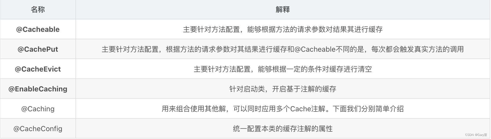

# SpringCache

适合放入缓存中的数据：

1. 查询频率高；
2. 修改频率低；
3. 数据安全行要求低的。


cache 增强类执行流程：


配置 SpringCache：

```java
@Slf4j
@Configuration
@EnableCaching
@EnableConfigurationProperties(RedisProperties.class) // 确保配置了Redis
public class RedisCacheConfig extends CachingConfigurerSupport {

    @Bean
    public CacheManager cacheManager(RedisConnectionFactory redisConnectionFactory) {
        RedisCacheConfiguration objectConfig = RedisCacheConfiguration
                .defaultCacheConfig()
                .serializeKeysWith(RedisSerializationContext.SerializationPair.fromSerializer(new StringRedisSerializer()))
                .serializeValuesWith(RedisSerializationContext.SerializationPair.fromSerializer(new FastJson2JsonRedisSerializer<>(Object.class)))
                .disableCachingNullValues() // 不缓存空值
                .entryTtl(Duration.ofHours(hours)); // 设置缓存的过期时间
        RedisCacheManager.RedisCacheManagerBuilder builder = RedisCacheManager
                .builder(redisConnectionFactory)
                .cacheDefaults(objectConfig) // 默认配置
                .transactionAware(); // 配置同步修改或删除
        return builder.build();
    }

    @Bean
    @Override
    public CacheErrorHandler errorHandler() {
        // 异常处理，当Redis发生异常时，打印日志，但是程序正常走
        log.info("初始化 -> [{}]", "Redis CacheErrorHandler");
        return new CacheErrorHandler() {
            @Override
            public void handleCacheGetError(RuntimeException e, Cache cache, Object key) {
                log.error("Redis occur handleCacheGetError：key -> [{}]", key, e);
            }

            @Override
            public void handleCachePutError(RuntimeException e, Cache cache, Object key, Object value) {
                log.error("Redis occur handleCachePutError：key -> [{}]；value -> [{}]", key, value, e);
            }

            @Override
            public void handleCacheEvictError(RuntimeException e, Cache cache, Object key) {
                log.error("Redis occur handleCacheEvictError：key -> [{}]", key, e);
            }

            @Override
            public void handleCacheClearError(RuntimeException e, Cache cache) {
                log.error("Redis occur handleCacheClearError：", e);
            }
        };
    }

    /**
     * 用于根据给定的目标对象、方法和方法参数生成缓存键。
     * 在一些复杂场景下，方法的参数可能不适合作为缓存键，比如参数的数量不固定，
     * 或者参数是复杂的对象，这时可以通过 keyGenerator() 来自定义缓存键生成逻辑，
     * 确保缓存键的唯一性和正确性。
     *
     * @return 缓存键
     */
    @Override
    @Bean("myKeyGenerator")
    public KeyGenerator keyGenerator() {
        return (target, method, params) -> {
            StringBuilder sb = new StringBuilder();
            sb.append(target.getClass().getName());
            sb.append(method.getName());
            for (Object obj : params) {
                sb.append(obj.toString());
            }
            return sb.toString();
        };
    }
}
```

使用 SpringCache：



生成 key：

当我们要使用 root 对象的属性作为 key 时我们也可以将`#root`省略，因为 Spring 默认使用的就是 root 对象的属性。

| 属性名称      | 描述                         | 示例                   |
| ------------- | ---------------------------- | ---------------------- |
| `methodName`  | 当前方法名                   | `#root.methodName`     |
| `method`      | 当前方法                     | `#root.method.name`    |
| `target`      | 当前被调用的对象             | `#root.target`         |
| `targetClass` | 当前被调用的对象的 class     | `#root.targetClass`    |
| `args`        | 当前方法参数组成的数组       | `#root.args[0]`        |
| `caches`      | 当前被调用的方法使用的 Cache | `#root.caches[0].name` |

condition 属性判定条件：

有的时候我们可能并不希望缓存一个方法所有的返回结果。通过`condition`属性可以实现这一功能。`condition`属性默认为空，表示将缓存所有的调用情形。其值是通过 SpringEL 表达式来指定的，当为`true`时表示进行缓存处理；当为`false`时表示不进行缓存处理，即每次调用该方法时该方法都会执行一次。如下示例表示只有当 user 的 id 为偶数时才会进行缓存：

```java
@Cacheable(value={"users"}, key="#user.id", condition="#user.id % 2 == 0")
public User find(User user) {
    return user;
}
```

1、Cacheable
先查询是否已经有缓存，有会使用缓存，没有则会执行方法并缓存。注意：要缓存的实体类必须实现序列化。一般用于查找。其中`value`等同于`cacheNames`：


2、CachePut
和 `@Cacheable` 不同的是，它每次都会触发真实方法的调用 。简单来说就是用户更新缓存数据。


3、@CacheEvict
作用：主要针对方法配置，能够根据一定的条件对缓存进行清空 。一般用于删除和更新。


4、@Caching
@Caching注解可以让我们在一个方法或者类上同时指定多个Spring Cache相关的注解。

```java
@Caching(evict={@CacheEvict("user1"), @CacheEvict("user2",allEntries=true)})
```


5、@CacheConfig
@CacheConfig是一个类级别的注解，它允许共享缓存名称，自定义KeyGenerator，自定义CacheManager和自定义CacheResolver。


当我们需要缓存的地方越来越多，可以在类上使用 `@CacheConfig(cacheNames = {"..."})`注解来统一指定`value`的值，这时方法可省略`value`，如果你在你的方法依旧写上了`value`，那么依然以方法的`value`值为准。

```java
@CacheConfig(cacheNames = {"myCache"})
public class UserServiceImpl implements UserService {
    @Override
    @Cacheable(key = "targetClass + methodName + #p0")//此处没写value
    public List<User> findAllLimit(int num) {
        return userRepository.findAllLimit(num);
    }
    .....
}
```

Spring支持的CacheManager，
SimpleCache：没有引入其他缓存组件的情况下，SpringBoot 的默认缓存，使用 ConcurrentMap 实现

3、注意点：

- 配置文件中启用缓存：`spring.cache.type=redis`；
- 缓存的对象必须实现 Serializable 注解是基于 Spring；
- AOP 代理类，内部方法调用是不走代理的，注解是不起作用的。需要利用`this.getClass().cast(AopContext.currentProxy())`获取代理的对象。

4、Spring Cache 优劣：

- 优势：
  - 支持开箱即用（Out Of The Box），并提供基本的Cache抽象，方便切换各种底层Cache；
  - 通过Cache注解即可实现缓存逻辑透明化，让开发者关注业务逻辑；
  - 当事务回滚时，缓存也会自动回滚；
  - 支持比较复杂的缓存逻辑；
  - 提供缓存编程的一致性抽象，方便代码维护。
- 劣势：
  - Spring Cache并不针对多进程的应用环境进行专门的处理；
  - 另外SpringCache抽象的操作中没有锁的概念，当多线程并发操作（更新或者删除）同一个缓存项时，有可能读取到过期的数据；
  - 查询是加锁，其他的都是公用的没有加锁。读模式做了处理，写模式并没有管。常规（读多写少，及时性，一致性不高的数据完全可以用SpringCache）。

Spring Cache 常见问题：

1. 缓存穿透：

   指访问一个不存在的 key，缓存和数据库都没有数据，导致请求绕过缓存直接访问数据库，容易引起数据库压力过大。解决方案是在缓存中预先设置一个空对象或者`null`值来占位，并设置很短的过期时间，避免对数据库的频繁访问。或者使用布隆过滤器，可以将其理解为一个容器，把数据库中的所有存在的数据 id 放入到布隆过滤器中，判断 id 存在再放行。

2. 缓存击穿：

   指缓存中的一个热点 key 失效，导致大量的请求直接绕过缓存访问数据库，容易引起数据库压力过大。解决方案是设置缓存时效，采用分布式锁来避免多个请求同时访问数据库。

3. 缓存雪崩：

   指缓存中的大量数据在同一时间过期或失效，导致大量请求直接绕过缓存访问数据库，容易引起数据库压力过大。解决方案是将缓存失效时间随机化，避免大量缓存同时失效；使用多级缓存策略，将缓存分散在不同的节点上；预热缓存，在系统低峰期加载缓存。

# Mybatis 二级缓存

详见 [MyBatis.md](./MyBatis.md)

# 对比

MyBatis 和 Spring Cache 是两个不同的缓存机制，用于提高应用程序的性能。它们各自有不同的特点、适用场景和配置方式。下面是对它们的详细对比。

### 1. **缓存层次**
- **MyBatis 缓存**
  - **一级缓存（PerpetualCache）**:  
    - 一级缓存是 MyBatis 的默认缓存，它是基于 `SqlSession` 的缓存。即同一个 `SqlSession` 在执行相同的 SQL 查询时，如果参数相同，会直接从缓存中取值，而不会再发送查询请求。
    - 一级缓存的生命周期和 `SqlSession` 一样，当 `SqlSession` 关闭或提交时，一级缓存会被清空。
  - **二级缓存（PerpetualCache + Cache Interface）**:  
    - 二级缓存是可选的，它是基于命名空间（mapper）级别的缓存。即在多个 `SqlSession` 之间共享，数据被缓存到整个命名空间中。
    - 二级缓存可以通过配置使用，也可以通过实现 `Cache` 接口自定义。
    - 二级缓存的生命周期比一级缓存更长，一般在应用程序运行期间有效，但可以配置失效策略。

- **Spring Cache**
  - Spring Cache 是一个更通用的缓存抽象层，支持多种缓存提供者（如 EhCache、Redis、Caffeine 等）。它支持缓存方法的返回值，因此适用于更广泛的场景。
  - Spring Cache 是方法级别的缓存，即当一个带有缓存注解的方法被调用时，如果缓存中有数据就会直接返回，否则执行方法并将结果缓存起来。

### 2. **缓存粒度**
- **MyBatis 缓存**
  - 缓存粒度与 SQL 查询直接相关，MyBatis 的缓存主要针对数据库查询的结果集，粒度比较细。
  - 一级缓存粒度是 `SqlSession` 级别，二级缓存粒度是 mapper 级别。
  - MyBatis 缓存更适合于细粒度的数据库查询结果缓存。

- **Spring Cache**
  - 缓存粒度是方法级别，缓存的数据是方法的返回值。
  - Spring Cache 适合于缓存业务逻辑中的复杂计算结果、方法的执行结果等。

### 3. **配置与使用**
- **MyBatis 缓存**
  - 一级缓存是默认开启的，不需要配置。
  - 二级缓存需要在 MyBatis 配置文件或注解中开启，并且需要在 `mapper` 中配置 `<cache>` 标签，或者使用 `@CacheNamespace` 注解。
  - 可以配置缓存的属性，如缓存策略、大小、过期时间等。

- **Spring Cache**
  - Spring Cache 需要在 Spring 配置中启用，如 `@EnableCaching` 注解。
  - 使用注解（如 `@Cacheable`, `@CachePut`, `@CacheEvict`）或者 XML 配置来指定哪些方法的结果需要被缓存。
  - 配置更灵活，可以指定不同的缓存提供者，并对不同的缓存提供者进行精细化配置，如缓存的过期时间、大小等。

### 4. **失效机制**
- **MyBatis 缓存**
  - MyBatis 缓存中的数据会在 `INSERT`、`UPDATE`、`DELETE` 操作时自动失效，以保证数据的一致性。
  - 一级缓存失效机制是 `SqlSession` 的生命周期结束，或执行 `SELECT` 以外的操作。
  - 二级缓存支持配置失效时间、刷新策略，但需要自行处理较复杂的缓存失效逻辑。

- **Spring Cache**
  - 可以通过 `@CacheEvict` 注解或手动调用缓存管理器来失效缓存。
  - 支持 TTL（Time to Live）、LRU（Least Recently Used）等失效策略，具体依赖于所选的缓存提供者。

### 5. **扩展性**
- **MyBatis 缓存**
  - MyBatis 缓存可以通过自定义实现 `Cache` 接口进行扩展。
  - 由于 MyBatis 专注于 ORM 层，所以它的缓存机制相对简单，不太适合复杂的应用场景。

- **Spring Cache**
  - Spring Cache 提供了丰富的扩展性，可以结合各种缓存中间件（如 Redis、EhCache、Caffeine 等）使用。
  - 可以轻松地通过配置或自定义实现来扩展缓存行为。

### 6. **适用场景**
- **MyBatis 缓存**
  - 适用于需要优化数据库查询性能的场景，尤其是数据库读操作较多而写操作较少的场景。
  - 适合小粒度数据缓存，不适合应用层复杂数据缓存。

- **Spring Cache**
  - 适用于业务逻辑层的结果缓存，特别是在方法执行开销较大，且结果需要频繁使用时。
  - 适合更广泛的缓存场景，包括数据库查询结果缓存、复杂计算结果缓存、Web 请求缓存等。

### 7. 不推荐使用 MyBatis 二级缓存的原因

尽管 MyBatis 的二级缓存在某些场景下可以提高查询性能，但在大多数情况下，我们不推荐使用它。以下是一些原因：

#### 1. 数据不一致性

由于二级缓存是跨 SqlSession 共享的，当多个 SqlSession 对同一数据进行修改时，可能会导致数据不一致的问题。例如，当一个 SqlSession 更新了某个数据，而另一个 SqlSession 正在使用相同的数据，就会出现数据不一致的情况。

为了解决这个问题，MyBatis 提供了一些机制，如缓存刷新和缓存失效等。但这些机制增加了复杂性，并且不能保证完全消除数据不一致性的问题。

#### 2. 内存占用

二级缓存将查询结果缓存在内存中，对于大量的数据查询，会占用较多的内存空间。如果系统中有频繁的查询操作，缓存中的数据可能会占满内存，导致系统性能下降。

另外，由于二级缓存是跨 SqlSession 共享的，缓存的数据可能并不是所有 SqlSession 都需要的，这样就浪费了一部分内存空间。

#### 3. 缓存同步 / 延迟问题

当数据库中的数据发生变化时，需要保证缓存与数据库的一致性。然而，MyBatis 的二级缓存没有提供自动同步机制，需要手动刷新缓存或设置合适的失效策略来保证一致性。

缓存同步问题增加了系统的复杂性，并且容易出错。在高并发环境下，正确地处理缓存同步是一个挑战。

#### 4. 不适用于复杂查询

MyBatis 的二级缓存只能缓存简单的查询结果，对于复杂的查询结果，如多表关联查询或使用了分页的查询，缓存的管理变得非常困难。

这是因为二级缓存是基于 SQL 语句及参数进行缓存的，而对于复杂的查询结果，每次查询可能会使用不同的 SQL 语句和参数，导致缓存无法命中。

### 总结

- **MyBatis 缓存** 更加聚焦于数据库查询的性能优化，适合在 MyBatis ORM 层使用，粒度更细，配置较简单，但功能相对有限。
- **Spring Cache** 是一个更为通用和强大的缓存解决方案，适用于更广泛的场景，可以结合多种缓存提供者，并且配置和扩展性更强。
