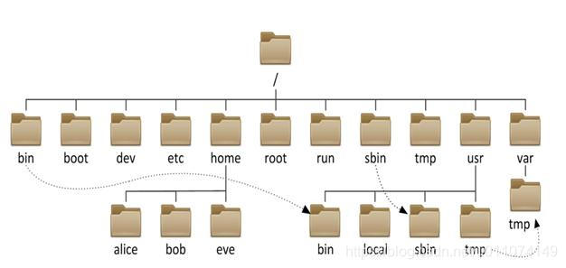
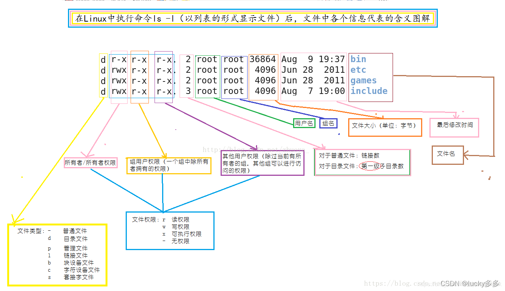

# 文件结构



```shell
[xxx@localhost /]$ ls -l --author -h -c
总用量 24K
类型 权限         作者 用户名 组名
lrwxrwxrwx.   1 root root root    7 8月  31 2022 bin -> usr/bin
dr-xr-xr-x.   5 root root root 4.0K 8月  31 2022 boot
drwxr-xr-x.  19 root root root 3.3K 7月  31 03:51 dev
drwxr-xr-x. 147 root root root 8.0K 10月 31 10:29 etc
drwxr-xr-x.   3 root root root   19 8月  31 2022 home
lrwxrwxrwx.   1 root root root    7 8月  31 2022 lib -> usr/lib
lrwxrwxrwx.   1 root root root    9 8月  31 2022 lib64 -> usr/lib64
drwxr-xr-x.   2 root root root    6 8月  31 2022 media
drwxr-xr-x.   2 root root root    6 8月  31 2022 mnt
drwxr-xr-x.   6 root root root  105 10月  9 15:28 opt
dr-xr-xr-x. 257 root root root    0 7月  31 03:51 proc
dr-xr-x---.   4 root root root  223 9月   9 14:43 root
drwxr-xr-x.  43 root root root 1.3K 10月 31 10:30 run
lrwxrwxrwx.   1 root root root    8 8月  31 2022 sbin -> usr/sbin
drwxr-xr-x.   2 root root root    6 8月  31 2022 srv
dr-xr-xr-x.  13 root root root    0 7月  31 03:51 sys
drwxrwxrwt.  21 root root root 4.0K 10月 31 10:43 tmp
drwxr-xr-x.  13 root root root  155 8月  31 2022 usr
drwxr-xr-x.  21 root root root 4.0K 7月  31 03:51 var
```

1. `/`：根目录。整个 Linux 文件系统层次结构的根，在图中是最上层的`/`。

2. `/bin`：*binaries*，用户二进制文件。需要在单用户模式可用的必要命令（可执行文件），面向所有用户，例如： cat、 ls、 cp等。注意：`/bin`目录是`/usr/bin`的软连接。

   > 单用户模式：在最小环境中使用超级用户维护系统环境，例如：修改损坏的系统文件、修改配置文件等。

3. `/boot`：启动加载器文件。该目录包含启动系统所需的文件，例如：GRUB 引导加载程序的文件和 Linux 内核都存储在此处。通常位于一个单独的分区中，大小为 100MB 即可。

4. `/dev`：*device*，设备文件。该目录包含许多代表设备的特殊文件。在 Linux 中一切皆文件，设备也被看成一个文件，访问该文件就相当于访问对应设备。例如：`/dev/sda`表示系统中的第一个 SATA 驱动器。还包含伪设备，它们是实际上与硬件不对应的虚拟设备。例如：`/dev/random`产生随机数，`/dev/null`是一种特殊的设备，它不产生任何输出并自动丢弃所有输入。

5. `/etc`：*et cetera*，配置文件。该目录包含系统范围内的配置文件。注意：`/etc`目录包含系统范围的配置文件，特定于用户的配置文件位于每个用户的家目录中。

6. `/home`：用户主目录。该目录包含每个用户的家目录。例如：用户 xiaoming 的家目录为`/home/xiaoming`，在用户家目录下包含该用户的数据文件和用户特定的配置文件。每个用户仅对其自己的家目录具有写访问权，并且必须获得管理员权限（root 权限）才能修改系统上非该用户的文件。通常也将其设置为一个单独的分区。

7. `/root`：root 用户的主目录。root 用户不同于普通用户，家目录并不是`/home/root`。

8. `/run`：一个相当新的目录，它为应用程序提供了一个标准位置来存储所需的临时文件，例如套接字和进程 ID。这些文件无法存储在`/tmp`中，因为`/tmp`中的文件会被删除。

9. `/sbin`：*system binaries*，系统二进制文件，是`/usr/sbin`的软连接。该目录包含基本二进制文件，这些二进制文件通常旨在由 root 用户运行以进行系统管理。

10. `/tmp`：*temporary*，临时文件。该目录存储临时文件，系统在重启时会自动清理该目录下的文件（不同 Linux 系统清理时间有差别，CentOS 是重启后清理 10 天前文件，Ubuntu 是每次重启后清理），所以不要将重要文件放到这个目录下。

11. `/usr`：*unix software resource*，用户程序。该目录包含用户使用的应用程序和文件，而不是系统使用的应用程序和文件。例如，非必需的应用程序位于`/usr/bin`目录而不是`/bin`目录中，非必需的系统管理二进制文件位于`/usr/ sbin`目录而不是`/sbin`目录中。默认情况下，`/usr/local`目录是本地编译的应用程序安装目录，这样可以防止它们破坏系统的其余部分。

    > 注意：usr 不是 “user” 的缩写，而是“Unix Software Resource” 的缩写。

12. `/var`：*variable*，可变文件。该目录包含系统运行中内容不断变化的文件，如日志，脱机文件和临时电子邮件文件，有时是一个单独的分区。

13. `/lib`：library，系统库，是`/usr/lib`的软连接。`/bin`和`/sbin`目录中二进制文件需要的库文件。`/usr/bin`目录中的二进制文件所需的库位于`/usr/lib`中。

14. `/media`：可移除媒体(如CD-ROM)的挂载点。例如：当您将 CD 插入 Linux 系统时，将在`/media`目录中自动创建一个目录，就可以在此目录中访问 CD 的内容。

15. `/mnt`：*mount*，该目录是临时挂载文件系统的位置。例如：挂载 U 盘，然后通过挂载的文件访问 U 盘内容。

16. `/opt`：*optional*，可选应用软件包目录。

17. `/proc`：*process*，进程信息，虚拟文件系统，将内核与进程状态归档为文本文件。该目录是一个虚拟的目录，它是系统内存的映射，可以通过直接访问这个目录来获取系统信息。

18. `/srv`：*service*，该目录为系统提供的服务的数据，一些服务启动后，保存服务所需要的数据。

19. `/cdrom`：该目录不是 FHS 标准的一部分，但是在 Ubuntu 和其他操作系统上可以看到它。 这是系统中插入 CD-ROM 的临时位置。但是，临时媒体的标准位置在`/media`目录中。

20. `/lost+found`：该目录用于存放系统异常时文件的碎片，以便于进行恢复。如果文件系统崩溃，则将在下次启动时执行文件系统检查。

# 目录 ls



# 链接 ln

符号链接（Symbolic Link），软链接，指向引用：

```shell
ln -s target.txt link.txt
ln --symbolic target.txt link.txt
```

硬链接（Hard Link），指向数据本身：

```shell
ln target.txt link.txt

```

# 解压缩 

## tar

压缩 compress

```shell
tar -cvzf archiveName.tar.gz folderName filename
```

解压 extract 到指定目录

```shell
tar -xvzf archiveName.tar.gz -C folderName
```

## zip

压缩

```shell
zip -r archiveName.zip folderName
```

解压

```shell
unzip archiveName.zip
```

## gzip

压缩

```shell
gzip file.txt
```

解压

```shell
gunzip file.txt.gz
gzip -d file.txt.gz
```

